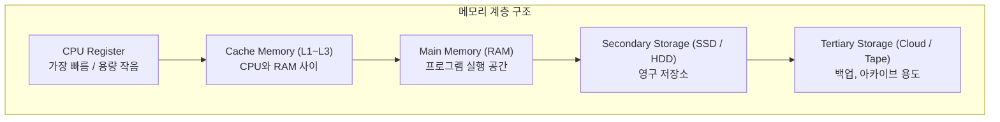
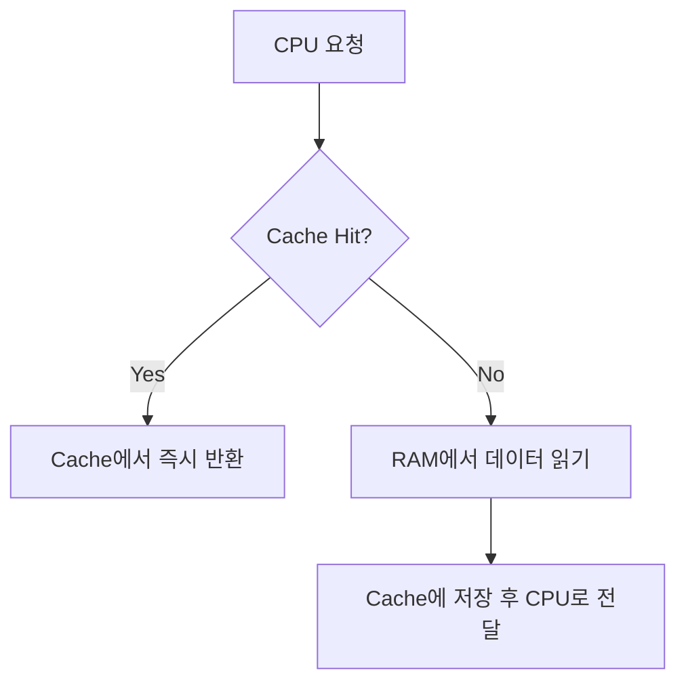
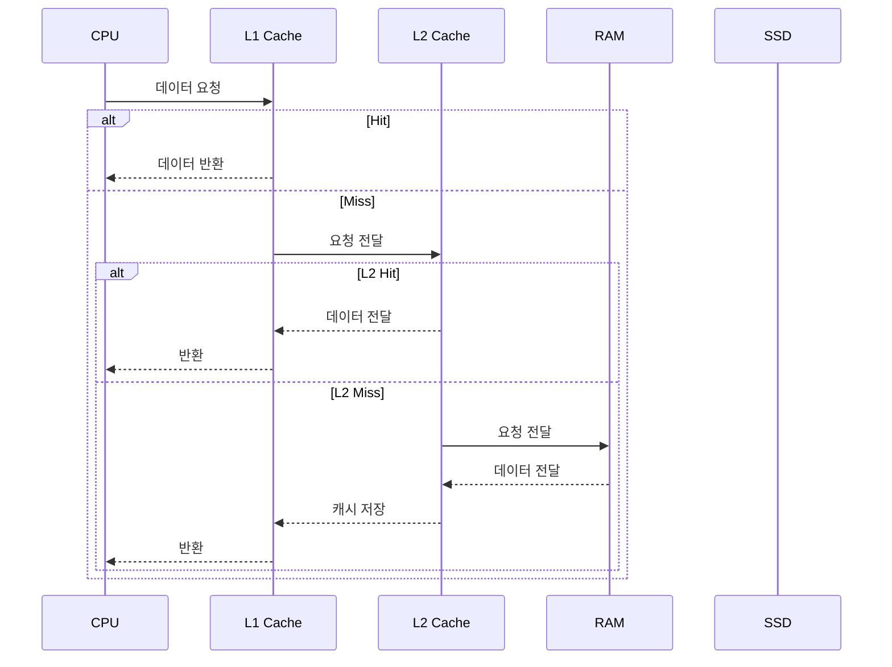
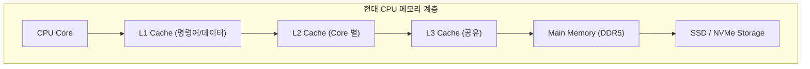

캐시–RAM–디스크 간 계층 구조 및 속도 비교
CPU 캐시부터 RAM, SSD, 디스크까지의 계층 구조를 속도·비용·용량 관점으로 설명
메모리 접근 흐름을 시각화한 Mermaid 다이어그램과 캐시 히트/미스 예시

#### 정리

* 메모리는 빠를수록 비싸고, 느릴수록 용량이 크다.
* CPU는 빠른 계층(L1/L2/L3 캐시)에서 먼저 데이터를 찾고,
  없으면 RAM, SSD 순으로 접근한다.
* 캐시의 적중률이 높을수록 전체 시스템 속도가 크게 향상된다.
* 현대 시스템은 이러한 계층 구조를 자동으로 관리하며,
  사용자는 물리적 복잡성을 의식하지 않고 프로그래밍할 수 있다.

---

#### 참고 자료

* [CS50 Lecture – Memory & Cache](https://cs50.harvard.edu/x/2024/notes/3/)
* [Wikipedia – CPU cache](https://en.wikipedia.org/wiki/CPU_cache)


# 메모리 계층 구조 (Memory Hierarchy)

## 1️ 개요
컴퓨터의 메모리 시스템은 **속도와 비용, 용량의 균형**을 맞추기 위해 계층적으로 설계되어 있다.  
CPU 내부의 레지스터부터 외부 저장장치인 디스크까지,  
각 계층은 서로 다른 접근 속도와 용량, 단가를 가진다.

이 계층 구조를 **메모리 계층 구조(Memory Hierarchy)** 라고 한다.

---

## 2️ 메모리 계층의 기본 개념

컴퓨터의 메모리는 크게 다음과 같이 구분된다.



CPU는 자주 사용하는 데이터를 캐시에 저장하고,
필요할 때만 RAM이나 디스크에서 데이터를 읽어온다.
이 과정을 통해 전체 시스템 성능을 크게 향상시킨다.

---

## 3️ 각 계층의 특징

| 계층                    | 주요 역할              | 접근 속도            | 용량          | 비용 (단가) | 예시                   |
| --------------------- | ------------------ | ---------------- | ----------- | ------- | -------------------- |
| **레지스터(Register)**    | 연산 중인 데이터 임시 저장    | ⚡ 매우 빠름 (1ns 미만) | 수십~수백 Byte  | 매우 높음   | CPU 내부               |
| **L1 캐시**             | 명령어/데이터 캐시         | 매우 빠름 (~1ns)     | 32~128 KB   | 높음      | CPU 코어별              |
| **L2 캐시**             | 보조 캐시              | 빠름 (~3ns)        | 256 KB~2 MB | 중간      | 코어별 또는 공유            |
| **L3 캐시**             | 공유 캐시              | 보통 (~10ns)       | 2~64 MB     | 낮음      | CPU 전체 공유            |
| **RAM (Main Memory)** | 실행 중인 프로그램과 데이터 저장 | 중간 (~100ns)      | 수 GB        | 낮음      | DDR5, LPDDR          |
| **SSD / HDD**         | 비휘발성 저장 장치         | 느림 (µs~ms 단위)    | 수백 GB~수 TB  | 매우 낮음   | NVMe, SATA           |
| **클라우드 / 테이프**        | 백업 및 장기 저장         | 매우 느림 (초 단위 이상)  | 수 PB        | 매우 저렴   | Object Storage, Tape |

> ⚙️ 일반적으로 “빠를수록 비싸고, 느릴수록 싸다”는 **속도-비용-용량 트레이드오프**가 존재한다.

---

## 4 캐시 메모리의 역할

캐시(Cache)는 CPU와 RAM 사이의 병목현상을 줄이기 위해 사용된다.
CPU가 데이터를 요청할 때, 우선 캐시에 해당 데이터가 있는지 확인한다.
이때 **캐시에 존재하면 Cache Hit**,
존재하지 않아 RAM에서 가져와야 하면 **Cache Miss**가 발생한다.



캐시 적중률(Cache Hit Ratio)은 전체 성능을 좌우하는 중요한 지표다.
적중률이 90% 이상이면, CPU가 대부분의 데이터를 빠르게 처리할 수 있다.

---

## 5️ 메모리 접근 시간 계산 예시

만약 캐시의 접근 시간이 2ns, RAM이 100ns이고
캐시 적중률이 95%라면, 평균 접근 시간(AMAT, Average Memory Access Time)은 다음과 같다.

```
AMAT = (Hit Time) + (Miss Rate × Miss Penalty)
     = 2ns + (0.05 × 100ns)
     = 2ns + 5ns = 7ns
```

적중률을 조금만 높여도 전체 성능이 크게 향상되는 이유가 여기에 있다.

---

## 6️ 메모리 계층의 동작 흐름

CPU는 아래와 같은 순서로 데이터를 접근한다.
가장 가까운 계층부터 탐색하고, 없으면 아래 계층으로 내려간다.



이처럼 캐시와 메모리는 계층적으로 협력하며,
CPU는 가장 빠른 경로를 통해 데이터를 처리한다.

---

## 7️ 메모리 계층 설계의 핵심 원리

1. **지역성(Locality) 원리**

   * 프로그램은 가까운 데이터나 명령어를 반복적으로 사용하는 경향이 있다.
   * 공간적 지역성(Spatial Locality): 인접 데이터 접근
   * 시간적 지역성(Temporal Locality): 최근 접근 데이터 재사용

2. **속도·용량·비용의 균형**

   * 모든 메모리를 캐시처럼 빠르게 만들면 비용이 급등한다.
   * 따라서 적절한 계층 구조로 균형을 유지해야 한다.

3. **계층 간 자동 관리**

   * 현대 시스템은 CPU가 직접 캐시를 제어하지 않는다.
   * 하드웨어가 자동으로 데이터를 적재(eviction)하고 관리한다.

---

## 8️ 현대적 메모리 구조 예시



현대 CPU는 코어별로 L1, L2 캐시를 가지고 있고,
여러 코어가 L3 캐시를 공유한다.
운영체제는 RAM을 가상 주소 공간으로 관리하며,
SSD는 페이지 스와핑이나 파일 시스템을 통해 확장 저장소로 사용된다.

---
