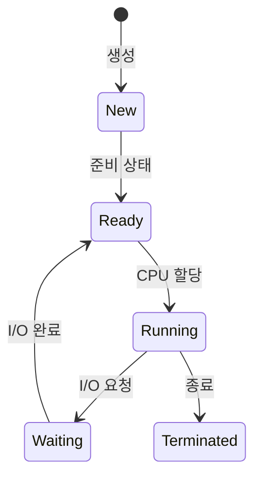
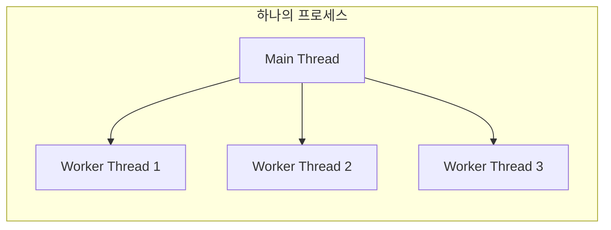
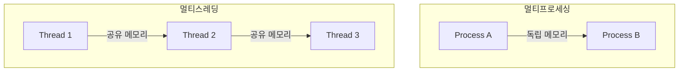

####  정리

프로세스는 독립적인 실행 단위로, 시스템의 안정성을 보장한다.
스레드는 프로세스 내의 작은 실행 흐름으로, 효율적인 자원 사용이 가능하다.
운영체제는 이러한 프로세스와 스레드를 스케줄링하며, CPU와 메모리 자원을 균형 있게 분배한다.
현대 시스템에서는 멀티코어 환경이 일반적이므로,
프로세스와 스레드를 적절히 조합해 병렬성과 안정성을 동시에 확보하는 것이 중요하다.

#### 참고 자료

* [CS50 Lecture – Processes & Threads](https://cs50.harvard.edu/x/2024/notes/4/)
* [Wikipedia – Process (computing)](https://en.wikipedia.org/wiki/Process_%28computing%29)
* [Wikipedia – Thread (computing)](https://en.wikipedia.org/wiki/Thread_%28computing%29)
---


#  프로세스와 스레드의 기본 개념 (Process & Thread)

## 1️ 개요
운영체제는 여러 프로그램을 동시에 실행하기 위해 **프로세스(Process)** 와 **스레드(Thread)** 라는 단위를 사용한다.  
프로세스는 실행 중인 프로그램의 독립적인 인스턴스이고,  
스레드는 프로세스 안에서 실행되는 작은 실행 흐름이다.  
즉, 프로세스가 집이라면, 스레드는 그 안에서 일하는 여러 사람에 비유할 수 있다.

---

## 2️ 프로세스(Process)의 개념
프로세스는 실행 중인 프로그램을 의미한다.  
운영체제는 프로그램을 실행할 때 메모리에 로드하고, CPU를 할당하여 명령어를 순차적으로 수행한다.  
각 프로세스는 독립적인 주소 공간, 스택, 힙, 코드, 데이터 영역을 가진다.


운영체제는 프로세스를 생성할 때 PCB(Process Control Block)라는 정보를 함께 만든다.
PCB에는 프로세스의 상태, CPU 레지스터 값, 메모리 정보, 우선순위 등이 저장되어 있다.
이 정보를 통해 운영체제는 여러 프로세스를 번갈아 실행하는 시분할(time-sharing) 방식을 구현한다.

---

## 3️ 프로세스의 상태 변화

프로세스는 실행 중에 여러 상태를 오간다.
일반적으로 다음 다섯 가지 상태가 존재한다.



1. **New**: 프로그램이 메모리에 적재되어 프로세스가 생성되는 단계
2. **Ready**: 실행 준비가 되어 CPU를 기다리는 상태
3. **Running**: 실제 CPU가 명령어를 수행하는 상태
4. **Waiting (Blocked)**: 입출력(I/O) 등 외부 이벤트를 기다리는 상태
5. **Terminated**: 실행이 끝난 상태

운영체제는 이 상태들을 오가며 프로세스를 효율적으로 관리한다.

---

## 4️ 스레드(Thread)의 개념

스레드는 프로세스 내에서 실행되는 **작은 실행 단위**다.
하나의 프로세스는 여러 스레드를 가질 수 있으며, 이 스레드들은 같은 메모리 공간을 공유한다.



스레드는 코드, 데이터, 힙 영역을 다른 스레드와 공유하지만,
각 스레드는 자신만의 스택(Stack)과 레지스터를 가진다.
이로 인해 스레드 간 통신은 빠르지만, 동시에 동기화 문제(race condition)가 발생할 위험이 있다.

---

## 5️ 프로세스와 스레드의 비교

| 구분         | 프로세스                      | 스레드                                           |
| ---------- | ------------------------- | --------------------------------------------- |
| **기본 단위**  | 실행 중인 프로그램                | 프로세스 내 실행 흐름                                  |
| **메모리 공간** | 독립적                       | 프로세스 내 공유                                     |
| **통신 방식**  | IPC(파이프, 소켓 등) 필요         | 공유 메모리 직접 접근 가능                               |
| **오버헤드**   | 크다 (생성/문맥교환 비용)           | 작다 (가벼움)                                      |
| **안정성**    | 한 프로세스 오류는 다른 프로세스에 영향 없음 | 한 스레드 오류 시 전체 프로세스 종료 가능                      |
| **예시 언어**  | C, Go, Java (프로세스 기반 실행)  | Java Thread, Python threading, Node.js Worker |

---

## 6️ 코드 예시

### 프로세스 예시 (C 언어, `fork()` 사용)

```c
#include <stdio.h>
#include <unistd.h>

int main() {
    pid_t pid = fork(); // 자식 프로세스 생성
    if (pid == 0)
        printf("자식 프로세스입니다. (PID: %d)\n", getpid());
    else
        printf("부모 프로세스입니다. (PID: %d)\n", getpid());
    return 0;
}
```

`fork()`를 호출하면 부모 프로세스가 복제되어 두 개의 프로세스가 동시에 실행된다.

---

### 스레드 예시 (Python, `threading` 모듈)

```python
import threading

def worker(name):
    print(f"{name} 실행 중")

threads = []
for i in range(3):
    t = threading.Thread(target=worker, args=(f"스레드-{i}",))
    threads.append(t)
    t.start()

for t in threads:
    t.join()
```

하나의 프로세스 안에서 세 개의 스레드가 동시에 동작한다.
스레드들은 같은 변수 공간을 공유하기 때문에, 동기화(lock) 처리가 필요할 수 있다.

---

## 7️ 멀티프로세싱과 멀티스레딩

* **멀티프로세싱(Multiprocessing)** 은 여러 CPU를 활용해 여러 프로세스를 병렬로 실행하는 방식이다.
  각 프로세스가 독립된 메모리를 가지므로 안정적이지만, 데이터 교환에 오버헤드가 발생한다.
* **멀티스레딩(Multithreading)** 은 하나의 프로세스 내부에서 여러 스레드가 동시에 실행되는 방식이다.
  자원을 공유하므로 빠르고 효율적이지만, 동시성 문제를 주의해야 한다.



---
