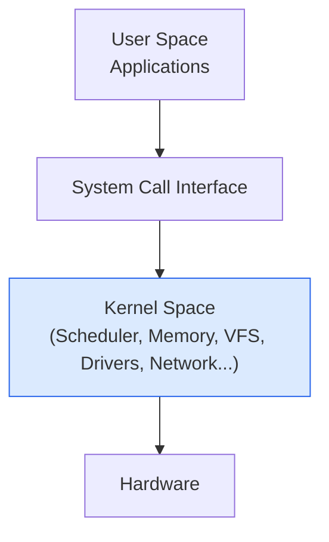
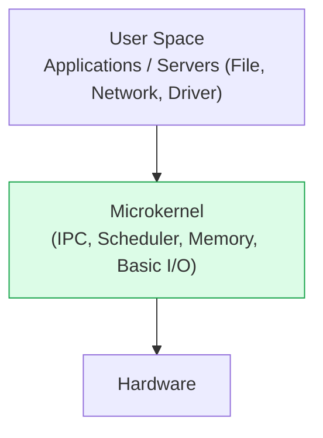
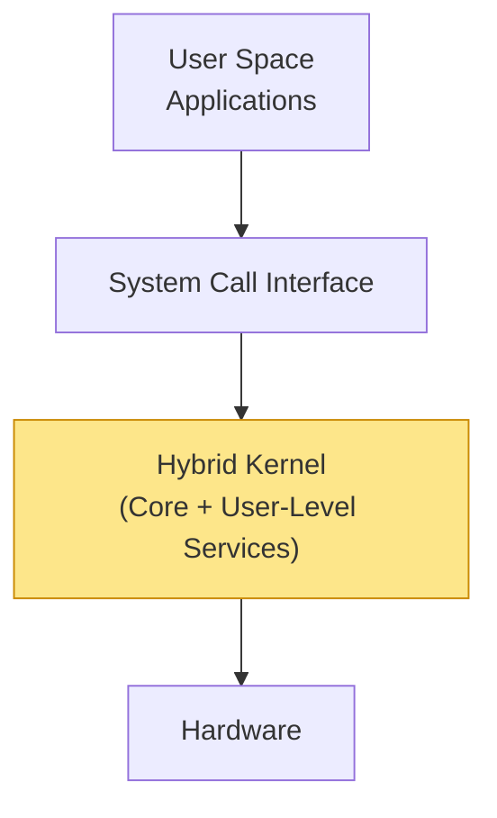
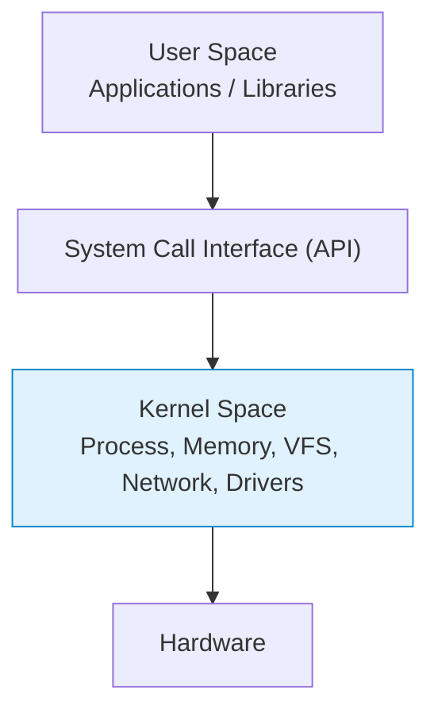

가상 메모리, 커널 구조


# 커널 아키텍처 (Kernel Architecture)

#### 정리 요약

이 문서는 운영체제의 핵심 구성요소인 **커널(Kernel)** 의 구조와 설계 방식을 설명한다.  
커널은 하드웨어와 응용 프로그램 사이에서 자원을 관리하고, 프로세스·메모리·파일·디바이스·네트워크를 통합적으로 제어한다.  
대표적인 커널 구조는 **모놀리식 커널(Monolithic Kernel)**, **마이크로커널(Microkernel)**,  
그리고 두 방식을 절충한 **하이브리드 커널(Hybrid Kernel)** 로 구분된다.

* **Linux**: 모놀리식 기반 + 모듈화 구조 (성능 중심, 서버/임베디드 모두 활용)
* **Windows NT / macOS**: 하이브리드 커널 (성능·안정성 균형)
* **QNX / seL4**: 마이크로커널 기반 (안전성·보안성 중요 환경에 사용)
* **커널 빌드 옵션** (`make menuconfig`) 을 통해 모듈 포함 여부 선택 가능
* 시스템 개발자는 **커널 공간과 사용자 공간 간의 경계**를 명확히 이해해야 한다.
* **커널 패닉(Kernel Panic)** 발생 시, `dmesg` 또는 `/var/log/kern.log` 분석으로 원인 파악 가능.

##### 참고 자료
* [Linux Kernel Documentation – Architecture Overview](https://docs.kernel.org/)
* [Wikipedia – Kernel (operating system)](https://en.wikipedia.org/wiki/Kernel_%28operating_system%29)
* [Apple Developer Documentation – XNU Kernel Architecture](https://developer.apple.com/documentation/xnu)
* [Microsoft Docs – Windows NT Kernel Architecture](https://learn.microsoft.com/en-us/windows-hardware/drivers/kernel/)


---

## 1. 커널의 역할

운영체제의 커널은 시스템의 중심(Core)으로,  
하드웨어 자원(CPU, 메모리, 입출력 장치)을 효율적으로 관리하고,  
사용자 프로그램이 안전하게 실행되도록 보장한다.

| 역할 | 설명 |
|:--|:--|
| **프로세스 관리** | 프로세스 생성·스케줄링·종료, 문맥 교환 관리 |
| **메모리 관리** | 가상 메모리, 페이징, 캐싱 관리 |
| **파일 시스템 관리** | 파일 입출력, 디스크 블록 할당, 버퍼 캐시 관리 |
| **디바이스 드라이버 관리** | 하드웨어 장치 제어 및 인터럽트 처리 |
| **시스템 콜 인터페이스** | 사용자 영역과 커널 영역 간 통신 창구 제공 |

---

## 2. 커널 구조 유형

### (1) Monolithic Kernel

모놀리식 커널은 **운영체제의 모든 핵심 기능(프로세스, 메모리, 파일, 장치, 네트워크 등)** 이  
하나의 거대한 커널 공간(Kernel Space)에서 동작하는 구조이다.

<div style="text-align:center;">



</div>

| 특징    | 설명                           |
| :---- | :--------------------------- |
| 구조    | 모든 기능이 커널 내부에서 직접 실행         |
| 장점    | 시스템 콜 간 통신이 빠르고, 성능이 우수      |
| 단점    | 하나의 모듈 오류가 전체 커널에 영향을 줄 수 있음 |
| 대표 OS | Linux, Unix, FreeBSD         |

> **리눅스 커널(Linux Kernel)** 은 전통적인 모놀리식 구조이지만,
> 동적 모듈 로딩(Loadable Kernel Module, LKM)을 지원하여
> **“모듈형 모놀리식 커널(모듈러 모놀리식)”** 형태로 발전했다.

---

### (2) Microkernel

마이크로커널은 커널의 크기를 최소화하여,
**핵심 기능(IPC, 스케줄러, 기본 메모리 관리)** 만 커널에 남기고
나머지 기능(파일시스템, 드라이버, 네트워크 등)을 **사용자 공간(User Space)** 로 분리한 구조이다.

<div style="text-align:center;">


</div>

| 특징    | 설명                                     |
| :---- | :------------------------------------- |
| 구조    | 최소한의 기능만 커널에 포함                        |
| 장점    | 안정성, 보안성 높음 (모듈 오류가 시스템 전체에 영향 없음)     |
| 단점    | 커널 ↔ 사용자 공간 간 메시지 전달(IPC)로 인해 성능 저하 발생 |
| 대표 OS | Mach, QNX, Minix 3, seL4               |

> **마이크로커널의 철학**은 “커널은 최소한의 핵심 기능만 수행하고,
> 나머지는 사용자 공간의 서비스(server)로 구현한다”는 것이다.

---

### (3) Hybrid Kernel

하이브리드 커널은 모놀리식과 마이크로커널의 절충형이다.
핵심 기능을 커널 공간에 두되, 일부 서비스는 유연하게 분리하여 동작시킨다.
대표적으로 Windows NT, macOS(XNU 커널), iOS 커널이 이 구조를 따른다.

<div style="text-align:center;">



</div>

| 특징    | 설명                                    |
| :---- | :------------------------------------ |
| 구조    | 마이크로커널 기반 + 일부 기능(드라이버 등)을 커널 공간에서 실행 |
| 장점    | 안정성과 성능의 균형                           |
| 단점    | 구현 복잡, 유지보수 어려움                       |
| 대표 OS | Windows NT, macOS(XNU), iOS           |

> 예를 들어, **macOS의 XNU 커널**은 Mach 기반 마이크로커널 위에
> BSD 서브시스템과 I/O Kit(드라이버 프레임워크)를 결합한 구조를 가진다.

---

## 3. 커널 계층 구조 요약

<div style="text-align:center;">


</div>

---

## 4. 하드웨어 추상화 계층 (HAL, Hardware Abstraction Layer)

**HAL(Hardware Abstraction Layer)** 은 커널이 다양한 하드웨어를
일관된 방식으로 제어할 수 있도록 하는 중간 계층이다.
드라이버와 아키텍처별 코드(CPU, 보드, 인터럽트 컨트롤러 등)를 추상화하여
운영체제의 이식성을 높인다.

| 기능             | 설명                                   |
| :------------- | :----------------------------------- |
| **디바이스 독립성**   | 동일한 커널이 다양한 하드웨어에서 실행 가능             |
| **드라이버 표준화**   | 공통 인터페이스 제공 (예: PCI, USB, NVMe 등)    |
| **플랫폼 포팅 용이성** | x86, ARM, RISC-V 등 다른 아키텍처에 쉽게 이식 가능 |

---

## 5. 모듈형 커널 (Modular Kernel)

현대의 리눅스 커널은 **모놀리식 + 모듈화** 형태로 동작한다.
필요한 기능(네트워크 드라이버, 파일시스템 등)을 **동적 모듈(Loadable Kernel Module, LKM)** 로 로드하거나 제거할 수 있다.

| 명령어                  | 설명              |
| :------------------- | :-------------- |
| `lsmod`              | 현재 로드된 커널 모듈 목록 |
| `insmod`, `modprobe` | 모듈 추가           |
| `rmmod`              | 모듈 제거           |

```bash
# 예시
sudo modprobe e1000e     # Intel 네트워크 드라이버 로드
sudo rmmod e1000e        # 모듈 언로드
```

> 이 구조는 마이크로커널의 장점(유연성)을 일부 흡수하면서
> 모놀리식 커널의 성능을 유지한다.

---

