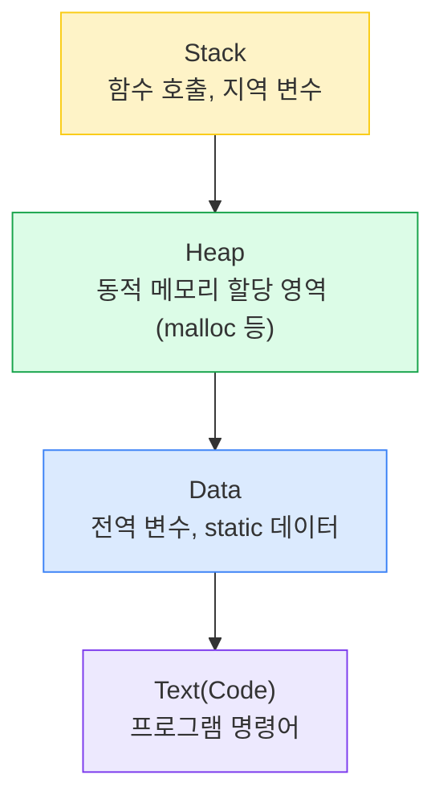
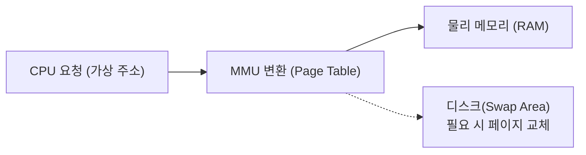

(Paging, Segmentation)

#### 정리 요약

이 문서는 운영체제에서 **메모리(Memory)** 가 어떻게 관리되는지를 설명한다.  
운영체제는 한정된 물리 메모리를 여러 프로세스가 효율적으로 공유할 수 있도록 관리하며,  
이 과정에서 **주소 변환(Address Translation)**, **가상 메모리(Virtual Memory)**, **페이징(Paging)**, **스와핑(Swapping)** 등의 기법을 사용한다.  
메모리 관리는 시스템 성능과 안정성에 직접적인 영향을 미치는 핵심 요소이다.

* 가상 메모리는 현대 OS의 핵심으로, 실제 메모리 용량보다 큰 프로그램 실행을 가능하게 한다.
* 페이지 교체 빈도가 높으면 **스래싱(Thrashing)** 현상이 발생해 성능이 급격히 저하된다.
* 리눅스는 **Demand Paging** 방식을 사용하여 실제 접근 시점에 페이지를 로드한다.
* 메모리 상태 확인 명령: `free`, `vmstat`, `top`, `/proc/meminfo`
* 컨테이너 환경(Docker 등)에서는 **cgroup memory 제한**을 통해 프로세스 메모리 사용량을 제어한다.

##### 참고 자료
* [Linux Kernel Documentation – Memory Management](https://docs.kernel.org/mm/)
* [Wikipedia – Virtual Memory](https://en.wikipedia.org/wiki/Virtual_memory)
---

## 1. 메모리 관리의 개념

메모리 관리는 프로세스에 메모리를 할당하고, 사용이 끝나면 회수하는 기능이다.  
운영체제는 CPU와 마찬가지로 메모리를 효율적으로 분배하여 여러 프로세스가 동시에 실행될 수 있게 한다.

| 구분 | 설명 |
|:--|:--|
| **물리 메모리** | 실제 RAM 공간 |
| **논리 메모리 (가상 메모리)** | 프로그램이 인식하는 주소 공간 |
| **주소 변환 (Address Translation)** | 논리 주소를 실제 물리 주소로 변환하는 과정 |
| **메모리 보호 (Protection)** | 프로세스 간 메모리 침범을 방지 |

---

## 2. 주소 공간 구조

각 프로세스는 독립적인 주소 공간(Address Space)을 가진다.  
일반적으로 프로세스의 메모리는 다음 네 영역으로 구성된다.

각 프로세스는 논리적으로 자신만의 메모리 공간을 가지며, 다른 프로세스의 메모리에 접근하지 못한다.

---

## 3. 메모리 할당 방식

| 구분                                     | 설명                       | 특징                |
| :------------------------------------- | :----------------------- | :---------------- |
| **연속 할당 (Contiguous Allocation)**      | 프로세스가 하나의 연속된 메모리 공간을 차지 | 단순하지만 외부 단편화 발생   |
| **비연속 할당 (Non-contiguous Allocation)** | 프로세스가 여러 불연속 공간을 점유      | 페이징, 세그먼테이션 방식 사용 |

연속 할당은 단순하지만 메모리 단편화(Fragmentation) 문제가 심각하다.
이를 해결하기 위해 현대 OS는 대부분 **페이징(Paging)** 또는 **세그먼테이션(Segmentation)** 기법을 사용한다.

---

## 4. 페이징 (Paging)

페이징은 물리 메모리를 고정된 크기의 블록으로 나누어 사용하는 방식이다.
논리 메모리는 **페이지(Page)**, 물리 메모리는 **프레임(Frame)** 단위로 관리된다.

| 항목                  | 설명                         |
| :------------------ | :------------------------- |
| 페이지(Page)           | 프로세스의 논리 메모리를 일정 크기로 나눈 단위 |
| 프레임(Frame)          | 물리 메모리를 일정 크기로 나눈 단위       |
| 페이지 테이블(Page Table) | 페이지 번호와 프레임 번호의 매핑 정보 저장   |

이 구조는 **외부 단편화(External Fragmentation)** 를 해결하지만,
**내부 단편화(Internal Fragmentation)** 가 발생할 수 있다.

---

## 5. 세그먼테이션 (Segmentation)

세그먼테이션은 논리 메모리를 의미 단위(함수, 배열 등)로 나누어 관리하는 방식이다.
각 세그먼트는 크기가 다르며, **세그먼트 테이블(Segment Table)** 을 통해 물리 주소로 변환된다.

| 항목        | 설명             |
| :-------- | :------------- |
| 세그먼트 번호   | 논리 세그먼트 구분     |
| 세그먼트 길이   | 세그먼트 크기        |
| 베이스(Base) | 물리 메모리 내 시작 주소 |

세그먼테이션은 프로그래머가 구조적으로 메모리를 관리하기 쉽지만,
외부 단편화가 여전히 발생할 수 있다.

---

## 6. 가상 메모리 (Virtual Memory)

가상 메모리는 실제 물리 메모리보다 큰 논리 공간을 제공하는 기술이다.
운영체제는 **디스크 일부(Swap Space)** 를 보조 메모리처럼 사용하여
프로세스 전체를 메모리에 올리지 않아도 실행할 수 있도록 한다.

| 개념                           | 설명                  |
| :--------------------------- | :------------------ |
| 페이지 부재 (Page Fault)          | 필요한 페이지가 메모리에 없는 경우 |
| 스왑(Swap)                     | 디스크와 메모리 간 데이터 교체   |
| MMU (Memory Management Unit) | 주소 변환을 수행하는 하드웨어 장치 |

가상 메모리를 통해 시스템은 “물리 메모리보다 큰 프로그램”을 실행할 수 있게 된다.

---

## 7. 페이지 교체 알고리즘 (Page Replacement)

페이지 부재(Page Fault)가 발생했을 때, 어떤 페이지를 제거할지를 결정하는 알고리즘이다.

| 알고리즘    | 설명                         | 특징                 |
| :------ | :------------------------- | :----------------- |
| FIFO    | 가장 먼저 올라온 페이지 제거           | 단순하지만 성능이 떨어질 수 있음 |
| LRU     | 가장 오랫동안 사용되지 않은 페이지 제거     | 성능이 우수하나 구현 복잡     |
| Optimal | 앞으로 가장 오랫동안 사용되지 않을 페이지 제거 | 이론적 최적 (예측 불가)     |
| Clock   | LRU 근사 알고리즘                | 하드웨어 구현에 적합        |

---

## 8. 스와핑 (Swapping)

스와핑은 프로세스 전체를 디스크로 옮겼다가 다시 메모리로 가져오는 방식이다.
이 방식은 오래된 운영체제에서 사용되었지만, 현대 시스템에서는 **페이징 기반 가상 메모리**가 대체하고 있다.

---

