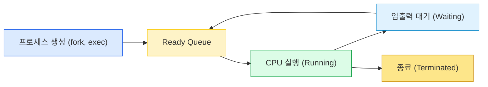
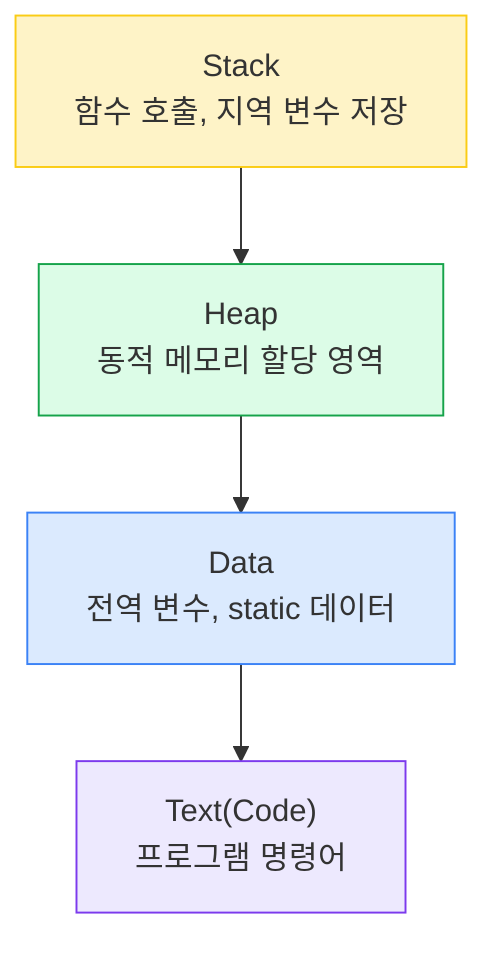
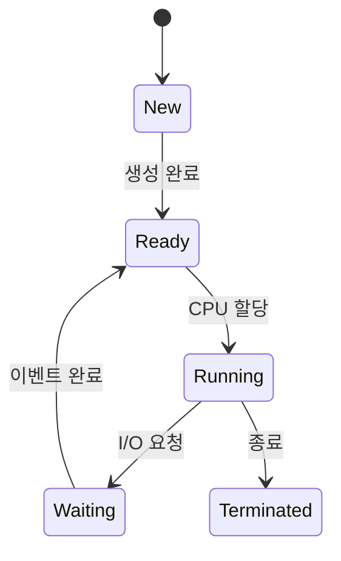
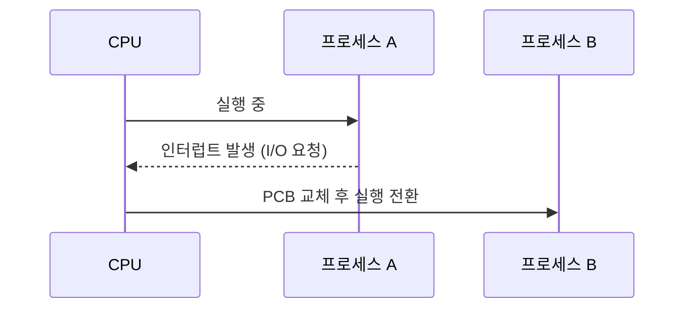

(Scheduling, Context Switching)

#### 정리 요약

이 문서는 운영체제에서 **프로세스(Process)** 가 생성되고 실행되며 종료되는 과정을 설명한다.  
운영체제는 여러 프로그램을 동시에 실행하기 위해 CPU를 효율적으로 분배하며,  
스케줄링(Scheduling), 문맥 교환(Context Switching), 상태 전이(State Transition) 등을 수행한다.  
프로세스 관리는 운영체제의 핵심 기능으로, 시스템의 성능과 안정성에 직접적인 영향을 준다.

* 운영체제는 수백 개의 프로세스를 동시에 관리하므로, **효율적인 스케줄링**이 핵심이다.
* **문맥 교환의 오버헤드**는 시스템 성능에 큰 영향을 미친다.
* **멀티코어 CPU**에서는 각 코어가 별도의 스케줄링 큐를 사용한다.
* 리눅스는 **CFS(Completely Fair Scheduler)** 를 사용하여 CPU 자원을 공정하게 분배한다.
* 실제 프로세스 정보는 `ps`, `top`, `htop` 명령으로 확인할 수 있다.

###### 참고 자료

* [Linux Kernel Documentation – Process Management](https://docs.kernel.org/scheduler/sched-design-CFS.html)
* [Wikipedia – Process (computing)](https://en.wikipedia.org/wiki/Process_%28computing%29)
* [CS50 Lecture Notes – Operating Systems](https://cs50.harvard.edu/x/2024/notes/6/)

---

## 1. 프로세스의 개념

**프로세스(Process)** 란 실행 중인 프로그램을 의미한다.  
프로그램은 단순한 명령어의 집합(정적 개체)이지만, 프로세스는 실행 중인 동적 개체이다.  
각 프로세스는 독립적인 메모리 공간을 가지며, 코드, 데이터, 스택, 힙으로 구성된다.

| 구분 | 설명 |
|:--|:--|
| 프로그램 (Program) | 디스크에 저장된 명령어의 집합 (정적) |
| 프로세스 (Process) | 실행 중인 프로그램 (동적 실행 단위) |
| 스레드 (Thread) | 프로세스 내부에서 실행되는 최소 단위 |

---

### 프로세스의 메모리 구조

스택(Stack)은 함수 호출 시마다 생성되고, 힙(Heap)은 실행 중 동적으로 증가한다.
코드(Text)와 데이터(Data)는 비교적 고정된 구조를 가진다.

---

## 2. 프로세스 상태와 전이

프로세스는 실행 중 여러 상태를 오가며,
운영체제는 이 상태를 관리하여 효율적인 자원 사용을 보장한다.

| 상태                | 설명                    |
| :---------------- | :-------------------- |
| New               | 프로세스가 생성 중인 상태        |
| Ready             | CPU 할당을 기다리는 상태       |
| Running           | CPU를 점유하여 실행 중인 상태    |
| Waiting (Blocked) | 입출력 등 외부 이벤트를 기다리는 상태 |
| Terminated        | 실행이 종료된 상태            |

---

## 3. 프로세스 제어 블록 (PCB, Process Control Block)

운영체제는 각 프로세스의 정보를 PCB에 저장하고 관리한다.
PCB는 커널 공간에 존재하며, 프로세스 상태 복구 및 스케줄링에 사용된다.

| 항목                   | 설명                |
| :------------------- | :---------------- |
| PID (Process ID)     | 고유한 식별자           |
| 상태 (State)           | Ready, Running 등  |
| PC (Program Counter) | 다음 명령어 주소         |
| 레지스터 정보              | CPU 상태 저장         |
| 메모리 정보               | 코드, 데이터, 스택, 힙 위치 |
| 스케줄링 정보              | 우선순위, 큐 위치        |

---

## 4. 문맥 교환 (Context Switching)

CPU는 한 번에 하나의 프로세스만 실행할 수 있다.
따라서 여러 프로세스가 동시에 실행되는 것처럼 보이기 위해
운영체제는 **문맥 교환(Context Switching)** 을 수행한다.

이 과정에서 현재 프로세스의 PCB를 저장하고, 다음 프로세스의 PCB를 불러온다.

문맥 교환이 많아지면 CPU 시간 낭비가 증가하므로,
스케줄링 알고리즘은 교환 횟수를 최소화하는 방향으로 설계된다.

---

## 5. 프로세스 스케줄링 (Scheduling)

스케줄러는 여러 프로세스 중 어느 것을 먼저 실행할지 결정한다.
운영체제는 프로세스의 우선순위, 대기 시간, CPU 사용량 등을 고려해 스케줄링을 수행한다.

| 스케줄링 방식               | 설명                                |
| :-------------------- | :-------------------------------- |
| 선점형 (Preemptive)      | 우선순위가 높은 프로세스가 현재 프로세스를 중단시킬 수 있음 |
| 비선점형 (Non-Preemptive) | 현재 프로세스가 자발적으로 CPU를 반납할 때까지 실행 지속 |

### 주요 스케줄링 알고리즘

| 알고리즘     | 설명                          | 장점 / 단점                 |
| :------- | :-------------------------- | :---------------------- |
| FCFS     | 먼저 도착한 프로세스부터 실행            | 단순하지만 대기 시간이 길 수 있음     |
| SJF      | 실행 시간이 짧은 프로세스 우선           | 평균 대기 시간 최소화            |
| RR       | 시간 할당량(Time Quantum) 단위로 순환 | 시분할 시스템에 적합             |
| Priority | 우선순위 높은 프로세스 우선             | 기아(Starvation) 문제 발생 가능 |

---

## 6. 프로세스 간 통신 (IPC, Inter-Process Communication)

프로세스는 서로 독립된 메모리 공간을 가지므로,
데이터를 주고받기 위해서는 IPC 메커니즘을 사용해야 한다.

| 방식                     | 설명                  |
| :--------------------- | :------------------ |
| 파이프 (Pipe)             | 부모-자식 간 단방향 통신      |
| 메시지 큐 (Message Queue)  | 커널이 메시지를 큐 형태로 관리   |
| 공유 메모리 (Shared Memory) | 가장 빠른 방식, 동기화 필요    |
| 소켓 (Socket)            | 네트워크 기반 통신          |
| 세마포어 (Semaphore)       | 임계 구역 접근 제어용 동기화 도구 |

---