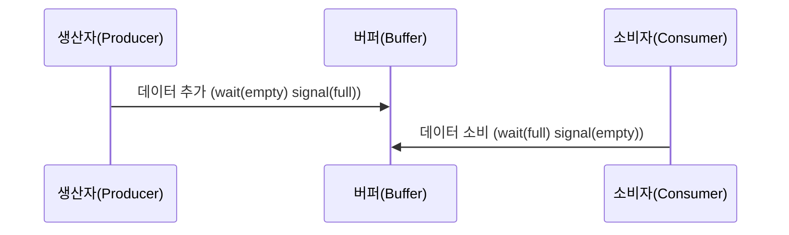

(Semaphore, Mutex, Monitor)

# 동기화 (Synchronization)

#### 정리 요약

이 문서는 운영체제에서 **프로세스와 스레드 간 동기화(Synchronization)** 가 왜 필요한지,  
그리고 이를 어떻게 구현하는지를 설명한다.  
동기화는 여러 프로세스나 스레드가 동시에 공유 자원에 접근할 때 발생하는  
**경쟁 상태(Race Condition)** 를 방지하기 위해 사용된다.  
운영체제는 이를 위해 **세마포어(Semaphore)**, **뮤텍스(Mutex)**, **모니터(Monitor)** 등의 기법을 제공한다.

* 동기화는 **멀티스레드 환경**에서 필수적이다.
* 잘못된 락(lock) 사용은 **교착 상태**를 초래할 수 있다.
* 커널 수준의 락은 스핀락(Spinlock), 세마포어, 리더-라이터 락(RWLock) 등 다양한 형태로 존재한다.
* 현대 OS는 다중 코어 환경에서 락 경쟁을 줄이기 위해 **Lock-Free / Wait-Free 알고리즘**을 도입하고 있다.
* 실제 시스템 분석 시 `ps -eLf`, `htop`, `perf lock` 명령을 통해 락 경합을 진단할 수 있다.

###### 참고 자료

* [Linux Kernel Documentation – Synchronization Primitives](https://docs.kernel.org/locking/)
* [Wikipedia – Synchronization (computer science)](https://en.wikipedia.org/wiki/Synchronization_%28computer_science%29)

---

## 1. 동기화의 필요성

현대 운영체제는 여러 프로세스 또는 스레드가 동시에 실행되는 **병행 처리(Concurrency)** 환경을 지원한다.  
이때 공유 자원(변수, 파일, 메모리 등)에 동시에 접근하면 의도치 않은 결과가 발생할 수 있다.  
이를 **Race Condition**이라 하며, 동기화를 통해 해결한다.

| 문제 상황 | 설명 |
|:--|:--|
| 공유 자원 접근 | 여러 스레드가 동시에 같은 메모리 영역에 접근 |
| Race Condition | 접근 순서에 따라 결과가 달라짐 |
| 동기화 (Synchronization) | 공유 자원 접근을 순차적으로 제어 |

---

## 2. 임계 구역 (Critical Section) 문제

임계 구역은 동시에 실행되면 안 되는 코드 영역을 의미한다.  
운영체제는 다음 세 가지 조건을 만족하도록 임계 구역을 보호해야 한다.

| 조건 | 설명 |
|:--|:--|
| 상호 배제 (Mutual Exclusion) | 한 번에 하나의 프로세스만 임계 구역에 진입 가능 |
| 진행 (Progress) | 임계 구역에 진입할 프로세스가 없을 경우, 대기 중인 프로세스 중 하나는 진입 가능 |
| 한정 대기 (Bounded Waiting) | 특정 프로세스가 무한히 대기하지 않도록 보장 |

---

## 3. 동기화 도구

운영체제는 임계 구역 문제를 해결하기 위해 다양한 동기화 도구를 제공한다.

### (1) 뮤텍스 (Mutex)

뮤텍스는 **Lock / Unlock** 방식으로 한 번에 하나의 스레드만 자원에 접근하도록 제한한다.

```c
// 예시: 뮤텍스 사용
pthread_mutex_lock(&mutex);
// 임계 구역
pthread_mutex_unlock(&mutex);
```

| 특징    | 설명                  |
| :---- | :------------------ |
| 구조    | 이진 상태 (잠금 / 해제)     |
| 사용 대상 | 스레드 간 공유 자원 보호      |
| 구현 위치 | 사용자 수준 또는 커널 수준     |
| 단점    | 잘못된 unlock 시 데드락 가능 |

---

### (2) 세마포어 (Semaphore)

세마포어는 카운터를 사용하여 여러 프로세스가 자원을 제한적으로 사용할 수 있도록 제어한다.
세마포어 값이 0이면, 프로세스는 자원을 사용할 수 없고 대기 상태가 된다.

```text
P(S): wait(S)  // 세마포어 감소
V(S): signal(S) // 세마포어 증가
```

| 구분                            | 설명                     |
| :---------------------------- | :--------------------- |
| 이진 세마포어 (Binary Semaphore)    | 0 또는 1 값만 가짐 (뮤텍스와 유사) |
| 카운팅 세마포어 (Counting Semaphore) | 다중 자원 접근 제어            |
| 장점                            | 다양한 병행 제어 구조 구현 가능     |
| 단점                            | 교착 상태 가능성 존재           |

---

### (3) 모니터 (Monitor)

모니터는 언어 수준에서 동기화를 제공하는 **고급 동기화 도구**이다.
뮤텍스나 세마포어와 달리 개발자가 직접 락을 관리하지 않아도 된다.

```java
synchronized void update() {
  // 임계 구역
}
```

| 특징    | 설명                        |
| :---- | :------------------------ |
| 제공 방식 | 프로그래밍 언어 레벨 (예: Java, C#) |
| 구성 요소 | 공유 자원 + 동기화 메서드 + 조건 변수   |
| 장점    | 코드 가독성 향상, 데드락 발생률 감소     |
| 단점    | 커널 수준의 세밀한 제어는 어려움        |

---

## 4. 교착 상태 (Deadlock)

동기화 과정에서 두 개 이상의 프로세스가 서로 자원을 기다리며
영원히 대기하는 상황을 **교착 상태(Deadlock)** 라고 한다.

| 조건                       | 설명                     |
| :----------------------- | :--------------------- |
| 상호 배제 (Mutual Exclusion) | 자원은 한 프로세스만 사용 가능      |
| 점유와 대기 (Hold and Wait)   | 자원을 점유한 상태에서 다른 자원을 요청 |
| 비선점 (No Preemption)      | 자원을 강제로 빼앗을 수 없음       |
| 순환 대기 (Circular Wait)    | 프로세스들이 순환 형태로 자원을 기다림  |

### 교착 상태 해결 방법

| 방법              | 설명                                          |
| :-------------- | :------------------------------------------ |
| 예방 (Prevention) | 교착 상태 발생 조건 중 하나 이상을 제거                     |
| 회피 (Avoidance)  | 자원 요청 시 안전 상태(Safe State)만 허용 (예: 은행원 알고리즘) |
| 탐지 (Detection)  | 교착 상태 발생 여부를 주기적으로 검사                       |
| 복구 (Recovery)   | 교착 상태 발생 시 강제 종료 또는 자원 회수                   |

---

## 5. 생산자-소비자 문제 (Producer-Consumer Problem)

이 문제는 동기화의 대표적인 예시다.
하나의 **버퍼(Buffer)** 를 공유하는 두 프로세스가 있을 때,
생산자는 데이터를 추가하고 소비자는 데이터를 제거한다.


- 생산자(Producer)는 버퍼가 비어 있을 때 wait(empty) 조건을 만족하면 데이터를 추가하고, signal(full)을 통해 소비자에게 알립니다.
- 소비자(Consumer)는 버퍼에 데이터가 있을 때 wait(full) 조건을 만족하면 데이터를 소비하고, signal(empty)로 생산자에게 알립니다.

