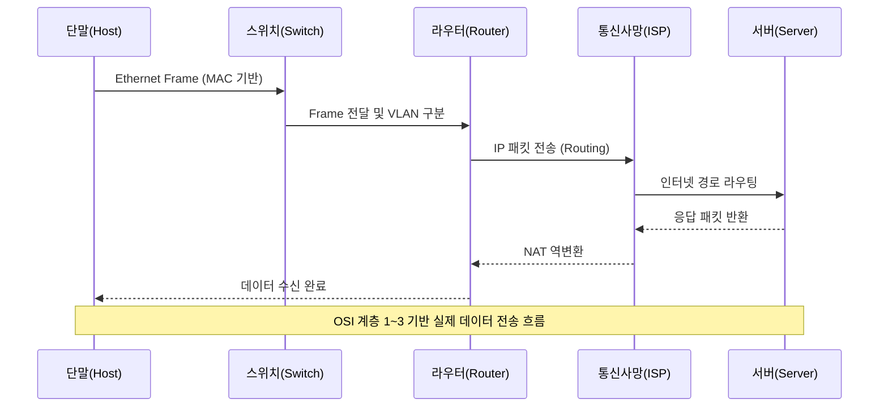
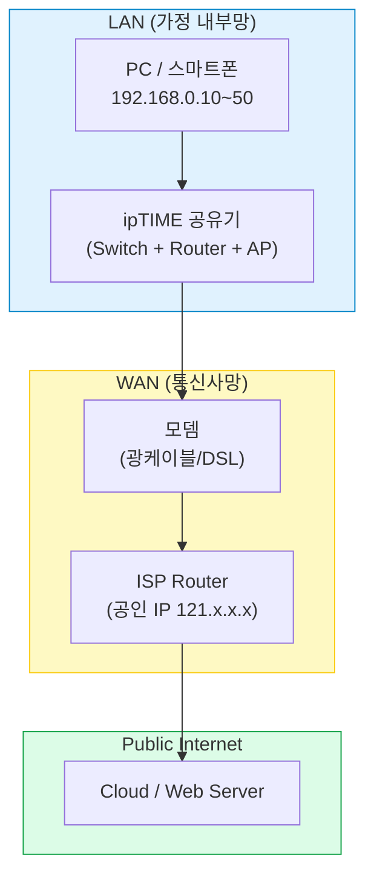
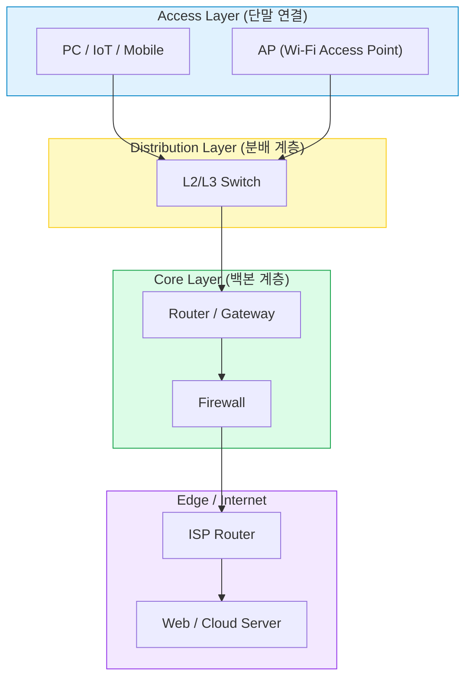
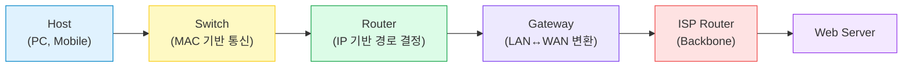

#### 요약

- 네트워크 장치는 데이터가 **올바른 경로로 이동하고**, **필요한 변환과 분배**를 수행하는 핵심 구성요소다.  
- 모든 통신은 단말(Host)에서 출발하여 **스위치(Switch)**, **라우터(Router)**, **게이트웨이(Gateway)**, **모뎀(Modem)** 등을 거쳐 전달된다.  
- 장비별 역할을 이해하면 네트워크 구조 설계, 장애 원인 분석, IP 구성 문제 해결이 쉬워진다.  

네트워크 장치는 단순한 연결 도구가 아니라
**데이터가 “어디서 → 어디로 → 어떤 방식으로” 이동하는지를 결정하는 엔진**이다.
각 장비의 역할을 정확히 이해하면,
장애 분석·보안 설정·성능 개선까지 모든 영역에서 원인을 신속히 파악할 수 있다.

**핵심 요약**
1. 허브(Hub)는 단순 분배, 스위치(Switch)는 MAC 기반 전달  
2. 라우터(Router)는 IP 기반 경로 선택  
3. 게이트웨이(Gateway)는 다른 네트워크 간 변환  
4. 모뎀(Modem)은 신호 변조·복조  
5. AP(Access Point)는 무선 네트워크 확장  

---

#### 1. 네트워크 장치 개요

네트워크 장비는 데이터가 이동하는 “교통 시스템”의 신호등·분기점과 같다.  
기본적으로 다음 세 계층으로 나눌 수 있다.

| 구분 | 역할 | 예시 장비 |
|:--|:--|:--|
| **단말 장치 (Host Devices)** | 데이터를 송수신 | PC, 서버, 스마트폰 |
| **전송 장치 (Switching Devices)** | 데이터 프레임 전송 및 분배 | 스위치, 허브 |
| **경로 제어 장치 (Routing Devices)** | 네트워크 간 경로 결정 | 라우터, 게이트웨이, 모뎀 |

---

#### 2. 주요 장비별 역할 정리

| 장비                    | 계층         | 주요 기능                              | 비고            |
| :-------------------- | :--------- | :--------------------------------- | :------------ |
| **허브 (Hub)**          | 데이터링크(2계층) | 단순한 신호 복제 및 브로드캐스트                 | 저가형, 충돌 도메인 큼 |
| **스위치 (Switch)**      | 데이터링크(2계층) | MAC 주소 기반 프레임 전달                   | VLAN 지원       |
| **라우터 (Router)**      | 네트워크(3계층)  | IP 기반 경로 선택 및 라우팅 테이블 관리           | LAN↔WAN 연결 핵심 |
| **게이트웨이 (Gateway)**   | 전송~응용 계층   | 서로 다른 프로토콜 간 변환                    | LAN↔외부망 변환    |
| **모뎀 (Modem)**        | 물리 계층      | 신호 변조(Modulation)/복조(Demodulation) | ISP 연결용       |
| **AP (Access Point)** | 데이터링크      | 무선 단말 접속 중계                        | Wi-Fi 확장      |
| **방화벽 (Firewall)**    | 전송~네트워크 계층 | 접근 제어, 트래픽 필터링                     | 보안 핵심 장비      |

---

#### 3. 데이터 흐름: 단말 → 공유기 → 라우터 → 인터넷

---

#### 4. ipTIME 공유기를 기준으로 본 가정용 네트워크 구조

| 기능            | 수행 장치  | 설명                        |
| :------------ | :----- | :------------------------ |
| IP 자동할당(DHCP) | ipTIME | 내부 사설 IP 부여 (192.168.x.x) |
| NAT 변환        | ipTIME | 내부 IP ↔ 공인 IP 변환          |
| 무선 연결 (Wi-Fi) | AP 내장  | 2.4GHz / 5GHz 듀얼밴드        |
| WAN 연결        | 모뎀     | ISP로 신호 전달                |
| 인터넷 통신        | 라우터    | 외부 경로 제어 및 전달             |

---

#### 5. 실무 환경에서의 장비 계층 구조

**요약:**

* **Access Layer**: 사용자 단말이 최초로 연결되는 구간 (AP, Switch)
* **Distribution Layer**: 트래픽 집계, VLAN 관리
* **Core Layer**: 주요 라우팅과 방화벽을 통한 정책 제어
* **Edge Layer**: 외부 인터넷 또는 클라우드와 연결되는 구간

---

#### 6. 장비 간 차이 핵심 비교

| 구분        | 전달 단위      | 기준 정보         | 연결 범위        | 대표 장비        |
| :-------- | :--------- | :------------ | :----------- | :----------- |
| **스위치**   | 프레임(Frame) | MAC 주소        | 동일 네트워크(LAN) | L2/L3 Switch |
| **라우터**   | 패킷(Packet) | IP 주소         | 다른 네트워크(WAN) | Router       |
| **게이트웨이** | 세션/응용 데이터  | 프로토콜          | 異체계 간 연결     | Gateway      |
| **허브**    | 신호(Signal) | 없음 (모두 전송)    | 단순 분배        | Hub          |
| **모뎀**    | 전기/광 신호    | 아날로그 ↔ 디지털 변환 | 통신사 회선 연결    | Modem        |

---

#### 7. 장비 구성 흐름 요약

---
