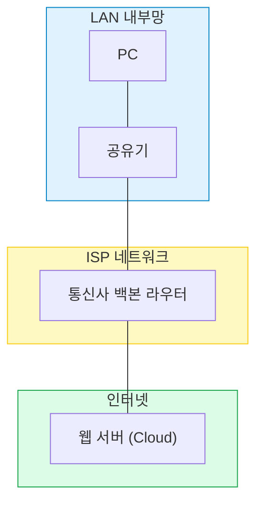
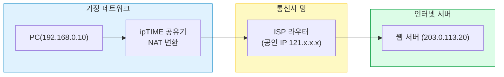
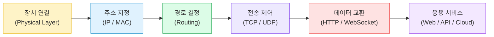

#### 요약

- 네트워크(Network)는 여러 장치들이 데이터를 교환하기 위해 연결된 **정보 전달 시스템**이다.  
- 네트워크는 물리적 구조(케이블, 전파, 장비)와 논리적 구조(IP, 라우팅, 프로토콜)의 결합으로 구성된다.  
- 목적은 단순히 연결이 아니라 **데이터의 신뢰성·속도·보안성 확보**이다.  
- 네트워크 구조를 이해하면 통신 경로, 지연(Latency), 장애 원인을 계층별로 분석할 수 있다.  

**핵심 요약**
1. 네트워크 = 물리적 + 논리적 연결 구조  
2. 모든 통신은 “주소(IP)”와 “규칙(프로토콜)”을 기반으로 한다  
3. 데이터 흐름은 계층화되어 있으며, 송신·수신 과정에서 캡슐화된다  
4. 실제 네트워크는 **LAN → 라우터 → ISP → 인터넷 → 서버**로 이어진다  

---

#### 1. 네트워크의 정의와 구조

네트워크는 데이터를 교환하기 위한 **통신 경로(Communication Path)** 로,  
기본적으로 다음과 같은 구성요소로 이루어진다.

| 구성 요소 | 설명 | 예시 |
|:--|:--|:--|
| **호스트(Host)** | 데이터를 송·수신하는 단말 | PC, 스마트폰, 서버 |
| **매체(Medium)** | 데이터를 전달하는 물리적 통로 | 케이블, 광섬유, 무선 |
| **프로토콜(Protocol)** | 통신 규칙과 절차 | TCP/IP, HTTP, DNS |
| **장비(Device)** | 데이터 전달과 분배 담당 | 스위치, 라우터, 공유기 |

---

#### 2. 물리적 vs 논리적 네트워크

- **물리적(Physical)**: 실제 케이블·장비로 연결된 구조  
- **논리적(Logical)**: IP, 서브넷, VLAN, 라우팅 등 소프트웨어적 구성  

```mermaid
flowchart LR
  A["노트북 (192.168.0.10)"] --> B["ipTIME 공유기 (게이트웨이)"]
  B --> C["ISP 라우터 (공인망)"]
  C --> D["인터넷 (Public Network)"]
  D --> E["웹 서버 (203.0.113.20)"]

  style A fill:#e0f2fe,stroke:#0284c7,stroke-width:1px
  style B fill:#fef9c3,stroke:#facc15,stroke-width:1px
  style D fill:#dcfce7,stroke:#16a34a,stroke-width:1px
````

**해석:**
사용자의 PC → 공유기 → 통신사 라우터 → 인터넷 → 목적지 서버
이 흐름이 바로 네트워크의 기본 동작 경로이다.

---

#### 3. 데이터 흐름 단계 (End-to-End Flow)

```mermaid
sequenceDiagram
  participant U as 사용자 단말 (Client)
  participant R as 라우터/게이트웨이
  participant I as 인터넷 (ISP)
  participant S as 서버 (Server)

  U->>R: 데이터 전송 요청 (TCP/IP 패킷)
  R->>I: 패킷 라우팅
  I->>S: 최적 경로로 패킷 전달
  S-->>I: 응답 데이터 (ACK)
  I-->>R: 역경로로 전송
  R-->>U: 수신 완료 (Response)
  Note over U,S: 왕복(RTT) = Ping 지연의 핵심
```

**요약:**

1. 송신 측이 데이터를 캡슐화하여 전송
2. 중간 라우터들이 목적지 IP 기준으로 경로 선택
3. 수신 측이 역캡슐화 후 응답 반환

---

#### 4. 네트워크의 주요 형태

| 유형                                | 설명                    | 예시                |
| :-------------------------------- | :-------------------- | :---------------- |
| **LAN (Local Area Network)**      | 근거리 네트워크, 사무실·가정 내 구성 | Wi-Fi, 유선 LAN     |
| **WAN (Wide Area Network)**       | 광역망, ISP 백본망          | KT, SK Broadband  |
| **WLAN (Wireless LAN)**           | 무선 기반 LAN             | Wi-Fi 6, 802.11ax |
| **VPN (Virtual Private Network)** | 가상 사설망, 보안 터널링 통신     | 기업 원격 접속          |



---

#### 5. 가정용 네트워크 동작 예시 (ipTIME)

1. PC는 DHCP를 통해 IP(예: 192.168.0.10)를 자동 할당받는다.
2. ipTIME 공유기는 NAT를 통해 내부 사설 IP를 공인 IP로 변환한다.
3. ISP(통신사)는 외부망으로 라우팅한다.
4. 목적지 서버와 TCP 세션이 수립되고 데이터가 오간다.



---

#### 6. 네트워크의 핵심 목표

| 목표                    | 설명               |
| :-------------------- | :--------------- |
| **신뢰성 (Reliability)** | 데이터 손실 없이 전달     |
| **효율성 (Efficiency)**  | 최소한의 경로로 빠른 전송   |
| **보안성 (Security)**    | 암호화·인증·방화벽       |
| **확장성 (Scalability)** | 노드 확장 및 경로 추가 용이 |

---

#### 7. 전체 개념 요약 — "연결에서 통신까지"



---


