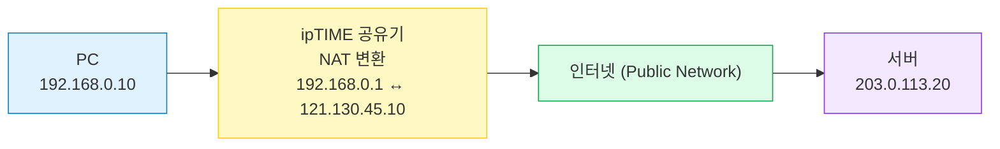
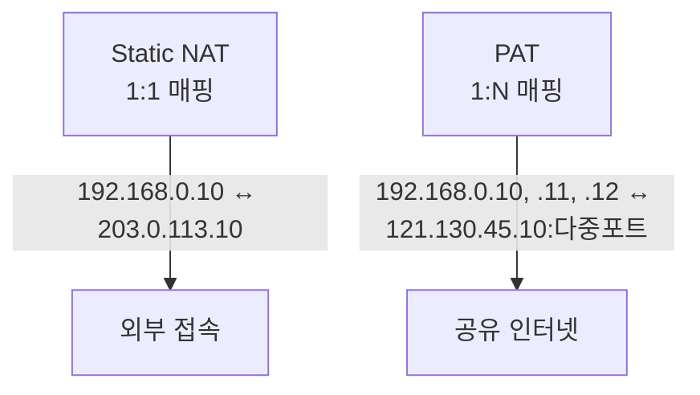
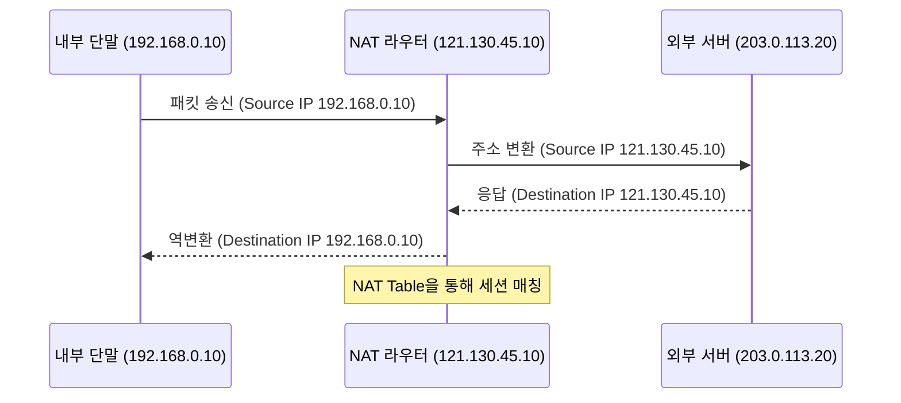
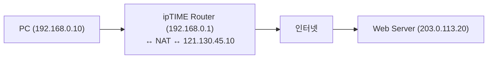
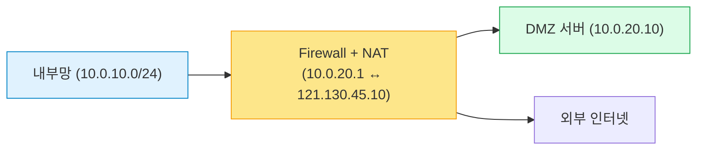
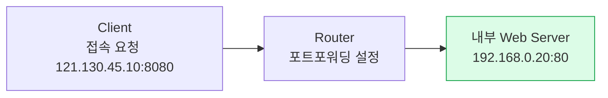

#### 요약
- **NAT(Network Address Translation)** 은 사설 IP(내부 주소)를 공인 IP(외부 주소)로 변환하는 기술이다.  
- IPv4 주소 고갈을 해결하고, 내부망의 보안을 강화하며, 여러 장치가 하나의 공인 IP를 공유하도록 한다.  
- NAT는 오늘날 거의 모든 **가정용 공유기(ipTIME, Netgear)** 와 **기업용 라우터(Cisco, Juniper)** 에 내장되어 있다.  

NAT는 IPv4 시대의 생존 기술로,
**한정된 주소를 최대한 효율적으로 활용하고**,
**내부망 보안과 외부망 연결을 동시에 해결**한다.
가정에서는 ipTIME 공유기, 기업에서는 방화벽·라우터 장비가 이 역할을 수행한다.

즉, NAT는

> “내부망을 보호하면서 외부와 연결을 가능하게 만드는 **네트워크 번역기**다.”

**핵심 요약**
1. NAT는 내부 IP와 외부 IP 간 주소 변환을 수행한다.  
2. 사설 IP는 외부에서 직접 접근할 수 없으며, NAT를 통해만 인터넷 통신 가능하다.  
3. Port Address Translation(PAT)을 사용하면 하나의 공인 IP로 여러 세션을 동시에 유지할 수 있다.  
4. NAT는 **보안 + 자원 절약 + 연결 공유**의 핵심 기술이다.  

---

#### 1. NAT의 개념 이해

* PC가 `192.168.0.10`(사설 IP)에서 HTTP 요청을 보내면,
  공유기가 NAT 테이블을 이용해 **121.130.45.10:50123** 으로 변환한다.
* 서버는 응답을 보낼 때 해당 포트를 참고해 다시 올바른 내부 장치로 전달된다.

---

#### 2. NAT 변환 테이블 예시

| 내부 IP        | 내부 포트 | 외부 IP         | 외부 포트 | 상태          |
| :----------- | :---: | :------------ | :---: | :---------- |
| 192.168.0.10 | 50123 | 121.130.45.10 | 50123 | Established |
| 192.168.0.11 | 50124 | 121.130.45.10 | 50124 | Established |
| 192.168.0.12 | 50125 | 121.130.45.10 | 50125 | Established |

> 💡 NAT는 이처럼 “포트 단위”로 매핑을 관리한다.
> 동일한 공인 IP를 여러 장치가 동시에 사용 가능하다.

---

#### 3. NAT의 종류와 특징

| 유형                                 | 설명                      | 예시                |
| :--------------------------------- | :---------------------- | :---------------- |
| **Static NAT**                     | 내부 IP ↔ 외부 IP 1:1 고정 매핑 | DMZ 서버, 고정 접근용    |
| **Dynamic NAT**                    | IP 풀(Pool)에서 임시 매핑      | 기업망, 세션당 동적 할당    |
| **PAT (Port Address Translation)** | 포트를 기반으로 다중 매핑          | 가정용 공유기 일반형       |
| **Bidirectional NAT**              | 양방향 변환 (서버용)            | 공인 서버 IP 내부화 시 사용 |

---

#### 4. 사설 IP 주소 대역 (RFC 1918)

| 대역             |      크기     | 사용 예시        |
| :------------- | :---------: | :----------- |
| 10.0.0.0/8     | 16,777,216개 | 대규모 기업, 클라우드 |
| 172.16.0.0/12  |  1,048,576개 | 중형 기관망       |
| 192.168.0.0/16 |   65,536개   | 가정, 소형 사무실   |

> 이 범위의 IP는 외부 인터넷에서 라우팅되지 않는다.
> (즉, NAT 없이 외부에서 접근 불가)

---

#### 5. NAT 동작 흐름 (패킷 전송 절차)

---

#### 6. 실제 예시① — 가정용 NAT(ipTIME 기반)

| 장비         | 역할         | 예시 IP                       | 설명         |
| :--------- | :--------- | :-------------------------- | :--------- |
| PC         | 내부 클라이언트   | 192.168.0.10                | DHCP 자동 할당 |
| 스마트폰       | 무선 단말      | 192.168.0.11                | Wi-Fi 연결   |
| ipTIME 공유기 | NAT + DHCP | 192.168.0.1 / 121.130.45.10 | 내부 ↔ 외부 변환 |
| 서버         | 외부 대상      | 203.0.113.20                | 웹서비스 제공    |

---

#### 7. 실제 예시② — 기업용 사설망 구조

| 구분           | 설명               | IP 예시                  |
| :----------- | :--------------- | :--------------------- |
| 내부망 (LAN)    | 업무용 PC / 서버망     | 10.0.10.0/24           |
| DMZ          | 외부 공개 서버 구간      | 10.0.20.0/24           |
| 외부망 (WAN)    | ISP 연결           | 공인 IP 121.130.45.10    |
| NAT/Firewall | 내부↔외부 변환 및 접근 제어 | Cisco ASA, Palo Alto 등 |

---

#### 8. 포트 포워딩 (Port Forwarding)

* 외부 사용자가 내부 서버에 접속할 수 있도록 특정 포트를 열어둠
* 예: 외부에서 `121.130.45.10:8080`으로 접근 → 내부 `192.168.0.20:80`으로 전달

| 외부 포트 | 내부 IP        | 내부 포트 | 프로토콜 | 용도        |
| :---: | :----------- | :---: | :--: | :-------- |
|  8080 | 192.168.0.20 |   80  |  TCP | Web       |
|  8443 | 192.168.0.30 |  443  |  TCP | HTTPS     |
|   22  | 192.168.0.40 |   22  |  TCP | SSH 원격 접속 |

---

#### 9. NAT의 한계 및 주의사항

| 항목     | 설명                                        |
| :----- | :---------------------------------------- |
| 세션 제한  | PAT은 포트 수(65535) 이상 동시 연결 불가              |
| 실시간 통신 | P2P, WebRTC는 NAT Traversal 필요 (STUN/TURN) |
| 로깅 복잡성 | 외부 IP 하나에 다수 세션 매핑으로 추적 어려움               |
| 보안 설정  | 포트포워딩 과다 시 공격 노출 위험                       |

---

#### 10. 실무 팁

✅ **NAT + DHCP 조합은 일반적인 가정용 기본 구성**
✅ 공인 IP가 필요한 서버는 DMZ 또는 포트포워딩 사용
✅ VPN 구성 시 NAT-T(NAT Traversal) 기능 활성화 필요
✅ IPv6 환경에서는 NAT보다 방화벽/ACL 정책으로 대체

---

