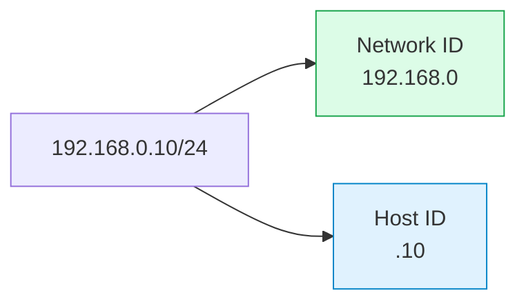
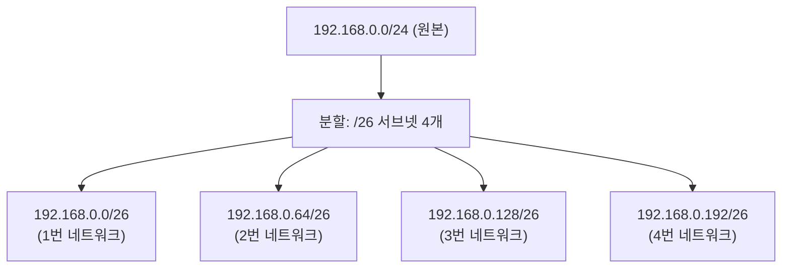
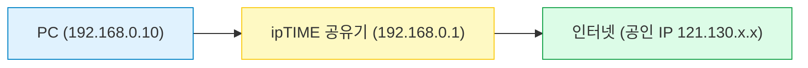
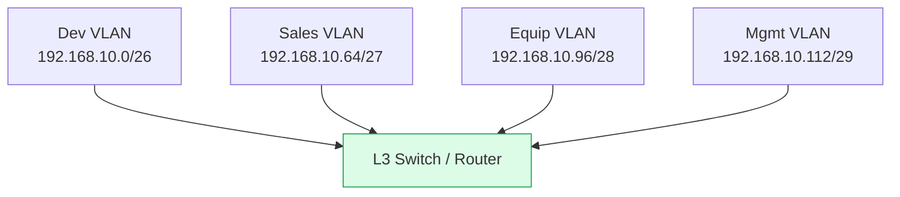
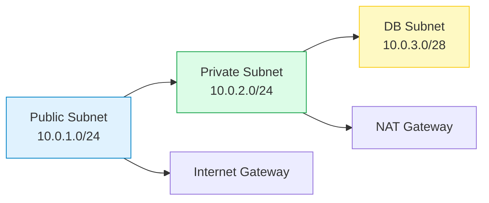
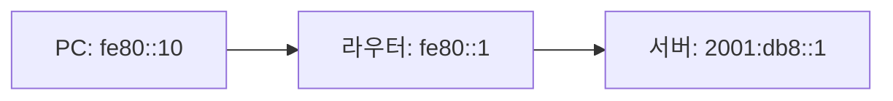

#### 요약
- IP 주소는 네트워크 상의 **논리적 주소(주소 체계)** 로, 장치 식별과 데이터 경로 설정의 기반이 된다.  
- IPv4는 32비트, IPv6는 128비트로 구성되어 네트워크 확장성과 보안성을 개선했다.  
- **서브넷(Subnet)** 은 네트워크를 작게 쪼개어 효율적인 IP 관리와 트래픽 제어를 가능하게 한다.  

IP와 서브넷은 단순한 숫자가 아니라 **네트워크의 논리적 지도**다.
주소 구조를 이해하면,

* **NAT** 변환이 어떻게 동작하는지,
* **라우터**가 경로를 어떻게 선택하는지,
* **가상 네트워크**가 어떻게 격리되는지를 한눈에 파악할 수 있다.

IP는 결국 네트워크 전체의 “좌표계”이며,
이를 정확히 설계하는 것이 안정적인 통신의 출발점이다.

**핵심 요약**
1. IP = 네트워크 식별자(Network ID) + 호스트 식별자(Host ID)  
2. 서브넷 마스크는 네트워크의 경계선을 표시한다.  
3. CIDR(Classless Inter-Domain Routing)은 유연한 주소 관리 기법이다.  
4. IP는 NAT, 라우팅, 방화벽, 가상 네트워크의 기반이 된다.  

---

#### 1. IP 주소 체계

| 버전 | 비트 수 | 표기 방식 | 예시 | 주요 특징 |
|:--|:--:|:--|:--|:--|
| IPv4 | 32비트 (4옥텟) | `192.168.0.10` | 일반적인 주소체계, NAT 필수 | 주소 고갈로 제한적 |
| IPv6 | 128비트 (8세그먼트) | `2001:db8::1` | 자동 설정(SLAAC), NAT 불필요 | 차세대 인터넷 표준 |

> 💡 **옥텟(Octet)** : 8비트(1바이트)를 의미. IPv4는 4옥텟으로 32비트를 구성한다.  
> 💡 **프리픽스(Prefix)** : 네트워크 비트 길이를 의미. 예: `/24` = 상위 24비트는 네트워크 영역.

---

#### 2. IP 구성 구조



* **Network ID** : 동일 네트워크 세그먼트 내 장치들을 그룹화함.
* **Host ID** : 그 네트워크 안의 개별 장치 식별자.

예를 들어,

* `192.168.0.0/24` 네트워크 안에는 `192.168.0.1` ~ `192.168.0.254` 까지 장치가 존재 가능하다.
* `192.168.0.0`은 **네트워크 주소**, `192.168.0.255`는 **브로드캐스트 주소**로 예약되어 사용 불가.

---

#### 3. 서브넷 마스크 & CIDR

| 서브넷 마스크         | CIDR | 총 주소 수 | 사용 가능 호스트 수 | 사용 환경       |
| :-------------- | :--: | :----: | :---------: | :---------- |
| 255.255.255.0   |  /24 |   256  |     254     | 가정/소규모 사무실  |
| 255.255.255.128 |  /25 |   128  |     126     | 소규모 부서망     |
| 255.255.255.192 |  /26 |   64   |      62     | 서버/보안 분리망   |
| 255.255.255.224 |  /27 |   32   |      30     | 테스트 구간, 장비망 |
| 255.255.255.240 |  /28 |   16   |      14     | DMZ, 관리 전용망 |

> **계산식**
> 총 IP = 2^(32 - prefix)
> 사용 가능한 호스트 수 = 총 IP - 2
> (네트워크 주소와 브로드캐스트 주소는 사용 불가)

---

#### 4. 공인 IP vs 사설 IP (RFC 1918 표준)

| 구분              | 주소 대역   | 예시                     | 특징                    |
| :-------------- | :------ | :--------------------- | :-------------------- |
| **공인(Public)**  | 전 세계 고유 | 121.130.45.10          | 인터넷 직접 통신 가능 (ISP 제공) |
| **사설(Private)** | 내부 전용   | 192.168.x.x / 10.x.x.x | NAT 필요, 내부 통신용        |

> **루프백(Loopback)** : `127.0.0.1` — 자기 자신 테스트용
> **링크 로컬(Link-local)** : `169.254.x.x` — DHCP 실패 시 자동 할당
> **멀티캐스트(Multicast)** : `224.0.0.0/4` — 여러 장치에 동시에 전송

---

#### 5. CIDR과 서브넷 분할 예시



* **CIDR(Classless Inter-Domain Routing)**: 클래스(A/B/C) 구분 대신 `/` 프리픽스로 범위 정의.
* **VLSM(Variable Length Subnet Mask)**: 필요한 크기만큼 다르게 나누는 유연한 방식.

---

#### 6. 바이너리 예시 (비트 단위 분석)

`192.168.0.10/26`

```
IP(10진) : 192.168.0.10  
IP(2진) : 11000000.10101000.00000000.00001010  
MASK(/26): 11111111.11111111.11111111.11000000  

Network  : 192.168.0.0  
Broadcast: 192.168.0.63  
Usable   : 192.168.0.1 ~ 192.168.0.62
```

> `/26` → 64개 주소(62 usable)
> `/30` → 4개 주소(2 usable, 보통 라우터 간 연결용)

---

#### 7. 실제 예시① — 가정용 네트워크



* DHCP로 자동 IP 할당 (`192.168.0.x`)
* NAT 변환으로 외부망 연결
* 공유기는 `192.168.0.1` → 기본 게이트웨이로 작동

> **실제 할당 예시**
>
> * PC: 192.168.0.10
> * 노트북: 192.168.0.11
> * 스마트폰: 192.168.0.12
> * NAS: 192.168.0.20 (고정 IP)

---

#### 8. 실제 예시② — 사무실 VLAN / 서브넷 구조

| 부서  | 서브넷               | 게이트웨이          | 비고         |
| :-- | :---------------- | :------------- | :--------- |
| 개발팀 | 192.168.10.0/26   | 192.168.10.1   | 서버 트래픽 많음  |
| 영업팀 | 192.168.10.64/27  | 192.168.10.65  | 일반 사무용     |
| 장비망 | 192.168.10.96/28  | 192.168.10.97  | IP카메라, NAS |
| 관리망 | 192.168.10.112/29 | 192.168.10.113 | 관리자 전용     |



> VLAN 별로 분리된 IP 대역을 통해 트래픽 간섭 최소화
> 보안 정책(ACL)으로 부서 간 접근 통제 가능

---

#### 9. 실제 예시③ — 클라우드 VPC 구조

| 서브넷 이름         | CIDR        | 용도       | 설명                  |
| :------------- | :---------- | :------- | :------------------ |
| Public Subnet  | 10.0.1.0/24 | 외부 접근 허용 | 로드밸런서, Bastion Host |
| Private Subnet | 10.0.2.0/24 | 내부 서비스   | API 서버, DB          |
| DB Subnet      | 10.0.3.0/28 | 보안 강화    | RDS 등 데이터베이스 전용     |



---

#### 10. IPv6 예시

| 항목    | IPv6 주소 예시      | 설명               |
| :---- | :-------------- | :--------------- |
| 링크 로컬 | `fe80::1`       | 동일 네트워크 간 자동 연결  |
| 유니캐스트 | `2001:db8::1`   | 특정 노드 지정         |
| 멀티캐스트 | `ff02::1`       | 전체 노드(모든 장치)에 송신 |
| 애니캐스트 | `2001:db8::100` | 가장 가까운 노드로 전달    |



---

