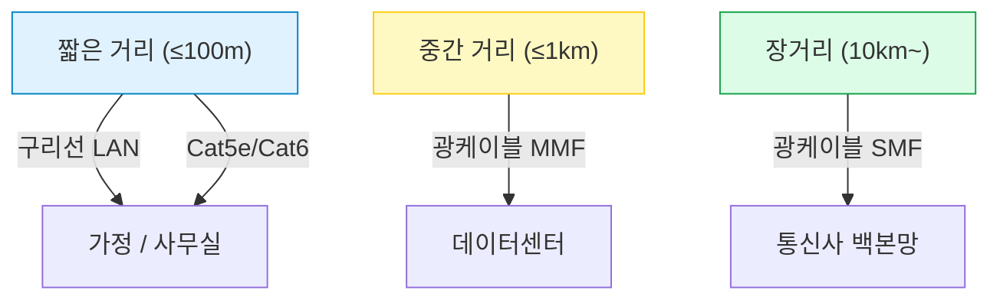
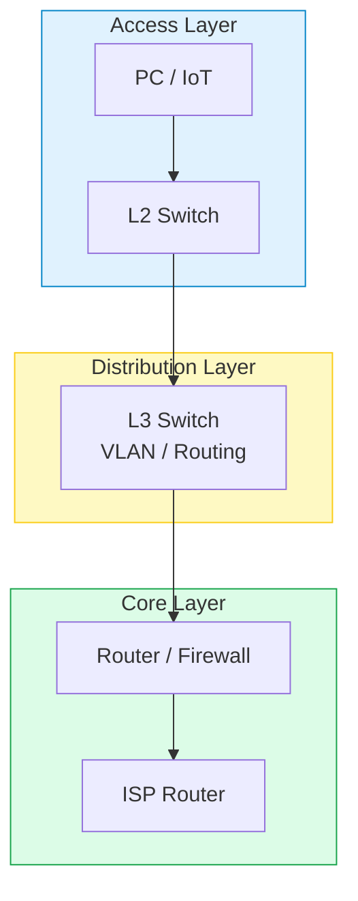
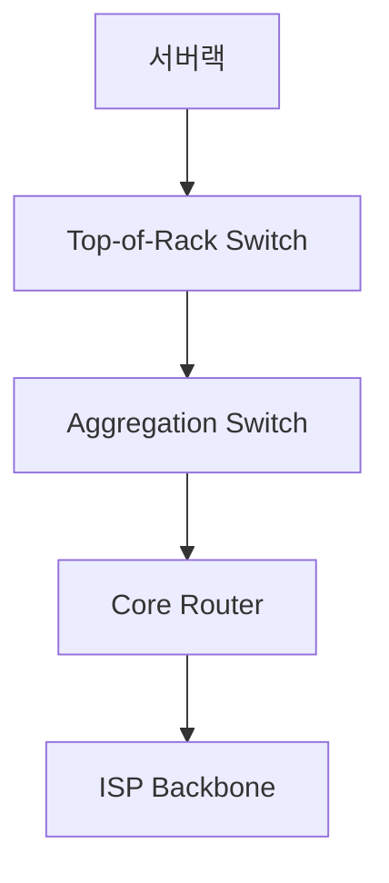

#### 요약
- 물리 계층(Physical Layer)은 데이터를 전기·광학 신호로 실제 전송하는 **네트워크의 기반**이다.  
- 케이블, 커넥터, 허브, NIC(Network Interface Card), 리피터 등 하드웨어가 포함된다.  
- 이 계층의 품질은 네트워크 속도, 안정성, 신호 간섭, 패킷 손실에 직접적인 영향을 준다.

물리 계층은 “보이지 않는 인프라”지만 **네트워크 성능의 70%를 좌우한다.**
적절한 케이블 규격, 커넥터 품질, 전송 거리, 노이즈 관리가
**상위 계층(TCP/IP, HTTP)의 안정성**을 결정짓는다.

즉, **“패킷은 소프트웨어가 보내지만, 신호는 하드웨어가 전한다.”**

**핵심 요약**
1. 물리 계층은 **비트 단위 전송(0,1)** 을 담당한다.  
2. 전송 매체는 **유선(구리선/광섬유)** 과 **무선(Wi-Fi, Bluetooth)** 로 구분된다.  
3. 전송 거리에 따라 케이블 종류와 표준이 다르다.  
4. 실제 통신은 NIC ↔ 케이블 ↔ 허브/스위치 ↔ 라우터 순으로 흐른다.

---

#### 1. 물리 계층의 역할

* 데이터가 상위 계층에서 내려올수록 전기적 신호로 변환된다.
* 물리 계층에서는 **신호 전압, 케이블 길이, 주파수, 커넥터 규격** 등이 중요하다.

---

#### 2. 주요 구성 요소

| 구성 요소                            | 역할             | 예시                  | 특징          |
| :------------------------------- | :------------- | :------------------ | :---------- |
| **케이블 (Cable)**                  | 신호 전송 매체       | UTP, STP, 광케이블      | 전송거리·속도에 영향 |
| **NIC (Network Interface Card)** | 디지털 ↔ 전기 신호 변환 | 내장형 LAN 카드, USB 랜카드 | MAC 주소 보유   |
| **허브 (Hub)**                     | 신호 단순 복제       | ipTIME Mini Hub     | 충돌 많고 비효율   |
| **스위치 (Switch)**                 | MAC 기반 전달      | Cisco, Netgear      | 데이터링크 2계층   |
| **리피터 (Repeater)**               | 신호 증폭          | 중계기                 | 거리 확장       |
| **AP (Access Point)**            | 무선 신호 중계       | Wi-Fi 6 AP          | WLAN 구성     |

---

#### 3. 케이블 종류별 비교

| 구분                 | 전송 매체    | 속도         |   최대 거리  | 용도           |
| :----------------- | :------- | :--------- | :------: | :----------- |
| Cat5e              | 구리선(UTP) | 1 Gbps     |   100 m  | 일반 가정/사무실    |
| Cat6               | 구리선(UTP) | 10 Gbps    |   55 m   | 고속 백본        |
| Cat6A              | 구리선(STP) | 10 Gbps    |   100 m  | 노이즈 많은 환경    |
| 광케이블 (Multi-mode)  | 광섬유      | 10–40 Gbps |   550 m  | IDC, 서버실     |
| 광케이블 (Single-mode) | 광섬유      | 100+ Gbps  | 10 km 이상 | ISP 백본망      |
| Coaxial            | 동축 케이블   | 1 Gbps 이하  |   수십 m   | 옛날 케이블TV/인터넷 |

> 💡 **UTP(Unshielded Twisted Pair)** : 가장 흔한 LAN 케이블, 저렴하지만 간섭에 취약
> 💡 **STP(Shielded Twisted Pair)** : 차폐층이 있어 전자파 간섭(EMI)에 강함
> 💡 **RJ-45 커넥터** : 이더넷 케이블의 대표 커넥터 (8핀 구조)

---

#### 4. 전송 거리와 신호 품질 관계

* 거리가 길어질수록 **신호 감쇠(attenuation)** 와 **지연(latency)** 발생
* **리피터** 또는 **광 모듈(SFP, QSFP)** 로 보완

---

#### 5. 무선 네트워크 구성 요소

| 구분       | 표준       | 주파수       |   최대 속도  | 특징             |
| :------- | :------- | :-------- | :------: | :------------- |
| Wi-Fi 4  | 802.11n  | 2.4/5 GHz | 600 Mbps | 구형             |
| Wi-Fi 5  | 802.11ac | 5 GHz     | 1.3 Gbps | 대부분의 가정용       |
| Wi-Fi 6  | 802.11ax | 2.4/5 GHz | 9.6 Gbps | OFDMA, MU-MIMO |
| Wi-Fi 6E | 802.11ax | 6 GHz 추가  | 9.6 Gbps | 간섭 적음          |
| Wi-Fi 7  | 802.11be | 6 GHz     | 40 Gbps+ | 차세대 무선         |

---

#### 6. 실제 예시① — 가정용 유선 구성

* **ipTIME 공유기** : NAT + DHCP + 무선 AP 내장
* **KT 광모뎀** : ISP(통신사) 연결용, 광회선 신호 복조
* **LAN 케이블 Cat6** : 내부 네트워크 전송

---

#### 7. 실제 예시② — 기업형 스위칭 구조

> **Access Layer** – 단말 연결
> **Distribution Layer** – VLAN 라우팅 및 트래픽 제어
> **Core Layer** – 외부 연결 및 보안 처리

---

#### 8. 실제 예시③ — 데이터센터(서버실)

| 장비                 | 역할        | 포트 유형      | 예시                  |
| :----------------- | :-------- | :--------- | :------------------ |
| TOR Switch         | 서버 직접 연결  | 10/25/40G  | Cisco Nexus, Arista |
| Aggregation Switch | 여러 TOR 집합 | 40/100G    | Spine 구조            |
| Router             | 외부망 연결    | 100G       | Juniper, Huawei     |
| Patch Panel        | 케이블 정리    | RJ-45 / LC | 1U/2U 단위            |
| Fiber Module       | 광 트랜시버    | SFP+, QSFP | 광케이블 연결용            |

---

#### 9. 물리 계층 장애 예시

| 증상           | 원인                | 조치                |
| :----------- | :---------------- | :---------------- |
| Ping 지연 / 끊김 | 케이블 손상, 접촉 불량     | 케이블 교체            |
| 포트 링크 불안정    | 속도/듀플렉스 불일치       | Auto-Negotiate 설정 |
| 간헐적 패킷 손실    | EMI 간섭, 길이 초과     | STP 케이블, 거리 단축    |
| 전송 속도 저하     | Cat5e vs Cat6 불일치 | 케이블 등급 교체         |

---

#### 10. 주요 측정 장비 예시

| 장비          | 용도          | 설명         |
| :---------- | :---------- | :--------- |
| **LAN 테스터** | 케이블 결선 테스트  | T568A/B 확인 |
| **광 파워미터**  | 광신호 세기 측정   | dBm 단위     |
| **케이블 분석기** | 노이즈 / 손실 진단 | CAT6 인증    |
| **PoE 테스터** | 전원공급 유무 확인  | IP카메라 점검용  |

---

