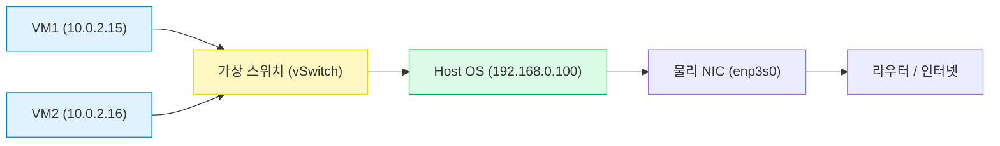
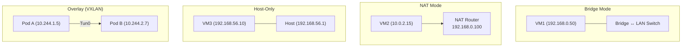
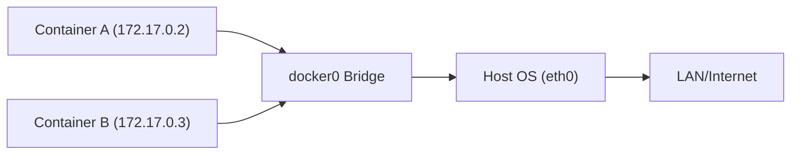
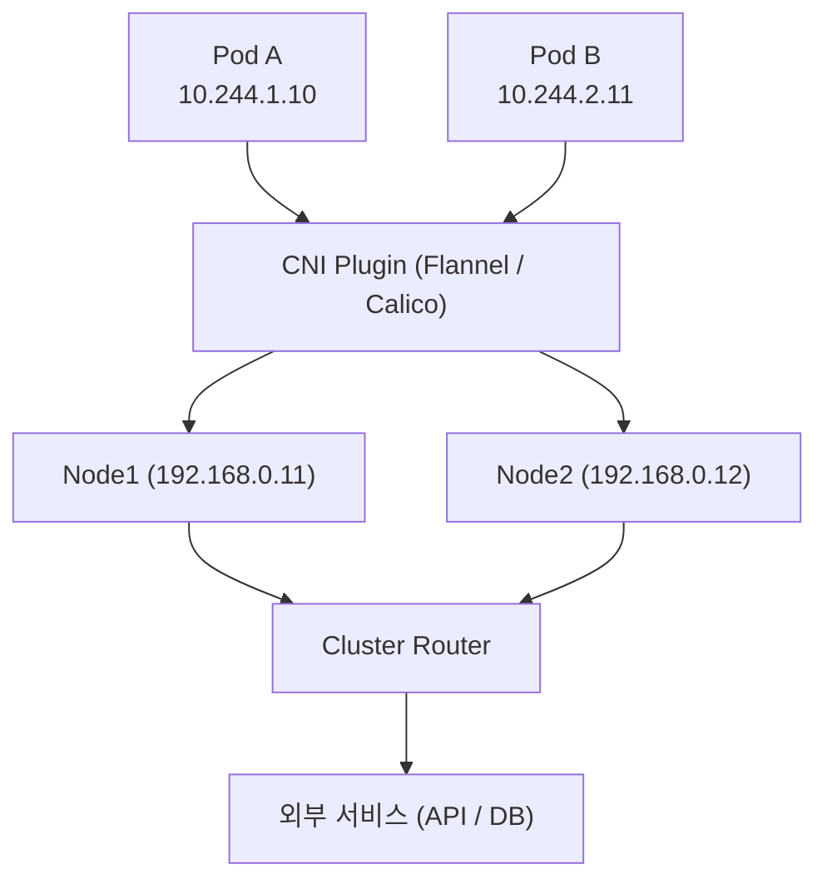
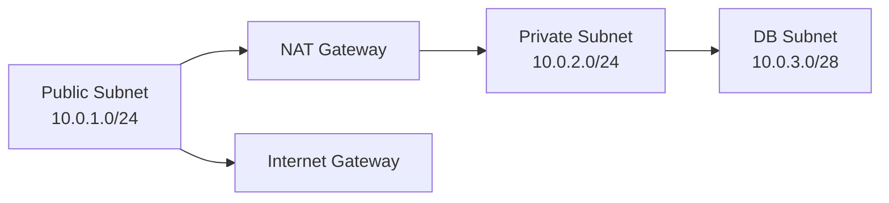

#### 요약
- **가상 네트워크(Virtual Network)** 는 실제 하드웨어 없이 소프트웨어로 구성된 논리적 네트워크이다.  
- 물리적 네트워크 위에 생성되어, **VM(가상머신)** · **컨테이너(Docker)** · **클라우드 인스턴스** 간 통신을 가능하게 한다.  
- 실제 NIC를 에뮬레이션하거나, 브리지·NAT·오버레이 형태로 네트워크를 구성한다.  

가상 네트워크는 실제 하드웨어를 소프트웨어로 에뮬레이션한 **논리적 네트워크 계층**이다.
이 구조 덕분에 개발자는 하나의 노트북에서 “가상의 데이터센터”를 만들 수 있으며,
클라우드·컨테이너·Kubernetes 환경은 모두 이 원리를 기반으로 동작한다.

> “가상 네트워크는 물리적 제약을 제거하고, 연결의 자유를 제공한다.”

**핵심 요약**
1. 가상 네트워크는 “**물리적 네트워크의 논리적 복제본**”이다.  
2. Hypervisor 또는 Container Runtime이 가상 NIC와 스위치를 생성한다.  
3. Bridge / NAT / Host-only / Overlay 네트워크 모드가 대표적이다.  
4. 클라우드(VPC), Kubernetes, Docker 모두 내부적으로 이 원리를 사용한다.  

---

#### 1. 가상 네트워크의 구조 개념

* **vSwitch(Virtual Switch)** : 가상 머신 간의 스위칭 담당
* **vNIC(Virtual NIC)** : 가상 장치가 실제 네트워크에 접근하는 가상 인터페이스
* **Host OS의 NIC** : 물리적 네트워크와 연결되는 실제 인터페이스

---

#### 2. 가상 네트워크의 주요 모드

| 모드              | 설명                  | 외부 연결 여부  | 예시                    |
| :-------------- | :------------------ | :-------- | :-------------------- |
| **Bridge Mode** | 실제 네트워크에 직접 연결      | O         | 가상머신이 동일 LAN에 속함      |
| **NAT Mode**    | Host의 IP를 통해 외부로 나감 | O (공유기처럼) | VirtualBox 기본         |
| **Host-Only**   | 호스트와 가상머신 간만 통신     | X         | 개발/테스트용               |
| **Overlay**     | 가상 터널로 다른 호스트와 연결   | O         | Kubernetes CNI, VXLAN |

---

#### 3. VirtualBox 예시

| 모드        | 내부 IP        | 외부 접근 | 설명                          |
| :-------- | :----------- | :---- | :-------------------------- |
| NAT       | 10.0.2.x     | 가능    | 외부 인터넷 연결은 가능하지만 외부에서 접속 불가 |
| Bridged   | 192.168.0.x  | 가능    | 가상머신이 실제 네트워크의 한 노드처럼 동작    |
| Host-Only | 192.168.56.x | 불가    | 개발 환경에서 내부 테스트용             |

---

#### 4. Docker 네트워크 구조

| 네트워크 이름       | 설명                            | CIDR 예시       |
| :------------ | :---------------------------- | :------------ |
| bridge        | 기본 Docker 네트워크 (컨테이너끼리 통신 가능) | 172.17.0.0/16 |
| host          | 호스트 네트워크와 동일                  | Host IP 동일    |
| none          | 네트워크 연결 없음                    | 없음            |
| custom bridge | 사용자 정의 브리지 네트워크               | 172.20.0.0/16 |

> `docker network ls` 명령어로 생성된 가상 네트워크를 확인할 수 있다.
> `docker network inspect bridge` 로 상세 구조와 IP 대역 조회 가능.

---

#### 5. Kubernetes CNI 기반 구조

* **CNI(Container Network Interface)** 는 Kubernetes에서 네트워크 생성을 담당하는 표준.
* **Flannel, Calico, WeaveNet** 등이 대표 플러그인이다.
* 각 Pod는 고유한 IP를 가지고, CNI가 오버레이 터널(VXLAN/IPIP)을 통해 서로 통신한다.

---

#### 6. 실제 예시① — VMware 가상 서버 환경

| 구성                   | IP 대역           | 설명              |
| :------------------- | :-------------- | :-------------- |
| vSwitch0 (Bridge)    | 192.168.10.0/24 | 사내망과 직접 연결      |
| vSwitch1 (Host-only) | 172.16.10.0/24  | 테스트용 독립 네트워크    |
| vSwitch2 (NAT)       | 10.0.0.0/24     | 인터넷 접근용         |
| VM1                  | 192.168.10.50   | 실제 서버망과 통신      |
| VM2                  | 10.0.0.10       | NAT 기반 외부 접근 가능 |

---

#### 7. 실제 예시② — 클라우드 VPC (AWS 기준)

| 서브넷            | CIDR        | 용도       | 설명                 |
| :------------- | :---------- | :------- | :----------------- |
| Public Subnet  | 10.0.1.0/24 | 외부 접근 가능 | EC2, Load Balancer |
| Private Subnet | 10.0.2.0/24 | 내부 서비스용  | API, Worker        |
| DB Subnet      | 10.0.3.0/28 | 외부 비공개   | RDS, Redis 등       |

> AWS, GCP, Azure 모두 내부적으로 “오버레이 네트워크”를 사용한다.
> VPC 내부의 트래픽은 실제 물리 경로가 아닌 소프트웨어 터널을 통과한다.

---

#### 8. NAT 네트워크와의 비교 요약

| 항목  | NAT 네트워크           | 가상 네트워크 (Bridge / Overlay) |
| :-- | :----------------- | :------------------------- |
| 구조  | 사설 → 공인 변환         | 논리적 네트워크 복제                |
| 접근성 | 외부에서 접근 제한         | 내부 가상환경 내 접근 가능            |
| 목적  | 인터넷 공유, 주소 절약      | 가상환경 내 통신 분리               |
| 예시  | ipTIME 공유기, 기업 NAT | Docker, Kubernetes, VMware |

---

#### 9. 실무 팁

- ✅ VirtualBox, Docker, VMware 모두 가상 스위치(vSwitch) 개념 동일
- ✅ 클라우드의 VPC/Subnet도 결국 “소프트웨어 정의 네트워크(SDN)”
- ✅ Kubernetes에서는 CNI 선택에 따라 네트워크 구조가 달라짐
- ✅ 가상 네트워크 디버깅 시 `ping`, `ip a`, `brctl show`, `docker network inspect` 필수

