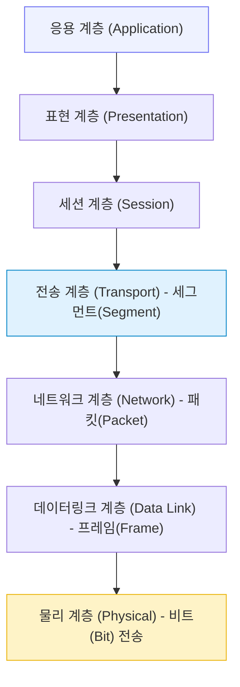
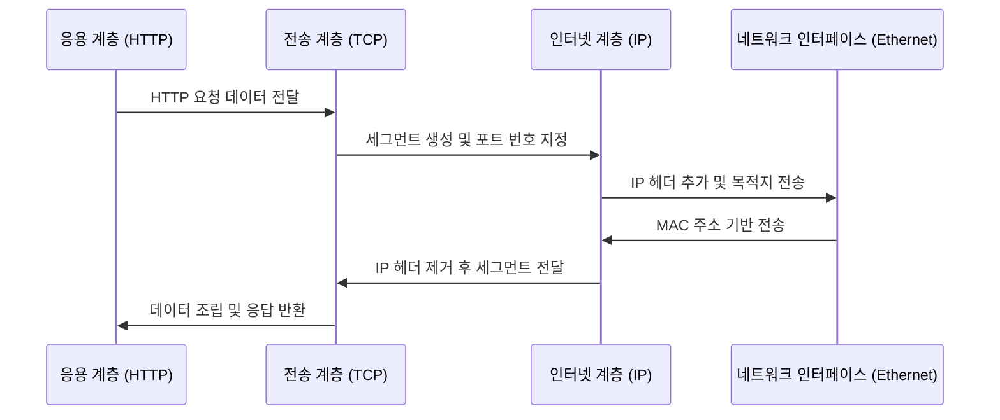
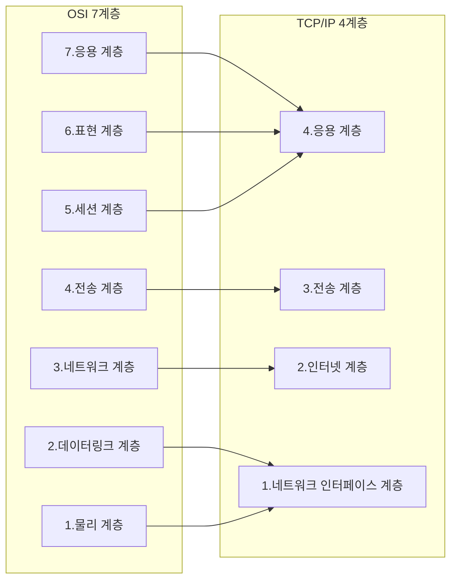

계층적 구조(Layered Architecture), OSI 7계층 (Open Systems Interconnection)
OSI 7계층과 TCP/IP 4계층

#### 정리 요약

- 이 문서는 네트워크 통신 구조의 핵심 개념인 OSI 7계층과 TCP/IP 4계층 모델을 설명한다.  
- 두 모델은 네트워크를 계층적으로 나누어 복잡한 통신 과정을 체계적으로 관리하기 위한 구조이다.  
- OSI 모델은 개념적 표준을 제공하며, TCP/IP 모델은 실제 인터넷 통신에서 구현되는 구조다.  
- 이 내용을 이해하면 데이터가 어떤 과정을 거쳐 전송되고, 네트워크 문제를 어떤 기준으로 분석해야 하는지를 명확히 파악할 수 있다.

OSI 모델은 학습과 분석을 위한 기준 모델이며,
TCP/IP 모델은 실제 통신에서 사용되는 구현 모델이다.
네트워크 문제를 분석할 때는 “어느 계층에서 문제가 발생했는가”를 기준으로 접근해야 한다.

* IP 충돌은 네트워크 계층 문제에 해당한다.
* 포트 충돌은 전송 계층 문제이다.
* SSL 인증서 오류는 표현 계층에서 발생한다.
* 웹 요청 실패(404, 500 등)는 응용 계층 문제로 본다.

시스템 설계나 보안 정책, 트래픽 제어, 방화벽 규칙 등을 정의할 때도
계층별 역할을 명확히 구분해두면 원인 분석과 유지보수가 훨씬 수월해진다.

---

## 1. OSI 7계층

OSI 7계층(Open Systems Interconnection Model)은 국제표준화기구(ISO)가 제정한 네트워크 통신 표준 구조이다.  
각 계층은 특정한 역할을 담당하며, 상호 독립적으로 동작한다.  
이 모델은 통신 과정의 복잡성을 줄이고, 시스템 간 호환성을 높이기 위해 설계되었다.

| 계층 번호 | 계층명 | 주요 역할 | 대표 프로토콜 / 장비 |
|:--:|:--|:--|:--|
| 7 | 응용 계층 (Application) | 사용자가 직접 접근하는 계층으로, 애플리케이션 서비스를 제공한다. | HTTP, FTP, SMTP, DNS |
| 6 | 표현 계층 (Presentation) | 데이터의 형식, 인코딩, 암호화, 압축을 담당한다. | JPEG, MPEG, SSL/TLS |
| 5 | 세션 계층 (Session) | 세션의 생성, 유지, 종료를 관리하며 동기화를 담당한다. | NetBIOS, RPC |
| 4 | 전송 계층 (Transport) | 신뢰성 있는 데이터 전송, 흐름 제어, 오류 제어를 수행한다. | TCP, UDP |
| 3 | 네트워크 계층 (Network) | 논리적 주소(IP) 관리 및 라우팅을 담당한다. | IP, ICMP, ARP |
| 2 | 데이터링크 계층 (Data Link) | 프레임 단위로 전송하고, MAC 주소를 기반으로 오류 제어를 수행한다. | Ethernet, PPP, Switch |
| 1 | 물리 계층 (Physical) | 전기적 또는 광학적 신호를 통해 데이터를 실제로 전송한다. | 케이블, 허브, NIC |

OSI 모델에서 데이터는 **상위 계층에서 하위 계층으로 내려가며 캡슐화**되고,  
수신 측에서는 **하위 계층에서 상위 계층으로 올라가며 역캡슐화**된다.  
각 계층은 바로 아래 계층의 서비스를 이용하고, 바로 위 계층에 서비스를 제공한다.

---

## 2. TCP/IP 4계층

TCP/IP 모델은 OSI 모델을 실무 중심으로 단순화한 형태로, 실제 인터넷 통신 구조의 기반이 된다.
각 계층은 독립적으로 동작하며, 운영체제 내부의 네트워크 스택(Network Stack)으로 구현된다.

| TCP/IP 계층        | 대응되는 OSI 계층   | 주요 프로토콜 / 예시         |
| :--------------- | :------------ | :------------------- |
| 4. 응용 계층         | 응용, 표현, 세션 계층 | HTTP, FTP, SMTP, DNS |
| 3. 전송 계층         | 전송 계층         | TCP, UDP             |
| 2. 인터넷 계층        | 네트워크 계층       | IP, ICMP, ARP        |
| 1. 네트워크 인터페이스 계층 | 데이터링크, 물리 계층  | Ethernet, Wi-Fi, MAC |

이 모델은 인터넷 통신의 실질적인 구조를 반영하며,
데이터 송수신, 주소 관리, 라우팅, 오류 제어 등의 역할을 효율적으로 수행한다.

---

## 3. TCP/IP 데이터 흐름 예시

사용자가 웹 브라우저에 `https://example.com`을 입력했을 때의 과정은 다음과 같다.

1. **응용 계층 (HTTP)**
   웹 브라우저가 HTTP 요청 메시지를 생성한다.
   예: `GET /index.html HTTP/1.1`
2. **전송 계층 (TCP)**
   데이터를 세그먼트로 분할하고, 포트 번호(예: 443)를 지정해 신뢰성 있는 전송을 준비한다.
3. **인터넷 계층 (IP)**
   IP 주소를 기반으로 패킷을 생성하고, 목적지까지의 경로를 결정한다.
4. **네트워크 인터페이스 계층 (Ethernet)**
   물리적 MAC 주소를 사용해 프레임을 전송한다.
5. **수신 측**에서는 이 과정을 반대로 수행하여 응용 계층에서 데이터를 재조립한다.

---

## 4. OSI vs TCP/IP 비교 요약

| 구분      | OSI 7계층         | TCP/IP 4계층              |
| :------ | :-------------- | :---------------------- |
| 설계 주체   | ISO (국제표준기구)    | DARPA (미국 국방성)          |
| 구조 목적   | 개념적 표준 모델       | 실무 중심의 구현 모델            |
| 계층 수    | 7               | 4                       |
| 대표 프로토콜 | X.400, X.25     | HTTP, TCP, IP, Ethernet |
| 주요 용도   | 네트워크 이론 교육, 표준화 | 실제 인터넷 및 시스템 통신         |
| 특징      | 구조적, 이론 중심      | 단순화, 실무 중심              |

---

## 5. 계층 간 대응 구조

