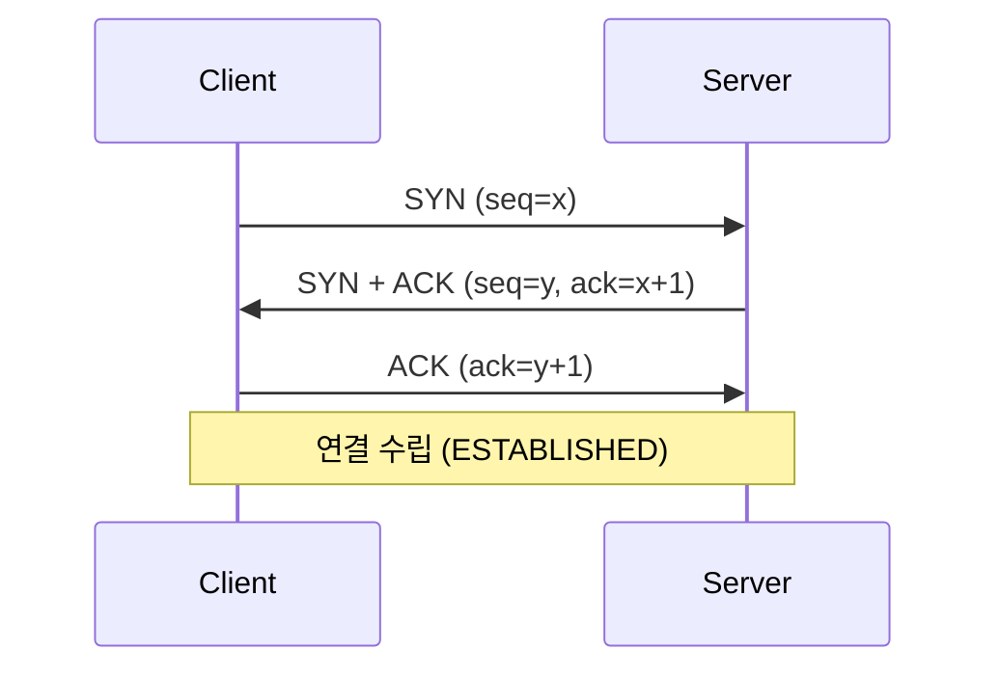
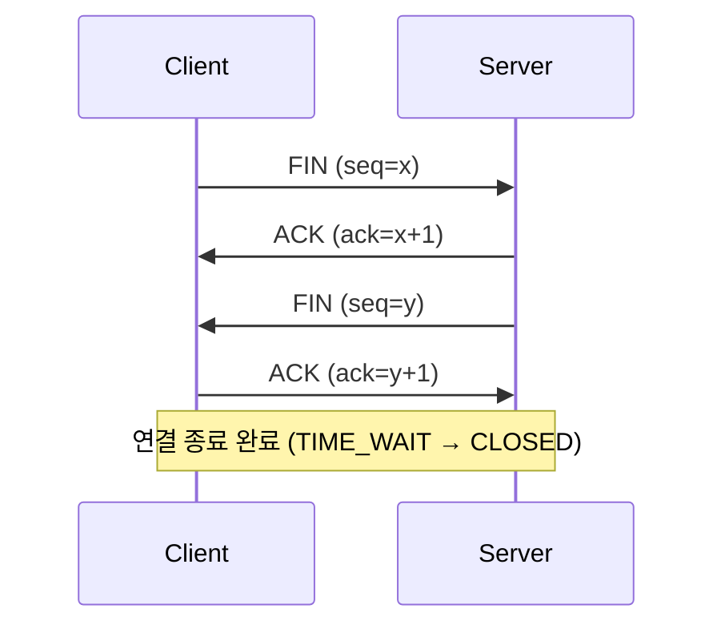
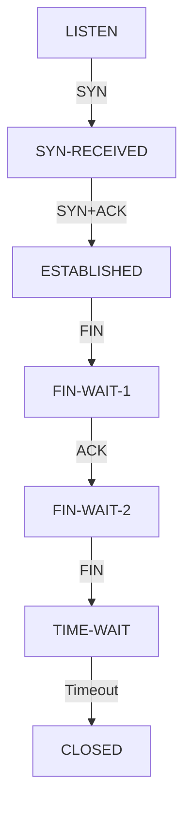

TCP의 3-Way Handshake와 4-Way Termination 과정

#### 정리 요약
이 문서는 TCP 프로토콜에서 연결을 수립하고 종료하는 과정을 설명한다.  
TCP는 신뢰성 있는 통신을 제공하기 위해 연결을 설정할 때 **3-Way Handshake**,  
연결을 종료할 때 **4-Way Termination** 절차를 사용한다.  
이 과정은 데이터가 손실 없이 순서대로 전달되도록 보장하며,  
각 단계에서 송신자와 수신자는 서로의 상태를 확인하고 동기화한다.

* TCP는 데이터 신뢰성을 확보하기 위해 3단계로 연결을 수립하고 4단계로 종료한다.
* 3-Way Handshake는 송신자와 수신자가 서로의 전송 가능 상태를 확인하는 절차이다.
* 4-Way Termination은 양방향 데이터 흐름이 완전히 종료될 때까지 기다린다.
* **TIME_WAIT** 상태는 동일 포트 재사용 시 충돌을 방지하기 위한 안전 대기 구간이다.
* 방화벽, 로드밸런서, NAT 설정 시 이러한 상태 변화가 세션 유지에 영향을 준다.


## 1. TCP의 특징

TCP(Transmission Control Protocol)는 연결 지향적(Connected-oriented) 프로토콜이다.  
데이터를 전송하기 전 반드시 상대방과 연결을 수립하고, 데이터의 순서, 무결성, 재전송 등을 관리한다.
이 연결은 3-way handshake라는 과정을 통해 이루어진다.

#### 주요 특징

##### 1. 연결 기반 통신(Connection-oriented)
이 연결은 **3-way handshake라는 과정을** 통해 이루어 진다
데이터를 보내기 전에 먼저 상대방과 연결을 설정한다.
마치 전화 걸기 전에 상대방이 받는 것처럼 
 
##### 2. 신뢰성 보장 (ACK 응답, 재전송)
TCP는 데이터를 보낼 때마다 **잘 받았는지 확인(ACK)** 을 받는다.
만약 중간에 데이터가 손실되거나 깨지면, TCP는 자동으로 다시 보내준다
덕분에 웹페이지나 파일을 받을 때 빠짐없이 정확하게 받을 수 있다

##### 3. 순서 제어 (Sequence Number)
데이터는 **여러 조각으로 나뉘어 전송되며**, 각 조각에는 **순서 번호가** 붙는다. 
수신 측은 이 번호를 기준으로 데이터를 원래 순서대로 재조립한다. 이를 통해 데이터가 순서대로 도착하지 않더라도 정확하게 복원할 수 있다.
**그래서 영상이나 음악 스트리밍도 순서대로 끊김 없이 재생되는것**

##### 4. 흐름 제어 (Window Size)
수신 측의 처리 능력에 따라 송신 측이 데이터를 보내는 속도를 조절한다. 
이를 통해 수신 측의 버퍼가 넘치지 않도록 방지한다.
- 너무 많이 보내면 상대방이 버퍼가 넘쳐서 못 받을 수도 있으니깐
- TCP는 상대방이 얼마나 빨리 처리할 수 있는지를 고려해서 데이터 보냄

##### 5. 혼잡 제어 (Congestion Control)
네트워크 상태를 고려해 전송 속도를 조절한다. 네트워크가 혼잡한 경우에는 속도를 줄이고, 여유가 생기면 다시 늘리는 방식으로 전체 네트워크의 안정성을 높인다.
TCP는 이런 기능을 수행하기 위해 통신을 시작할 때와 끝낼 때  
상태를 동기화하는 절차를 반드시 거친다.

---

## 2. TCP 3-Way Handshake (연결 설정)

TCP 연결은 세 단계의 Handshake 과정을 통해 이루어진다.  
이 절차는 양쪽이 서로의 송수신 가능 상태를 확인하고,  
데이터 전송에 사용할 **시퀀스 번호(Sequence Number)** 를 동기화하기 위한 목적을 가진다.

| 단계 | 송신자 (Client) | 수신자 (Server) | 설명 |
|:--:|:--|:--|:--|
| 1 | SYN | 대기 | 클라이언트가 연결 요청 (SYN) 패킷을 보낸다. |
| 2 | SYN-ACK | SYN 수신 → 응답 | 서버는 SYN을 수신하고, 응답으로 SYN + ACK를 보낸다. |
| 3 | ACK | SYN-ACK 수신 → 확인 | 클라이언트는 ACK로 응답하여 연결이 확립된다. |

**요약 흐름**
```
Client                        Server
| ----------- SYN ----------> |
| <-------- SYN + ACK ------- |
| ----------- ACK ----------> |

```

이 과정을 마치면 TCP 세션이 **ESTABLISHED** 상태로 변경되며,  
양측이 데이터 전송을 시작할 수 있다.

---

### 단계별 동작 설명

1. **SYN 단계**  
   클라이언트는 연결을 요청하기 위해 SYN 플래그가 설정된 TCP 패킷을 보낸다.  
   이때 클라이언트는 자신의 초기 시퀀스 번호(ISN, Initial Sequence Number)를 포함한다.

2. **SYN-ACK 단계**  
   서버는 SYN 요청을 받고, 자신의 ISN을 생성해 SYN 플래그와 함께 ACK를 보낸다.  
   ACK는 클라이언트의 ISN + 1을 확인 번호로 포함한다.

3. **ACK 단계**  
   클라이언트는 서버의 ISN + 1을 ACK로 응답하며, 연결이 확립된다.

<div style="text-align:center">


</div>

---

## 3. TCP 4-Way Termination (연결 종료)

TCP 연결 종료는 4단계로 이루어지며,
송신자와 수신자가 각각 독립적으로 연결을 종료한다.
이 절차는 데이터를 완전히 전송한 뒤 연결을 안전하게 끊기 위한 과정이다.

|  단계 | 송신자 (Client) | 수신자 (Server)   | 설명                              |
| :-: | :----------- | :------------- | :------------------------------ |
|  1  | FIN          | 대기             | 클라이언트가 더 이상 전송할 데이터가 없음을 알린다.   |
|  2  | ACK          | FIN 수신 → 응답    | 서버는 FIN을 수신하고, ACK로 응답한다.       |
|  3  | FIN          | 송신 종료 준비       | 서버도 자신의 데이터를 모두 전송한 후 FIN을 보낸다. |
|  4  | ACK          | FIN 수신 → 종료 확인 | 클라이언트는 ACK로 응답하고 연결이 완전히 종료된다.  |

**요약 흐름**

```
Client                        Server
  | ----------- FIN ----------> |
  | <----------- ACK ---------- |
  | <----------- FIN ---------- |
  | ----------- ACK ----------> |
```

---

### 단계별 동작 설명

1. **클라이언트의 FIN 전송**
   클라이언트가 더 이상 전송할 데이터가 없음을 알리기 위해 FIN 패킷을 보낸다.
   이 시점 이후 클라이언트는 데이터를 보내지 않지만, 수신은 가능하다.

2. **서버의 ACK 응답**
   서버는 FIN을 수신한 뒤 ACK로 응답하여 해당 요청을 확인한다.
   아직 서버는 보낼 데이터가 남아 있을 수 있다.

3. **서버의 FIN 전송**
   서버가 자신의 모든 데이터를 전송한 뒤 FIN을 보낸다.

4. **클라이언트의 최종 ACK**
   클라이언트가 FIN에 대한 ACK를 전송하면 세션이 종료된다.
   클라이언트는 잠시 **TIME_WAIT** 상태로 대기하여 재전송 지연 패킷을 방지한다.

<div style="text-align:center">


</div>

---

## 4. 상태 전이 (TCP State Transition)

TCP 연결은 여러 상태를 거치며 동작한다.
아래는 주요 상태의 흐름이다.

| 상태             | 설명                             |
| :------------- | :----------------------------- |
| LISTEN         | 서버가 연결 요청을 기다리는 상태             |
| SYN-SENT       | 클라이언트가 SYN을 보낸 후 응답을 기다리는 상태   |
| SYN-RECEIVED   | 서버가 SYN을 받고 SYN-ACK를 보낸 상태     |
| ESTABLISHED    | 연결이 완전히 성립된 상태                 |
| FIN-WAIT-1 / 2 | 연결 종료 요청 후 응답을 기다리는 상태         |
| CLOSE-WAIT     | 상대방의 종료 요청을 받은 상태              |
| LAST-ACK       | 자신의 FIN을 보낸 후 마지막 ACK를 기다리는 상태 |
| TIME-WAIT      | 지연된 패킷을 방지하기 위해 잠시 대기하는 상태     |
| CLOSED         | 연결이 완전히 종료된 상태                 |

<div style="text-align:center">


</div>
---
