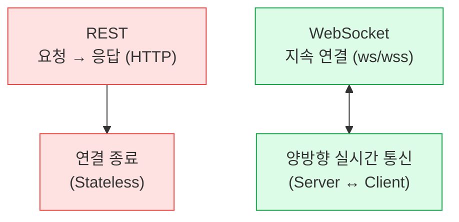
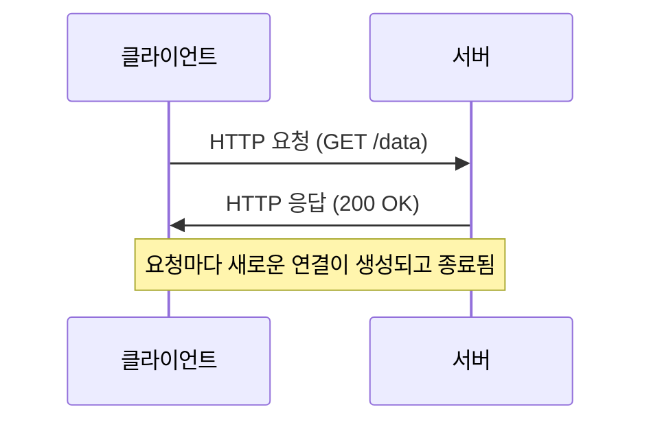
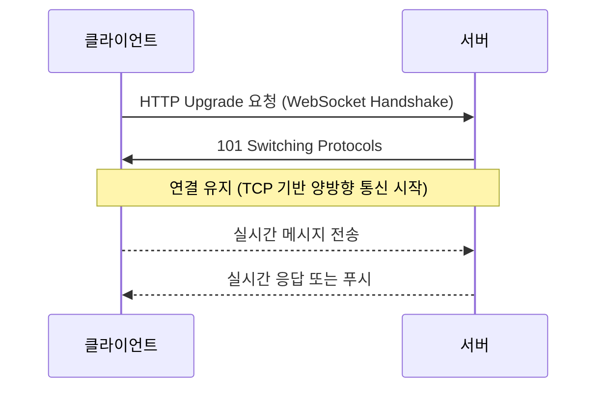

WebSocket과 REST 통신 방식
WebSocket과 REST는 모두 OSI 모델의 응용 계층(Application Layer) 에서 동작
REST는 요청 단위의 전송에 적합하고, WebSocket은 지속적인 상태 유지와 실시간 데이터 교환에 적합

#### 정리 요약
이 문서는 HTTP 기반의 **REST 통신**과 실시간 양방향 통신인 **WebSocket**의 차이를 설명한다.  
REST는 요청과 응답이 분리된 단방향 구조이며,  
WebSocket은 연결을 유지하면서 서버와 클라이언트가 실시간으로 데이터를 주고받는 구조이다.  
두 방식은 서비스 성격에 따라 선택적으로 사용되며, 일반적인 API 호출은 REST, 실시간 데이터는 WebSocket을 활용한다.

* **REST**는 상태가 없는(Stateless) 구조로 서버 부하 분산과 확장성이 뛰어나다.
* **WebSocket**은 연결 상태를 유지하므로 빠른 실시간 응답이 가능하다.
* 대부분의 현대 서비스는 두 방식을 **혼합 구조**로 사용한다.
* REST → 초기 데이터 요청 및 설정
* WebSocket → 실시간 알림, 상태 업데이트, 이벤트 처리
* 보안 통신 시에는 반드시 `wss://` (TLS 기반) 프로토콜을 사용해야 한다.
* 대규모 실시간 트래픽 환경에서는 Redis Pub/Sub, Kafka, MQTT 등과 조합해 부하를 분산한다.

---

## 1. REST (Representational State Transfer)

REST는 **HTTP 프로토콜 기반의 요청-응답 구조**로 동작하는 가장 기본적인 통신 방식이다.  
클라이언트는 요청(Request)을 보내고 서버는 응답(Response)을 반환하며,  
요청이 끝나면 연결이 종료된다.

| 항목 | 내용 |
|:--|:--|
| 통신 방식 | 단방향 (요청 → 응답) |
| 연결 지속성 | 없음 (요청마다 연결 생성) |
| 주요 프로토콜 | HTTP/1.1, HTTP/2 |
| 장점 | 단순, 구조적, 캐싱 및 로드밸런싱에 유리 |
| 단점 | 실시간 데이터 처리에는 부적합 |

### REST 통신 흐름

REST는 구조가 단순하고 명확하여 API 설계 표준으로 널리 사용된다.
그러나 서버에서 발생하는 실시간 이벤트를 즉시 전달해야 하는 상황에서는 비효율적이다.

---

## 2. WebSocket

WebSocket은 클라이언트와 서버 간에 **지속적인 양방향 통신**을 제공하는 프로토콜이다.
초기 연결은 HTTP를 통해 이루어지지만,
이후 **TCP 소켓으로 전환(Upgrade)** 되어 양측이 자유롭게 데이터를 교환할 수 있다.

| 항목     | 내용                          |
| :----- | :-------------------------- |
| 통신 방식  | 양방향 (Full Duplex)           |
| 연결 지속성 | 있음 (Persistent Connection)  |
| 프로토콜   | ws:// 또는 wss:// (TLS 기반 보안) |
| 장점     | 실시간 데이터 전송, 즉각적인 반응         |
| 단점     | 서버 리소스 부담, 연결 관리 필요         |

### WebSocket 통신 흐름

---

## 3. REST와 WebSocket 비교 요약

| 구분      | REST           | WebSocket            |
| :------ | :------------- | :------------------- |
| 통신 방향   | 단방향            | 양방향                  |
| 연결 유지   | 요청마다 새 연결      | 지속 연결 유지             |
| 사용 프로토콜 | HTTP           | WebSocket (ws / wss) |
| 데이터 전송  | 요청-응답 단위       | 이벤트 단위 (지속 스트림)      |
| 응답 지연   | 요청 후 응답 대기     | 실시간 송수신              |
| 대표 사용 예 | 일반 API, 데이터 조회 | 실시간 채팅, 알림, 스트리밍     |

---

