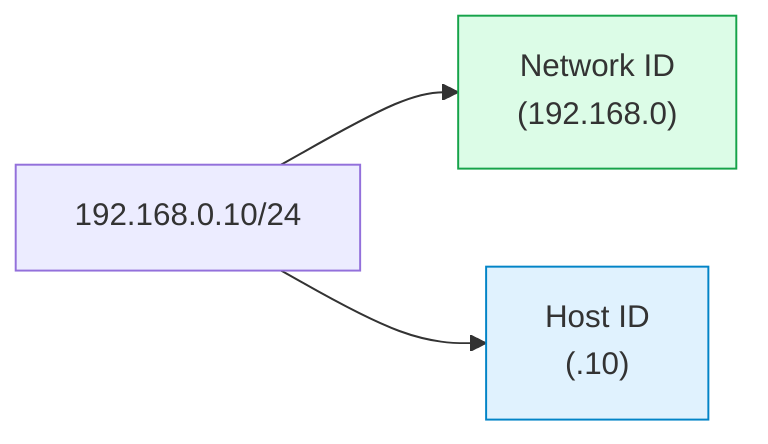
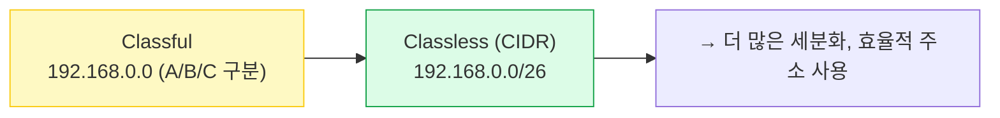

#### 요약
- IP 주소는 네트워크 상의 **논리적 위치(주소)** 를 나타내며, 장치 식별과 라우팅의 기반이 된다.  
- IPv4는 32비트(4옥텟), IPv6는 128비트로 구성된다.  
- 서브넷(Subnet)은 IP 주소 공간을 효율적으로 분할하기 위한 구조다.  


방화벽은 단순한 차단 장치가 아니라 **정책 기반의 보안 게이트**이다.
적절한 규칙 설계와 로그 모니터링이 시스템 안전의 핵심이다.


**핵심 요약**
1. IP = 네트워크 식별자 + 호스트 식별자  
2. 서브넷 마스크는 네트워크 경계를 정의한다.  
3. CIDR(Classless Inter-Domain Routing)은 주소 낭비를 줄이는 방식이다.

---

#### 1. IP 주소 체계

| 버전 | 구조 | 예시 | 비고 |
|:--|:--|:--|:--|
| IPv4 | 32bit (4 x 8bit) | 192.168.0.10 | 사설/공인 IP 구분 |
| IPv6 | 128bit (8 x 16bit) | fe80::a00:27ff:fe89:4d8d | 확장성 우수 |

---

#### 2. IP 주소 구성



---

#### 3. 서브넷 마스크 개념

| 서브넷 마스크         | CIDR 표기 | 네트워크 수 | 호스트 수 | 비고        |
| :-------------- | :------ | :----- | :---- | :-------- |
| 255.255.255.0   | /24     | 256    | 254   | 일반 가정/사무실 |
| 255.255.255.128 | /25     | 512    | 126   | 중간 규모     |
| 255.255.255.192 | /26     | 1024   | 62    | 세분화된 구역   |

---

#### 4. 공인 vs 사설 IP

| 구분        | IP 대역     | 예시                     | 특징        |
| :-------- | :-------- | :--------------------- | :-------- |
| **공인 IP** | 전 세계에서 고유 | 121.130.45.10          | ISP가 할당   |
| **사설 IP** | 내부 전용     | 192.168.x.x / 10.x.x.x | NAT 변환 필요 |

---

#### 5. CIDR 개념 (Classless Inter-Domain Routing)



---

#### 결론

IP 주소는 네트워크의 논리적 뼈대이며, 서브넷 구조는 효율적인 자원 분배의 핵심이다.
이 개념은 NAT, 라우팅, 가상 네트워크 설계의 전제 조건이 된다.

````

---

### 7️⃣ 물리적 네트워크 구성 요소 (Physical Layer Real)
```markdown
---
title: "물리적 네트워크 구성 요소 (Physical Layer Real)"
date: 2025-10-27
---

#### 요약
- 물리 계층은 **데이터를 실제로 전송하는 하드웨어 기반 계층**이다.  
- 케이블, 커넥터, 허브, NIC, 전송 매체 등이 포함된다.  
- 전송 품질과 속도는 이 계층의 상태에 직접 영향을 받는다.  

---

#### 1. 주요 구성요소

| 구성 요소 | 역할 | 예시 |
|:--|:--|:--|
| 케이블 | 데이터 신호 전송 | UTP, STP, 광케이블 |
| NIC | 물리적 네트워크 인터페이스 | LAN 카드, 무선 어댑터 |
| 커넥터 | 물리적 연결 | RJ-45, LC, SC |
| 허브 | 신호 분배 | 1:N 단순 브로드캐스트 |
| 리피터 | 신호 증폭 | 거리 연장용 |

---

#### 2. 케이블 구조 비교

```mermaid
graph TD
  A["UTP 케이블"] --> B["Unshielded<br>간섭 약하지만 저가"]
  A --> C["Cat5e, Cat6, Cat6A 등급"]
  D["STP 케이블"] --> E["Shielded<br>차폐로 간섭 최소화"]
  D --> F["고주파 환경/서버실 사용"]
````

---

#### 3. 네트워크 속도와 전송 거리

| 구분    | 속도         | 최대 거리 | 매체  |
| :---- | :--------- | :---- | :-- |
| Cat5e | 1Gbps      | 100m  | 구리선 |
| Cat6  | 10Gbps     | 55m   | 구리선 |
| 광케이블  | 10~400Gbps | 10km+ | 광섬유 |

---

#### 4. 물리 계층 시각화

```mermaid
flowchart LR
  PC["PC<br>NIC"] --> HUB["허브"]
  HUB --> SW["스위치"]
  SW --> RT["라우터"]
  RT --> ISP["모뎀 / ISP"]
  ISP --> WEB["인터넷 서버"]

  style PC fill:#e0f2fe,stroke:#0284c7
  style HUB fill:#fef9c3,stroke:#facc15
  style SW fill:#fde68a,stroke:#f59e0b
  style RT fill:#dcfce7,stroke:#16a34a
```

---

#### 결론

물리 계층은 **속도·신호·간섭**이라는 세 가지 변수에 의해 네트워크 품질이 결정된다.
즉, 상위 프로토콜이 아무리 완벽해도 케이블 한 가닥이 불량이면 통신은 실패한다.

````

---

### 8️⃣ NAT와 사설 네트워크 구조 (Home/Office Network)
```markdown
---
title: "NAT와 사설 네트워크 구조 (Home/Office Network)"
date: 2025-10-27
---

#### 요약
- NAT(Network Address Translation)는 **내부 사설 IP ↔ 외부 공인 IP** 변환 기술이다.  
- 한 개의 공인 IP로 여러 내부 장치가 인터넷을 공유할 수 있다.  

---

#### 1. NAT의 기본 개념

```mermaid
flowchart LR
  A["PC (192.168.0.10)"] --> R["공유기 NAT 변환<br>(192.168.0.1 ↔ 121.130.x.x)"]
  R --> I["인터넷"]
  I --> S["서버 (203.0.113.20)"]
````

---

#### 2. NAT 변환 테이블 예시

| 내부 IP        | 내부 포트 | 외부 IP         | 외부 포트 | 상태          |
| :----------- | :---- | :------------ | :---- | :---------- |
| 192.168.0.10 | 50123 | 121.130.45.10 | 80    | ESTABLISHED |
| 192.168.0.12 | 50124 | 121.130.45.10 | 443   | ESTABLISHED |

---

#### 3. NAT의 종류

| 구분                            | 특징                        |
| :---------------------------- | :------------------------ |
| Static NAT                    | 1:1 고정 매핑                 |
| Dynamic NAT                   | 풀(pool) 기반 자동 할당          |
| PAT(Port Address Translation) | 포트 기반 다중 매핑 (가정용 공유기 일반형) |

---

#### 4. NAT + DHCP 동작 흐름

```mermaid
sequenceDiagram
  participant PC as 내부 단말
  participant R as 공유기
  participant ISP as 인터넷

  PC->>R: DHCP 요청 (IP 요청)
  R->>PC: 내부 IP 할당 (192.168.0.x)
  PC->>R: HTTP 요청
  R->>ISP: NAT 변환 후 전송 (121.130.x.x)
  ISP-->>R: 응답 패킷
  R-->>PC: 내부 IP로 역변환 후 전달
```

---

#### 결론

NAT는 IPv4 주소 고갈을 극복한 핵심 기술이다.
**사설망의 독립성과 외부망의 확장성**을 동시에 달성한 대표적인 구조다.

````

---

### 9️⃣ 가상 네트워크 (Virtual Networking)
```markdown
---
title: "가상 네트워크 (Virtual Networking)"
date: 2025-10-27
---

#### 요약
- 가상 네트워크는 물리적 장비 없이 **소프트웨어적으로 구성된 네트워크 환경**이다.  
- 하이퍼바이저, 컨테이너, 클라우드 환경에서 네트워크를 가상화한다.  

---

#### 1. 주요 구성 방식

| 유형 | 설명 | 예시 |
|:--|:--|:--|
| 브리지(Bridge) | 실제 네트워크와 동일 세그먼트 | Docker bridge, vSwitch |
| NAT | 내부 가상망에서 외부로만 통신 | VirtualBox NAT |
| Host-only | 호스트와 가상머신만 통신 | 개발용 내부망 |
| Overlay | 물리망 위에 가상 터널 생성 | Kubernetes CNI (Flannel, Calico) |

---

#### 2. 가상 네트워크 플로우

```mermaid
flowchart LR
  VM1["VM1 (10.0.2.15)"] --> VSW["vSwitch (Bridge)"]
  VM2["VM2 (10.0.2.16)"] --> VSW
  VSW --> HOST["Host OS (192.168.0.100)"]
  HOST --> NAT["NAT 게이트웨이"]
  NAT --> INTERNET["Public Internet"]
````

---

#### 3. Kubernetes 예시

* 각 Pod는 고유한 가상 IP를 가짐
* CNI 플러그인이 라우팅 및 NAT를 처리

```mermaid
flowchart TB
  POD1["Pod A (10.244.1.10)"] --> CNI["CNI Bridge"]
  POD2["Pod B (10.244.1.11)"] --> CNI
  CNI --> NODE["Worker Node"]
  NODE --> ROUTER["Cluster Router"]
```

---

#### 결론

가상 네트워크는 인프라의 유연성을 극대화하는 핵심 기술이다.
실제 하드웨어 없이도 **논리적 연결, 라우팅, 보안 정책**을 모두 구현할 수 있다.

````

---

### 10️⃣ 네트워크 트러블슈팅과 실무 명령어
```markdown
---
title: "네트워크 트러블슈팅과 실무 명령어"
date: 2025-10-27
---

#### 요약
- 네트워크 장애는 물리적/논리적 계층 어디서든 발생할 수 있다.  
- 명령어 도구를 사용해 단계별 진단이 가능하다.  

---

#### 1. 기본 진단 명령어

| 명령어 | 설명 | 예시 |
|:--|:--|:--|
| `ping` | ICMP로 연결 확인 | `ping 8.8.8.8` |
| `traceroute` / `tracert` | 경로 추적 | `traceroute google.com` |
| `nslookup` | DNS 확인 | `nslookup naver.com` |
| `netstat` / `ss` | 포트 상태 확인 | `netstat -tulnp` |
| `ip addr` / `ifconfig` | IP 설정 조회 | `ip addr show` |
| `route` / `ip route` | 라우팅 테이블 확인 | `ip route` |

---

#### 2. 진단 흐름 예시

```mermaid
flowchart TD
  A["1️⃣ Ping 실패"] --> B["2️⃣ IP 설정 확인 (ip addr)"]
  B --> C{"3️⃣ 내부 통신 가능?"}
  C -- "No" --> D["DHCP / NIC 문제"]
  C -- "Yes" --> E["4️⃣ 외부 DNS 확인 (nslookup)"]
  E --> F{"5️⃣ 특정 도메인만 실패?"}
  F -- "Yes" --> G["DNS / 캐시 문제"]
  F -- "No" --> H["6️⃣ 라우팅 / 방화벽 문제"]
````

---

#### 결론

트러블슈팅은 **“문제의 계층을 찾는 것”**이다.
즉, 물리계층 → IP계층 → 전송계층 → 응용계층 순서로
단계적으로 접근해야 한다.

````

---

### 11️⃣ 네트워크 보안과 방화벽 기본
```markdown
---
title: "네트워크 보안과 방화벽 기본"
date: 2025-10-27
---

#### 요약
- 방화벽(Firewall)은 트래픽을 필터링하고, 허용된 패킷만 통과시킨다.  
- 네트워크 보안의 기본은 **인증(Authentication), 암호화(Encryption), 접근 제어(ACL)** 이다.  

---

#### 1. 방화벽 구조

```mermaid
flowchart LR
  A["LAN (내부망)"] --> FW["Firewall<br>Inbound/Outbound Rule"]
  FW --> B["WAN (외부망)"]
  style A fill:#e0f2fe,stroke:#0284c7
  style FW fill:#fde68a,stroke:#f59e0b
  style B fill:#dcfce7,stroke:#16a34a
````

---

#### 2. 트래픽 제어 정책

| 구분                       | 설명                  |
| :----------------------- | :------------------ |
| Inbound Rule             | 외부 → 내부 접근 제어       |
| Outbound Rule            | 내부 → 외부 전송 제한       |
| ACL(Access Control List) | IP/Port 기반 접근 허용/거부 |
| NAT Firewall             | 외부에서 직접 접근 차단       |

---

#### 3. 기본 보안 원칙

* 최소 권한 원칙 (Principle of Least Privilege)
* Zero Trust 모델
* TLS 1.3 기반 암호화
* IDS/IPS를 통한 공격 탐지

---

