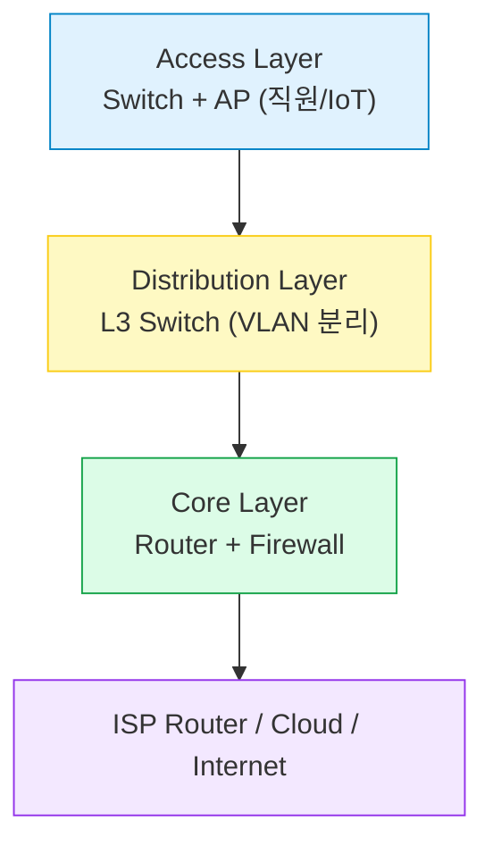
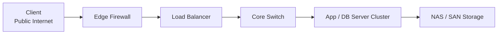

#### 요약
- 실제 환경에서는 네트워크를 **Access / Distribution / Core** 구조로 설계한다.  
- 보안, 확장성, 장애 대응을 고려한 계층형 구조가 권장된다.  

좋은 네트워크 설계는 “**문제가 생겨도 전체가 멈추지 않는 구조**”를 만든다.
즉, **안정성·유연성·보안성**의 세 가지 균형이 핵심이다.

| 번호 | 주제 | 핵심 키워드 |
|:--:|:--|:--|
| 3 | IP 주소와 서브넷 구조 | CIDR, 서브넷, 공인/사설 |
| 7 | 물리적 구성 요소 | 케이블, NIC, 신호 |
| 8 | NAT 구조 | 사설망, IP 변환 |
| 9 | 가상 네트워크 | Bridge, NAT, Overlay |
| 10 | 트

---

#### 1. 사무실 네트워크 예시

---

#### 2. 데이터센터 네트워크 예시

---

#### 3. 설계 체크리스트

* IP 대역 및 서브넷 분리 (/24, /26 등)
* VLAN 기반 부서별 격리
* NAT 및 DMZ 설정
* L2/L3 스위치 계층 구성
* 방화벽 및 IDS 배치
* 백업망 (Failover Link) 구축

---
