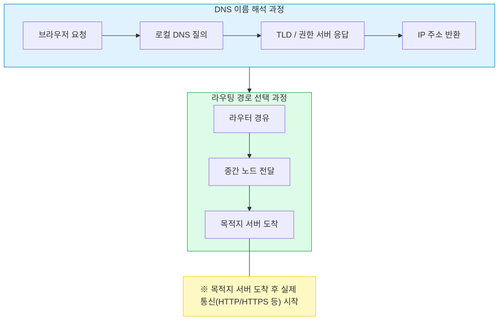
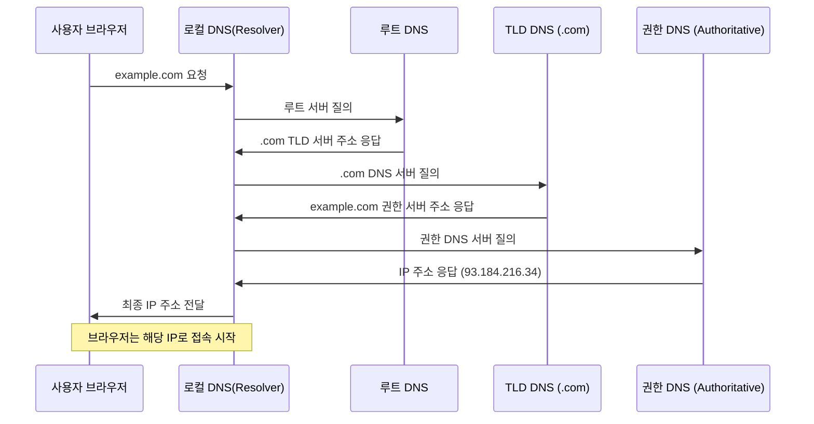

DNS와 라우팅
DNS의 이름 해석 과정부터 라우팅의 원리, 그리고 실제 네트워크 경로 결정까지 단계별로 설명

#### 정리 요약

이 문서는 인터넷 통신에서 **DNS(Domain Name System)** 가 도메인 이름을 IP 주소로 변환하는 과정과,  
**라우팅(Routing)** 이 IP 패킷을 목적지로 전달하기 위해 경로를 선택하는 원리를 설명한다.  
DNS는 사람에게 친숙한 이름을 컴퓨터가 이해할 수 있는 주소로 바꾸고,  
라우팅은 그 주소를 따라 가장 효율적인 길로 데이터를 전달하는 역할을 한다.  
이 두 기능은 인터넷 통신의 시작과 끝을 연결하는 핵심 요소이다.

* DNS 오류(`NXDOMAIN`, `SERVFAIL`)는 IP 주소 해석이 실패한 경우이며, 네트워크 문제와 구분해야 한다.
* 라우팅 문제는 경로 손실(`Destination Unreachable`)이나 지연(`High Latency`) 형태로 나타난다.
* 네트워크 트러블슈팅 시 `nslookup`, `dig`, `ping`, `traceroute` 명령을 조합하면 원인 분석이 가능하다.
* 클라우드 환경(AWS, GCP, Azure)에서는 DNS와 라우팅이 각각 독립된 서비스로 관리된다.
  예: AWS Route53(DNS), VPC Route Table(라우팅)

---

## 1. DNS (Domain Name System)

DNS는 사람이 이해하기 쉬운 도메인 이름(예: `example.com`)을  
네트워크가 이해하는 IP 주소(예: `93.184.216.34`)로 변환하는 시스템이다.  
이 과정을 **이름 해석(Name Resolution)** 이라고 한다.

| 구분 | 설명 |
|:--|:--|
| 역할 | 도메인 이름 → IP 주소 변환 |
| 작동 방식 | 분산 계층 구조로 구성된 네임 서버들이 순차적으로 응답 |
| 주요 포트 | UDP 53, TCP 53 |
| 주요 구성 요소 | Resolver, Root DNS, TLD DNS, Authoritative DNS |

---

### DNS 이름 해석 과정

---

### 캐싱 구조

DNS는 성능 향상을 위해 여러 단계에서 **캐시(Cache)** 를 사용한다.

* **브라우저 캐시** : 최근 접속한 도메인의 IP를 저장
* **운영체제 캐시 (DNS Client)** : 시스템 수준의 이름 해석 캐시
* **로컬 DNS 캐시 (Resolver)** : ISP 또는 내부 네트워크의 캐시 서버
* **TTL(Time To Live)** : 캐시 유효 시간으로, 도메인별로 다르게 설정됨

이 캐시 덕분에 동일한 도메인에 대한 반복 요청은 훨씬 빠르게 처리된다.

---

## 2. 라우팅 (Routing)

라우팅은 IP 패킷이 네트워크를 따라 **목적지까지 도달하는 경로를 결정하는 과정**이다.
라우터는 패킷의 목적지 주소를 확인하고, 다음으로 보낼 경로(Next Hop)를 선택한다.

| 구분      | 설명                             |
| :------ | :----------------------------- |
| 역할      | 네트워크 간 최적 경로 결정                |
| 핵심 장비   | 라우터(Router), 게이트웨이(Gateway)    |
| 기반 프로토콜 | ICMP, OSPF, BGP 등              |
| 데이터 단위  | 패킷(Packet)                     |
| 주요 정보   | IP 주소, 서브넷, 게이트웨이, 메트릭(metric) |

---

### 라우팅 과정

1. **패킷 생성**
   송신자가 데이터를 전송하면 네트워크 계층(IP 계층)에서 패킷이 생성된다.
2. **라우터 확인**
   패킷의 목적지 IP를 확인하고, 라우팅 테이블을 참조하여 다음 홉을 결정한다.
3. **경로 선택**
   내부 라우터들은 서로 정보를 교환하며 최적의 경로를 계산한다.

   * 내부망: OSPF(Open Shortest Path First)
   * 외부망(인터넷): BGP(Border Gateway Protocol)
4. **패킷 전달**
   경로를 따라 여러 라우터를 거치며 목적지 네트워크에 도착한다.

---

### 라우팅 테이블 예시

| 목적지 네트워크    | 넷마스크          | 게이트웨이         | 인터페이스 | 메트릭 |
| :---------- | :------------ | :------------ | :---- | :-: |
| 192.168.1.0 | 255.255.255.0 | 0.0.0.0       | eth0  |  0  |
| 10.0.0.0    | 255.0.0.0     | 192.168.1.1   | eth0  |  1  |
| 0.0.0.0     | 0.0.0.0       | 192.168.1.254 | eth0  |  10 |

위 예시에서 `0.0.0.0/0`은 기본 경로(default route)를 의미한다.
라우터는 목적지 IP가 어떤 네트워크에도 속하지 않을 경우,
이 기본 경로를 통해 외부 네트워크로 패킷을 전달한다.

---

## 3. DNS와 라우팅의 관계

DNS는 “어디로 갈지”를 알려주는 이름 해석 시스템이고,
라우팅은 “어떻게 갈지”를 결정하는 경로 선택 시스템이다.

* **DNS**: IP 주소를 찾는 과정
* **라우팅**: IP 주소를 따라 데이터가 이동하는 과정

이 두 과정은 순차적으로 수행된다.
DNS가 먼저 도메인 이름을 IP로 변환하고,
그 IP를 이용해 라우터들이 실제 경로를 찾아 패킷을 전송한다.

