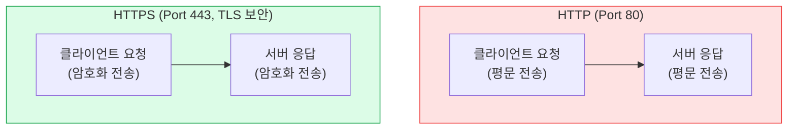
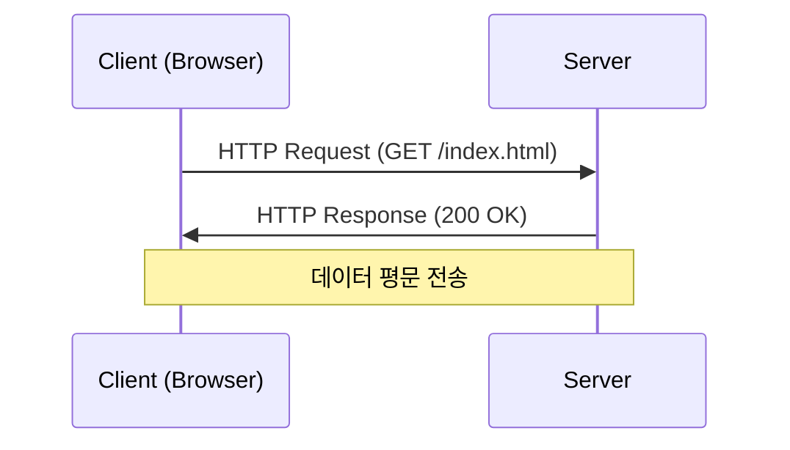
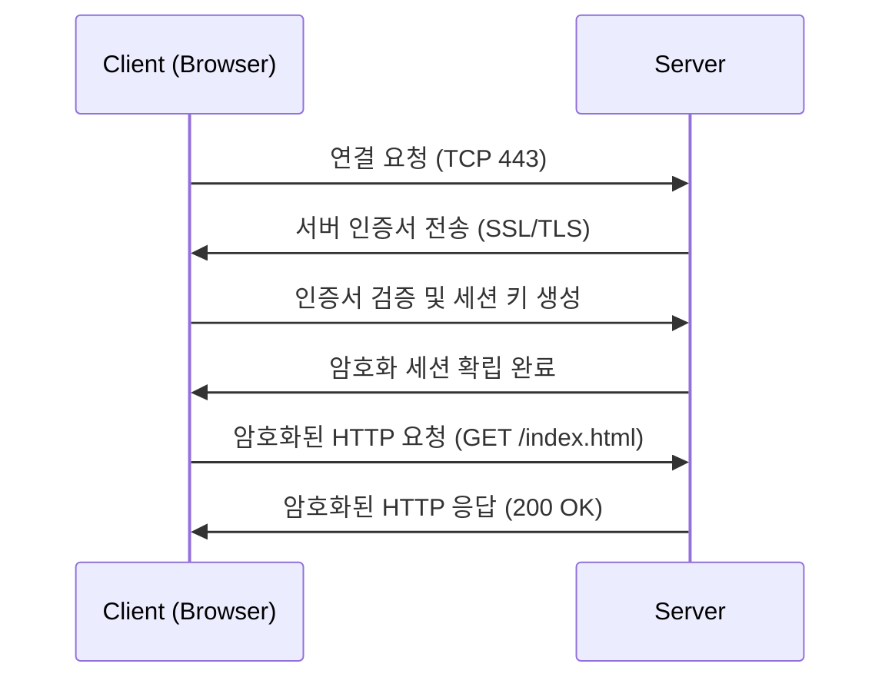

#### 정리 요약

이 문서는 웹 통신의 기본 프로토콜인 **HTTP**와 **HTTPS**의 차이를 설명한다.  
두 프로토콜은 모두 클라이언트(브라우저)와 서버 간의 데이터 전송에 사용되지만,  
보안 측면에서 큰 차이를 가진다.  
HTTP는 데이터를 평문으로 전송하는 반면, HTTPS는 **TLS(Transport Layer Security)** 를 통해  
데이터를 암호화하여 도청과 위·변조를 방지한다.  
현대의 웹 서비스에서는 거의 모든 요청이 HTTPS를 사용한다.

* HTTPS는 HTTP의 확장 버전으로, **TLS 계층이 추가된 구조**이다.
* 대부분의 서비스에서 기본 통신은 HTTPS이며, HTTP 요청은 자동으로 리다이렉트된다.
* 서버 인증서(예: Let's Encrypt, DigiCert 등)를 설정해야 정상적인 HTTPS 통신이 가능하다.
* API 서버, 로그인, 금융 거래 등 민감한 데이터를 다루는 경우 HTTPS는 필수이다.
* TLS 설정 시 최신 프로토콜 버전(TLS 1.3)과 안전한 암호화 스위트를 사용하는 것이 권장된다.

 

- HTTP: 데이터가 암호화되지 않아 도청 및 변조 가능
- HTTPS: TLS를 통한 암호화, 무결성 검증 CA 인증서 기반 서버 신뢰성 보장

---

## 1. HTTP (HyperText Transfer Protocol)

HTTP는 1991년 처음 등장한 웹 통신 프로토콜로,  
클라이언트와 서버 간의 **요청(Request)과 응답(Response)** 구조로 동작한다.  
TCP 80번 포트를 사용하며, 데이터를 암호화하지 않고 평문으로 전송한다.

| 항목 | 내용 |
|:--|:--|
| 기본 포트 | 80 |
| 전송 방식 | TCP 기반, 요청-응답 구조 |
| 보안 수준 | 낮음 (암호화 없음) |
| 데이터 전송 | 평문 전송 |
| 대표 사용 예 | 구형 사이트, 내부 네트워크, 테스트용 서버 |

### 동작 방식

1. 클라이언트가 서버로 HTTP 요청을 보낸다.  
   예: `GET /index.html HTTP/1.1`
2. 서버는 요청을 처리한 후 응답 메시지를 보낸다.  
   예: `HTTP/1.1 200 OK`
3. 연결이 유지되는 동안 요청-응답이 반복된다.  
   (HTTP/1.1에서는 Keep-Alive 옵션으로 지속 연결 가능)

 

**특징 요약**

* 단순하고 빠르지만, 중간에서 데이터를 볼 수 있다.
* 패킷 스니핑(sniffing)이나 변조 공격에 취약하다.
* 인증서 기반 검증이 없어 서버 신뢰성을 보장하지 않는다.

---

## 2. HTTPS (HyperText Transfer Protocol Secure)

HTTPS는 HTTP에 **보안 계층인 TLS(Transport Layer Security)** 를 추가한 프로토콜이다.
기본 포트는 443번을 사용하며, 데이터를 암호화하여 안전하게 전송한다.
TLS는 서버 인증, 데이터 암호화, 무결성 검증 기능을 제공한다.

| 항목      | 내용                      |
| :------ | :---------------------- |
| 기본 포트   | 443                     |
| 전송 방식   | TCP + TLS (보안 계층 추가)    |
| 보안 수준   | 높음 (암호화 및 인증 지원)        |
| 데이터 전송  | 암호화된 전송                 |
| 대표 사용 예 | 모든 현대 웹 서비스, 금융·로그인 페이지 |

---

### HTTPS 통신 과정

HTTPS는 실제 데이터 전송 전에 **TLS Handshake**를 통해 암호화 통신을 설정한다.

 

### TLS Handshake 요약

1. **ClientHello** : 클라이언트가 지원 가능한 암호화 방식과 버전을 전송한다.
2. **ServerHello + 인증서 전송** : 서버는 선택된 암호화 알고리즘과 인증서를 보낸다.
3. **인증서 검증 및 키 교환** : 클라이언트는 인증서를 검증하고 세션 키를 생성한다.
4. **암호화 통신 시작** : 양측이 동일한 세션 키로 대칭 암호화 통신을 수행한다.

---

## 3. HTTP vs HTTPS 비교 요약

| 구분      | HTTP             | HTTPS                         |
| :------ | :--------------- | :---------------------------- |
| 포트 번호   | 80               | 443                           |
| 암호화 여부  | 없음 (평문 전송)       | TLS 기반 암호화                    |
| 데이터 보안성 | 낮음               | 높음                            |
| 서버 인증서  | 필요 없음            | 필요 (CA 인증서)                   |
| 속도      | 약간 빠름            | TLS 암호화로 약간 느림 (현대 환경에서는 미미함) |
| 사용 예시   | 내부 테스트, 비공개 네트워크 | 웹 서비스, 로그인, 결제, API 등         |

---

## 4. HTTPS의 장점

1. **데이터 암호화**
   전송 중 데이터가 노출되거나 변조되는 것을 방지한다.

2. **서버 신뢰성 검증**
   브라우저는 CA(Certificate Authority)가 서명한 인증서를 통해
   서버가 신뢰할 수 있는 대상인지 확인한다.

3. **데이터 무결성 보장**
   TLS는 해시 기반 메시지 인증(HMAC)을 통해 데이터가 손상되지 않았음을 검증한다.

4. **SEO 및 브라우저 정책**
   구글을 비롯한 주요 검색 엔진은 HTTPS 사이트를 우선 노출하며,
   최신 브라우저는 HTTP 사이트에 ‘안전하지 않음’ 경고를 표시한다.

---

## 5. TLS 구성 요소 요약

| 구성 요소                            | 역할                          |
| :------------------------------- | :-------------------------- |
| 인증서 (Certificate)                | 서버의 신원을 증명하며, 공개키를 포함한다.    |
| 공개키 / 개인키 (Public / Private Key) | 암호화와 복호화에 사용된다.             |
| 세션 키 (Session Key)               | 실제 데이터 전송 시 사용되는 대칭키이다.     |
| CA (Certificate Authority)       | 신뢰할 수 있는 인증기관으로, 인증서를 발급한다. |

---

