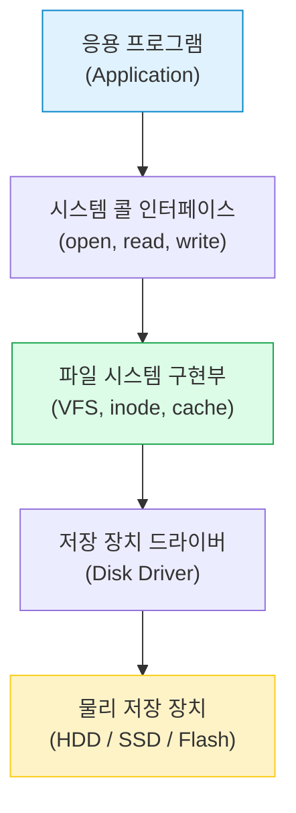
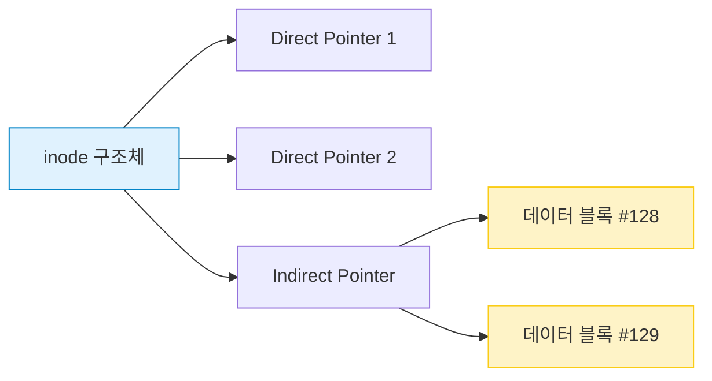
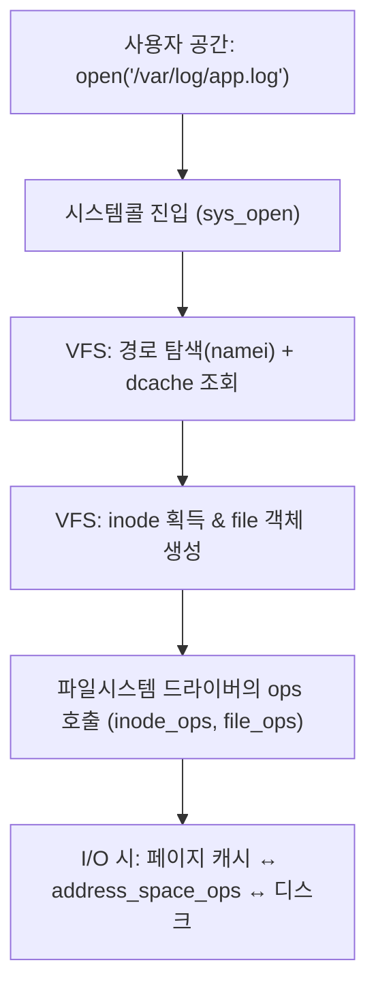

파일 시스템 (File System)
(inode, journaling, VFS)

#### 정리 요약

이 문서는 운영체제에서 **파일 시스템(File System)** 이 데이터를 저장·관리하는 방식을 설명한다.  
파일 시스템은 저장 장치(HDD, SSD 등)에 데이터를 효율적으로 기록하고,  
사용자가 파일 단위로 접근할 수 있도록 하는 핵심 소프트웨어 계층이다.  
운영체제는 이를 통해 디렉터리 구조, 파일 권한, 캐시, 저널링 등을 관리하며  
데이터의 무결성과 접근 속도를 보장한다.

* 파일 시스템은 **커널의 VFS 계층**을 통해 추상화되어 있다.
* ext4는 **inode 기반 + Journaling 지원**으로 안정성과 성능을 모두 확보했다.
* SSD 환경에서는 저널링의 잦은 쓰기 작업이 수명에 영향을 줄 수 있다.
* 리눅스 명령어 `df`, `du`, `ls -i`, `stat`을 통해 파일 시스템 구조와 inode 정보를 확인할 수 있다.
* 컨테이너나 가상 환경에서는 OverlayFS, AUFS, ZFS 등이 자주 사용된다.
* 파일 시스템 손상 시 `fsck` 명령으로 무결성 검사 및 복구를 수행한다.

##### 참고 자료

* [Linux Kernel Documentation – Filesystems](https://docs.kernel.org/filesystems/)
* [Wikipedia – File System](https://en.wikipedia.org/wiki/File_system)
---

## 1. 파일 시스템의 개념

**파일(File)** 은 연속된 데이터 블록의 논리적 집합이며,  
**파일 시스템(File System)** 은 이러한 파일을 저장 장치에 체계적으로 배치하고 관리하는 구조이다.  
운영체제는 파일 시스템을 통해 파일 생성, 삭제, 읽기, 쓰기, 접근 제어 등의 기능을 제공한다.

| 구성 요소 | 설명 |
|:--|:--|
| 파일 (File) | 데이터를 저장하는 논리적 단위 |
| 디렉터리 (Directory) | 파일의 논리적 묶음(계층 구조) |
| 메타데이터 (Metadata) | 파일 이름, 크기, 권한, 생성일 등 |
| 블록 (Block) | 실제 데이터가 저장되는 최소 단위 |
| 마운트 (Mount) | 파일 시스템을 OS에 연결하는 과정 |

### 주요 파일 시스템 형식 

현대 운영체제는 다양한 파일 시스템 형식을 지원한다.  
각 형식은 성능, 안정성, 용도(일반 저장소, 플래시, 네트워크 등)에 따라 최적화되어 있다.  
리눅스의 경우 대부분 **VFS(Virtual File System)** 를 통해 이기종 파일 시스템을 통합적으로 다룬다.

- 리눅스 기본 FS는 **ext4**, 고성능 환경에서는 **XFS**,  
  백업/스냅샷 중심 환경에서는 **Btrfs** 또는 **ZFS** 사용을 권장한다.  
- 컨테이너 런타임(Docker, Podman 등)은 **OverlayFS** 기반으로 동작한다.  
- SSD 환경에서는 F2FS가 NAND 쓰기 효율이 높다.  
- 파일시스템 마운트 시 옵션(`noatime`, `discard`, `data=ordered`) 설정은  
  성능과 수명에 큰 영향을 준다.  
- 대규모 파일 I/O 환경에서는 **ext4 → XFS**,  
  데이터 무결성 중심 환경에서는 **Btrfs/ZFS**가 더 적합하다.

##### 파일 시스템 비교 요약

| 파일시스템 | 저널링 | 최대 파일 | 특징 | 주요 용도 |
|:--|:--|:--|:--|:--|
| **ext4** | 지원 (JBD2) | 16TB | 안정적, 범용 | 리눅스 기본 |
| **XFS** | 지원 | 8EB | 대용량, 병렬 I/O | DB, 로그 서버 |
| **Btrfs** | 지원 (CoW) | 16EB | 스냅샷, 체크섬 | 백업, NAS |
| **NTFS** | 지원 | 16EB | ACL, 암호화 | Windows |
| **FAT32/exFAT** | 미지원 | 4GB/128PB | 단순, 이식성 | 이동식 저장장치 |
| **ZFS** | 지원 (CoW) | 16EB+ | 데이터 무결성, RAID 통합 | 스토리지 서버 |

---

## 2. 파일 시스템 구조

파일 시스템은 일반적으로 아래와 같은 계층 구조로 이루어져 있다.

이 구조를 통해 응용 프로그램은 파일을 직접 다루지 않고,
운영체제가 제공하는 인터페이스를 통해 파일을 조작한다.

---

## 3. 파일 할당 방식

운영체제는 파일을 저장할 때 데이터를 물리 블록에 배치해야 한다.
대표적인 파일 할당 방식은 다음과 같다.

| 방식                                | 설명                  | 장점 / 단점                 |
| :-------------------------------- | :------------------ | :---------------------- |
| **연속 할당 (Contiguous Allocation)** | 파일을 연속된 블록에 저장      | 빠른 접근 / 외부 단편화 발생       |
| **연결 할당 (Linked Allocation)**     | 블록을 링크드 리스트로 연결     | 단편화 해결 / 임의 접근 속도 느림    |
| **인덱스 할당 (Indexed Allocation)**   | 인덱스 블록에 모든 블록 주소 저장 | 임의 접근 빠름 / 인덱스 블록 크기 증가 |

대부분의 현대 파일 시스템은 **인덱스 기반 구조(inode)** 를 사용한다.

---

## 4. inode 구조

**inode(index node)** 는 파일의 메타데이터와 데이터 블록의 위치 정보를 저장하는 구조체이다.
각 파일은 고유한 inode 번호를 가지며, 실제 파일 내용은 데이터 블록에 저장된다.

| 항목         | 설명                 |
| :--------- | :----------------- |
| inode 번호   | 파일을 식별하는 고유 ID     |
| 파일 크기      | 파일의 전체 바이트 크기      |
| 접근 권한      | 읽기/쓰기/실행 권한        |
| 소유자 / 그룹   | UID, GID 정보        |
| 생성 및 수정 시간 | 파일 생성·수정·접근 시각     |
| 데이터 블록 포인터 | 실제 데이터 위치를 가리키는 주소 |

### inode 예시 구조

inode는 파일 이름을 저장하지 않으며,
디렉터리는 파일 이름과 inode 번호의 매핑 테이블 역할을 한다.

---
## 5. 가상 파일 시스템 (VFS, Virtual File System) 

VFS는 **여러 종류의 실제 파일 시스템(ext4, XFS, NTFS, FAT, proc, tmpfs, overlay 등)** 을
하나의 공통 인터페이스로 추상화하는 커널 계층이다.  
사용자 공간에서는 `open/read/write/close` 같은 시스템콜만 보이며,
커널은 해당 호출을 **VFS → 구체 파일시스템 드라이버**로 라우팅한다.

### 5.1 설계 목표
- **이식성**: 사용자/라이브러리 코드는 파일시스템 종류와 무관하게 동일한 API 사용
- **확장성**: 새 파일시스템을 추가해도 VFS 인터페이스만 구현하면 커널 통합 가능
- **성능**: 경로 탐색 캐시(dcache)·페이지 캐시(page cache)로 반복 I/O 비용 최소화
- **일관성**: 락 규약과 writeback 정책으로 데이터/메타데이터 정합성 유지

---

### 5.2 VFS 핵심 객체와 역할

| 객체 | 의미 | 주요 필드/연관 | 역할 요약 |
|:--|:--|:--|:--|
| `super_block` | 파일시스템 인스턴스(한 번의 `mount` 결과) | `s_op`(super_operations), `s_root` | 전체 FS의 메타데이터와 루트 디렉터리 보유 |
| `inode` | 파일 단위의 커널 객체(메타데이터) | `i_mode`,`i_size`,`i_ino`,`i_op`,`i_fop` | 권한/크기/타입·연산 테이블 연결, 디스크의 inode에 매핑 |
| `dentry` | 디렉터리 엔트리(이름→inode 매핑) | `d_name`,`d_inode` | **경로 탐색 캐시**(dcache)의 기본 단위(음성(negative) dentry 포함) |
| `file` | 열린 파일의 “세션” 상태 | `f_pos`,`f_flags`,`f_op` | 프로세스가 `open()` 한 결과(커서, 플래그, 파일 연산 상태) |

> 요약: **경로 이름**은 `dentry`, **파일 실체**는 `inode`, **열린 핸들**은 `file`, **마운트된 FS**는 `super_block`이 담당한다.

---

### 5.3 연산 테이블(Operations Tables)

실제 동작은 각 객체에 연결된 “ops” 함수 포인터 집합이 수행한다.  
파일시스템 구현체(ext4, XFS 등)는 아래 테이블을 채워넣어 VFS 호출을 처리한다.

| 테이블 | 대표 콜백 | 용도 |
|:--|:--|:--|
| `super_operations` | `read_inode()`, `write_inode()`, `statfs()` | 슈퍼블록 단위 관리 |
| `inode_operations` | `create()`, `lookup()`, `link()`, `mkdir()`, `rename()` | 디렉터리 항목(이름→inode) 조작 |
| `file_operations` | `read()`, `write()`, `llseek()`, `ioctl()`, `mmap()` | 열린 파일 핸들에 대한 I/O |
| `address_space_operations` | `readpage()`, `writepage()`, `write_begin()/end()` | 페이지 캐시와 디스크 간 전송(페이지 단위) |

> 실무 팁: `read()/write()`가 항상 디스크로 바로 가지는 않는다. **대부분 페이지 캐시**를 경유하고,  
> 필요 시 `aops`가 디스크 I/O를 수행한다.

---

### 5.4 시스템콜 → VFS → 파일시스템 흐름

* **open**: 경로를 파싱하고 `dentry`/`inode`를 찾은 뒤 `file` 객체를 생성
* **read/write**: 우선 페이지 캐시에서 처리, 미스 시 디스크 접근
* **close**: 참조 감소, 필요 시 writeback/flush

---

### 5.5 경로 탐색과 Dentry 캐시(dcache)

#### 이름 조회(namei)

* 커널은 경로(`/a/b/c`)를 슬래시로 분해하여, 현재 `dentry`에서 하위 `dentry`로 진행한다.
* 존재하지 않는 이름도 **음성(negative) dentry**로 캐시해 “없음”을 빠르게 재확인한다.

#### Dcache의 이점

* **반복 접근 경로 가속**: 다중 마이크로서비스·로그 디렉터리 등 핫패스 최적화
* **락·RCU 사용**: 고성능 경로 탐색을 위해 RCU 기반 참조(락 경합 최소화)

---

### 5.6 페이지 캐시(Page Cache)와 Writeback

| 구성         | 설명                                            |
| :--------- | :-------------------------------------------- |
| 페이지 캐시     | 파일 내용이 메모리에 캐시된 영역. `read()`는 캐시 히트 시 디스크 미접근 |
| Dirty Page | 수정되었으나 아직 디스크에 기록되지 않은 페이지                    |
| Writeback  | 커널 백그라운드 스레드가 Dirty Page를 디스크에 플러시            |
| `fsync()`  | 호출 스레드가 해당 파일의 Dirty Page/메타데이터를 강제 동기화       |

> 컨테이너/DB에서는 **지연 쓰기**로 인한 유실을 막기 위해 `O_DSYNC`/`fsync()`/저널링 모드 설정이 중요하다.

---

### 5.7 마운트, 네임스페이스, 가상/스택 파일시스템

* **마운트(`mount`)**: 블록장치(또는 가상 FS)를 디렉터리 트리에 연결하여 접근 가능하게 함
* **마운트 네임스페이스**: 프로세스 집합별로 서로 다른 마운트 트리를 제공(컨테이너 격리 핵심)
* **가상/의사 파일시스템**

  * `procfs`(`/proc`): 프로세스/커널 상태를 파일로 노출
  * `sysfs`(`/sys`): 디바이스/드라이버/클래스 모델 노출
  * `tmpfs`: 메모리 기반 임시 파일시스템
  * `devtmpfs`: `/dev` 자동 노출(udev와 결합)
* **스택/오버레이 파일시스템**

  * **overlayfs**: 상단(Upper) 쓰기 레이어 + 하단(Lower) 읽기 레이어를 겹쳐 하나로 보이게 함
    컨테이너 이미지/레이어드 스토리지의 기본 구성

---

### 5.8 특수 파일과 권한 모델

| 타입         | 설명                 | 예시                     |
| :--------- | :----------------- | :--------------------- |
| 정규 파일      | 일반 데이터 저장          | `/var/log/app.log`     |
| 디렉터리       | 이름→inode 매핑 테이블    | `/etc`, `/home`        |
| 심볼릭 링크     | 다른 경로 참조(별도 inode) | `/lib -> /usr/lib`     |
| 블록/문자 디바이스 | 장치를 파일 인터페이스로 노출   | `/dev/sda`, `/dev/tty` |
| 소켓/파이프     | IPC 엔드포인트          | `/var/run/app.sock`    |

권한은 `mode(유저/그룹/기타)` + **ACL/캡 능력(capabilities)** 로 확장될 수 있다.

---

### 5.9 (심화) 락과 일관성

* **i_rwsem**(구 i_mutex): inode 단위 메타데이터 보호
* **dentry 락 + RCU**: 경로 탐색에서 동시성 극대화
* **Writeback·저널링 연계**: dirty 메타데이터 동기화 순서를 규율(Ordered/Journal 모드 등)

---

### 5.10 실무에서의 이해 포인트

* **경로 성능**: 짧고 평평한 디렉터리 구조가 dcache 효율에 유리
* **쓰기 내구성**: DB·거래 로그는 `fsync()`·저널링 모드 확인(예: ext4 `data=ordered/journal`)
* **컨테이너**: overlayfs 위 쓰기는 CoW로 인해 랜덤 쓰기·inode 증가를 유발 → 로그/DB는 별도 볼륨 권장
* **트러블슈팅**:

  * 캐시/dirty 상태: `cat /proc/meminfo`, `vmstat`, `iotop`
  * 마운트/네임스페이스 확인: `findmnt`, `lsns -t mnt`, `mount`
  * 파일 핸들 누수: `lsof`, `/proc/<pid>/fd`
* **호환성**: 이기종 FS(예: NTFS-3G) 사용 시 ops/락/캐시 특성이 달라 성능/기능 제한이 있을 수 있음

---

## 6. Journaling (저널링)

저널링(Journaling)은 **파일 시스템의 안정성과 데이터 무결성(Data Integrity)** 을 보장하기 위한 핵심 메커니즘이다.  
시스템이 갑자기 종료되거나 전원이 차단될 경우,  
저널링은 손상된 파일 시스템을 빠르게 복구할 수 있도록 돕는다.  

일반 파일 시스템에서는 데이터 쓰기 중 장애가 발생하면  
메타데이터(파일 구조 정보)와 실제 데이터의 불일치로 **파일 손상(Corruption)** 이 발생할 수 있다.  
저널링은 이 문제를 해결하기 위해 **모든 변경 사항을 로그(저널 영역)에 먼저 기록**하고,  
이 로그를 기반으로 복구 과정을 수행한다.

---

### 저널링의 동작 원리

1. **트랜잭션(Transaction) 시작**  
   파일 시스템은 변경 작업(예: 파일 생성, 삭제, 쓰기 등)을 하나의 트랜잭션으로 묶는다.

2. **저널(로그) 영역에 기록**  
   실제 파일 데이터 또는 메타데이터를 변경하기 전에  
   해당 변경 내용을 **저널 영역(Journal Area)** 에 기록한다.  
   이 단계는 “쓰기 예약(write-ahead)” 단계라고 부른다.

3. **커밋(Commit)**  
   로그가 안정적으로 저장되면 커밋(Commit) 플래그를 설정한다.  
   이는 해당 트랜잭션이 완전히 기록되었음을 의미한다.

4. **실제 파일 시스템에 반영**  
   커밋이 완료된 후, 로그의 내용을 실제 파일 시스템 데이터 영역에 반영한다.

5. **저널 정리 (Checkpointing)**  
   모든 변경이 성공적으로 적용되면 해당 로그를 저널 영역에서 제거하거나 재활용한다.

---

### 저널링 모드 (ext4 기준)

저널링은 성능과 안정성의 균형을 위해 여러 모드를 제공한다.
대표적으로 리눅스의 **ext3/ext4 파일 시스템**은 아래 세 가지 모드를 지원한다.

| 모드                    | 설명                              | 안정성 |  속도 |
| :-------------------- | :------------------------------ | :-: | :-: |
| **Journal Mode**      | 메타데이터 + 파일 데이터 모두 저널링           |  최고 |  느림 |
| **Ordered Mode (기본)** | 파일 데이터 → 저널 기록 → 메타데이터 반영 순서 보장 |  높음 |  중간 |
| **Writeback Mode**    | 메타데이터만 저널링, 데이터 순서 보장 X         |  낮음 |  빠름 |

* **Journal Mode**:
  가장 안전하지만 I/O 오버헤드가 크다. 은행 거래·DB 등 데이터 무결성이 중요한 시스템에 적합.
* **Ordered Mode**:
  기본값으로, 대부분의 일반 서버·데스크탑 환경에 사용된다.
  파일 데이터가 디스크에 먼저 쓰인 뒤, 메타데이터만 저널링한다.
* **Writeback Mode**:
  속도는 빠르지만 장애 시 일부 데이터 손상 위험이 있다. 캐시 서버·임시 저장소에 사용.

---

### 저널 구조

저널은 일반적으로 별도의 **연속된 디스크 블록 영역**에 저장되며,
내부적으로 다음과 같은 구조를 가진다.

| 구성 요소                  | 설명                         |
| :--------------------- | :------------------------- |
| **Journal Superblock** | 저널의 전체 메타데이터(크기, 위치, 상태 등) |
| **Descriptor Block**   | 트랜잭션에 포함된 데이터 블록 목록        |
| **Log Data Block**     | 실제 변경된 데이터(또는 메타데이터)       |
| **Commit Block**       | 트랜잭션 커밋 완료 표시 플래그          |

---
### 장애 복구 절차 (Crash Recovery)
시스템이 비정상 종료된 경우,
운영체제는 부팅 시 저널을 검사하여 복구 절차를 수행한다.

1. **커밋되지 않은 트랜잭션 무시 (Discard)**
   커밋 플래그가 없는 로그는 복구 대상에서 제외된다.
   (즉, 완료되지 않은 변경사항은 적용되지 않는다.)

2. **커밋 완료된 트랜잭션 재적용 (Replay)**
   커밋 플래그가 설정된 로그는 파일 시스템에 다시 적용한다.

3. **체크포인트 완료 후 로그 초기화**
   복구가 완료되면 저널은 다시 빈 상태로 초기화된다.

이 과정을 통해 파일 시스템은 **FSCK 전체 검사 없이도 빠르게 일관성을 회복**할 수 있다.

---

### 저널링의 장점과 단점

| 구분         | 장점                           | 단점                   |
| :--------- | :--------------------------- | :------------------- |
| **데이터 보호** | 비정상 종료 시 손상 최소화              | 로그 저장으로 디스크 I/O 증가   |
| **복구 속도**  | FSCK 수행 없이 빠른 복구 가능          | 저널 손상 시 복구 불가        |
| **무결성 보장** | 트랜잭션 단위 적용으로 일관성 확보          | SSD 수명 감소 (쓰기 증폭)    |
| **적용 사례**  | ext3, ext4, NTFS, XFS, JFS 등 | 비저널링 FS보다 공간 오버헤드 존재 |

---

### 실무에서의 이해 포인트

* 대부분의 리눅스 시스템은 **ext4 Ordered Mode**로 동작한다.
* **데이터베이스·금융 시스템**은 `data=journal` 모드를 선호한다.
* SSD 환경에서는 저널링이 빈번한 쓰기를 유발하므로 **저널 크기 조정**이나 **noatime 옵션**으로 수명 최적화가 필요하다.
* 손상된 파일시스템은 `fsck`가 아닌 **저널 재생(replay)** 로 자동 복구된다.
* 파일시스템 마운트 옵션(`mount -o data=ordered`)을 통해 모드를 직접 변경할 수 있다.

---

## 8. 주요 파일 시스템 형식 

현대 운영체제는 다양한 파일 시스템 형식을 지원한다.  
각 형식은 성능, 안정성, 용도(일반 저장소, 플래시, 네트워크 등)에 따라 최적화되어 있다.  
리눅스의 경우 대부분 **VFS(Virtual File System)** 를 통해 이기종 파일 시스템을 통합적으로 다룬다.

### 8.1 ext 계열 (ext2 / ext3 / ext4)

| 항목 | 설명 |
|:--|:--|
| **ext2 (1993)** | 초기 리눅스 표준 파일 시스템으로, 저널링 미지원. 안정적이지만 장애 복구 속도가 느림. |
| **ext3 (2001)** | ext2에 저널링 기능(JBD: Journaling Block Device)을 추가. `data=ordered` 기본 모드. |
| **ext4 (2008)** | 현대 리눅스의 기본 파일 시스템. **확장된 inode 구조, extent 기반 블록 관리, 64비트 파일 크기, 지연 할당(Delayed Allocation)** 등으로 성능과 안정성을 개선. |

#### ext4의 주요 특징
| 기능 | 설명 |
|:--|:--|
| **Extent 기반 블록 관리** | 연속된 블록을 하나의 extent로 묶어 관리 (단편화 감소, I/O 효율 향상) |
| **64비트 주소 공간** | 최대 1EB(Exabyte)까지 파일시스템 확장 가능 |
| **저널링 (JBD2)** | 메타데이터 및 데이터 변경사항을 로그로 관리 |
| **지연 할당 (Delayed Allocation)** | 실제 쓰기를 지연시켜 블록 배치 최적화 |
| **Persistent Preallocation** | 대용량 파일 사전 예약으로 조각 방지 (예: DB, 미디어 파일) |
| **Online Defragmentation** | 마운트 상태에서도 조각 모음 가능 |
| **Backward Compatibility** | ext3/2와 하위 호환성 유지 |

#### ext4의 성능 관련 매개변수
| 옵션 | 설명 |
|:--|:--|
| `data=ordered` | 데이터 → 저널 → 메타데이터 순으로 기록 (기본값) |
| `data=writeback` | 메타데이터만 저널링 (성능 ↑, 안전성 ↓) |
| `noatime` | 파일 접근 시간 기록 비활성화 (I/O 부하 감소) |
| `barrier=1` | 쓰기 순서 보장 활성화 (전원 장애 시 안정성 향상) |

---

### 8.2 XFS (SGI, 1994~)

**대용량 파일 및 병렬 I/O**에 특화된 저널링 파일 시스템.  
ext4보다 뛰어난 쓰기 성능을 제공하며, 수 TB~PB급 파일시스템을 효율적으로 관리한다.

| 특징 | 설명 |
|:--|:--|
| **Extent 기반 구조** | 대용량 연속 블록 관리 |
| **B+Tree 기반 메타데이터 인덱스** | 빠른 파일 검색 및 할당 |
| **Lazy Allocation** | 쓰기 요청을 모아서 배치 처리 |
| **병렬 저널링** | CPU 코어별 I/O 동시성 향상 |
| **온라인 확장/축소 지원** | 마운트 상태에서 용량 조정 가능 |

> XFS는 로그 서버, DB 서버, 미디어 스트리밍 등 고성능 I/O 환경에 적합하다.

---

### 8.3 Btrfs (B-tree File System)

**차세대 리눅스 파일 시스템**으로, 스냅샷과 체크섬을 지원하는 **Copy-on-Write(CoW)** 기반 구조를 사용한다.  
ZFS의 개념을 일부 계승하며, ext4를 대체하기 위해 설계되었다.

| 특징 | 설명 |
|:--|:--|
| **Copy-on-Write (CoW)** | 기존 블록을 덮어쓰지 않고 새 위치에 기록 (데이터 무결성 보장) |
| **스냅샷(Snapshot)** | 파일시스템 상태를 시점 단위로 복제 |
| **체크섬(Checksum)** | 모든 블록 무결성 검증 |
| **서브볼륨(Subvolume)** | 독립적 볼륨 단위로 관리 |
| **압축 및 디듀플리케이션** | 공간 절약 |
| **RAID 통합 관리** | 소프트웨어 RAID 기능 내장 (RAID 0,1,10,5,6) |

> Btrfs는 대규모 스토리지, 클라우드 환경, 백업 시스템에 적합하지만  
> 커널 버전에 따라 안정성 차이가 있으므로 신중한 운용이 필요하다.

---

### 8.4 NTFS (Windows NT File System)

Microsoft의 대표 파일 시스템으로,  
메타데이터와 보안 속성이 강력하며 **저널링 + ACL + 트랜잭션 로그**를 지원한다.

| 특징 | 설명 |
|:--|:--|
| **Master File Table (MFT)** | 모든 파일과 디렉터리를 관리하는 중앙 인덱스 |
| **저널링 (NTFS Log File)** | 메타데이터 무결성 유지 |
| **파일 수준 보안 (ACL)** | 접근 제어 목록(Access Control List) 지원 |
| **압축 및 암호화 (EFS)** | NTFS 자체 암호화/압축 기능 제공 |
| **Sparse File 지원** | 대용량 희소 파일 효율적 저장 |
| **대체 데이터 스트림 (ADS)** | 숨겨진 데이터 저장 가능 (보안 취약점이 될 수 있음) |

> 리눅스에서는 `ntfs-3g` 드라이버를 통해 읽기/쓰기가 가능하지만,  
> 성능과 기능은 원본 NTFS 대비 제한적이다.

---

### 8.5 FAT 계열 (FAT32 / exFAT)

단순한 구조로 **이식성이 뛰어나지만 안정성과 보안 기능이 부족**하다.  
USB, SD카드 등 외장형 저장매체에 널리 사용된다.

| 형식 | 특징 |
|:--|:--|
| **FAT32** | 4GB 파일 크기 제한, 저널링 미지원 |
| **exFAT** | Microsoft가 FAT32의 한계를 개선 (128PB 지원, 저널링 없음) |
| **VFAT** | 긴 파일 이름(LFN) 지원 (Windows 95 이후) |

> FAT 계열은 임베디드 시스템, 카메라, IoT 장비 등 경량 환경에 적합하다.

---

### 8.6 기타 리눅스/유닉스 파일 시스템

| 파일시스템 | 특징 |
|:--|:--|
| **ZFS (Sun Microsystems)** | Copy-on-Write + RAID-Z + 스냅샷, 데이터 무결성 최고 수준 |
| **ReiserFS** | 트리 기반 소형 파일 최적화 (지금은 주로 사용되지 않음) |
| **JFS (IBM)** | 저널링 지원, 낮은 CPU 부하 |
| **F2FS (Flash-Friendly FS)** | NAND 플래시에 최적화된 구조 (스마트폰, SSD 환경) |
| **OverlayFS** | 컨테이너 계층형 파일시스템 (읽기 전용 + 쓰기 가능 Upper Layer) |

---