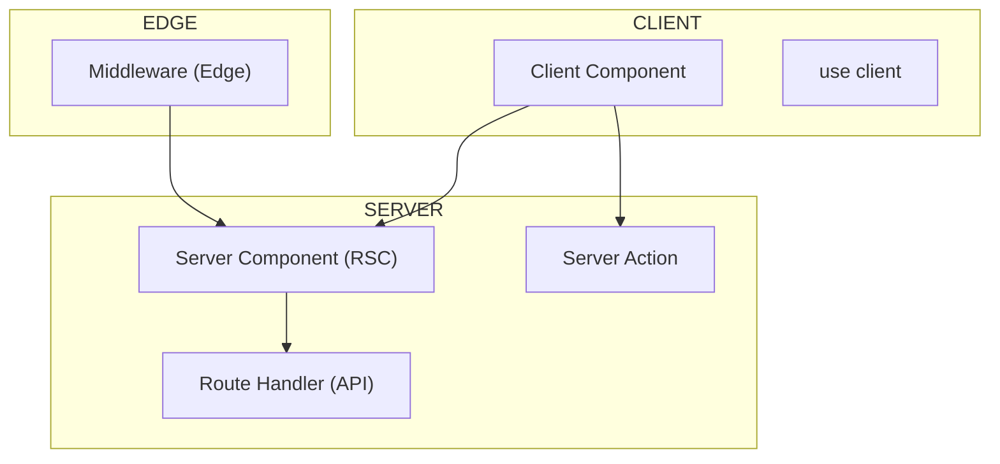

#### 요약

> **Next.js 15 / React 19 기준 문서입니다.**

이 문서는 Next.js의 핵심 개념과 명령어, 구조, 주요 API를 한눈에 볼 수 있는 **레퍼런스 요약표**이다.  
개발, 디버깅, 배포, 성능 최적화 등 모든 영역을 빠르게 점검할 수 있다.

- App Router / RSC / Suspense / Server Actions  
- SSR, SSG, ISR, Streaming 렌더링 구분  
- CLI 명령어, 환경변수, 빌드·배포 흐름  
- 주요 Hook, API, 디렉터리 구조  
- 보안, 성능, 테스트, 운영 핵심 지침  

> 요약 정리:  
> Next.js 15는 **“Server-first + Universal Rendering + DevOps-ready”** 프레임워크로,  
> 프론트엔드와 백엔드의 경계를 제거한다.

> **정리:**
>
> * App Router = Universal Layer
> * RSC + Actions = 서버 중심 아키텍처
> * fetch + revalidate = 자동 캐싱
> * Edge + Middleware = 초저지연 처리
>
> Next.js는 단순한 프레임워크를 넘어 “웹 애플리케이션 플랫폼”으로 진화했다.


##### 참고자료  
- [Next.js 공식 문서](https://nextjs.org/docs)  
- [React 19 공식 레퍼런스](https://react.dev/reference/react)  
- [Vercel Deployment Docs](https://vercel.com/docs)  
- [App Router Guide](../02-routing/2.routing.md)  
- [Performance & Ops](../07-performance-ops/7.performance-ops.md)

---

#### 1. CLI 명령어 요약

| 명령어 | 설명 |
|--------|------|
| `npx create-next-app@latest` | 새 Next.js 프로젝트 생성 |
| `npm run dev` | 개발 서버 실행 (`localhost:3000`) |
| `npm run build` | 프로덕션 빌드 생성 (`.next/`) |
| `npm start` | 빌드 결과 실행 (Node 서버) |
| `next lint` | ESLint 검사 실행 |
| `next export` | 정적 HTML 내보내기 |
| `next telemetry disable` | 익명 통계 비활성화 |

---

#### 2. 디렉터리 구조 요약

```text
project-root/
├─ app/                   # App Router (RSC 기반)
│  ├─ layout.tsx          # 공통 레이아웃
│  ├─ page.tsx            # 기본 페이지
│  ├─ api/                # Route Handlers(API)
│  ├─ loading.tsx         # Suspense fallback
│  ├─ error.tsx           # 전역 에러 처리
│  └─ (group)/            # Route Group
├─ public/                # 정적 자산
├─ src/                   # 유틸/컴포넌트 (선택)
├─ next.config.js         # 빌드 설정
├─ tsconfig.json          # 타입 설정
└─ .env.local             # 환경변수
```

> App Router(`app/`)가 Pages Router(`/pages`)보다 항상 우선한다.

---

#### 3. 렌더링 모드 구분

| 모드                                        | 실행 시점    | 설명                  |
| ----------------------------------------- | -------- | ------------------- |
| **SSR (Server-Side Rendering)**           | 요청 시     | 매 요청마다 HTML 생성      |
| **SSG (Static Site Generation)**          | 빌드 시     | 정적 HTML 생성          |
| **ISR (Incremental Static Regeneration)** | 빌드 + 주기적 | 일정 주기로 재생성          |
| **CSR (Client-Side Rendering)**           | 클라이언트    | 브라우저 JS로 렌더링        |
| **Streaming**                             | 서버 스트리밍  | Suspense 기반 점진적 렌더링 |

> RSC(Server Components) + Suspense로 SSR과 CSR의 장점을 결합할 수 있다.

---

#### 4. 데이터 패칭 요약

| 기능                       | 설명            | 코드 예시                                      |
| ------------------------ | ------------- | ------------------------------------------ |
| `fetch()`                | 기본 데이터 요청     | `fetch(url, { next: { revalidate: 60 } })` |
| `revalidateTag()`        | 태그 기반 캐시 무효화  | `await revalidateTag("posts")`             |
| `Server Actions`         | 서버 함수 직접 호출   | `"use server"` 선언                          |
| `generateStaticParams()` | 빌드 시 정적 경로 생성 | SSG에 사용                                    |
| `revalidatePath()`       | 경로 캐시 재검증     | 페이지 단위 무효화                                 |

---

#### 5. Server Actions 요약

```tsx
"use server";
export async function createUser(data) {
  await db.user.create({ data });
  revalidatePath("/users");
}
```

* `"use server"` 선언 필수
* 클라이언트에서 직접 import 불가
* 폼(form) 또는 `useFormState()` 훅과 결합 가능
* Mutation / CRUD 로직을 API 라우트 없이 구현

> API 없이 폼 데이터를 서버에서 직접 처리할 수 있는 것이 Server Actions의 핵심이다.

---

#### 6. 환경 변수 규칙

| 파일                | 용도          | 노출 여부    |
| ----------------- | ----------- | -------- |
| `.env.local`      | 로컬 개발       | 서버 전용    |
| `.env.production` | 배포용         | 서버 전용    |
| `NEXT_PUBLIC_*`   | 클라이언트 접근 가능 | 클라이언트 노출 |

> 서버 환경에서는 `process.env`,
> Edge 환경에서는 빌드 시점에만 접근 가능하다.

---

#### 7. 성능 최적화 요약

| 항목  | 전략                 | 도구                       |
| --- | ------------------ | ------------------------ |
| 이미지 | `<Image>` 최적화      | Image Optimization       |
| 폰트  | `next/font` 로컬화    | Font Optimization        |
| 캐시  | fetch + revalidate | Incremental Regeneration |
| 분석  | Web Vitals         | Vercel Analytics         |
| 코드  | Dynamic Import     | React.lazy / Suspense    |

> 성능 최적화는 대부분 Next.js가 자동으로 처리하지만,
> fetch 캐시 정책과 revalidate 주기는 직접 제어해야 한다.

---

#### 8. 보안 요약

| 항목    | 방법                                           |
| ----- | -------------------------------------------- |
| 인증    | NextAuth / Auth0                             |
| CSRF  | 내장 토큰 검증                                     |
| XSS   | React 자동 이스케이프 + DOMPurify                   |
| CSP   | `next.config.js`에 Content-Security-Policy 설정 |
| HTTPS | Vercel 자동 또는 Nginx + Certbot                 |

> App Router는 서버 중심 구조로, 민감 데이터가 브라우저로 직접 노출되지 않는다.

---

#### 9. 테스트 & 품질 요약

| 종류        | 도구                    | 설명              |
| --------- | --------------------- | --------------- |
| Unit      | Jest                  | 함수 단위 테스트       |
| Component | React Testing Library | UI 렌더링 검증       |
| E2E       | Playwright            | 전체 사용자 시나리오 테스트 |
| a11y      | axe-core              | 접근성 검사          |
| CI/CD     | GitHub Actions        | 자동 테스트 파이프라인    |

> 모든 테스트를 CI 단계에서 자동화하면 빌드 실패 시 배포 차단이 가능하다.

---

#### 10. 배포 명령 요약

| 환경                | 명령                                                     | 설명           |
| ----------------- | ------------------------------------------------------ | ------------ |
| **Vercel**        | `vercel --prod`                                        | 자동 빌드/배포     |
| **Docker**        | `docker build -t app . && docker run -p 3000:3000 app` | 자체 호스팅       |
| **Static Export** | `next export`                                          | 정적 HTML 빌드   |
| **CI/CD**         | GitHub Actions                                         | 자동 빌드+테스트+배포 |

> Vercel은 Preview URL을 PR마다 자동 생성하며,
> Docker는 self-host 환경에서 확장성 제어가 용이하다.

---

#### 11. 주요 Hook & API 요약

| 구분    | 이름                                            | 설명                 |
| ----- | --------------------------------------------- | ------------------ |
| 서버    | `use`                                         | 서버 비동기 fetch 결과 사용 |
| 클라이언트 | `useState`, `useEffect`, `useTransition`      | 기본 상태 관리           |
| 폼     | `useFormState`, `useFormStatus`               | Server Action 연동   |
| 네비게이션 | `useRouter`, `usePathname`, `useSearchParams` | App Router 전용      |
| 에러    | `useErrorBoundary`                            | 에러 처리 (React 19)   |

---

#### 12. 디버깅 및 로깅 팁

| 상황       | 명령어 / 도구                            |
| -------- | ----------------------------------- |
| 서버 로그 확인 | `next dev` 출력                       |
| Edge 로그  | Vercel Edge Logs                    |
| 환경변수 검증  | `console.log(process.env.NODE_ENV)` |
| 빌드 결과 확인 | `.next/analyze`                     |
| 성능 프로파일  | Chrome DevTools / React Profiler    |

> `NEXT_DEBUG=true` 설정 시 일부 내부 Fetch 로깅이 활성화된다.

---

#### 13. 전반 아키텍처 개요



> App Router는 위 3개 런타임(Client, Server, Edge)을 하나의 파이프라인으로 통합한다.

---

#### 14. 버전별 주요 변경점

| 버전             | 주요 내용                                |
| -------------- | ------------------------------------ |
| **Next.js 13** | App Router, RSC 도입                   |
| **Next.js 14** | Server Actions, Partial Prerendering |
| **Next.js 15** | React 19, Suspense Streaming 안정화     |
| **React 19**   | use, Actions, FormState 공식 포함        |

---

#### 15. 결론

Next.js 15는 “**모든 것을 서버 중심으로 단순화한 React 런타임**”이다.
데이터, 렌더링, 보안, 배포가 모두 프레임워크 내부에서 일관되게 작동하며,
대규모 서비스에서도 코드 복잡도를 최소화할 수 있다.

