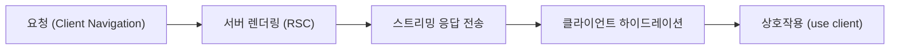
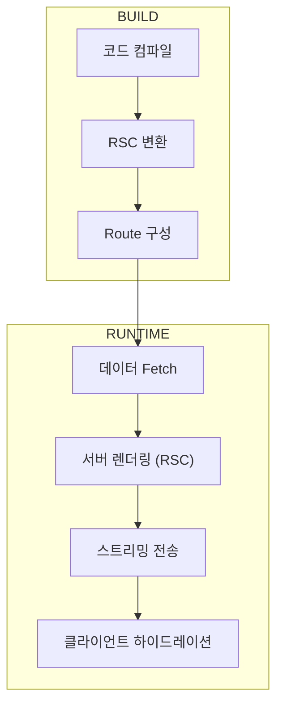

**Next.js 15.x / React 19 기준.**
#### 요약

Next.js는 **React 애플리케이션의 서버·클라이언트 렌더링을 통합**하는 프레임워크로,  
App Router 기반 구조와 React Server Components(RSC) 아키텍처를 중심으로 구성된다.  
본 문서는 Next.js의 **핵심 개념, 디렉터리 구조, 환경 설정, 개발 철학**을 정리한다.

- React 19 기반 풀스택 웹 프레임워크  
- 서버 중심 렌더링(RSC, SSR, ISR)을 통한 성능 최적화  
- App Router와 파일 기반 라우팅 구조  
- 타입 안정성과 DX 향상을 위한 TypeScript 환경  
- 환경 변수, 빌드 구성, 코드 경로 별칭 관리

> 요약 정리:  
> Next.js는 “서버와 클라이언트가 협력하는 현대적 렌더링 모델”을 제공한다.  
> React 19의 Server Components와 Suspense, Actions API를 결합해 **데이터 근접성(Data Proximity)**과 **렌더링 효율성(Render Efficiency)**을 동시에 달성한다.

##### 참고자료  
- [공식 문서 – Next.js Overview](https://nextjs.org/docs)  
- [App Router 안내서](https://nextjs.org/docs/app)  
- [React 19 Server Components RFC](https://react.dev/reference/react/ServerComponents)  
- [환경 변수 가이드](https://nextjs.org/docs/app/building-your-application/configuring/environment-variables)  
- [TypeScript 설정](https://nextjs.org/docs/app/building-your-application/configuring/typescript)  

---

#### 1. Next.js란 무엇인가

Next.js는 **React의 한계를 보완**하기 위해 만들어진 프레임워크다.  
CSR(Client-Side Rendering) 중심의 React는 초기 로딩이 느리고 SEO 대응이 어렵다.  
Next.js는 서버에서 HTML을 미리 생성(SSR/SSG/ISR)하여 사용자에게 즉시 전달한다.

| 구분 | 설명 |
|------|------|
| **App Router** | `app/` 디렉터리 중심의 라우팅, 페이지 생명주기 자동 관리 |
| **RSC (React Server Components)** | 서버에서 실행되어 클라이언트 JS 크기 감소 |
| **Full-stack 기능** | DB 접근, API 라우트, 인증, 배포까지 단일 환경 |
| **Streaming Rendering** | TTFB(Time To First Byte) 개선을 위한 점진적 전송 |

> Next.js 15는 React 19의 RSC, Server Actions, Suspense Streaming을 완전히 통합했다.



---

#### 2. 프로젝트 구조

Next.js 15는 **App Router + TypeScript 기반 구조**를 사용한다.
기본적으로 루트에는 `app/`, `public/`, `tsconfig.json`, `.env` 파일이 위치한다.

```text
project-root/
├─ app/                   # 페이지 및 라우트 단위 구성
│  ├─ layout.tsx          # 공통 레이아웃
│  ├─ page.tsx            # 루트 페이지
│  ├─ (group)/page.tsx    # 그룹 라우팅
│  ├─ api/                # Route Handlers(API)
│  └─ global-error.tsx    # 전역 에러 바운더리
├─ public/                # 정적 자원 (이미지, 아이콘 등)
├─ src/                   # 선택적 디렉터리, 유틸/컴포넌트
├─ tsconfig.json          # 타입 설정 및 경로 별칭
├─ package.json           # 종속성 관리
└─ .env.local             # 환경 변수
```

##### 경로 별칭 설정 (`tsconfig.json`)

```json
{
  "compilerOptions": {
    "baseUrl": ".",
    "paths": {
      "@/*": ["./src/*"],
      "@app/*": ["./app/*"]
    }
  }
}
```

##### 환경 변수 관리

| 파일              | 설명                 | 노출 여부       |
| --------------- | ------------------ | ----------- |
| `.env.local`    | 개발 환경용, git에 커밋 금지 | 서버 전용       |
| `.env`          | 공통 기본값 (배포 시 주입)   | 서버 전용       |
| `NEXT_PUBLIC_*` | 클라이언트에서 접근 가능      | 클라이언트 노출 가능 |

> **TIP:** 환경 변수는 RSC 내부에서만 직접 접근하는 것이 원칙이다.
> 클라이언트에서는 반드시 `NEXT_PUBLIC_` 접두사를 사용한다.

---

#### 3. 빌드 설정 및 타입 시스템

Next.js는 TypeScript가 기본 내장되어 있으며, 첫 실행 시 자동으로 `tsconfig.json`을 생성한다.

```bash
npx create-next-app@latest --typescript
```

##### 주요 설정 항목

| 옵션                 | 설명               | 권장 값       |
| ------------------ | ---------------- | ---------- |
| `strict`           | 타입 검사 강화         | `true`     |
| `target`           | ECMAScript 타깃 버전 | `ESNext`   |
| `jsx`              | JSX 트랜스파일링       | `preserve` |
| `moduleResolution` | 모듈 해석 방식         | `bundler`  |

---

#### 4. 개발 서버 및 빌드 명령

| 명령어             | 설명                       |
| --------------- | ------------------------ |
| `npm run dev`   | 개발 서버 시작 (기본 포트: 3000)   |
| `npm run build` | 프로덕션 빌드 생성 (`.next/` 폴더) |
| `npm run start` | 빌드 결과 실행 (Node.js 서버)    |
| `npm run lint`  | 코드 스타일 검사 (eslint)       |

> `next build` 시 자동으로 RSC, ISR, Dynamic Routes 분석 결과가 로그에 표시된다.

---

#### 5. 환경 구성 및 실행 흐름

1. **코드 변경 → Hot Reload**
2. **서버 빌드 → app/ 내부 구조 분석**
3. **라우트 매칭 → layout/page.tsx 조합**
4. **데이터 Fetch → RSC 렌더링**
5. **Streaming → 클라이언트 Hydration**



---

#### 6. 결론

Next.js의 **기초 구조(Foundations)**는 “React 애플리케이션을 서버 친화적으로 확장한 구조”다.
App Router, RSC, ISR 등은 모든 상위 기능의 기반이며,
이를 이해하면 이후 라우팅·데이터 패칭·보안·배포 구조를 자연스럽게 이어갈 수 있다.

> **정리:**
> Next.js 15는 React 19의 서버 중심 패러다임을 완성한 버전이다.
> 개발자는 이제 CSR·SSR·SSG·ISR을 자유롭게 혼합해 “사용자에게 가장 빠른 첫 바이트”를 전달할 수 있다.

