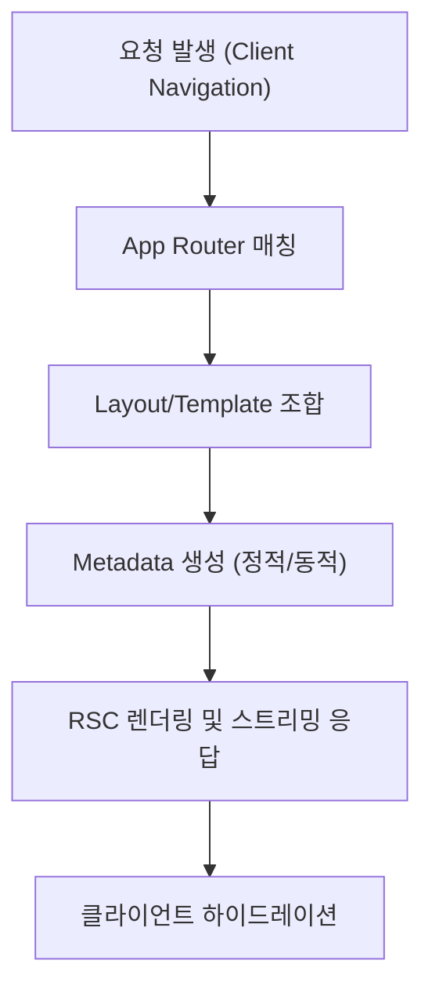

(App Router, Layout/Template, Metadata/SEO 포함)
**Next.js 15.x / React 19 기준.**
#### 요약

Next.js의 **App Router**는 파일 기반 구조로 라우팅을 자동 관리하며,  
Layout·Template·Metadata API를 통해 **페이지 생명주기와 SEO를 프레임워크 수준에서 통합**한다.  

- 파일 기반 라우팅(`app/` 디렉터리 구조)  
- Route Groups와 Dynamic Routes로 구조화  
- Layout과 Template의 역할 구분  
- Metadata API를 활용한 SEO 자동화  
- Intercepting Routes 및 병렬 UI 지원  

> 요약 정리:  
> App Router는 “폴더가 곧 라우트”라는 단순한 원칙 아래,
> React의 UI 구성 철학을 서버 렌더링까지 확장한 Next.js의 심장이다.
> App Router는 Next.js의 핵심으로, “파일 시스템이 곧 라우팅 구조”이다.  
> 개발자는 `app/` 폴더 내의 디렉터리와 파일 이름만으로 URL, Layout, SEO를 완전히 제어할 수 있다.

##### 참고자료  
- [공식 문서 – App Router](https://nextjs.org/docs/app/building-your-application/routing)  
- [Layout과 Template](https://nextjs.org/docs/app/building-your-application/routing/pages-and-layouts)  
- [Metadata API](https://nextjs.org/docs/app/building-your-application/optimizing/metadata)  
- [파일 구조 예시](../01-foundations/01-what-is-nextjs.md)  
- [환경 변수 설정](../01-foundations/02-project-structure.md)

---

#### 1. App Router 개요

Next.js 13부터 도입된 App Router는 `app/` 폴더를 기준으로  
**라우팅, 데이터 패칭, 렌더링, SEO 메타데이터까지 통합 관리**한다.  

```text
app/
  layout.tsx        # 공통 레이아웃
  page.tsx          # 루트 페이지
  dashboard/
    layout.tsx
    page.tsx
  blog/
    [slug]/page.tsx # 동적 라우팅
```

> 각 폴더는 하나의 “Route Segment”이며, `page.tsx`가 엔트리 포인트 역할을 한다.

---

#### 2. 라우트 그룹과 인터셉트

##### 라우트 그룹 `(group)`

* 폴더 이름을 괄호로 감싸면 `(group)`은 **URL에 포함되지 않는다.**
* 라우팅 계층을 유지하면서 **코드 구조를 분리**할 수 있다.

```text
app/
  (auth)/
    login/page.tsx
    register/page.tsx
```

→ `/login`, `/register` URL만 노출됨.

##### 인터셉팅(Intercepting) 라우트

* 모달이나 오버레이 UI를 위해 특정 라우트를 **다른 경로에서 가로채서 렌더링**할 수 있다.

```text
app/
  photos/[id]/page.tsx
  @modal/(..)photos/[id]/page.tsx
```

> Intercepting은 모달 기반 탐색, SPA 전환에 매우 유용하다.

---

#### 3. Layout과 Template

| 구분               | 특징              | 리렌더링          | 상태 유지 |
| ---------------- | --------------- | ------------- | ----- |
| **layout.tsx**   | 공통 레이아웃, 상태 유지됨 | ❌ (리렌더 안됨)    | ✅ 유지  |
| **template.tsx** | 재렌더링이 필요한 영역    | ✅ (매 네비게이션 시) | ❌ 초기화 |

##### 예시

```tsx
// app/dashboard/layout.tsx
export default function Layout({ children }) {
  return <section>{children}</section>;
}
```

> 중첩 레이아웃을 통해 섹션별 셸(Shell)을 구성할 수 있다.

---

#### 4. Metadata & SEO

Next.js 15에서는 **Metadata API**를 통해 SEO 구성을 타입 안전하게 관리할 수 있다.

##### 정적 메타데이터

```tsx
export const metadata = {
  title: "홈페이지 | MyApp",
  description: "Next.js 15 기반 웹 서비스",
  openGraph: { title: "MyApp", images: ["/og-image.png"] },
};
```

##### 동적 메타데이터

```tsx
export async function generateMetadata({ params }) {
  return { title: `Post: ${params.slug}` };
}
```

##### robots.txt / sitemap.xml 자동화

```tsx
// app/robots.ts
export default function robots() {
  return {
    rules: { userAgent: "*", allow: "/" },
    sitemap: "https://example.com/sitemap.xml",
  };
}
```

> SEO 설정은 라우트 단위로 자동 병합되어, 빌드 시 일괄 관리된다.

---

#### 5. 동적 라우팅(Dynamic Routes)

Next.js는 파일 이름의 대괄호(`[param]`)를 사용하여 동적 URL을 정의한다.

```text
app/blog/[slug]/page.tsx
```

##### 정적 프리렌더링(`generateStaticParams`)

```tsx
export async function generateStaticParams() {
  return [{ slug: "hello" }, { slug: "world" }];
}
```

> 빌드 시 해당 파라미터로 미리 HTML을 생성하여 성능을 최적화한다.

---

#### 6. 페이지 생명주기 요약



> App Router는 이 모든 과정을 **파일 구조 분석 → RSC 렌더링 → 스트리밍 전송** 단계로 자동 수행한다.

---

#### 7. 결론
App Router는 Next.js의 핵심 엔진으로,
**파일 기반 라우팅 + 서버 중심 렌더링 + SEO 자동화**를 결합한다.
Layout·Template·Metadata를 이해하면 프로젝트 구조가 훨씬 명확해지고,
대규모 애플리케이션에서도 유지보수성이 크게 향상된다.


