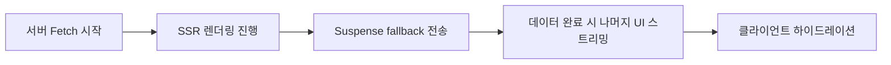
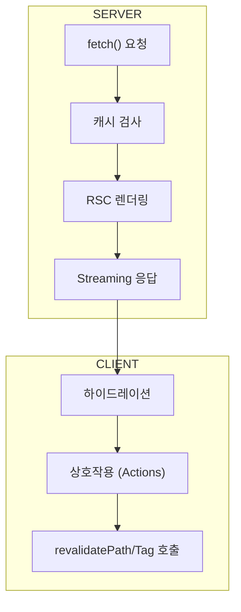

데이터 패칭 전략 (fetch, ISR, Server Actions, Streaming/Suspense)
> **Next.js 15 / React 19 기준**

#### 요약

Next.js의 데이터 패칭은 **fetch 캐싱, revalidate(재검증), Server Actions, Streaming UI**로 구성된다.  
React 19와 함께 도입된 Server Actions 및 Suspense를 통해  
서버 중심 데이터 패칭 구조가 완성되었다.

- `fetch` 캐시 정책과 ISR 기반 재검증  
- `Server Actions`로 서버에서 직접 mutate  
- `Suspense`를 통한 Streaming UI  
- `revalidateTag`, `revalidatePath`로 부분 갱신  
- 서버 중심 데이터 플로우로 CSR 의존성 감소  

> 요약 정리:  
> 데이터 패칭은 “서버가 먼저 데이터를 준비하고 클라이언트는 상호작용만 수행한다”는
> React 19의 핵심 철학을 구현한 부분이다.
> 이 모델은 대규모 SaaS, 대시보드, 개인화 서비스 모두에 적합하다.
> Next.js 15는 데이터 요청과 응답의 경계를 “서버 우선(Server-first)”으로 재정의한다.  
> fetch·Action·Streaming이 모두 React 19의 Suspense 렌더링 모델 위에 통합되어 작동한다.

##### 참고자료  
- [Data Fetching Overview](https://nextjs.org/docs/app/building-your-application/data-fetching/fetching)  
- [Server Actions 공식 문서](https://nextjs.org/docs/app/building-your-application/data-fetching/server-actions-and-mutations)  
- [Streaming & Suspense](https://nextjs.org/docs/app/building-your-application/routing/loading-ui-and-streaming)  
- [revalidateTag API](https://nextjs.org/docs/app/api-reference/functions/revalidateTag)  
- [App Router 구조](../02-routing/2.routing.md)

---

#### 1. fetch()와 캐시 정책

Next.js 15의 `fetch()`는 **서버·클라이언트 간 캐시 정책을 완벽히 통합**했다.  
모든 데이터 패칭은 서버 환경(RSC)에서 실행되며, 캐시·재검증·태그 단위 무효화를 지원한다.

```ts
const data = await fetch("https://api.example.com/posts", {
  cache: "force-cache",             // 기본 캐시
  next: { revalidate: 60 },         // ISR (60초 후 재검증)
}).then(r => r.json());
```

| 옵션                | 설명                                       | 기본값             |
| ----------------- | ---------------------------------------- | --------------- |
| `cache`           | `"force-cache"` (기본), `"no-store"` (비캐시) | `"force-cache"` |
| `next.revalidate` | ISR 재생성 주기(초)                            | `false` (비활성)   |
| `next.tags`       | 특정 태그 그룹으로 캐시 묶음                         | -               |

> `no-store` 옵션은 요청 시마다 새 데이터를 가져오며,
> 개인화된 페이지나 대시보드에 적합하다.

---

#### 2. ISR (Incremental Static Regeneration)

ISR은 정적 페이지를 일정 주기로 **자동 재생성**하는 기술이다.
빌드 시점의 SSG(Static Generation)에 `revalidate` 속성을 추가해 캐시를 재검증한다.

```tsx
export const revalidate = 120; // 2분마다 재검증
```

ISR은 **성능과 최신성의 균형을 유지**하며, `revalidateTag()` 또는 `revalidatePath()`로 수동 무효화도 가능하다.

```ts
import { revalidateTag } from "next/cache";
await revalidateTag("posts");
```

---

#### 3. Server Actions

React 19에서 정식 도입된 **Server Actions**는
폼 제출, Mutation, 검증 로직을 클라이언트 대신 서버에서 실행한다.
이로써 REST API 호출 대신 서버 함수를 직접 호출하는 모델이 가능하다.

```tsx
"use server";

import { z } from "zod";

const schema = z.object({ title: z.string().min(3) });

export async function createPost(prevState, formData) {
  const result = schema.safeParse(Object.fromEntries(formData));
  if (!result.success) return { error: "제목이 너무 짧습니다." };
  await db.post.create({ data: result.data });
  return { ok: true };
}
```

##### 주요 특징

| 항목                      | 설명                         |
| ----------------------- | -------------------------- |
| **직접 서버 실행**            | API endpoint 없이 서버에서 코드 실행 |
| **자동 직렬화/역직렬화**         | formData 객체를 자동 변환         |
| **Error Boundaries 호환** | 실패 시 `error.tsx`에서 처리      |
| **타입 안전성**              | zod, TypeScript와 완전 호환     |

> Server Actions는 서버의 상태를 직접 제어하므로,
> “서버가 데이터의 단일 출처(Single Source of Truth)”가 된다.

---

#### 4. Streaming & Suspense

Streaming은 React 19의 핵심 기능 중 하나로,
서버에서 렌더링된 결과를 **부분적으로 스트리밍 전송**하여 TTFB를 단축한다.

```tsx
// app/page.tsx
import { Suspense } from "react";
import Posts from "./Posts";

export default function Page() {
  return (
    <Suspense fallback={<p>로딩 중...</p>}>
      <Posts />
    </Suspense>
  );
}
```

* Suspense 내부는 서버가 데이터 준비를 마치는 즉시 전송됨
* 전체 페이지가 아니라 **일부 블록만 지연 렌더링** 가능
* `loading.tsx` 파일을 통해 자동 fallback 구성 가능

```tsx
// app/loading.tsx
export default function Loading() {
  return <p>페이지 로딩 중...</p>;
}
```



---

#### 5. 데이터 무효화 (Revalidation)

Next.js 15는 `revalidatePath`와 `revalidateTag`를 통해
**특정 페이지나 데이터 그룹의 캐시를 수동으로 무효화**할 수 있다.

```ts
import { revalidatePath } from "next/cache";

export async function action() {
  await updateDatabase();
  revalidatePath("/dashboard");
}
```

| 함수                     | 설명                         |
| ---------------------- | -------------------------- |
| `revalidatePath(path)` | 해당 경로의 캐시 무효화              |
| `revalidateTag(tag)`   | 특정 태그 그룹 재검증               |
| `revalidate()`         | fetch 옵션의 revalidate 수동 실행 |

> 이 기능은 서버 이벤트(예: 데이터 생성 후)에서 사용하면 실시간 반영 효과를 준다.

---

#### 6. 데이터 흐름 요약



---

#### 7. 결론

Next.js 15의 데이터 패칭은 **서버 중심 렌더링 구조(Server-first)**를 완성한다.
fetch 캐시, ISR, Server Actions, Streaming이 모두 하나의 일관된 모델 위에서 동작하며,
개발자는 REST API나 GraphQL 없이도 완전한 데이터 흐름을 구성할 수 있다.


