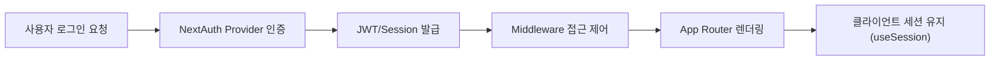

**Next.js 15 / React 19 기준**
(NextAuth, Middleware, CSP/XSS/CSRF)
#### 요약
Next.js의 인증 체계는 **App Router + Middleware + NextAuth(Auth.js)** 구조로 구성된다.  
OAuth, Credentials, JWT 기반 인증을 지원하며,  
보안 측면에서는 **CSP(Content Security Policy)**, **XSS/CSRF 방지**, **Edge 제한 환경 보안**을 함께 고려한다.

- App Router 환경에서 NextAuth(Auth.js) 완전 지원  
- Middleware로 라우트 접근 제어  
- 세션/JWT 기반 인증 유지  
- CSP, CSRF, XSS 방어 정책 설정  
- Edge 런타임에서의 보안 제약 고려  

> 요약 정리:  
> Next.js 15의 인증 구조는 **NextAuth로 로그인 처리**,  
> **Middleware로 보호**, **보안 헤더로 방어**하는 3단계 아키텍처로 정리된다.
> App Router 구조에서는 인증도 UI의 일부가 아닌 **데이터 흐름의 일부**로 다뤄야 한다.
> 세션, JWT, Middleware, CSP를 함께 설계하는 것이 안전한 Next.js 15 보안의 핵심이다.

##### 참고자료  
- [Auth.js (NextAuth)](https://authjs.dev/)  
- [Next.js Middleware](https://nextjs.org/docs/app/building-your-application/routing/middleware)  
- [Content Security Policy 설정](https://nextjs.org/docs/app/building-your-application/configuring/content-security-policy)  
- [HTTP 헤더 보안 가이드 (MDN)](https://developer.mozilla.org/docs/Web/HTTP/CSP)  
- [Session / JWT 구성](https://next-auth.js.org/configuration/options)

---

#### 1. 인증 흐름 개요

Next.js의 인증은 **서버 중심**으로 설계된다.  
모든 인증 로직은 `app/api/auth/[...nextauth]/route.ts` 경로에서 수행된다.



---

#### 2. NextAuth(Auth.js) 설정

##### 설치

```bash
npm install next-auth
```

##### 구성 예시

```ts
// app/api/auth/[...nextauth]/route.ts
import NextAuth from "next-auth";
import GitHubProvider from "next-auth/providers/github";

export const authOptions = {
  providers: [
    GitHubProvider({
      clientId: process.env.GITHUB_ID!,
      clientSecret: process.env.GITHUB_SECRET!,
    }),
  ],
  session: { strategy: "jwt" },
};

const handler = NextAuth(authOptions);
export { handler as GET, handler as POST };
```

##### 세션 조회 (클라이언트)

```tsx
"use client";
import { useSession, signIn, signOut } from "next-auth/react";

export default function LoginButton() {
  const { data: session } = useSession();
  if (session)
    return <button onClick={() => signOut()}>로그아웃</button>;
  return <button onClick={() => signIn("github")}>로그인</button>;
}
```

> `useSession()` 훅은 클라이언트에서 인증 상태를 자동 추적한다.

---

#### 3. Middleware 보호

Next.js의 `middleware.ts`는 특정 경로를 보호하기 위한 **인증 필터** 역할을 한다.

```ts
// middleware.ts
import { getToken } from "next-auth/jwt";
import { NextResponse } from "next/server";
import type { NextRequest } from "next/server";

export async function middleware(req: NextRequest) {
  const token = await getToken({ req });
  const isAuthPage = req.nextUrl.pathname.startsWith("/login");

  if (isAuthPage && token) return NextResponse.redirect(new URL("/", req.url));
  if (!token && !isAuthPage)
    return NextResponse.redirect(new URL("/login", req.url));

  return NextResponse.next();
}

export const config = {
  matcher: ["/dashboard/:path*", "/admin/:path*"],
};
```

| 구분                        | 설명                     |
| ------------------------- | ---------------------- |
| `getToken()`              | JWT 기반 세션 추출           |
| `NextResponse.redirect()` | 인증 실패 시 로그인 페이지로 리다이렉트 |
| `matcher`                 | 보호할 경로 지정              |

> Middleware는 Edge Runtime에서 실행되므로 Node 전용 API(`fs`, `crypto`) 사용은 제한된다.

---

#### 4. 보안 헤더 (Security Headers)

보안 강화를 위해 `next.config.js`에 HTTP 헤더를 설정한다.

```js
// next.config.js
const securityHeaders = [
  {
    key: "Content-Security-Policy",
    value: "default-src 'self'; img-src *; script-src 'self' 'unsafe-inline';",
  },
  { key: "X-Frame-Options", value: "DENY" },
  { key: "X-Content-Type-Options", value: "nosniff" },
  { key: "Referrer-Policy", value: "strict-origin-when-cross-origin" },
];

module.exports = {
  async headers() {
    return [{ source: "/(.*)", headers: securityHeaders }];
  },
};
```

##### 주요 헤더

| 헤더                         | 설명             |
| -------------------------- | -------------- |
| **CSP**                    | 스크립트/리소스 로드 제어 |
| **X-Frame-Options**        | 클릭재킹 방지        |
| **X-Content-Type-Options** | MIME 스니핑 차단    |
| **Referrer-Policy**        | 외부 참조 정보 제한    |

---

#### 5. CSRF / XSS 방지

##### CSRF 보호

* NextAuth는 기본적으로 **CSRF 토큰 검증**을 내장하고 있다.
* 직접 API를 구현할 경우에는 `csrf()` 미들웨어를 추가해야 한다.

##### XSS 방어

* **React의 자동 이스케이프**를 활용하고,
* 사용자 입력을 출력 시 반드시 `dangerouslySetInnerHTML`을 피한다.
* 필요 시 `sanitize-html`, `DOMPurify`로 필터링한다.

```tsx
import DOMPurify from "isomorphic-dompurify";
<div dangerouslySetInnerHTML={{ __html: DOMPurify.sanitize(userInput) }} />;
```

---

#### 6. Edge 환경 보안 고려사항

Edge Runtime(`middleware`, `route.ts`)에서는
Node.js API 접근이 제한되며, 민감한 인증 키를 직접 참조할 수 없다.

| 제한 항목         | 설명                                    |
| ------------- | ------------------------------------- |
| `fs`, `path`  | 로컬 파일 접근 불가                           |
| `process.env` | `.env` 값은 빌드 시 주입된 값만 사용 가능           |
| 암호화           | Web Crypto API(`crypto.subtle`) 사용 권장 |

> Edge 함수에서는 환경변수를 직접 호출하기보단
> **전처리 시점에서 안전하게 주입(build-time injection)** 해야 한다.

---

#### 7. 결론

Next.js의 인증·보안 체계는 “**NextAuth로 인증, Middleware로 접근 제어, 헤더로 보호**”로 요약된다.
React 19 및 Edge 환경까지 대응하며, 서버 중심의 보안 모델을 유지한다.

