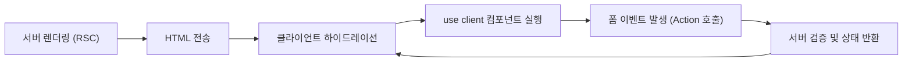

**Next.js 15 / React 19 기준 문서**

#### 요약

Next.js의 UI 구성은 **서버·클라이언트 경계 분리(use client)**,  
**전역 스타일링 체계(Tailwind/CSS Modules)**,  
**서버 액션 기반 폼 처리(Server Actions + react-hook-form)** 으로 구성된다.

- `use client` 지시어로 클라이언트 전용 컴포넌트 지정  
- 전역/모듈 스타일링 전략 병행 (Tailwind, CSS Modules, styled-components)  
- 서버 액션 + zod + react-hook-form으로 폼 유효성 검증  
- 상태 유지 최소화로 렌더링 효율 향상  
- 서버 중심 데이터 흐름을 깨지 않는 UI 설계  

> 요약 정리:  
> Next.js 15는 **서버 렌더링을 기본으로, 클라이언트 상태는 필요한 만큼만 최소화**한다.  
> 모든 UI는 “데이터는 서버에서, 인터랙션은 클라이언트에서”라는 원칙 위에 구축된다.
> 클라이언트 컴포넌트는 “인터랙션 전용”,
> 서버는 “데이터 준비 전용”으로 역할을 분리하라.
> 이 구조는 성능·유지보수성·보안 세 측면에서 가장 이상적이다.

##### 참고자료  
- [Client Components 공식 문서](https://nextjs.org/docs/app/building-your-application/rendering/composition-patterns#using-client-components)  
- [스타일링 가이드](https://nextjs.org/docs/app/building-your-application/styling)  
- [Server Actions + Form 처리](https://nextjs.org/docs/app/building-your-application/data-fetching/server-actions-and-mutations)  
- [React Hook Form](https://react-hook-form.com/)  
- [zod 유효성 검사 라이브러리](https://zod.dev/)

---

#### 1. 클라이언트 컴포넌트 (use client)

Next.js 15에서는 **기본이 서버 컴포넌트(Server Component)**이며,  
브라우저 상호작용이 필요한 컴포넌트에만 `use client`를 선언한다.

```tsx
"use client";

import { useState } from "react";

export default function Counter() {
  const [count, setCount] = useState(0);
  return <button onClick={() => setCount(count + 1)}>Count: {count}</button>;
}
````

| 구분    | 서버 컴포넌트      | 클라이언트 컴포넌트        |
| ----- | ------------ | ----------------- |
| 실행 위치 | Node.js 런타임  | 브라우저              |
| 목적    | 데이터 패칭 / 렌더링 | 사용자 이벤트 / 상태      |
| JS 번들 | ❌ 제외         | ✅ 포함              |
| 선언 방식 | 기본           | `"use client"` 필요 |

> 클라이언트 컴포넌트는 RSC 트리의 **경계(boundary)**를 만든다.
> 가능하면 상위는 서버, 하위는 클라이언트로 두어 데이터 흐름을 단방향으로 유지하자.

---

#### 2. 상태 관리 및 경계 분리

서버에서 데이터 Fetch → 클라이언트에서 최소 상태 유지.

```tsx
// app/page.tsx (Server Component)
import Counter from "./Counter";

export default async function Page() {
  const data = await getData();
  return (
    <div>
      <h1>{data.title}</h1>
      <Counter /> {/* use client 컴포넌트 */}
    </div>
  );
}
```

> **RSC → Client Component 흐름**을 지키면 hydration 비용이 줄고 성능이 향상된다.

---

#### 3. 스타일링 (Styling)

Next.js는 여러 스타일링 방식을 지원한다.
공식적으로 **Tailwind CSS**, **CSS Modules**, **styled-components** 사용이 권장된다.

##### Tailwind CSS

```bash
npm install -D tailwindcss postcss autoprefixer
npx tailwindcss init -p
```

`globals.css`에 기본 설정 추가:

```css
@tailwind base;
@tailwind components;
@tailwind utilities;
```

##### CSS Modules

```tsx
// Button.module.css
.button {
  background-color: #0070f3;
  color: white;
}

/* Button.tsx */
import styles from "./Button.module.css";
export function Button() {
  return <button className={styles.button}>Click</button>;
}
```

##### styled-components

```tsx
"use client";
import styled from "styled-components";

const Box = styled.div`
  padding: 16px;
  background: #f0f0f0;
`;
```

| 구분                | 장점        | 단점         | 권장 상황        |
| ----------------- | --------- | ---------- | ------------ |
| Tailwind          | 빠른 프로토타이핑 | 클래스 가독성 저하 | UI 일관성 중요할 때 |
| CSS Modules       | 스코프 명확    | 전역 재사용 어려움 | 중소형 프로젝트     |
| styled-components | 동적 스타일    | 런타임 오버헤드   | 인터랙션 많은 UI   |

---

#### 4. Form과 Server Actions

Next.js 15에서는 **폼 제출 시 API 요청 없이 서버 함수(Server Action)**를 직접 호출할 수 있다.

##### 서버 액션 정의

```tsx
"use server";
import { z } from "zod";

const schema = z.object({
  name: z.string().min(2),
  email: z.string().email(),
});

export async function submitForm(prevState, formData) {
  const result = schema.safeParse(Object.fromEntries(formData));
  if (!result.success) return { error: "유효하지 않은 입력입니다." };
  await saveUser(result.data);
  return { ok: true };
}
```

##### 클라이언트 폼 구성

```tsx
"use client";
import { useFormState } from "react-dom";
import { submitForm } from "./actions";

export default function Form() {
  const [state, formAction] = useFormState(submitForm, { ok: false });
  return (
    <form action={formAction}>
      <input name="name" placeholder="이름" required />
      <input name="email" placeholder="이메일" required />
      <button type="submit">등록</button>
      {state.error && <p>{state.error}</p>}
    </form>
  );
}
```

> `useFormState` 훅은 서버 응답 객체를 자동으로 추적해
> **폼 상태 → 서버 응답 → 재렌더링**의 흐름을 단순화한다.

---

#### 5. zod + react-hook-form 통합

서버 액션이 아닌 클라이언트 유효성 검증이 필요한 경우,
`zodResolver`를 사용하여 `react-hook-form`과 통합할 수 있다.

```tsx
"use client";
import { useForm } from "react-hook-form";
import { z } from "zod";
import { zodResolver } from "@hookform/resolvers/zod";

const schema = z.object({
  email: z.string().email("올바른 이메일을 입력하세요."),
});

export default function RHFExample() {
  const { register, handleSubmit, formState } = useForm({
    resolver: zodResolver(schema),
  });

  const onSubmit = (data) => console.log(data);

  return (
    <form onSubmit={handleSubmit(onSubmit)}>
      <input {...register("email")} />
      {formState.errors.email && <p>{formState.errors.email.message}</p>}
      <button>제출</button>
    </form>
  );
}
```

---

#### 6. UI 생명주기 개요



> UI의 모든 상호작용은 서버 중심 데이터 흐름을 깨지 않는 방향으로 설계되어야 한다.

---

#### 7. 결론

Next.js 15는 UI를 구성할 때 **서버 주도 렌더링(Server-Driven UI)**을 권장한다.
스타일링, 폼, 상태관리는 모두 이 철학을 보조한다.


