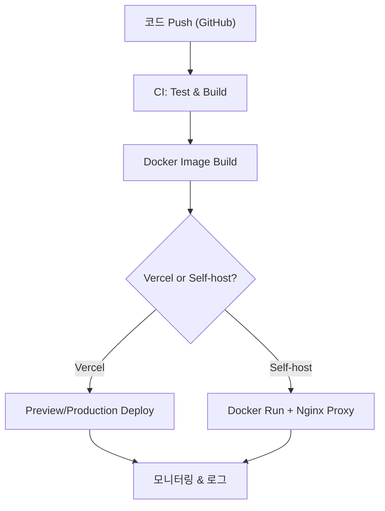

**Next.js 15 / React 19 기준 문서**

#### 요약
Next.js는 기본적으로 **Vercel 플랫폼에 최적화된 서버리스 배포 구조**를 사용하지만,  
**Docker / Nginx 기반 Self-Host** 및 **CI/CD 자동 배포 파이프라인**도 공식적으로 지원한다.  
운영 환경에서는 런타임 설정, 환경변수 주입, 빌드 캐시 관리가 핵심이다.

- `next build` / `next start` 기반 Node 실행  
- Vercel 환경변수, Preview, Edge 기능 지원  
- Self-host 시 Standalone 빌드 및 Docker 이미지 생성  
- Nginx Reverse Proxy로 HTTPS 구성  
- GitHub Actions + Turborepo 기반 CI/CD 자동화  

> 요약 정리:  
> Next.js의 배포 전략은 “**어디서나 실행되는 서버리스 아키텍처**”를 지향한다.  
> 프레임워크 차원에서 Vercel, Docker, CI/CD 모두 일관된 런타임을 유지한다.

> **정리:**
>
> * Vercel → 자동 스케일링, Edge 배포
> * Docker → 인프라 제어 및 독립 환경
> * CI/CD → 품질 + 배포 자동화
>
> Next.js는 모든 배포 모델을 일관된 런타임 규약으로 통합했다.

##### 참고자료  
- [Deploying to Vercel](https://nextjs.org/docs/app/building-your-application/deploying/vercel)  
- [Self-hosting Guide](https://nextjs.org/docs/app/building-your-application/deploying/self-hosting)  
- [Standalone Output](https://nextjs.org/docs/app/api-reference/next-config-js/output)  
- [Docker 공식 가이드](https://hub.docker.com/_/node)  
- [GitHub Actions CI/CD](https://docs.github.com/en/actions)

---

#### 1. Vercel 배포

Next.js는 Vercel에서 **버튼 한 번으로 완전 자동 배포**가 가능하다.  
Vercel은 Next.js 빌드 파이프라인과 동일한 런타임을 사용한다.

##### 기본 절차

1. GitHub / GitLab 저장소 연결  
2. `vercel.json` 또는 프로젝트 루트 인식  
3. 브랜치별 Preview 배포 자동 생성  
4. `main` 병합 시 Production 반영

##### 환경변수 관리

Vercel → Settings → Environment Variables  
환경별(`Production`, `Preview`, `Development`)로 분리 가능.

> Preview 배포는 PR마다 자동 생성되어 테스트용으로 사용된다.

##### 도메인 연결

- Custom Domain 추가 → `CNAME` 레코드 설정  
- SSL 인증서 자동 발급 (Let’s Encrypt)  
- 자동 HTTPS Redirect 활성화

---

#### 2. Self-host (Docker + Nginx)

Vercel 외 환경에서도 `next start` 기반으로 Node 서버를 직접 구동할 수 있다.

##### Standalone 빌드

```bash
next build
```

`next.config.js`에서 Standalone 출력 설정:

```js
module.exports = {
  output: "standalone",
};
```

##### Dockerfile 예시

```Dockerfile
# Step 1: Build
FROM node:20-alpine AS builder
WORKDIR /app
COPY . .
RUN npm ci && npm run build

# Step 2: Run
FROM node:20-alpine
WORKDIR /app
COPY --from=builder /app/.next/standalone ./
COPY --from=builder /app/public ./public
EXPOSE 3000
CMD ["node", "server.js"]
```

> Standalone 빌드는 `.next/standalone` 내부에 실행 가능한 최소 서버를 생성한다.

##### docker-compose.yml 예시

```yaml
version: "3.8"
services:
  nextjs:
    build: .
    container_name: nextjs-app
    ports:
      - "3000:3000"
    environment:
      - NODE_ENV=production
      - NEXT_PUBLIC_API_URL=https://api.example.com
```

##### Nginx Reverse Proxy 설정

```nginx
server {
  listen 80;
  server_name example.com;

  location / {
    proxy_pass http://localhost:3000;
    proxy_set_header Host $host;
    proxy_set_header X-Forwarded-For $proxy_add_x_forwarded_for;
  }
}
```

> HTTPS를 적용하려면 Certbot을 이용한 SSL 인증서 발급 후
> `listen 443 ssl;` 블록으로 확장하면 된다.

---

#### 3. CI/CD 자동화

##### GitHub Actions 예시 (`.github/workflows/deploy.yml`)

```yaml
name: Deploy Next.js
on:
  push:
    branches:
      - main

jobs:
  build-deploy:
    runs-on: ubuntu-latest
    steps:
      - uses: actions/checkout@v3
      - uses: actions/setup-node@v4
        with:
          node-version: 20
      - run: npm ci
      - run: npm run build
      - run: docker build -t nextjs-app .
      - run: docker save nextjs-app | gzip > nextjs-app.tar.gz
      - uses: actions/upload-artifact@v3
        with:
          name: nextjs-docker
          path: nextjs-app.tar.gz
```

##### Turborepo 병렬 빌드 예시

`turbo.json`

```json
{
  "pipeline": {
    "build": {
      "dependsOn": ["^build"],
      "outputs": [".next/**"]
    },
    "test": {},
    "lint": {}
  }
}
```

> Turborepo는 Next.js 모노레포 환경에서 **빌드 캐시 및 병렬 실행**을 자동 관리한다.

---

#### 4. 실행 환경 구성 (Runtime Config)

빌드 타임 / 런타임 변수를 명확히 분리해야 한다.

| 구분             | 사용 시점    | 접근 방식              |
| -------------- | -------- | ------------------ |
| **Build-time** | 빌드 시점    | `process.env`      |
| **Runtime**    | 서버 실행 시점 | `.env.production`  |
| **Client**     | 브라우저     | `NEXT_PUBLIC_` 접두사 |

> Self-host 환경에서는 `.env`를 Docker secret 또는 Kubernetes Secret으로 대체해 관리한다.

---

#### 5. 배포 검증 체크리스트

| 항목             | 확인 방법                         | 목적      |
| -------------- | ----------------------------- | ------- |
| **빌드 성공 여부**   | `next build` 완료 로그            | 코드 정합성  |
| **이미지 최소화**    | Docker multi-stage build      | 용량 최적화  |
| **환경 변수 주입**   | `.env`, GitHub Secrets        | 런타임 안정성 |
| **헬스체크 엔드포인트** | `/api/health`                 | 모니터링    |
| **SSL 설정 확인**  | `curl -v https://example.com` | 보안 통신   |

---

#### 6. 배포 흐름 요약



---

#### 7. 결론

Next.js 15는 “**Vercel + Self-host + CI/CD 완전 호환**” 아키텍처를 제공한다.
개발자는 동일한 코드로 서버리스/컨테이너 환경을 모두 지원할 수 있으며,
운영 자동화 수준에 따라 배포 안정성을 극대화할 수 있다.


