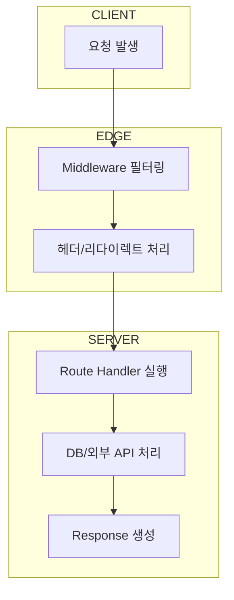

**Next.js 15 / React 19 기준**
(Route Handlers, Middleware, Edge 한계)

#### 요약

Next.js는 App Router를 기반으로 **서버 API(Route Handlers)**와 **Middleware**,  
그리고 **Edge Runtime(경량 서버 실행 환경)**을 통합적으로 지원한다.  
이를 통해 클라이언트 요청을 서버에서 즉시 처리하거나, Edge 네트워크 상에서 선응답(Pre-Response) 가능하다.

- `app/api/*` 기반 Route Handlers로 서버 API 구현  
- `middleware.ts`를 통한 요청/응답 전처리  
- Edge Runtime으로 초저지연 응답 처리  
- Node.js API 일부 제한 (Edge 환경)  
- Web Fetch API 호환 Request/Response 구조  

> 요약 정리:  
> Next.js 15의 서버 실행 구조는 “**Node + Edge 이중 런타임**”으로 발전했다.  
> 개발자는 트래픽 특성에 따라 API를 서버(Node) 또는 Edge에 배치할 수 있다.

> * Route Handlers → 데이터 로직
> * Middleware → 요청 제어
> * Edge Runtime → 초저지연 환경
> 이 세 가지를 조합하면 “클라이언트에서 서버까지 일관된 Fetch API 기반 요청 흐름”을 설계할 수 있다.


##### 참고자료  
- [Route Handlers 공식 문서](https://nextjs.org/docs/app/building-your-application/routing/route-handlers)  
- [Middleware 가이드](https://nextjs.org/docs/app/building-your-application/routing/middleware)  
- [Edge Runtime](https://nextjs.org/docs/app/building-your-application/rendering/edge-and-nodejs-runtimes)  
- [App Router 구조](../02-routing/2.routing.md)  
- [보안 헤더 설정](../05-auth-security/5.auth-security.md)

---

#### 1. Route Handlers — 서버 API

App Router는 `app/api` 폴더 내부에서 직접 서버 API를 구현할 수 있다.  
이때 파일 이름이 HTTP 메서드(`GET`, `POST`, `PUT`, `DELETE`) 함수와 매핑된다.

##### 기본 구조

```tsx
// app/api/hello/route.ts
export async function GET() {
  return Response.json({ message: "Hello API" });
}
```

##### 파라미터/쿼리 접근

```tsx
export async function GET(req: Request) {
  const { searchParams } = new URL(req.url);
  const name = searchParams.get("name");
  return Response.json({ hello: name });
}
```

##### POST 요청 처리

```tsx
export async function POST(req: Request) {
  const body = await req.json();
  return new Response(`Received: ${body.data}`, { status: 201 });
}
```

| 구분                        | 설명                  |
| ------------------------- | ------------------- |
| `Request`                 | Web Fetch API 표준 객체 |
| `Response.json()`         | JSON 직렬화된 응답 생성     |
| `req.headers`, `req.body` | 요청 정보 접근            |
| `req.url`                 | 전체 URL 분석 가능        |

> Next.js Route Handler는 Express와 달리 **상태 없는 함수형 API**를 지향한다.

---

#### 2. Route Handlers 고급 기능

##### Streaming 응답

```tsx
export async function GET() {
  const encoder = new TextEncoder();
  const stream = new ReadableStream({
    start(controller) {
      controller.enqueue(encoder.encode("Hello "));
      controller.enqueue(encoder.encode("World"));
      controller.close();
    },
  });
  return new Response(stream);
}
```

##### 파일 업로드 처리

```tsx
export async function POST(req: Request) {
  const data = await req.formData();
  const file = data.get("file") as File;
  return new Response(`파일명: ${file.name}`);
}
```

> Node.js 환경에서는 `formidable`, `busboy` 등도 사용할 수 있지만,
> Edge에서는 **Web API 기반 FormData만 허용**된다.

---

#### 3. Middleware — 요청/응답 전처리

Middleware는 **Edge Runtime에서 실행되는 필터**로,
요청(Request)과 응답(Response) 사이에 동작한다.

##### 예시: 인증 필터

```ts
// middleware.ts
import { NextResponse } from "next/server";

export function middleware(req) {
  const token = req.cookies.get("token");
  if (!token) return NextResponse.redirect(new URL("/login", req.url));
  return NextResponse.next();
}

export const config = {
  matcher: ["/dashboard/:path*", "/admin/:path*"],
};
```

##### 응용: 리다이렉트 및 Rewriting

```ts
export function middleware(req) {
  if (req.nextUrl.pathname === "/old") {
    return NextResponse.redirect(new URL("/new", req.url));
  }
  return NextResponse.next();
}
```

| 기능         | 설명            |
| ---------- | ------------- |
| Redirect   | URL 이동        |
| Rewrite    | 내부 경로 변경      |
| Block      | 응답 차단 (403 등) |
| Headers 수정 | 쿠키/보안헤더 설정    |

> Middleware는 Node 런타임이 아닌 **Edge에서 실행되므로**,
> `fs`, `os`, `crypto.randomUUID()` 등 일부 Node API는 사용할 수 없다.

---

#### 4. Edge Runtime — 경량 서버 환경

Edge Runtime은 Next.js 앱을 **전 세계 CDN 엣지 노드에서 직접 실행**하게 해주는 런타임이다.
일반 Node 서버보다 빠른 응답이 가능하지만, 기능적 제약이 존재한다.

| 항목     | Edge Runtime                        | Node.js Runtime   |
| ------ | ----------------------------------- | ----------------- |
| 실행 위치  | CDN PoP (Cloudflare, Vercel Edge 등) | 서버 VM/컨테이너        |
| 응답 속도  | 매우 빠름 (TTFB 개선)                     | 표준                |
| API 지원 | 제한적 (Web Fetch API 중심)              | 모든 Node API 사용 가능 |
| 용도     | 인증, 리다이렉트, 캐시제어                     | 대규모 연산, 파일 입출력    |
| 배포 대상  | Middleware, Route Handlers(선택적)     | 기본 서버 라우트         |

##### Edge용 구성 예시

```ts
export const runtime = "edge";

export async function GET() {
  return Response.json({ message: "Hello from Edge" });
}
```

> `export const runtime = "edge";`
> 선언만으로 Node 대신 Edge 환경에서 실행된다.

---

#### 5. Edge 제약사항 및 주의점

| 제한 항목           | 설명                               |
| --------------- | -------------------------------- |
| 파일 시스템(`fs`)    | 사용 불가                            |
| 데이터베이스          | Connection Pool 미지원 (서버리스 DB 권장) |
| 환경변수            | 런타임 시 변경 불가, 빌드 시 주입만 가능         |
| 암호화             | `crypto.subtle` (WebCrypto)만 지원  |
| Socket / Stream | 일부 제한 있음 (ReadableStream 권장)     |

> Edge 함수는 **CPU 집약적 연산, 대용량 DB 접근에는 부적합**하며,
> 빠른 응답이 필요한 인증, 리다이렉트, 헤더 조작에 이상적이다.

---

#### 6. API 실행 흐름 요약



---

#### 7. 결론

Next.js 15의 **API 및 Edge 구조**는
서버리스·하이브리드 환경을 아우르는 최신 아키텍처다.
Route Handlers는 Node 기반 API를, Middleware는 Edge 기반 필터를 담당하며
서로 조합해 최적의 응답 시간을 구현한다.

