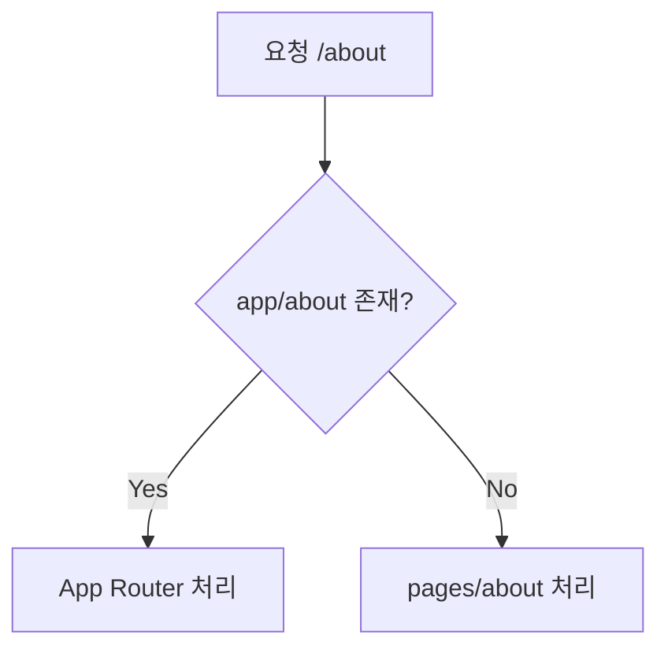

**Next.js 15 / React 19 기준**

#### 요약
Next.js 15는 `pages/` 기반의 **기존 Pages Router**를 여전히 지원하며,  
`app/` 기반 **App Router**와 공존할 수 있다.  
기존 프로젝트를 App Router로 점진적으로 이전할 수 있는 **하이브리드 구조**를 제공한다.

- Pages Router(`pages/`)는 여전히 완전 지원됨  
- App Router(`app/`)와 병행 운영 가능  
- 점진적 마이그레이션 전략: 병렬 폴더 구조  
- API Routes → Route Handlers로 전환  
- getServerSideProps → Server Components로 이전  

> 요약 정리:  
> Next.js 15는 **기존 프로젝트의 안정성과 최신 기능의 공존**을 보장한다.  
> App Router로의 이전은 강제되지 않으며, 필요 시 혼합 운용이 가능하다.

> **정리:**
>
> * 기존 코드는 유지하면서 새 기능을 도입 가능
> * getServerSideProps → RSC 기반 fetch로 이전
> * pages/api → app/api/route.ts 구조로 점진 전환
>
> 즉, App Router는 Next.js 15의 미래지만,
> Pages Router는 여전히 완전히 유효한 현재이다.

##### 참고자료  
- [Migrating from Pages to App Router](https://nextjs.org/docs/app/building-your-application/upgrading/app-router-migration)  
- [Pages Router Legacy Docs](https://nextjs.org/docs/pages/building-your-application/routing)  
- [Data Fetching (getServerSideProps)](https://nextjs.org/docs/pages/building-your-application/data-fetching)  
- [App Router Overview](../01-foundations/01-what-is-nextjs.md)  
- [Routing 구조 비교](../02-routing/2.routing.md)

---

#### 1. Pages Router란?

Pages Router는 Next.js 12 이하에서 사용되던  
**파일 기반 라우팅 구조의 초기 버전**이다.  
`pages/` 폴더의 파일이 자동으로 라우트로 변환된다.

```text
pages/
  index.tsx       → "/"
  about.tsx       → "/about"
  blog/[slug].tsx → "/blog/:slug"
````

##### 주요 특징

| 기능                           | 설명                          |
| ---------------------------- | --------------------------- |
| **자동 라우팅**                   | 파일 경로 기반 URL 생성             |
| **API Routes**               | `/pages/api/*` 경로에 서버 함수 작성 |
| **getServerSideProps**       | SSR 데이터 패칭                  |
| **getStaticProps**           | SSG 정적 생성                   |
| **_app.tsx / _document.tsx** | 전역 레이아웃 관리                  |

---

#### 2. App Router와의 차이점

| 구분        | Pages Router                           | App Router                              |
| --------- | -------------------------------------- | --------------------------------------- |
| 디렉터리      | `pages/`                               | `app/`                                  |
| 렌더링 방식    | CSR/SSR                                | RSC(React Server Components)            |
| 데이터 패칭    | `getServerSideProps`, `getStaticProps` | `fetch`, `revalidate`, `Server Actions` |
| 라우트 중첩    | 불가능                                    | ✅ 중첩 Layout 지원                          |
| SEO 메타데이터 | `next/head`                            | `metadata` API                          |
| 스트리밍      | ❌ 미지원                                  | ✅ 지원                                    |

> App Router는 서버 렌더링과 컴포넌트 계층화를 완전 통합했으며,
> 기존 Pages 구조는 단일 페이지 중심으로 유지된다.

---

#### 3. 공존(병행) 구조

Next.js 15에서는 두 라우터를 함께 사용할 수 있다.

```text
project-root/
├─ app/
│  └─ page.tsx              # App Router
├─ pages/
│  └─ legacy.tsx            # Pages Router
└─ next.config.js
```

##### 라우팅 우선순위

* `app/`이 존재하면 App Router가 우선된다.
* `pages/`의 경로가 중복될 경우, App Router 라우트가 먼저 매칭된다.
* `/api/*` 경로는 Pages Router의 API Route로 계속 동작 가능.



---

#### 4. 점진적 마이그레이션 전략

1️⃣ **병렬 구조 유지**

* 기존 `pages/` 유지, 신규 기능은 `app/`에 추가
* UI와 API를 점진적으로 이동

2️⃣ **데이터 로직 이전**

* `getServerSideProps` → `fetch()` (서버 컴포넌트 내부 호출)
* `getStaticProps` → `revalidate` 속성 기반 ISR 전환

```tsx
// before
export async function getServerSideProps() {
  const res = await fetch("https://api.example.com/data");
  return { props: { data: await res.json() } };
}

// after
export default async function Page() {
  const data = await fetch("https://api.example.com/data", { cache: "no-store" }).then(r => r.json());
  return <div>{data.title}</div>;
}
```

3️⃣ **API Routes → Route Handlers**

* `/pages/api/*` → `/app/api/*/route.ts` 로 구조 변경
* Web Fetch API를 기반으로 Request/Response 사용

4️⃣ **공통 레이아웃 이전**

* `_app.tsx` → `app/layout.tsx`
* `_document.tsx`의 `<html>`, `<body>` 구조를 layout.tsx로 통합

---

#### 5. 마이그레이션 체크리스트

| 항목         | Pages Router             | App Router 전환           |
| ---------- | ------------------------ | ----------------------- |
| 데이터 패칭     | getServerSideProps       | fetch/revalidate        |
| API Routes | pages/api                | app/api/route.ts        |
| 전역 레이아웃    | _app.tsx / _document.tsx | layout.tsx              |
| SEO        | next/head                | metadata API            |
| Error 처리   | _error.tsx               | error.tsx / GlobalError |
| 동적 라우팅     | [slug].tsx               | [slug]/page.tsx         |

> 전환은 페이지 단위로 이루어지므로,
> 전체 마이그레이션 없이도 점진적 개선이 가능하다.

---

#### 6. 호환성 주의사항

* `getInitialProps`는 App Router에서 더 이상 지원되지 않는다.
* `_middleware.ts`는 `middleware.ts`로 통합된다.
* `next/head`는 `metadata` API로 대체된다.
* `Link` 컴포넌트는 동일하게 사용 가능 (`next/link` 유지).

---

#### 7. 결론

Next.js 15는 **Pages Router의 안정성과 App Router의 혁신성을 동시에 유지**한다.
대규모 서비스는 “핵심 경로만 App Router로 이전”하는 하이브리드 구조를 많이 사용한다.

