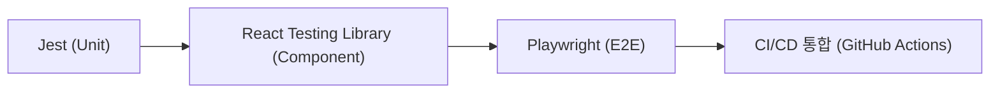

**Next.js 15 / React 19 기준**

#### 요약
Next.js는 **유닛 테스트(Jest)**, **E2E 테스트(Playwright)**,  
**접근성(a11y) 검사**를 통합한 품질 관리 체계를 지원한다.  
React 19의 서버 컴포넌트 환경에서도 테스트 가능하며,  
CI/CD와 연동해 자동 품질 검증을 수행할 수 있다.

- Jest 기반 유닛 테스트 및 컴포넌트 테스트  
- Playwright 기반 브라우저 시뮬레이션 E2E 테스트  
- a11y (Accessibility) 체크리스트 및 자동 분석 도구  
- CI 파이프라인에 테스트 단계 통합  
- 서버/클라이언트 양쪽 테스트 호환  

> 요약 정리:  
> Next.js의 품질 관리 핵심은 **테스트를 코드 수준에 통합**하고,  
> **접근성을 배포 전 자동 검증**하는 것이다.
> * Jest → 로직/컴포넌트 수준 검증
> * Playwright → 사용자 시나리오 검증
> * axe-core → 접근성 검증
> 이 세 가지를 결합하면 “테스트 가능한 UI”를 구축할 수 있다.

##### 참고자료  
- [Testing Next.js Apps](https://nextjs.org/docs/app/building-your-application/testing)  
- [Jest 공식 문서](https://jestjs.io/docs/getting-started)  
- [Playwright 공식 문서](https://playwright.dev/)  
- [axe-core 접근성 검사](https://github.com/dequelabs/axe-core)  
- [GitHub Actions CI 통합](https://docs.github.com/en/actions)

---

#### 1. 테스트 개요

Next.js 프로젝트의 테스트는 크게 3단계로 구성된다.

| 구분 | 도구 | 설명 |
|------|------|------|
| **유닛 테스트(Unit)** | Jest | 함수·로직 검증 |
| **컴포넌트 테스트(Component)** | Jest + @testing-library/react | UI 단위 테스트 |
| **E2E 테스트(End-to-End)** | Playwright | 전체 사용자 시나리오 테스트 |



---

#### 2. Jest 설정 (유닛/컴포넌트 테스트)

##### 설치

```bash
npm install -D jest @testing-library/react @testing-library/jest-dom ts-jest
```

##### 구성 파일 `jest.config.js`

```js
module.exports = {
  testEnvironment: "jsdom",
  transform: { "^.+\\.(t|j)sx?$": "ts-jest" },
  moduleNameMapper: { "^@/(.*)$": "<rootDir>/$1" },
  setupFilesAfterEnv: ["<rootDir>/jest.setup.js"],
};
```

##### 예시 테스트

```tsx
// components/Button.test.tsx
import { render, screen, fireEvent } from "@testing-library/react";
import { Button } from "./Button";

test("버튼 클릭 이벤트 동작 확인", () => {
  render(<Button label="확인" />);
  const button = screen.getByText("확인");
  fireEvent.click(button);
  expect(button).toBeInTheDocument();
});
```

##### `jest.setup.js`

```js
import "@testing-library/jest-dom";
```

> Jest는 `jsdom` 환경을 사용하므로, 브라우저 기반 동작을 모의(mock)할 수 있다.

---

#### 3. Playwright 설정 (E2E 테스트)

##### 설치

```bash
npm install -D playwright @playwright/test
npx playwright install
```

##### 기본 설정 (`playwright.config.ts`)

```ts
import { defineConfig } from "@playwright/test";

export default defineConfig({
  testDir: "./e2e",
  use: {
    headless: true,
    baseURL: "http://localhost:3000",
  },
});
```

##### 테스트 예시 (`e2e/login.spec.ts`)

```ts
import { test, expect } from "@playwright/test";

test("로그인 페이지 렌더링 확인", async ({ page }) => {
  await page.goto("/login");
  await expect(page.getByRole("heading", { name: "로그인" })).toBeVisible();
});
```

| 항목            | 설명              |
| ------------- | --------------- |
| `page.goto()` | 특정 경로로 이동       |
| `getByRole()` | 접근성 역할 기반 요소 탐색 |
| `expect()`    | UI 상태 검증        |

> Playwright는 실제 브라우저(Chromium, WebKit, Firefox)를 사용하므로
> 사용자 환경과 거의 동일한 시뮬레이션이 가능하다.

---

#### 4. 접근성(a11y) 검사

##### 자동 검사 도구: axe-core

```bash
npm install -D axe-core @axe-core/playwright
```

```ts
// e2e/accessibility.spec.ts
import { test } from "@playwright/test";
import { analyzeAccessibility } from "@axe-core/playwright";

test("홈페이지 접근성 검사", async ({ page }) => {
  await page.goto("/");
  const results = await analyzeAccessibility(page);
  console.log(results.violations);
});
```

##### 주요 체크 항목

| 항목                      | 설명             |
| ----------------------- | -------------- |
| **대체 텍스트(alt)**         | 이미지에 설명 텍스트 제공 |
| **명확한 대비(contrast)**    | 텍스트와 배경 명암비    |
| **포커스 순서(focus order)** | Tab 이동 순서 논리적  |
| **aria-label 사용**       | 스크린리더 접근성 개선   |

> 접근성은 테스트 자동화뿐 아니라 디자인·개발 전 과정에서 고려되어야 한다.

---

#### 5. CI/CD 통합

GitHub Actions 예시 (`.github/workflows/test.yml`)

```yaml
name: Run Tests
on: [push, pull_request]

jobs:
  test:
    runs-on: ubuntu-latest
    steps:
      - uses: actions/checkout@v3
      - uses: actions/setup-node@v4
        with:
          node-version: 20
      - run: npm ci
      - run: npm run test
      - run: npx playwright test
```

> 배포 전에 테스트 단계가 실패하면,
> Next.js 빌드(`next build`)가 중단되어 품질 저하를 방지한다.

---

#### 6. 품질 지표 요약

| 항목          | 도구             | 측정 기준           |
| ----------- | -------------- | --------------- |
| **유닛 안정성**  | Jest           | 함수/컴포넌트 커버리지    |
| **E2E 정확성** | Playwright     | UI 시나리오 성공률     |
| **접근성**     | axe-core       | WCAG 2.1 AA 준수율 |
| **CI 통합**   | GitHub Actions | 테스트 자동화율        |

---

#### 7. 결론

Next.js 15의 테스트 및 품질 관리 체계는 **React 컴포넌트 기반 검증 → 브라우저 시뮬레이션 → 접근성 분석**까지 완전 자동화된다.
테스트는 단순히 코드 안정성뿐 아니라 **UX 품질 보증의 핵심 프로세스**로 작동한다.
