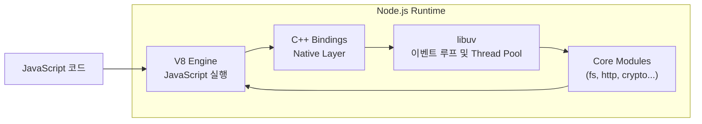
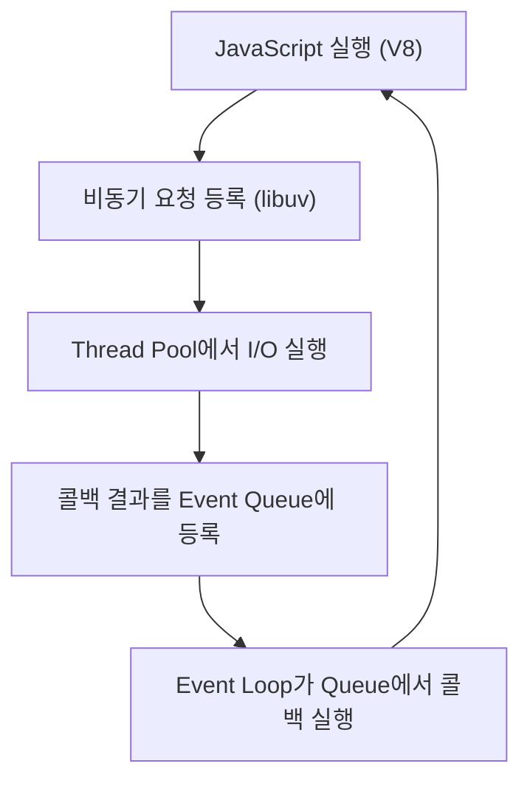

#### 요약
> Node.js는 **V8 엔진**, **libuv**, **Bindings**, **Core Modules**로 구성되며,  
> 이벤트 루프와 스레드풀을 통해 단일 스레드 환경에서도 병렬 I/O 처리를 수행한다.

- 런타임 내부 구조: V8 + libuv + Bindings
- 이벤트 루프(Event Loop) 기반 비동기 처리
- libuv Thread Pool을 통한 병렬 I/O
- Core Module을 통한 파일·네트워크 접근

##### 참고자료
- [Node.js 공식 아키텍처 문서](https://nodejs.org/en/learn/getting-started/the-nodejs-runtime-environment)
- [libuv Design Doc](https://docs.libuv.org/en/v1.x/design.html)

---

#### 1. Node.js 내부 구성 요소

Node.js 런타임은 다음 네 가지 핵심 구성으로 이루어져 있다.

| 구성 요소 | 설명 |
|------------|------|
| **V8 Engine** | JS를 기계어로 컴파일하고 실행하는 엔진 |
| **libuv** | 이벤트 루프, 스레드풀, 비동기 I/O 처리 담당 |
| **Bindings (C++ API)** | JS와 C/C++ 시스템 콜을 연결하는 인터페이스 |
| **Core Modules** | `fs`, `http`, `net`, `events` 등 Node 표준 모듈 |



> **요약:**
> V8은 JS 코드를 실행하고, libuv는 비동기 작업을 관리한다.
> 두 계층 사이를 Bindings가 연결하며, Core Modules이 시스템 자원에 접근한다.

---

#### 2. 이벤트 루프와 스레드풀의 관계

Node.js의 이벤트 루프는 모든 비동기 요청을 관리하는 핵심 메커니즘이다.
실제 I/O 연산은 libuv의 **Thread Pool(기본 4개 스레드)** 에서 병렬로 처리된다.

| 구성 요소              | 역할                     | 스레드                          |
| ------------------ | ---------------------- | ---------------------------- |
| **Main Thread**    | 이벤트 루프 실행, JS 코드 실행    | 1개                           |
| **Thread Pool**    | 파일 I/O, DNS, 암호화 등 처리  | 기본 4개 (`UV_THREADPOOL_SIZE`) |
| **Worker Threads** | 개발자가 직접 생성하는 병렬 처리 스레드 | 필요 시 확장 가능                   |

```bash
# Thread Pool 크기 조정 (기본 4 → 8)
$ export UV_THREADPOOL_SIZE=8
```

> Node.js는 싱글 스레드이지만, I/O 처리는 Thread Pool을 통해 병렬 수행된다.
> 따라서 “싱글 스레드”는 **JS 코드 실행 스레드가 하나뿐임**을 의미한다.

---

#### 3. 실행 흐름 (Event Loop Cycle)

Node.js의 실행 순서는 다음과 같다.

1. **JS 코드 파싱 및 실행 (V8)**
2. **비동기 요청(libuv에 등록)**
3. **I/O 완료 후 콜백 큐 등록**
4. **이벤트 루프가 큐의 콜백 실행**
5. **모든 큐가 비면 프로세스 종료**



> 이벤트 루프는 `poll`, `check`, `close`, `timer`, `microtask` 등의 단계로 구분된다.
> 각 단계마다 등록된 작업이 순차적으로 처리된다.

---

#### 4. Node.js의 실행 단계별 상세 동작

| 단계                   | 설명                             | 예시             |
| -------------------- | ------------------------------ | -------------- |
| **1. Timer Phase**   | `setTimeout`, `setInterval` 실행 | 지연된 작업 처리      |
| **2. I/O Callbacks** | 완료된 I/O 콜백 실행                  | 파일/네트워크 I/O    |
| **3. Idle, Prepare** | 내부 준비 단계                       | libuv 내부용      |
| **4. Poll Phase**    | 새로운 I/O 이벤트 대기                 | 비동기 요청 등록      |
| **5. Check Phase**   | `setImmediate` 콜백 실행           | I/O 완료 후 즉시 실행 |
| **6. Close Phase**   | `socket.on('close')` 등 종료 처리   | 리소스 정리         |

> **Microtask Queue (Promise 등)** 은 각 단계 사이마다 실행된다.
> 즉, 모든 Macrotask 이후에 Microtask가 실행된다.

---

#### 5. Core Modules의 역할

Node.js의 **Core Modules**은 OS 자원 접근을 위한 표준 API 집합이다.

| 모듈               | 기능              |
| ---------------- | --------------- |
| `fs`             | 파일 입출력          |
| `http` / `https` | 웹 서버/클라이언트 통신   |
| `crypto`         | 암호화 및 해시        |
| `os`             | 운영체제 정보         |
| `path`           | 경로 조작           |
| `events`         | 커스텀 이벤트 생성 및 처리 |

```js
// fs 모듈 예시
const fs = require('fs');
fs.readFile('README.md', 'utf8', (err, data) => {
  if (err) throw err;
  console.log(data);
});
```

> Core Modules는 Node.js 실행 환경의 기반으로,
> 외부 라이브러리 없이도 OS 수준의 처리를 가능하게 한다.

---

#### 6. Node.js의 내부 처리 특징

* 이벤트 루프는 **하나의 메인 스레드**에서 동작하지만
  내부 Thread Pool을 통해 병렬 처리를 수행한다.
* 대부분의 비동기 API (`fs`, `dns`, `crypto`)는 libuv를 사용한다.
* 네트워크 소켓 I/O는 **non-blocking epoll/kqueue** 메커니즘 기반이다.
* 고성능 서버는 CPU Core당 하나의 Node 프로세스를 할당하는 구조(`cluster`, `PM2`)를 사용한다.

---

#### 7. 결론

Node.js는 단일 스레드의 단순함과, 내부 libuv를 통한 병렬 I/O 구조를 결합한 효율적인 런타임이다.
V8, libuv, 이벤트 루프의 상호작용을 이해하는 것은
성능 최적화, 병렬 처리, 비동기 설계의 핵심 출발점이다.