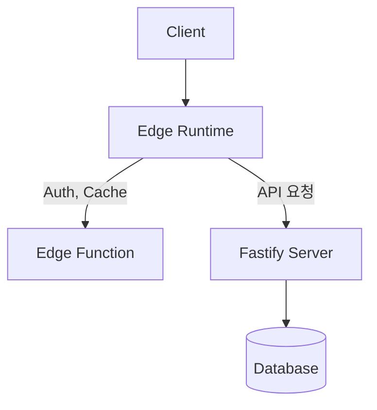

#### 요약
> Fastify는 Express 대비 최대 2배 이상 빠른 처리 성능을 제공하는 경량 서버 프레임워크이며,  
> Edge Runtime은 서버리스(Serverless)와 글로벌 분산 환경에 특화된 런타임이다.  
> 두 기술 모두 **저지연·고효율 웹 서비스**를 목표로 한다.

- Fastify = 고속 비동기 HTTP 서버 (Express의 대체 프레임워크)
- Edge Runtime = 클라우드 엣지(Edge Location)에서 실행되는 JS 런타임
- 둘 다 비동기 이벤트 루프 기반이지만 목적이 다름
- Fastify → Node.js 서버용 / Edge → 글로벌 분산용

##### 참고자료
- [Fastify 공식 문서](https://fastify.dev/)
- [Cloudflare Workers Docs](https://developers.cloudflare.com/workers/)
- [Vercel Edge Functions Docs](https://vercel.com/docs/functions/edge-functions)

---

#### 1. Fastify란?

Fastify는 **비동기 I/O에 최적화된 고성능 Node.js 프레임워크**로,  
Express보다 구조적이며 JSON 처리 속도가 빠르다.

| 항목 | Express | Fastify |
|------|----------|----------|
| 처리 속도 | 보통 | 매우 빠름 |
| 미들웨어 | 단일 체인 구조 | Hook 기반 단계적 구조 |
| 요청 스키마 | 선택적 | 내장 JSON Schema 검증 |
| 플러그인 구조 | 제한적 | 완전한 플러그인 시스템 |
| TypeScript 지원 | 중간 | 기본 통합 |

##### 설치
```bash
$ npm install fastify
````

##### 기본 예시

```js
import Fastify from 'fastify';
const app = Fastify();

app.get('/', async (req, reply) => {
  return { message: 'Hello Fastify!' };
});

app.listen({ port: 3000 }, (err) => {
  if (err) throw err;
  console.log('🚀 Fastify server running on http://localhost:3000');
});
```

---

#### 2. Fastify의 구조적 특징

Fastify는 **Hook 기반 라이프사이클**로 요청-응답을 처리한다.


| 단계              | 설명          |
| --------------- | ----------- |
| `onRequest`     | 요청 수신 시 실행  |
| `preValidation` | 요청 스키마 검증 전 |
| `preHandler`    | 라우트 로직 실행 전 |
| `onSend`        | 응답 전 데이터 조작 |
| `onResponse`    | 요청 종료 후 실행  |

##### 요청 검증 예시

```js
app.post('/user', {
  schema: {
    body: {
      type: 'object',
      required: ['name', 'email'],
      properties: {
        name: { type: 'string' },
        email: { type: 'string', format: 'email' }
      }
    }
  }
}, async (req, reply) => {
  return { success: true, data: req.body };
});
```

---

#### 3. Fastify의 장점

| 구분                | 설명                              |
| ----------------- | ------------------------------- |
| **성능**            | Express 대비 요청 처리 속도 약 1.5~2배 향상 |
| **플러그인 시스템**      | 인증, 로깅, 캐시 등을 모듈화 가능            |
| **스키마 기반 API 검증** | JSON Schema 자동 검증 지원            |
| **내장 로거**         | Pino 로거를 기본 제공                  |
| **TS 친화적**        | 타입 정의 내장 (`@types/fastify` 불필요) |

##### 로깅 예시

```js
const app = Fastify({ logger: true });
app.get('/', async () => ({ ok: true }));
```

---

#### 4. Express vs Fastify 성능 비교

| 항목               | Express  | Fastify       |
| ---------------- | -------- | ------------- |
| 요청 처리량 (req/sec) | 약 25,000 | 약 50,000      |
| JSON 직렬화 속도      | 느림       | 빠름            |
| 초기 로드            | 빠름       | 매우 빠름         |
| 미들웨어 처리          | 순차 실행    | Hook 기반 단계 처리 |
| 메모리 사용량          | 높음       | 낮음            |

> **요약:** Fastify는 Express보다 속도, 메모리 효율, 확장성 면에서 우수하다.
> 반면, 생태계는 Express가 더 넓다.

---

#### 5. Edge Runtime 개요

Edge Runtime은 Node.js 대신 **경량 JavaScript 런타임(V8 Isolate 기반)** 에서
코드를 **글로벌 엣지 서버**에서 실행하는 방식이다.

| 항목      | Node.js            | Edge Runtime                    |
| ------- | ------------------ | ------------------------------- |
| 실행 위치   | 중앙 서버              | CDN Edge 서버                     |
| 부팅 시간   | 수백 ms              | 수 ms                            |
| 목적      | 장기 실행 서버           | 초저지연 요청 처리                      |
| 런타임 API | fs, net 등 로컬 접근 가능 | 제한된 Web API 중심                  |
| 예시 환경   | AWS EC2, GCP VM    | Cloudflare Workers, Vercel Edge |

##### 코드 예시 (Vercel Edge)

```js
export const config = {
  runtime: 'edge',
};

export default async function handler(req) {
  return new Response(JSON.stringify({ msg: 'Hello from Edge!' }), {
    headers: { 'Content-Type': 'application/json' },
  });
}
```

> 💡 **Tip:**
> Edge Runtime은 **파일 시스템 접근이 불가능**하며,
> 대부분의 API는 `fetch`, `crypto.subtle`, `Request`, `Response` 와 같은 **Web 표준 API**로 제한된다.

---

#### 6. Fastify와 Edge 통합 전략

Edge는 짧은 수명(Lifetime) 환경이므로, Fastify 서버를 그대로 배포할 수는 없다.
하지만 Fastify의 API 설계를 Edge에서 재활용할 수 있다.

| 환경                | 런타임        | 특징            | 사용 예시                 |
| ----------------- | ---------- | ------------- | --------------------- |
| **Fastify**       | Node.js    | 지속 실행, 고성능 서버 | API Gateway, 백엔드 서버   |
| **Edge Function** | V8 Isolate | 초저지연 요청 처리    | Auth, A/B Testing, 캐싱 |

##### 통합 예시 (Fastify + Edge)

* Fastify 서버: `/api/v1/*`
* Edge Function: `/auth/*`, `/cache/*`



---

#### 7. 운영 및 배포 고려사항

| 항목      | Fastify             | Edge Runtime                  |
| ------- | ------------------- | ----------------------------- |
| 배포 환경   | Docker / VM         | CDN Edge (Vercel, Cloudflare) |
| 실행 지속시간 | 장기                  | 단기 (초 단위)                     |
| 초기 부팅   | 일반                  | 즉시 (Cold Start 최소화)           |
| 로깅      | Pino / Winston      | 제한적                           |
| 확장성     | 수평 확장 (PM2/Cluster) | 자동 글로벌 분산                     |

> **결론:**
> Fastify는 백엔드 API 서버에 적합하고,
> Edge는 인증·캐시·경량 로직 같은 **초경량 분산 처리**에 이상적이다.

---

#### 8. 결론

Fastify는 Express의 대안이 아닌 **차세대 고성능 Node.js 서버 프레임워크**이며,
Edge Runtime은 그 위의 **글로벌 저지연 실행 계층**이다.
두 기술을 조합하면 **“중앙 집중 + 분산 처리”** 구조의 하이브리드 아키텍처를 구현할 수 있다.

> 즉, **Fastify = Core API 서버 / Edge = 즉시 응답 계층**
> 이 조합은 2025년 이후 Node.js 기반 인프라의 표준 패턴이 될 것이다.

```

