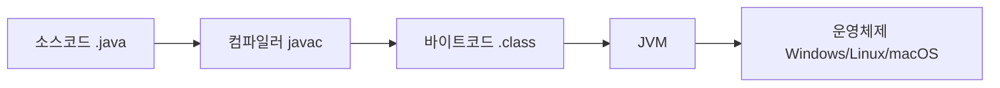
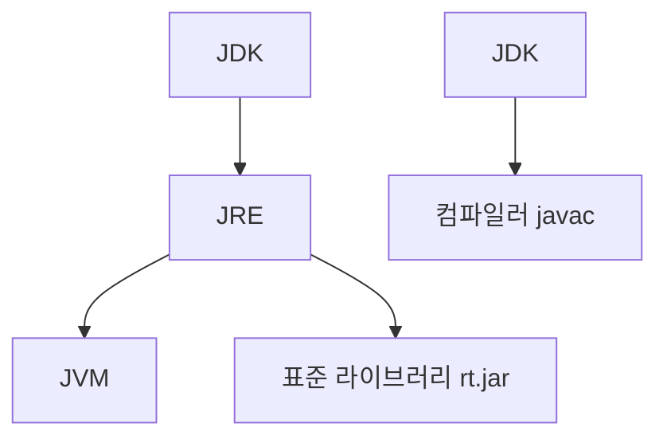

#### 요약

Java는 **객체지향 프로그래밍(OOP)** 언어이자 **플랫폼 독립적(Platform Independent)** 실행 환경을 제공하는 범용 언어이다.  
JVM(Java Virtual Machine)을 통해 다양한 OS에서 동일한 코드 실행이 가능하며, 풍부한 라이브러리와 강력한 생태계를 기반으로 **대규모 서버, 백엔드, 클라우드, 안드로이드, AI 플랫폼**까지 폭넓게 사용된다.  

**핵심 요약**
1. Java는 **“Write Once, Run Anywhere”** 철학을 가진 플랫폼 독립적 언어다.  
2. **JDK / JRE / JVM** 구조를 통해 컴파일과 실행이 분리된다.  
3. **Garbage Collector**로 메모리를 자동 관리한다.  
4. **멀티스레드 및 보안성**이 강점이다.  
5. **Java 21** 기준, Virtual Thread / Record / Sealed Class 등 현대적 기능이 추가되었다.  

Java는 30년 넘게 검증된 안정성과 풍부한 생태계를 갖춘 언어로,
**백엔드 개발자에게 가장 실무 친화적인 기반 언어**로 평가된다.
JVM을 중심으로 Kotlin, Scala, Groovy 같은 다양한 언어가 함께 발전하며,
Java는 여전히 **“엔터프라이즈 소프트웨어의 중심축”**으로 존재한다.

##### 참고자료
- [Oracle Java 공식 문서](https://docs.oracle.com/en/java/)
- [OpenJDK 프로젝트](https://openjdk.org/)
- [Java Language Specification](https://docs.oracle.com/javase/specs/)

---

#### 1. Java란 무엇인가?

Java는 1995년 Sun Microsystems(현 Oracle)에 의해 개발된 객체지향 언어이다.  
컴파일된 `.class` 파일이 **JVM** 위에서 실행되므로, 운영체제에 종속되지 않는다.

> 💡 즉, Java는 "컴파일 언어"와 "인터프리터 언어"의 장점을 모두 갖춘 **하이브리드 언어**다.

---

#### 2. Java의 핵심 특징

| 구분                | 설명                                                            |
| ----------------- | ------------------------------------------------------------- |
| **플랫폼 독립성**       | JVM 덕분에 OS와 상관없이 실행 가능                                        |
| **객체지향성(OOP)**    | 캡슐화, 상속, 다형성 등으로 구조적 개발 가능                                    |
| **자동 메모리 관리(GC)** | Garbage Collector로 메모리 누수 방지                                  |
| **멀티스레드 지원**      | `Thread`, `ExecutorService`로 병렬 처리                            |
| **보안성(Security)** | 클래스 로더와 샌드박스로 안전한 실행 환경 제공                                    |
| **풍부한 API**       | `java.util`, `java.io`, `java.time`, `java.net` 등 표준 라이브러리 포함 |

---

#### 3. JVM, JRE, JDK의 관계

| 구성요소                               | 역할                         |
| ---------------------------------- | -------------------------- |
| **JVM (Java Virtual Machine)**     | 바이트코드를 실행하는 가상 머신          |
| **JRE (Java Runtime Environment)** | JVM + 표준 라이브러리             |
| **JDK (Java Development Kit)**     | JRE + 개발 도구 (javac, jar 등) |

> ⚙️ **개발자는 JDK를 설치하고, 배포 환경에는 JRE만 설치하면 충분하다.**

---

#### 4. Java 버전별 주요 변화

| 버전          | 주요 기능                            | 비고                     |
| ----------- | -------------------------------- | ---------------------- |
| **Java 8**  | Lambda, Stream, Optional         | 함수형 프로그래밍 도입           |
| **Java 11** | `var`, HTTP Client               | Modern Syntax          |
| **Java 17** | Record, Sealed Class             | LTS(Long-Term Support) |
| **Java 21** | Virtual Thread, Pattern Matching | 최신 동시성 모델              |

---

#### 5. Java의 활용 영역

* **백엔드 서버 개발**: Spring Boot, Micronaut, Quarkus
* **데이터 파이프라인**: Hadoop, Spark, Kafka
* **모바일 앱**: Android SDK
* **AI/ML 플랫폼 연동**: TensorFlow Java API, ONNX Runtime
* **클라우드 및 컨테이너**: Kubernetes Operator, Jenkins, ArgoCD Integration

> 🧩 Java는 단순한 언어를 넘어 **“엔터프라이즈 생태계의 표준 플랫폼”** 역할을 수행한다.

---

#### 6. Java의 미래와 생태계

* **LTS 주기:** Oracle은 2년 주기의 LTS(Long-Term Support) 버전을 제공.
* **OpenJDK 표준화:** 대부분의 기업이 OpenJDK 기반으로 전환 중.
* **경량화 트렌드:** GraalVM, Quarkus로 네이티브 실행속도 향상.
* **AI/LLM 통합:** Java API로 PyTorch/TensorFlow, Ollama, LangChain과 연동 가능.

---

