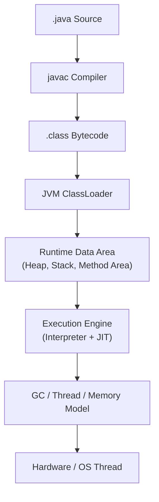
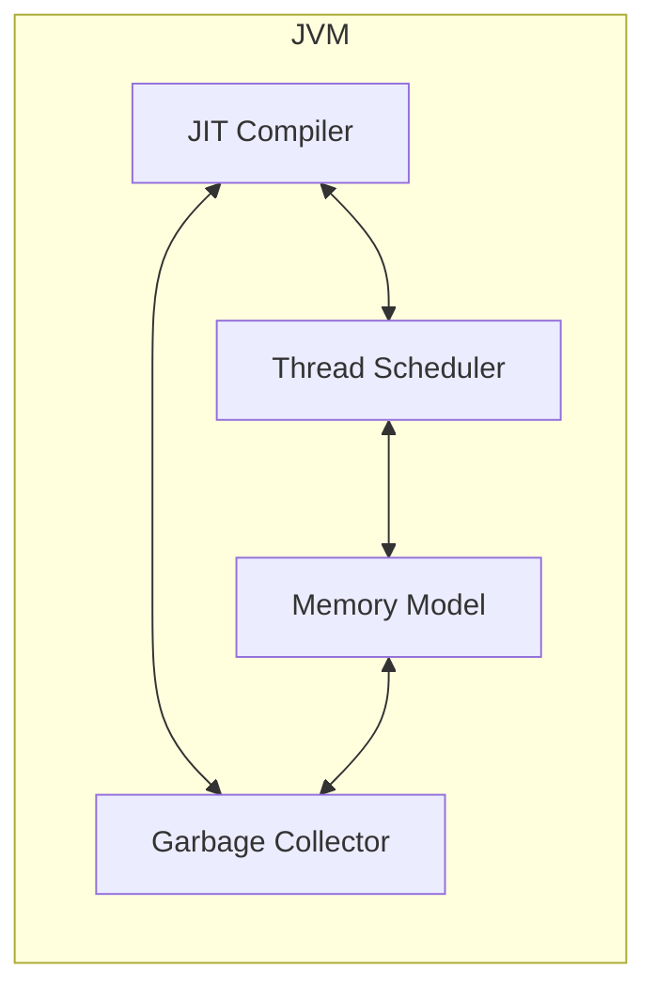
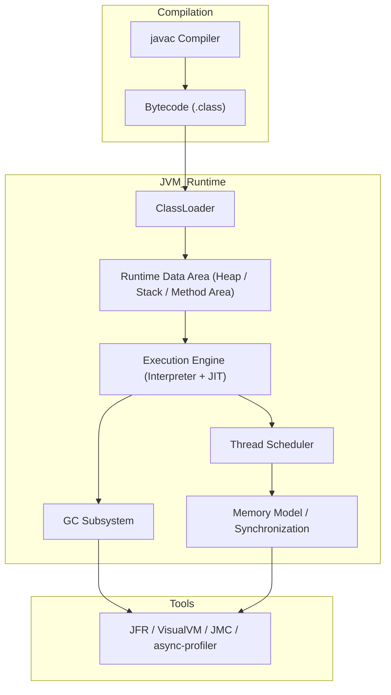

#### 요약

- Java Internals는 단순히 “언어 문법”이 아니라,  
  **JVM이라는 가상 실행 환경의 작동 원리**를 이해하는 학문이다.  
- 본 장에서는 JVM 내부의 핵심 구조를 다시 정리하고,  
  이를 기반으로 **성능·안정성·확장성**을 이해할 수 있는 학습 확장 방향을 제시한다.

**핵심 요약**
1. JVM은 “Class → Bytecode → Execution Engine → OS”로 이어지는 추상화 계층이다.  
2. GC, JIT, Memory Model, Concurrency는 모두 **하나의 일관된 실행 모델** 위에서 동작한다.  
3. 언어 내부를 이해하면, “성능 문제”도 “시스템 구조”도 스스로 해석할 수 있다.

> JVM의 내부를 이해한다는 것은,
> 단순히 자바를 잘 아는 것이 아니라
> **“언어가 하드웨어 위에서 어떻게 살아 움직이는가”** 를 이해하는 것이다.
>
> Java Internals는 코드와 머신 사이의 경계를 허무는 여정이며,
> 그 끝에는 **성능·안정성·확장성**의 통합적 시야가 있다.

#### 참고자료

* OpenJDK Docs — [HotSpot Internals](https://openjdk.org/groups/hotspot/)
* Oracle JFR / JMC — [Official Docs](https://docs.oracle.com/en/java/javase/17/jfapi/)

---

#### 1. 전체 구조 요약

> Java 실행의 핵심은 “**바이트코드의 해석 → JIT 컴파일 → GC 및 메모리 관리**”
> 이 모든 과정이 JVM 내부에서 일관된 흐름으로 동작한다.

---

#### 2. 상호 관계 개념 요약

| 관점                            | 핵심 상호 작용                       |
| ----------------------------- | ------------------------------ |
| **JVM ↔ OS**                  | Thread, Memory, IO 호출 관리       |
| **JIT ↔ GC**                  | 실행 최적화 중 발생하는 메모리 변동 처리        |
| **Thread ↔ JMM**              | 동시성 제어와 메모리 가시성 보장             |
| **Lock-Free ↔ CPU**           | CAS 명령을 통한 Non-blocking 동기화    |
| **Profiling ↔ JVM Internals** | 내부 이벤트(JIT, GC, Safepoint) 시각화 |

> JVM 내부의 모든 구성요소는 **동시 실행(concurrency)** 과 **동적 최적화(dynamic optimization)** 의 조합이다.

---

#### 3. Java Internals의 핵심 철학

| 철학                      | 설명                                       |
| ----------------------- | ---------------------------------------- |
| **추상화 (Abstraction)**   | OS/하드웨어를 감춘 “가상 머신” 계층                   |
| **일관성 (Consistency)**   | 메모리/스레드/타입 규칙의 통합된 실행 모델                 |
| **안정성 (Safety)**        | 예외, GC, 타입 검사로 인한 런타임 안정성                |
| **최적화 (Optimization)**  | 실행 중 학습 기반의 성능 향상 (JIT, Escape Analysis) |
| **투명성 (Observability)** | JFR, VisualVM 등으로 내부 동작 시각화 가능           |

> Java의 “Write Once, Run Anywhere”는 단순한 문장이 아니라,
> JVM 구조 전체가 이 철학을 구현하고 있음을 의미한다.

---

#### 4. 학습 확장 경로 (Next Steps)

| 단계                                 | 주제                        | 설명                     |
| ---------------------------------- | ------------------------- | ---------------------- |
| **1️⃣ JVM Deep Internals**         | HotSpot Source, Graal JIT | JVM 내부 코드와 IR 최적화 탐구   |
| **2️⃣ GC Algorithms**              | G1, ZGC, Shenandoah       | 동시/병렬 GC의 구조적 차이 이해    |
| **3️⃣ Concurrency Frameworks**     | Reactor, Akka, Loom       | JVM 스레드 모델의 확장 응용      |
| **4️⃣ Native Runtime Integration** | JNI, Panama Project       | Java ↔ Native 코드 상호 작용 |
| **5️⃣ Language Runtime 비교**        | JVM vs CPython vs V8      | 런타임 아키텍처 비교 및 설계 철학 분석 |

---

#### 5. JVM 이해의 실무적 가치

| 분야              | 적용 예시                                    |
| --------------- | ---------------------------------------- |
| **백엔드 시스템 개발자** | GC Pause, Thread Dump 해석 능력              |
| **성능 엔지니어**     | GC, JIT, 메모리 최적화의 상호 작용 이해               |
| **아키텍트 / 리서처**  | 언어 실행 모델, 런타임 설계 연구                      |
| **ML/LLM 엔지니어** | JVM 기반 모델 실행 성능 분석 (e.g. Deeplearning4j) |

> 내부 원리를 이해하는 개발자는 단순한 “사용자”를 넘어,
> **“언어와 시스템을 해석할 수 있는 설계자”** 가 된다.

---

#### 6. 종합 다이어그램 — Java Execution Map

---
