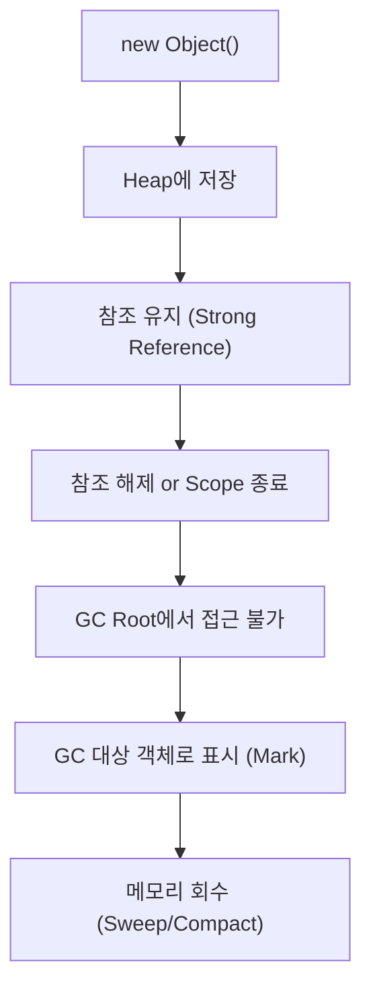
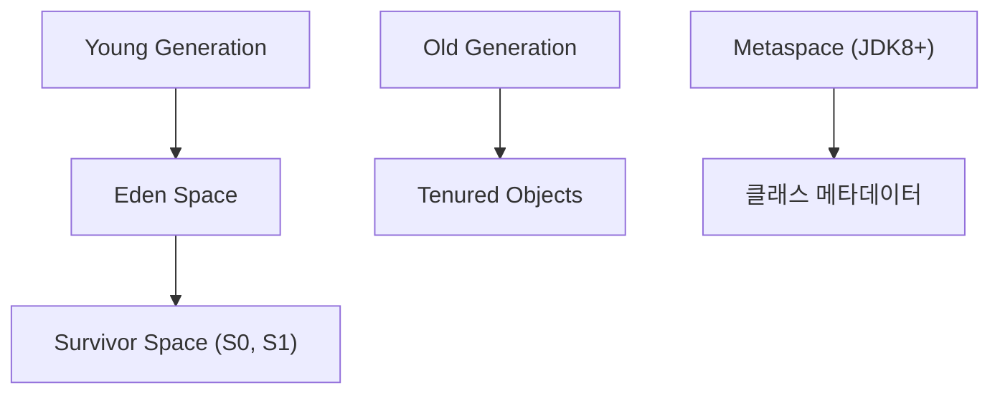
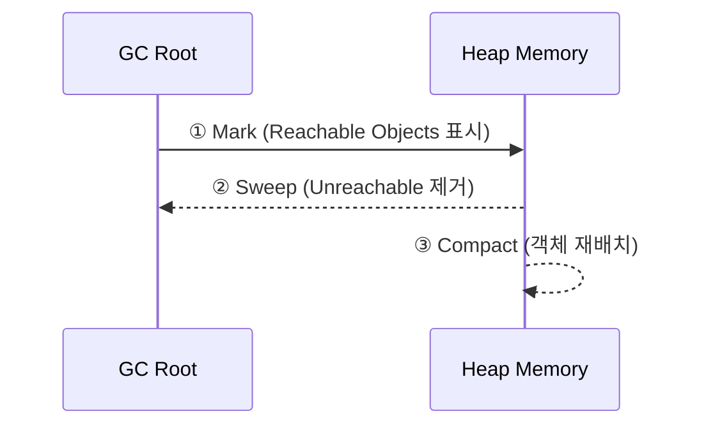
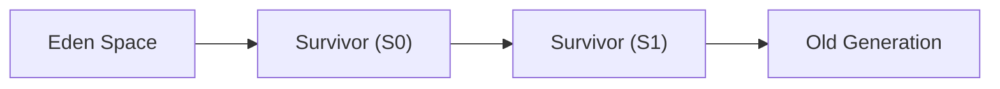
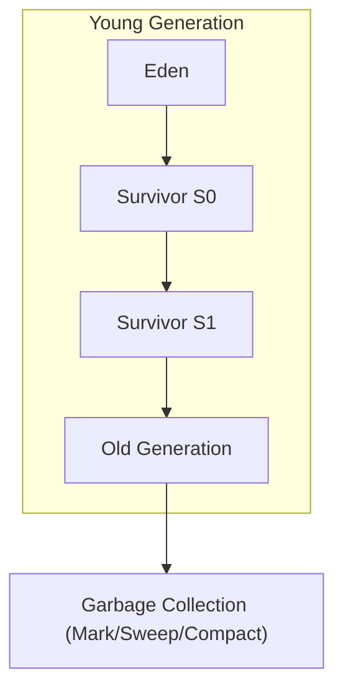

#### 요약

- Java의 메모리 관리는 **Garbage Collector(GC)** 가 자동으로 수행한다.  
- GC는 **더 이상 참조되지 않는 객체(garbage)** 를 식별하고 회수하여,  
  메모리 누수 없이 안정적인 실행 환경을 유지한다.  
- 본 장은 GC의 **기본 원리, 세대별 구조(Generational Heap), 주요 알고리즘** 을 다룬다.

**핵심 요약**
1. GC는 *객체의 생명주기*를 기반으로 불필요한 메모리를 자동 회수한다.  
2. Java Heap은 **Young / Old Generation** 으로 구분된다.  
3. GC는 “Mark → Sweep → Compact” 단계를 거쳐 객체를 정리한다.

| 구분         | 핵심 내용                    |
| ---------- | ------------------------ |
| **기본 원리**  | 참조되지 않는 객체 자동 회수         |
| **동작 순서**  | Mark → Sweep → Compact   |
| **메모리 구조** | Young / Old / Metaspace  |
| **중요 개념**  | GC Root, Promotion, STW  |
| **다음 주제**  | JIT Compiler의 최적화와 실행 효율 |


#### 참고자료

* Baeldung — [Guide to Java Garbage Collection](https://www.baeldung.com/java-garbage-collection)
* Red Hat — [Understanding G1 GC Internals](https://developers.redhat.com/articles/g1-garbage-collector)


---

#### 1. GC의 목적

| 항목 | 설명 |
|------|------|
| **자동 메모리 관리 (Automatic Memory Management)** | 개발자가 직접 `free()` 호출 없이 메모리 회수 |
| **메모리 누수 방지 (Memory Leak Prevention)** | 참조가 끊어진 객체를 탐색하여 제거 |
| **응용 프로그램 안정성 (Runtime Stability)** | OutOfMemoryError 방지, 예측 가능한 메모리 사용 유지 |

> GC는 단순한 “청소기”가 아니라, **프로그램의 안정성과 효율성**을 위한 핵심 동작이다.

---

#### 2. 객체의 생명주기

Java에서 객체는 Heap에 생성되고, **더 이상 참조되지 않을 때** GC 대상이 된다.



> GC는 참조 유무를 기준으로 하며, **객체 크기나 생성 시점은 직접적인 기준이 아니다.**

---

#### 3. GC Root (GC의 출발점)

GC는 **“어디서부터 도달 가능한 객체인가”** 를 판별하기 위해
**GC Root** 라는 기준점에서 시작한다.

| GC Root 유형             | 설명                        |
| ---------------------- | ------------------------- |
| **Stack Frame의 로컬 변수** | 현재 실행 중인 메서드의 지역 변수 참조    |
| **Static 변수**          | 클래스의 정적 필드                |
| **JNI 참조**             | 네이티브 코드(C/C++)에서 참조 중인 객체 |
| **Thread 객체**          | 실행 중인 각 스레드 인스턴스          |

> GC는 Root에서 **도달 가능한 객체(reachable)** 와
> **도달 불가능한 객체(unreachable)** 를 구분하여 후자를 제거한다.

---

#### 4. Generational Heap 구조

JVM은 객체의 **생명주기가 짧거나 긴 특성**에 따라 Heap을 구분한다.



| 영역                    | 주요 역할          | 설명                  |
| --------------------- | -------------- | ------------------- |
| **Eden**              | 새로 생성된 객체 저장   | 대부분의 객체는 이곳에서 생성됨   |
| **Survivor (S0, S1)** | GC 생존 객체 임시 이동 | Minor GC에서 교대 사용    |
| **Old Generation**    | 장기 생존 객체 저장    | 여러 번 GC 후에도 생존 시 이동 |
| **Metaspace**         | 클래스 메타데이터 저장   | JVM 메모리 외부(네이티브 영역) |

> 이 구조를 **Generational GC(세대별 GC)** 라고 한다.
> → 짧은 생명주기 객체는 Young GC, 긴 생명주기 객체는 Old GC가 처리한다.

---

#### 5. GC 주요 단계

GC는 일반적으로 다음 3단계를 반복한다.

| 단계          | 설명                            |
| ----------- | ----------------------------- |
| **Mark**    | GC Root로부터 접근 가능한 객체를 “활성” 표시 |
| **Sweep**   | 도달 불가능한 객체 제거                 |
| **Compact** | 메모리 단편화 해소(객체 재배치)            |



> 일부 GC 알고리즘(예: G1, ZGC)은 Compact 과정을 **병렬 또는 비차단(Concurrent)** 으로 수행한다.

---

#### 6. GC의 종류 (알고리즘별)

| GC 종류                | 특징             | 설명                         |
| -------------------- | -------------- | -------------------------- |
| **Serial GC**        | 단일 스레드, 단순 구조  | 단일 코어 환경에 적합               |
| **Parallel GC**      | 다중 스레드로 병렬 처리  | Throughput 중심              |
| **G1 GC**            | Region 단위 관리   | Pause time 예측 가능           |
| **ZGC / Shenandoah** | 초저지연(≤10ms) GC | 대용량 Heap 지원, Concurrent 수행 |

```plaintext
Serial  →  Parallel  →  G1  →  ZGC / Shenandoah
단순함     처리량↑        예측가능       지연↓
```

> 현대 JVM(17+)은 기본적으로 **G1 GC**를 사용한다.

---

#### 7. 객체 승격(Promotion) 과정

Young 영역에서 반복 GC 후에도 생존한 객체는 **Old Generation으로 이동**한다.

| 조건                                         | 동작                |
| ------------------------------------------ | ----------------- |
| Minor GC에서 생존 횟수(`age`) > 임계값(`Threshold`) | Survivor → Old 이동 |
| Survivor 공간 부족                             | 강제 Promotion      |
| Large Object (`>Threshold`)                | 즉시 Old 영역에 생성     |



> 이 과정을 **Promotion**이라 하며,
> Old 영역은 GC 비용이 크므로 *빈도는 낮지만 영향은 크다.*

---

#### 8. Stop-the-World (STW)

GC 수행 시 모든 애플리케이션 스레드가 일시 정지된다.

| 현상             | 원인                  | 영향                       |
| -------------- | ------------------- | ------------------------ |
| **STW 발생**     | GC Thread가 Heap을 스캔 | 응답 지연 증가                 |
| **Pause Time** | GC가 멈춘 시간(ms)       | G1, ZGC는 이 시간을 최소화하도록 설계 |

> STW는 GC 알고리즘의 성능을 판단하는 핵심 지표이다.
> 하지만 이 문서에서는 **튜닝이 아닌 메커니즘 이해**에 집중한다.

---

#### 9. GC 시각화 요약



---


