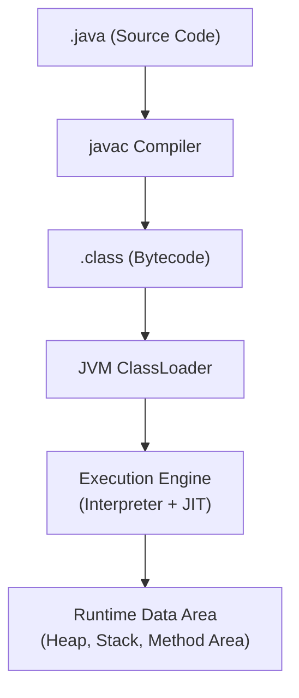
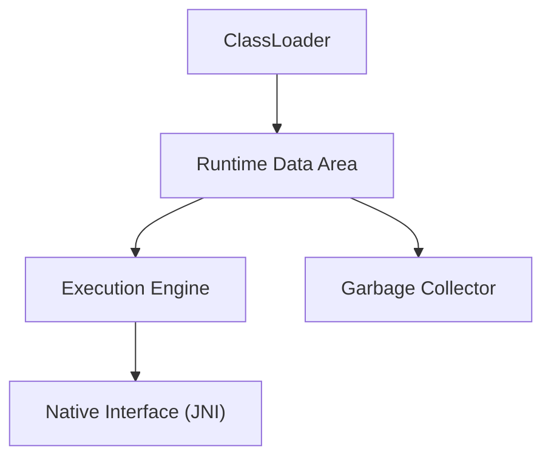

#### 요약

- Java는 **“한 번 작성하면 어디서나 실행된다 (Write Once, Run Anywhere)”** 는 개념을 중심으로,  
  하드웨어와 OS 위에 JVM이라는 **가상 실행 환경**을 두고 동작한다.  
- 본 장은 이후 심화 챕터(JVM, GC, Memory Model 등)를 위한  
  **언어 내부 구조와 실행 과정의 큰 그림**을 제공한다.

**핵심 요약**
1. Java 실행의 핵심은 **JVM 구조 (ClassLoader → Runtime Data Area → Execution Engine)**  
2. **GC, JIT, Thread, Memory Model**은 성능이 아닌 **언어 동작을 정의하는 핵심 메커니즘**  
3. Java 언어의 철학은 **안정성(Safety)** 과 **일관된 실행 모델(Consistency)** 에 있다.  

* Baeldung — [JVM Architecture Explained](https://www.baeldung.com/jvm-architecture)
* Red Hat — [Understanding the JVM](https://developers.redhat.com/articles/understanding-jvm)


---

#### 1. Java 실행의 전체 흐름

Java는 단순한 컴파일 언어도, 순수 인터프리터 언어도 아니다.  
**"Compile → Bytecode → Runtime Execution"** 이라는 3단계 구조로 동작한다.



> JVM은 바이트코드를 해석하거나, **JIT 컴파일러**를 통해 네이티브 코드로 변환해 실행한다.
> 이때 GC, Thread, Memory Model 등 여러 하위 모듈이 동시에 작동한다.

---

#### 2. JVM 내부 구성 요소 개요

| 구성 요소                      | 설명                         | 주요 역할                                 |
| -------------------------- | -------------------------- | ------------------------------------- |
| **ClassLoader**            | 클래스 로딩, 검증, 링크, 초기화        | `.class` 파일을 JVM 메모리에 적재              |
| **Runtime Data Area**      | 실행 중 데이터 저장 공간             | Stack, Heap, Method Area, PC Register |
| **Execution Engine**       | 명령어 실행 (Interpreter + JIT) | Bytecode → Native 변환 및 실행             |
| **Native Interface (JNI)** | Java ↔ Native 연결 계층        | OS API, C/C++ 호출 등                    |
| **Garbage Collector**      | 불필요 객체 자동 관리               | Heap 메모리 회수 및 관리                      |



---

#### 3. Java 메모리 구조 (Runtime Data Area)

| 구역                      | 설명             | 주요 데이터                   |
| ----------------------- | -------------- | ------------------------ |
| **Method Area**         | 클래스 메타데이터 저장   | 클래스 정보, 상수풀, static 변수   |
| **Heap**                | 객체 인스턴스 저장     | new로 생성된 객체, 배열          |
| **Stack**               | 각 쓰레드의 실행 컨텍스트 | 지역 변수, 호출 프레임, return 주소 |
| **PC Register**         | 현재 실행 명령어 주소   | Thread별 독립적              |
| **Native Method Stack** | JNI 호출 시 사용    | C/C++ 네이티브 코드 스택         |

> Stack은 스레드 단위, Heap은 모든 스레드가 공유한다.
> 따라서 동시성 제어(Thread Synchronization)는 Heap 접근에서 가장 중요하다.

---

#### 4. 컴파일 & 실행 모델

Java의 컴파일은 단순한 “소스 → 실행” 과정이 아니다.
JVM은 프로그램 실행 중에도 **동적 최적화(Dynamic Optimization)** 를 수행한다.

| 단계             | 설명                    | 도구 / 구성 요소        |
| -------------- | --------------------- | ----------------- |
| **1. 컴파일**     | `javac` → `.class` 생성 | Java Compiler     |
| **2. 로딩 & 링크** | JVM이 클래스 로드 및 검증      | ClassLoader       |
| **3. 실행(해석)**  | Bytecode를 한 줄씩 해석     | Interpreter       |
| **4. JIT 컴파일** | 반복 실행되는 코드 → 네이티브 변환  | JIT Compiler      |
| **5. GC 관리**   | 객체 생명주기 자동 관리         | Garbage Collector |

```plaintext
javac → bytecode → ClassLoader → Interpreter/JIT → 실행
```

> 이 동적 실행 구조가 Java를 “플랫폼 독립적이면서도 빠른 언어”로 만들어준다.

---

#### 5. 언어 설계 철학

| 개념                                  | 설명                                                |
| ----------------------------------- | ------------------------------------------------- |
| **안정성 (Safety)**                    | 메모리 접근, 타입 검사, 예외 처리를 언어 차원에서 보장                  |
| **일관성 (Consistency)**               | 플랫폼/OS와 무관하게 동일한 실행 결과                            |
| **가비지 관리 (Automatic GC)**           | 명시적 해제 대신 자동 메모리 회수                               |
| **멀티스레딩 내장 (Built-in Concurrency)** | `Thread`, `Executor` 등 표준 지원                      |
| **객체지향 통합 (OOP Integration)**       | Class, Interface, Inheritance, Polymorphism 완전 지원 |

---
