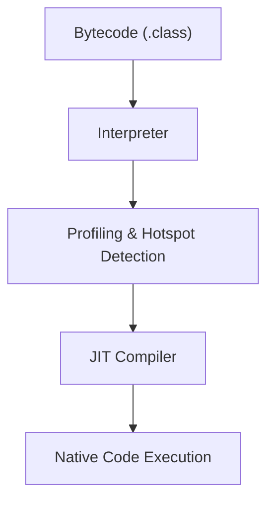
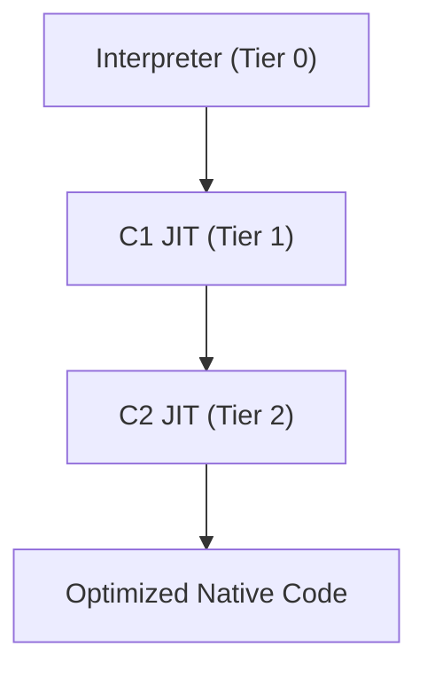

#### 요약

- **JIT(Just-In-Time) 컴파일러**는 자주 실행되는 코드를 **런타임에 네이티브 코드로 변환**하여 실행 속도를 높인다.  
- JIT은 JVM의 Interpreter와 협력하여 동작하며, 코드 실행 빈도에 따라 **Hot Code(핫스팟)** 를 식별해 컴파일한다.  
- 본 장은 JIT의 **Tiered Compilation 구조, 최적화 전략, Escape Analysis, Inlining** 등 핵심 메커니즘을 다룬다.

**핵심 요약**
1. JVM은 인터프리터로 시작하여, 반복 실행되는 코드를 JIT이 최적화해 네이티브 코드로 바꾼다.  
2. JIT의 주요 최적화: **Inlining / Escape Analysis / Loop Optimization / Dead Code Elimination**  
3. JIT은 “**실행 중 학습하는 컴파일러**” 로서, 코드의 실제 실행 패턴에 기반해 동적으로 성능을 향상시킨다.


| 항목         | 요약 내용                                                        |
| ---------- | ------------------------------------------------------------ |
| **기본 개념**  | JIT은 실행 중 반복 코드를 네이티브로 변환                                    |
| **핵심 구조**  | Tiered Compilation (Interpreter → C1 → C2)                   |
| **주요 최적화** | Inlining, Escape Analysis, Loop Unrolling, Dead Code Removal |
| **핵심 효과**  | 초기엔 느리지만, 장기 실행 시 C/C++ 수준 성능 달성                             |
| **다음 주제**  | Memory Model — 스레드 간 메모리 가시성과 Happens-Before 관계              |

---

#### 참고자료

* Oracle Docs — [Java HotSpot VM: JIT Compilation](https://docs.oracle.com/javase/8/docs/technotes/guides/vm/performance.html#jit)
* Baeldung — [Guide to JIT Compilation in Java](https://www.baeldung.com/java-jit-compiler)
* OpenJDK Wiki — [Graal JIT Compiler Project](https://openjdk.org/projects/graal/)


---

#### 1. JVM의 두 가지 실행 방식

| 구분 | 설명 | 특징 |
|------|------|------|
| **Interpreter** | Bytecode를 한 줄씩 해석하여 실행 | 초기 실행 속도 빠름, 반복 구문 느림 |
| **JIT Compiler** | 반복적으로 실행되는 코드를 네이티브 코드로 변환 | Warm-up 후 속도 비약적 향상 |



> **핵심 개념:**
> Java는 처음에는 느리지만, 실행이 반복될수록 **“학습된 최적화(runtime optimization)”** 로 빨라진다.

---

#### 2. Tiered Compilation 구조

JVM은 단일 JIT이 아닌, **C1 (Client) + C2 (Server)** 두 컴파일러를 혼합 운용한다.
이를 **Tiered Compilation** 이라고 한다.

| Tier       | 컴파일러            | 특징                 | 용도        |
| ---------- | --------------- | ------------------ | --------- |
| **Tier 0** | Interpreter     | 빠른 시작, 프로파일 수집     | 초기 실행     |
| **Tier 1** | C1 (Client) JIT | 가벼운 최적화            | 일반 애플리케이션 |
| **Tier 2** | C2 (Server) JIT | 고급 최적화, 인라이닝/루프 전개 | 장기 실행 서버  |



> Tiered Compilation은 “**빠른 시작 → 점진적 최적화**” 전략이다.
> 덕분에 JVM은 시작 속도와 장기 실행 성능을 모두 잡을 수 있다.

---

#### 3. HotSpot Detection (핫스팟 탐지)

JVM은 실행 중 **프로파일링 데이터를 수집**하여, 반복 호출되는 코드를 “핫스팟”으로 식별한다.

| 프로파일 데이터  | 설명                     |
| --------- | ---------------------- |
| 메서드 호출 횟수 | 호출 빈도 기반 Hot Method 탐지 |
| 루프 반복 횟수  | Hot Loop 탐지            |
| 분기 예측 패턴  | 조건 분기 최적화              |
| 객체 할당 정보  | Escape 여부 판단           |

> 특정 메서드 호출 횟수가 임계값(`-XX:CompileThreshold`)을 넘으면
> JIT이 해당 메서드를 네이티브 코드로 변환한다.

---

#### 4. 주요 최적화 기법

##### (1) **Inlining**

자주 호출되는 메서드를 호출부에 직접 삽입해 **함수 호출 오버헤드 제거**

```java
int add(int a, int b) { return a + b; }
int sum = add(3, 4); // 호출 → 인라인 변환 후: int sum = 3 + 4;
```

> 단, 너무 큰 메서드는 인라인 제외(`-XX:MaxInlineSize`).

---

##### (2) **Escape Analysis**

객체가 메서드 외부로 “탈출”하지 않으면, Heap 대신 Stack에 배치 가능.

```java
public void compute() {
    Point p = new Point(1, 2); // 메서드 내부 전용 객체
}
```

> 결과: `p`는 힙이 아닌 스택에 할당되어 **GC 부하 감소**
> 관련 옵션: `-XX:+DoEscapeAnalysis`, `-XX:+EliminateAllocations`

---

##### (3) **Loop Optimization**

루프 내 상수·불필요 연산 제거 및 Loop Unrolling 적용

```java
for (int i = 0; i < 4; i++) total += arr[i];
```

→ 컴파일 후:

```java
total += arr[0] + arr[1] + arr[2] + arr[3];
```

---

##### (4) **Dead Code Elimination**

조건상 실행 불가능한 코드 제거.

```java
if (DEBUG && false) log.debug("test"); // 제거됨
```

> 실행 경로에서 절대 도달하지 않는 분기 코드는 JIT이 제거한다.

---

#### 5. Deoptimization (역최적화)

JIT이 잘못된 예측으로 최적화한 코드를
런타임에 다시 “인터프리터 모드”로 되돌리는 과정이다.

| 상황               | 설명             |
| ---------------- | -------------- |
| 메서드 인라인 후 타입이 바뀜 | 예상된 클래스 타입 불일치 |
| 분기 패턴이 변경됨       | 새로운 실행 경로 등장   |
| 프로파일 데이터 재수집 필요  | 동적 환경 변화 발생    |

> JIT은 “항상 완벽한 최적화”가 아니라,
> **동적으로 학습하고, 필요하면 되돌리는 시스템**이다.

---

#### 6. JIT 컴파일 결과 관찰 예시

JIT 동작을 실제로 관찰하려면 다음 옵션을 사용한다.

```bash
java -XX:+PrintCompilation -XX:+UnlockDiagnosticVMOptions -XX:+PrintInlining MyApp
```

출력 예시:

```
   150   3       java/lang/String::hashCode (70 bytes)
   151   4%      com/example/Calc::add @ 12 (45 bytes)   inline (hot)
```

| 항목             | 의미                         |
| -------------- | -------------------------- |
| **Compile ID** | 컴파일 순번                     |
| **Tier Level** | C1/C2 구분                   |
| **% 표시**       | On-stack replacement (OSR) |
| **inline**     | 인라이닝 적용됨                   |

---

#### 7. Graal JIT (현대 JVM의 확장)

Graal은 JIT 컴파일러를 **Java로 구현한 차세대 JIT 아키텍처**이다.
(OpenJDK 11+에서 실험적 사용 가능)

| 비교 항목  | HotSpot C2 | Graal JIT           |
| ------ | ---------- | ------------------- |
| 구현 언어  | C++        | Java                |
| 확장성    | 낮음         | 높음 (플러그인 구조)        |
| AOT 지원 | 제한적        | Native Image 지원     |
| 최적화 모델 | 전통적        | Graal IR 기반 SSA 최적화 |

> Graal은 **JIT + AOT 통합 실행 엔진**으로,
> 향후 JVM의 핵심 컴파일러로 발전 중이다.

---