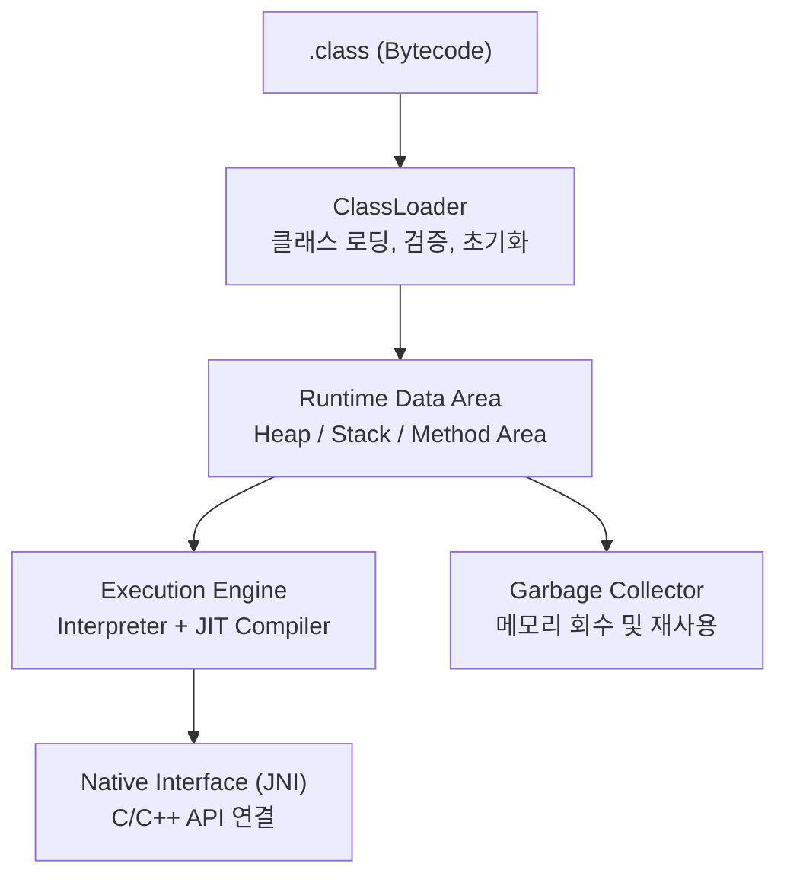
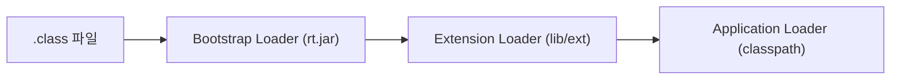
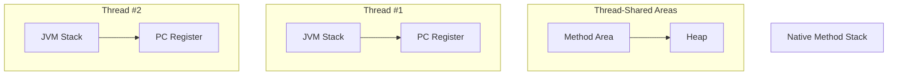
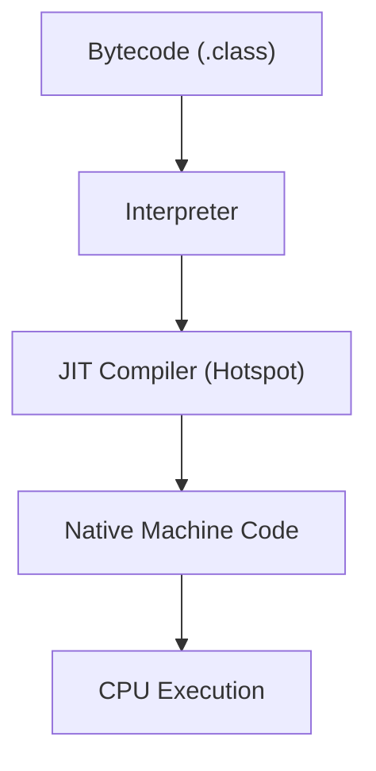

#### 요약

- JVM(Java Virtual Machine)은 Java 프로그램을 실행하기 위한 **가상 실행 환경(Virtual Runtime)** 이다.  
- JVM 내부는 **클래스 로더, 런타임 데이터 영역, 실행 엔진, GC, JNI**로 구성된다.  
- 이 구조를 이해하면 **GC 동작, 메모리 사용, 동시성, 컴파일 과정**의 모든 기초를 파악할 수 있다.

**핵심 요약**
1. JVM은 “**Class → Bytecode → Runtime Execution**” 흐름으로 동작한다.  
2. 주요 구성: **ClassLoader / Runtime Data Area / Execution Engine / JNI / GC**  
3. JVM은 OS 위에서 동작하며, Java의 플랫폼 독립성을 보장한다.

| 항목          | 핵심 내용                                            |
| ----------- | ------------------------------------------------ |
| **핵심 구성요소** | ClassLoader, Runtime Data Area, Execution Engine |
| **핵심 특징**   | 플랫폼 독립성, 동적 컴파일, 자동 메모리 관리                       |
| **핵심 흐름**   | `.class → 로드 → 실행 → GC → 종료`                     |


#### 참고자료
* Baeldung — [JVM Architecture Explained](https://www.baeldung.com/jvm-architecture)
* Red Hat — [Understanding JVM Internals](https://developers.redhat.com/articles/understanding-jvm)

---

#### 1. JVM 구조 개요



> JVM은 **Bytecode를 네이티브 코드로 실행하는 가상 머신**이며,
> OS와 하드웨어 사이의 **추상화 계층(Abstraction Layer)** 역할을 한다.

---

#### 2. ClassLoader Subsystem

**역할:** `.class` 파일을 메모리에 로드하고, 검증·링크·초기화를 수행한다.

| 단계                 | 설명                          | 주요 기능                                               |
| ------------------ | --------------------------- | --------------------------------------------------- |
| **Loading**        | `.class` 파일을 메모리에 적재        | `Bootstrap`, `Extension`, `Application` ClassLoader |
| **Linking**        | 참조 검증 및 심볼 해석               | Bytecode의 유효성 검사                                    |
| **Initialization** | static 필드 초기화, static 블록 실행 | 클래스 초기화 순서 제어                                       |



> ClassLoader는 **계층적 위임 모델(Delegation Model)** 을 따른다.
> 부모 로더가 먼저 로드할 수 있는 클래스를 탐색하고, 없을 경우 자식이 처리한다.

---

#### 3. Runtime Data Area

실행 중 생성된 **모든 데이터와 객체가 저장되는 메모리 공간**이다.
JVM은 각 스레드별로 고유한 스택을, 모든 스레드가 공유하는 힙을 유지한다.

| 영역                      | 설명                       | 스레드 공유 여부 |
| ----------------------- | ------------------------ | --------- |
| **Method Area**         | 클래스 구조, 메타데이터, static 변수 | ✅ 공유      |
| **Heap**                | 객체 인스턴스 저장               | ✅ 공유      |
| **JVM Stack**           | 메서드 호출 프레임, 지역 변수        | ❌ 스레드별    |
| **PC Register**         | 현재 실행 명령어 주소             | ❌ 스레드별    |
| **Native Method Stack** | JNI 실행용 스택               | ❌ 스레드별    |



> Method Area는 JDK 8 이후 **Metaspace** 로 변경되어,
> JVM 메모리가 아닌 **네이티브 메모리 영역**을 사용한다.

---

#### 4. Execution Engine

**Execution Engine**은 JVM의 “두뇌” 역할을 하며,
Bytecode를 실제 하드웨어 명령어로 변환해 실행한다.

| 구성 요소                 | 설명                   | 특징                    |
| --------------------- | -------------------- | --------------------- |
| **Interpreter**       | Bytecode를 한 줄씩 해석 실행 | 초기 로딩 속도 빠름, 반복 실행 느림 |
| **JIT Compiler**      | 자주 실행되는 코드 → 네이티브 변환 | 실행 성능 향상              |
| **Garbage Collector** | 불필요 객체 자동 회수         | Stop-the-world 영향     |
| **Thread Scheduler**  | OS 스케줄러 기반 스레드 관리    | CPU Time Slice 제어     |



> JIT(Just-In-Time) 컴파일은 실행 중 **프로파일링 기반 최적화**를 수행한다.
> 반복 호출되는 메서드만 네이티브로 변환해, **속도와 유연성의 균형**을 맞춘다.

---

#### 5. Native Interface (JNI)

**JNI(Java Native Interface)** 는 Java에서 OS 수준 함수를 호출하거나,
C/C++ 라이브러리와 상호작용하기 위한 표준 API다.

```java
public class NativeExample {
    static {
        System.loadLibrary("native-lib"); // C/C++ 라이브러리 로드
    }
    public native void nativeMethod();   // 네이티브 메서드 선언
}
```

> JNI는 Java가 **플랫폼 독립적**이면서도 **시스템 자원 접근**이 가능하게 만든다.
> 다만, JVM 외부 코드이므로 예외·메모리 안정성에 주의해야 한다.

---

#### 6. Garbage Collector (개요)

JVM은 **Heap 내 객체 생명주기를 자동으로 관리**한다.
GC는 실행 엔진과 병행되어 불필요한 객체를 제거한다.

| 구분                       | 대표 알고리즘            | 특징             |
| ------------------------ | ------------------ | -------------- |
| **Serial / Parallel GC** | Mark-Sweep-Compact | 단일/다중 스레드, 기본형 |
| **G1 GC**                | Region 단위 관리       | Pause 시간 최소화   |
| **ZGC / Shenandoah**     | Concurrent GC      | 초저지연, 대용량 힙 지원 |

> GC 동작의 세부 내용은 [02-gc-deep-dive.md]에서 다룬다.

---

#### 7. JVM 실행 단계 요약

| 단계                | 동작                | 구성 요소                 |
| ----------------- | ----------------- | --------------------- |
| **1. 클래스 로드**     | `.class` → 메모리 적재 | ClassLoader           |
| **2. 검증 및 링크**    | 참조 확인, 심볼 해석      | Verification, Linking |
| **3. 실행 준비**      | 스택/힙 영역 할당        | Runtime Data Area     |
| **4. 실행(해석/컴파일)** | Bytecode 실행       | Interpreter / JIT     |
| **5. GC 관리**      | 객체 수명 종료 관리       | Garbage Collector     |

---

