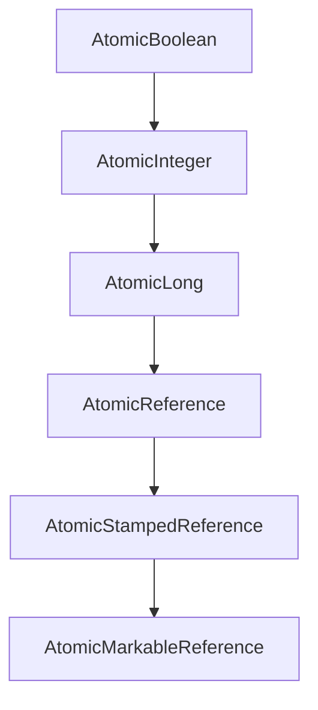

#### 요약

- **Lock-Free Concurrency** 는 `synchronized` 없이도 **안전한 데이터 갱신**을 가능하게 한다.  
- 핵심은 **CAS(Compare-And-Swap)** 연산으로,  
  CPU 명령 수준에서 **경쟁 상태 없이 원자적 연산(Atomic Operation)** 을 수행한다.  
- 본 장은 `java.util.concurrent.atomic` 패키지와 `VarHandle` API의 내부 구조를 중심으로 설명한다.

**핵심 요약**
1. Lock-Free는 “경쟁이 있어도 교착(Deadlock) 없이 진행 가능한 구조”이다.  
2. CAS는 **현재 값이 예상 값과 같을 때만 새 값으로 교체하는 원자 연산**이다.  
3. Atomic 클래스와 VarHandle은 JVM 수준에서 CAS를 이용해 구현되어 있다.

| 항목          | 내용                                                 |
| ----------- | -------------------------------------------------- |
| **핵심 원리**   | CAS(Compare-And-Swap)를 통한 원자적 갱신                   |
| **대표 클래스**  | AtomicInteger, AtomicReference, VarHandle          |
| **보조 메커니즘** | Memory Fence, ABA 해결 구조                            |
| **장점**      | Deadlock-free, Non-blocking                        |
| **다음 주제**   | Profiling Tools — JFR, async-profiler를 통한 내부 동작 관찰 |

---

#### 참고자료

* Baeldung — [Atomic Variables in Java](https://www.baeldung.com/java-atomic-variables)
* Red Hat — [VarHandle and Memory Barriers Explained](https://developers.redhat.com/articles/varhandle)

---

#### 1. Lock-Free 개념

| 용어 | 설명 |
|------|------|
| **Lock-Based** | `synchronized`, `ReentrantLock` 등 Lock 획득 기반 제어 |
| **Lock-Free** | CPU 수준 원자 명령(CAS)으로 데이터 변경 |
| **Wait-Free** | 모든 스레드가 일정 횟수 내에 반드시 진행 보장 |

```plaintext
Lock-Free ⊂ Non-Blocking ⊂ Concurrency
```

> Lock-Free 구조는 스레드가 **교착(Deadlock)**, **우선순위 역전(Priority Inversion)** 에 빠지지 않는다.

---

#### 2. Compare-And-Swap (CAS) 원리

CAS는 세 개의 인자를 가진 CPU 명령이다.

| 파라미터                   | 설명        |
| ---------------------- | --------- |
| **V (Variable)**       | 변경 대상 변수  |
| **E (Expected Value)** | 예상되는 현재 값 |
| **N (New Value)**      | 교체하려는 새 값 |

```java
boolean compareAndSwapInt(Object obj, long offset, int expect, int update);
```

동작 원리 👇

```plaintext
if (V == E)
    V = N;
else
    retry;
```

> 성공 시 true, 실패 시 재시도(retry) — 즉, **낙관적 동기화(Optimistic Concurrency)** 방식이다.

---

#### 3. Atomic 클래스 계층 구조



| 클래스                          | 기능            | 내부 구현      |
| ---------------------------- | ------------- | ---------- |
| `AtomicInteger`              | 정수형 원자적 연산    | CAS 기반     |
| `AtomicLong`                 | long 타입 연산    | CAS 기반     |
| `AtomicReference<T>`         | 참조형 교체        | CAS 기반     |
| `AtomicStampedReference<T>`  | 버전 스탬프 포함     | ABA 문제 해결  |
| `AtomicMarkableReference<T>` | Boolean 마커 포함 | CAS + Flag |

---

#### 4. AtomicInteger 예시

```java
import java.util.concurrent.atomic.AtomicInteger;

public class AtomicExample {
    private static final AtomicInteger counter = new AtomicInteger(0);

    public static void main(String[] args) throws InterruptedException {
        Thread t1 = new Thread(() -> {
            for (int i = 0; i < 1000; i++) counter.incrementAndGet();
        });
        Thread t2 = new Thread(() -> {
            for (int i = 0; i < 1000; i++) counter.incrementAndGet();
        });
        t1.start(); t2.start();
        t1.join(); t2.join();
        System.out.println(counter.get()); // 2000
    }
}
```

> 내부적으로 `Unsafe.compareAndSwapInt()` 가 호출되며,
> JVM은 CPU의 `LOCK CMPXCHG` 명령어로 처리한다.

---

#### 5. ABA 문제

**CAS의 맹점**은 값이 변경됐다가 다시 원래 값으로 돌아와도
변경이 감지되지 않는다는 점이다.

```plaintext
스레드1: A → B → A
스레드2: A → C (CAS 비교 통과)
```

해결 방법:

| 해결책                         | 설명              |
| --------------------------- | --------------- |
| **AtomicStampedReference**  | (값 + 버전 번호)로 비교 |
| **AtomicMarkableReference** | (값 + 플래그)로 비교   |

```java
AtomicStampedReference<String> ref = new AtomicStampedReference<>("A", 0);
int stamp = ref.getStamp();
ref.compareAndSet("A", "B", stamp, stamp + 1);
```

---

#### 6. VarHandle (Java 9+)

`VarHandle`은 기존 `Unsafe`를 대체하는 안전한 API다.
JMM 규칙(volatile, acquire, release)을 직접 제어할 수 있다.

```java
import java.lang.invoke.MethodHandles;
import java.lang.invoke.VarHandle;

public class VarHandleExample {
    private int value = 0;
    private static final VarHandle VALUE_HANDLE;

    static {
        try {
            VALUE_HANDLE = MethodHandles.lookup()
                .findVarHandle(VarHandleExample.class, "value", int.class);
        } catch (Exception e) {
            throw new Error(e);
        }
    }

    public void increment() {
        int v;
        do { v = (int) VALUE_HANDLE.getVolatile(this); }
        while (!VALUE_HANDLE.compareAndSet(this, v, v + 1));
    }
}
```

| 접근 모드                         | 설명                 |
| ----------------------------- | ------------------ |
| `getVolatile` / `setVolatile` | 즉시 가시성 보장          |
| `getAcquire` / `setRelease`   | Memory Barrier 최소화 |
| `compareAndSet`               | CAS 수행             |

> VarHandle은 **JMM의 메모리 장벽(Fence)** 을 직접 조작할 수 있는
> “언어 수준의 하드웨어 접근 API”이다.

---

#### 7. Memory Fences (메모리 장벽)

CPU는 명령어 순서를 재배치(Reordering)하여 실행할 수 있다.
이를 제어하기 위해 JVM은 **Memory Fence(메모리 장벽)** 을 사용한다.

| Fence 종류       | 설명                    |
| -------------- | --------------------- |
| **LoadLoad**   | 읽기 → 읽기 순서 보장         |
| **StoreStore** | 쓰기 → 쓰기 순서 보장         |
| **LoadStore**  | 읽기 → 쓰기 순서 보장         |
| **StoreLoad**  | 쓰기 → 읽기 순서 보장 (가장 강력) |

> `volatile` 접근 시 JVM은 StoreLoad Fence를 삽입해 **가시성과 순서 보장**을 유지한다.

---

#### 8. Lock-Free 큐 예시

`ConcurrentLinkedQueue` 는 CAS 기반 Lock-Free 자료구조다.

```java
ConcurrentLinkedQueue<Integer> queue = new ConcurrentLinkedQueue<>();
queue.offer(1);
queue.offer(2);
System.out.println(queue.poll()); // 1
```

| 특징                       | 설명                  |
| ------------------------ | ------------------- |
| **Head/Tail 노드 CAS 갱신**  | Lock-Free 방식으로 큐 갱신 |
| **ABA 방지 스탬프 사용**        | 안정적 참조 교체           |
| **Wait-Free Poll/Offer** | Blocking 없이 데이터 처리  |

---

#### 9. Lock-Free 구조의 장단점

| 구분        | 장점                                                  | 단점                   |
| --------- | --------------------------------------------------- | -------------------- |
| **장점**    | Deadlock 없음, 높은 병렬성, 빠른 응답                          | 구현 복잡도 높음, ABA 문제 존재 |
| **적용 사례** | Atomic 클래스, Concurrent Collections, ForkJoinPool 내부 | 실시간 제어 시스템, 고성능 서버 등 |

---

