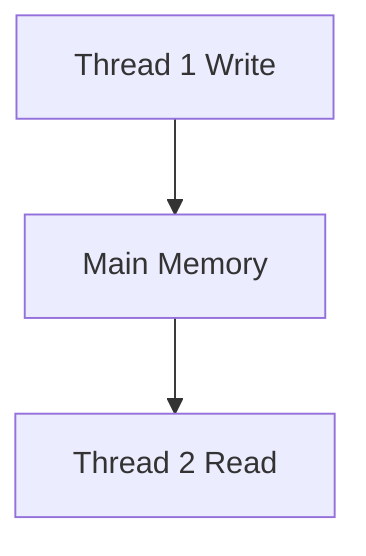
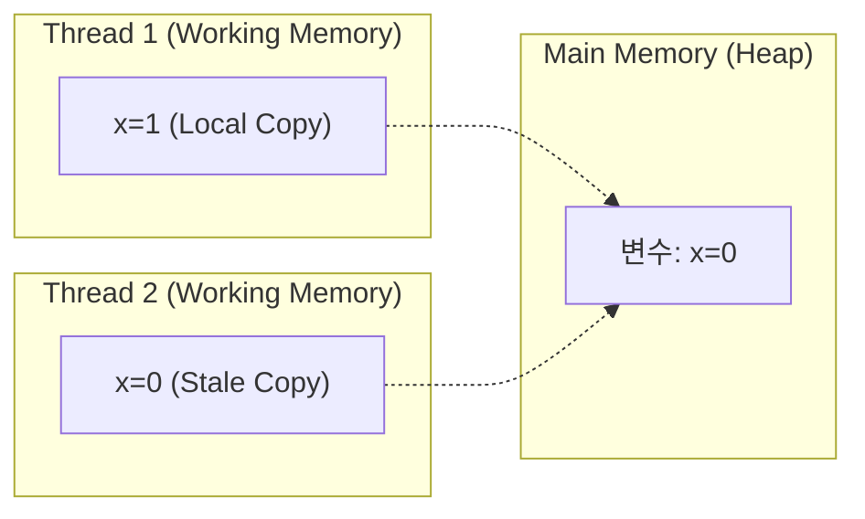
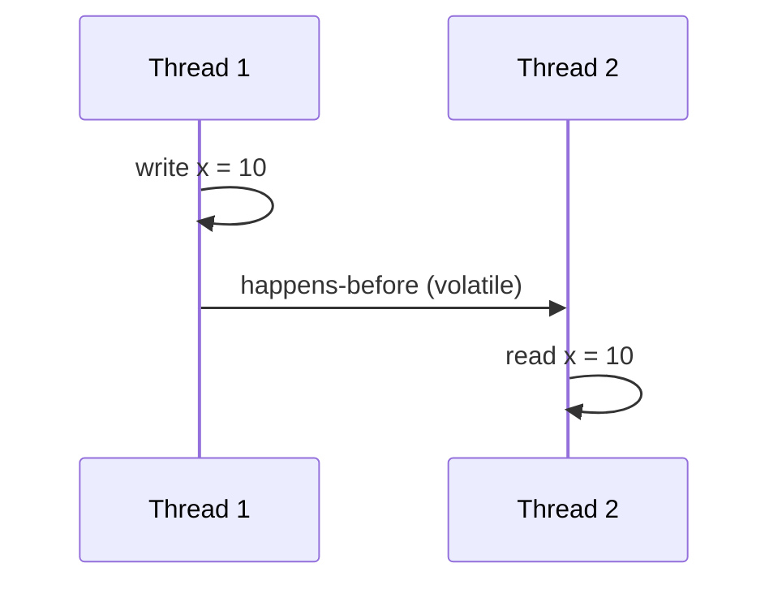
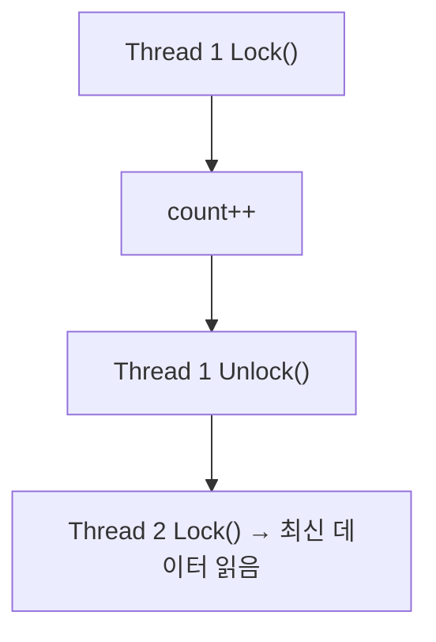

#### 요약

- Java Memory Model(JMM)은 **스레드 간 메모리 접근 규칙과 일관성(consistency)** 을 정의한다.  
- JMM은 CPU 캐시, 명령어 재정렬(Reordering), 컴파일러 최적화로 인한 **예측 불가능한 동작**을 방지한다.  
- 본 장에서는 `volatile`, `synchronized`, `final` 이 JMM 내에서 어떤 역할을 하는지 살펴본다.

**핵심 요약**
1. JMM은 “**모든 스레드가 동일한 메모리 상태를 본다는 보장**”을 정의한다.  
2. `happens-before` 관계는 동시성 코드의 실행 순서를 정의하는 핵심 규칙이다.  
3. `volatile`, `synchronized`, `Lock`, `final` 등은 모두 이 모델의 일관성을 확보하기 위한 도구다.

| 항목        | 설명                                        |
| --------- | ----------------------------------------- |
| **핵심 개념** | JMM은 스레드 간 일관된 메모리 접근 규칙                  |
| **중심 규칙** | Happens-Before 관계                         |
| **도구**    | volatile, synchronized, Lock, Atomic 클래스  |
| **핵심 효과** | Visibility + Ordering 보장                  |
| **다음 주제** | Threading & Concurrency — 실행 스케줄링과 동시성 구조 |

---

#### 참고자료

* Baeldung — [Java Memory Model Explained](https://www.baeldung.com/java-memory-model)
* Red Hat Developers — [Understanding Java Happens-Before Semantics](https://developers.redhat.com/articles/happens-before)

---

#### 1. JMM의 필요성

멀티스레드 환경에서는 CPU와 캐시가 독립적으로 작동하기 때문에,  
한 스레드의 변경이 다른 스레드에 **즉시 반영되지 않을 수 있다.**

```java
boolean running = true;

void threadA() {
    while (running) { } // 무한 루프
}
void threadB() {
    running = false; // 변경
}
```

> 위 코드는 `running`이 **CPU 캐시에만 존재하면 threadA가 무한 루프에서 빠져나오지 못한다.**

→ 이 문제를 해결하기 위한 규칙이 바로 **Java Memory Model** 이다.

---

#### 2. JMM의 핵심 목표

| 목표                 | 설명                          |
| ------------------ | --------------------------- |
| **Visibility**     | 한 스레드의 메모리 변경이 다른 스레드에 보이는가 |
| **Ordering**       | 코드 실행 순서가 예측 가능한가           |
| **Atomicity**      | 연산이 중간 단계 없이 수행되는가          |
| **Happens-Before** | 메모리 간 순서를 논리적으로 정의          |



> 모든 스레드는 **공유 메모리(Main Memory)** 를 기준으로 동기화되어야 한다.

---

#### 3. 메모리 구조 요약

| 영역                 | 설명                                          | 특징                               |
| ------------------ | ------------------------------------------- | -------------------------------- |
| **Main Memory**    | 모든 스레드가 공유하는 메모리 공간                         | Heap, Static 변수                  |
| **Working Memory** | 각 스레드의 캐시 역할                                | CPU 레지스터 또는 L1 Cache             |
| **JMM 규칙**         | Working Memory ↔ Main Memory 간 데이터 교환 시점 제어 | `volatile`, `synchronized` 등이 관여 |



> JMM은 “어떤 시점에 Main Memory로 flush/refresh 되는가”를 정의하는 규칙이다.

---

#### 4. Happens-Before 관계

JMM은 코드 실행 순서를 **시간적이 아닌 논리적 관계**로 정의한다.

> A **happens-before** B
> → A의 모든 메모리 변경은 B에서 반드시 관측된다.

| 규칙                     | 설명                                            |
| ---------------------- | --------------------------------------------- |
| **Program Order Rule** | 한 스레드 내에서는 코드 순서가 happens-before 순서다.         |
| **Monitor Lock Rule**  | `unlock`은 이후 `lock`보다 happens-before다.        |
| **Volatile Rule**      | `volatile` 변수의 쓰기는 그 이후 읽기보다 happens-before다. |
| **Thread Start Rule**  | `Thread.start()` 이전 동작은 새 스레드에서 관측 가능하다.      |
| **Thread Join Rule**   | 스레드의 모든 동작은 `join()` 이후에 관측된다.                |



> Happens-before는 “**정확한 실행 순서**”가 아니라,
> “**관측 가능한 메모리 순서 보장**”을 의미한다.

---

#### 5. volatile 키워드

`volatile`은 변수의 변경이 **즉시 메인 메모리에 반영되고**,
다른 스레드에서 즉시 읽히도록 보장한다.

```java
volatile boolean running = true;
```

| 특징          | 설명                       |
| ----------- | ------------------------ |
| **가시성 보장**  | 모든 스레드가 항상 최신 값 읽음       |
| **재정렬 방지**  | 명령어 순서 최적화 방지            |
| **원자성 미보장** | 복합 연산(`count++`)에는 적용 불가 |

```plaintext
volatile은 “즉시 동기화되는 변수”지만,
“Lock이 아닌 단일 읽기/쓰기 보장”만 수행한다.
```

---

#### 6. synchronized 키워드

`synchronized`는 한 번에 하나의 스레드만 임계 구역(Critical Section)을 실행하게 한다.

```java
synchronized void increment() {
    count++;
}
```

| 특징                           | 설명                                    |
| ---------------------------- | ------------------------------------- |
| **Mutual Exclusion (상호 배제)** | 동시에 진입 불가                             |
| **Visibility (가시성 보장)**      | Lock 해제 시 모든 변경 사항 Main Memory에 flush |
| **Ordering (순서 보장)**         | Lock 획득 후 읽는 데이터는 최신 상태               |



> `synchronized`는 “메모리 일관성 + 실행 순서” 모두 보장한다.
> 하지만 성능보다는 안정성에 초점이 있다.

---

#### 7. final 필드의 불변성 (Immutable Guarantee)

`final` 변수는 객체 초기화 이후 변경되지 않으며,
**생성자 완료 이후 다른 스레드가 올바른 값**을 볼 수 있게 보장한다.

```java
public class Config {
    final int port;
    Config() { this.port = 8080; }
}
```

| 특징                           | 설명                            |
| ---------------------------- | ----------------------------- |
| **생성자 완료 이후 변경 불가**          | 불변성 확보                        |
| **Happens-before 보장**        | 생성자 종료 → 다른 스레드 접근 시 값 일관성 유지 |
| **Lazy Initialization 시 주의** | 완전한 초기화 이후 publish 필요         |

---

#### 8. 명령어 재정렬 (Instruction Reordering)

JIT과 CPU는 성능을 위해 명령어 순서를 변경할 수 있다.
하지만 JMM은 중요한 순서(`volatile`, `synchronized`)를 보호한다.

```java
a = 1;  
b = 2;
```

컴파일 후 실제 실행:

```plaintext
b = 2;
a = 1; // 가능
```

> 단, `volatile` 변수 접근 시에는 재정렬 금지.

---

#### 9. Atomic Classes (Lock-Free 접근)

`java.util.concurrent.atomic` 패키지는
JMM 규칙을 기반으로 Lock 없이 원자 연산을 제공한다.

| 클래스                   | 기능                              |
| --------------------- | ------------------------------- |
| `AtomicInteger`       | 원자적 증가/감소 (`getAndIncrement()`) |
| `AtomicReference`     | 참조형 원자 교체 (`compareAndSet()`)   |
| `AtomicBoolean`       | boolean 원자 갱신                   |
| `VarHandle` (Java 9+) | 낮은 수준의 volatile + CAS API       |

```java
AtomicInteger counter = new AtomicInteger();
counter.incrementAndGet(); // Lock 없이 Thread-safe
```

> 내부적으로는 CPU의 **CAS(Compare-And-Swap)** 명령어를 사용한다.

---
