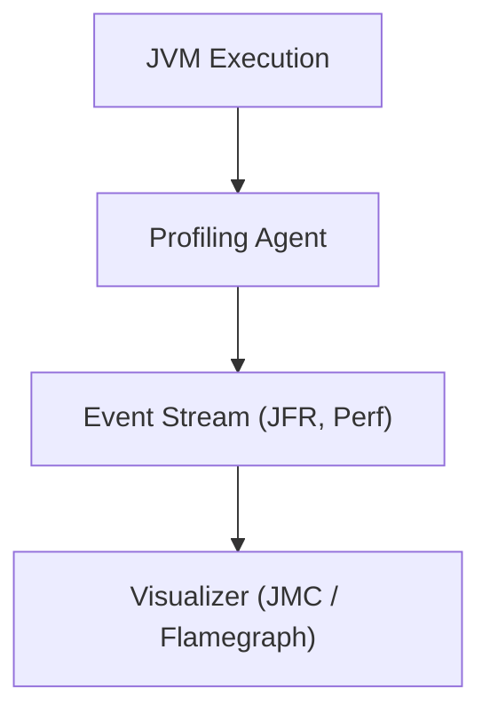
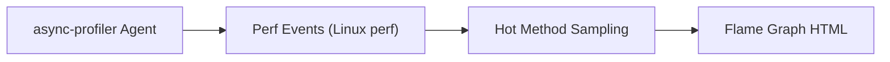
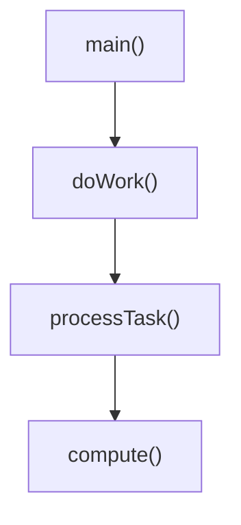

#### 요약

- **Profiling**은 애플리케이션의 실행 과정(스레드, 힙, CPU, JIT, GC)을 **관찰하고 시각화**하는 과정이다.  
- Java는 JVM 내부의 동작을 추적하기 위한 **JFR, async-profiler, VisualVM, JMC** 등의 프로파일러를 제공한다.  
- 본 장은 이 도구들이 JVM 내부 구조를 어떻게 관찰하는지를 이해하기 위한 **동작 원리 중심**으로 다룬다.

**핵심 요약**
1. Profiling은 코드가 “**어떻게 실행되고 있는가**”를 분석하는 JVM 관찰 기법이다.  
2. 주요 대상: **Thread / Heap / GC / JIT / Native Call**  
3. JFR, async-profiler, JMC는 JVM과 직접 통신하여 이벤트 단위로 데이터를 수집한다.

| 항목        | 내용                                     |
| --------- | -------------------------------------- |
| **핵심 개념** | JVM 내부 이벤트를 관찰해 구조를 이해                 |
| **주요 도구** | JFR, JMC, async-profiler, VisualVM     |
| **관찰 대상** | Thread, Heap, GC, JIT, ClassLoad       |
| **핵심 가치** | “보이지 않는 JVM 내부를 눈으로 확인한다.”             |
| **다음 주제** | Advanced Summary — 전체 구조 요약 및 학습 경로 안내 |

---

#### 참고자료

* Oracle Docs — [Java Flight Recorder](https://docs.oracle.com/en/java/javase/17/jfapi/)
* Baeldung — [Java Mission Control and Flight Recorder](https://www.baeldung.com/java-flight-recorder-monitoring)
* async-profiler GitHub — [https://github.com/jvm-profiling-tools/async-profiler](https://github.com/jvm-profiling-tools/async-profiler)
* JetBrains — [VisualVM and Flame Graph Analysis](https://www.jetbrains.com/help/idea/analyze-performance.html)

---

#### 1. Profiling의 목적

| 목적 | 설명 |
|------|------|
| **실행 흐름 이해** | 스레드, 메서드, 메모리의 상호작용 구조 파악 |
| **JVM 내부 이벤트 관찰** | GC, JIT, ClassLoad, System Call 모니터링 |
| **비동기 병목 탐색** | Thread Dump와 Stack Sampling 결합 |
| **시각적 구조 분석** | Flame Graph, Heap Graph, Lock Graph 생성 |



> Profiling은 “성능 개선 도구” 이전에,
> “JVM 내부의 작동 원리를 눈으로 확인하는 도구”로 이해할 수 있다.

---

#### 2. 주요 Profiling Tool 개요

| 도구                             | 방식              | 주요 대상                       | 특징               |
| ------------------------------ | --------------- | --------------------------- | ---------------- |
| **JFR (Java Flight Recorder)** | JVM 내장 이벤트 수집   | GC, JIT, Thread, Allocation | JDK에 기본 포함       |
| **JMC (Mission Control)**      | JFR 시각화 툴       | 이벤트 그래프, 스레드 타임라인           | GUI 기반           |
| **async-profiler**             | 네이티브 샘플링        | CPU, Allocation, Wall Time  | 저부하, Flame Graph |
| **VisualVM**                   | JMX + 샘플링       | Heap, Thread, GC, Classes   | 직관적 GUI          |
| **JConsole**                   | JMX 기반 실시간 모니터링 | 메모리, 스레드                    | 경량 도구            |

---

#### 3. Java Flight Recorder (JFR)

JFR은 JVM 내부에 내장된 **이벤트 기반 프로파일러(Event-driven Profiler)** 이다.
JVM 레벨에서 **GC, JIT, Thread, IO, ClassLoad** 이벤트를 기록한다.

```bash
java -XX:StartFlightRecording=filename=app.jfr,duration=60s,settings=profile MyApp
```

| 주요 이벤트 그룹                | 설명                           |
| ------------------------ | ---------------------------- |
| **Java Application**     | 메서드 실행, 예외, Lock 대기          |
| **Java Virtual Machine** | GC, JIT, Safepoint           |
| **System**               | OS Thread, CPU Load, Disk IO |
| **Profiling**            | CPU 샘플링, Allocation 추적       |

> `.jfr` 파일은 Mission Control(JMC)로 분석 가능하며,
> JVM이 “언제 무엇을 했는가”를 이벤트 단위로 보여준다.

---

#### 4. async-profiler

C++로 작성된 **저부하 샘플링 프로파일러**로,
JVM과 Native Stack을 동시에 분석할 수 있다.

```bash
./profiler.sh -e cpu -d 30 -f cpu.html <pid>
```

| 옵션             | 설명             |
| -------------- | -------------- |
| `-e cpu`       | CPU 샘플링        |
| `-e alloc`     | 메모리 할당 추적      |
| `-e wall`      | 실제 경과 시간 기반    |
| `-f file.html` | Flame Graph 출력 |



> async-profiler는 JVM 내부 함수와 네이티브 함수를 모두 추적 가능하며,
> GC 중단 구간(Stop-the-World)도 포함해서 시각화할 수 있다.

---

#### 5. VisualVM

VisualVM은 가장 널리 알려진 Java GUI 프로파일러다.
JMX를 통해 JVM에 직접 연결하여 **Heap, Thread, ClassLoad, GC 로그**를 실시간으로 시각화한다.

```bash
jvisualvm
```

| 주요 기능                | 설명                   |
| -------------------- | -------------------- |
| **CPU Profiler**     | 실행 중인 메서드 호출 빈도 분석   |
| **Memory Profiler**  | 객체 생성량, GC 호출 빈도 추적  |
| **Thread View**      | 스레드 상태, 데드락 감지       |
| **Heap Dump Viewer** | 객체 그래프 탐색 및 누수 원인 파악 |

> VisualVM은 “학습용 JVM 구조 관찰 도구”로 매우 적합하다.
> (GC, JIT, Heap 구조를 시각적으로 파악 가능)

---

#### 6. JDK Mission Control (JMC)

JMC는 JFR 데이터를 분석하기 위한 **전문 시각화 툴**이다.
실행 중 JFR 이벤트를 타임라인으로 표시한다.

| 분석 뷰                     | 설명                          |
| ------------------------ | --------------------------- |
| **Overview**             | GC, JIT, Thread, I/O 이벤트 전체 |
| **Method Profiling**     | Hot Method 샘플링              |
| **Heap & Allocation**    | 객체 생성 위치 추적                 |
| **Thread Latency Graph** | 스레드 대기·실행 구간 시각화            |
| **Event Browser**        | 모든 JVM 이벤트 검색               |

> JMC는 “JVM 내부 타임라인 재생기”처럼 동작하며,
> JVM이 어떤 순서로 이벤트를 처리했는지 탐구할 수 있다.

---

#### 7. Flame Graph (Stack Visualization)

Flame Graph는 async-profiler나 JFR로 생성된 **호출 스택 시각화 그래프**다.
각 함수의 누적 실행 시간을 **가로 폭으로 표현**한다.

```plaintext
[main] -> doWork() -> processTask() -> compute()
```



> Flame Graph는 CPU 또는 Allocation Hotspot을 직관적으로 보여준다.
> 실행 경로가 긴 메서드일수록 “불꽃”이 높게 표시된다.

---

#### 8. Profiling 접근 방식 비교

| 분류         | JFR    | async-profiler | VisualVM  | JMC     |
| ---------- | ------ | -------------- | --------- | ------- |
| **동작 방식**  | 이벤트 기록 | 샘플링            | 샘플링       | 시각화     |
| **JVM 통합** | 내부 내장  | 외부 에이전트        | 외부 툴      | JFR 분석용 |
| **부하**     | 매우 낮음  | 낮음             | 중간        | 없음      |
| **분석 대상**  | JVM 전역 | CPU/Heap       | Thread/GC | JFR 이벤트 |

> **JFR + JMC** 조합은 내부 분석,
> **async-profiler** 는 실제 CPU/메모리 구조 분석에 적합하다.

---

#### 9. Profiling 시 주의사항

| 주의 항목              | 설명                           |
| ------------------ | ---------------------------- |
| **JIT Warm-up 고려** | 초기 실행 시 프로파일링은 정확하지 않음       |
| **GC 영향 확인**       | GC Pause로 인한 CPU Time 왜곡 가능  |
| **샘플링 간격 조정**      | 너무 잦은 샘플링은 Overhead 유발       |
| **Test 환경 분리**     | 운영 환경에서 실시간 프로파일링은 제한적 수행 권장 |

---
