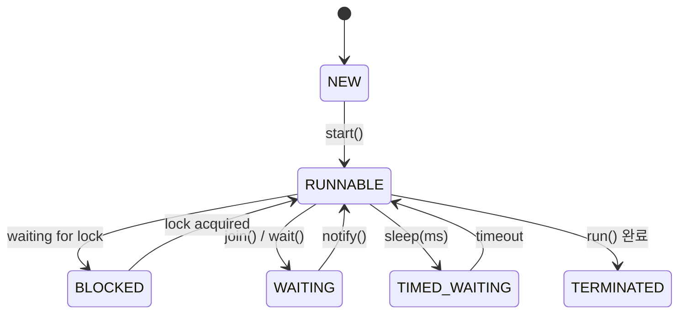
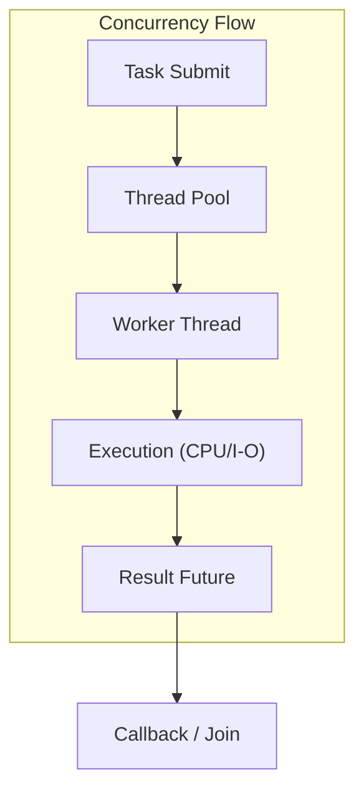

#### 요약

- Java의 **Thread 모델**은 운영체제 스레드(OS Thread)를 기반으로 하며,  
  JVM이 이를 관리하여 **동시 실행(Concurrency)** 을 제공한다.  
- 본 장은 스레드 생성, 스케줄링, Thread Pool, 동기화, ForkJoin, Virtual Thread 구조를 포함한  
  **JVM 레벨의 동시성 동작 원리**를 설명한다.

**핵심 요약**
1. Java 스레드는 OS 커널 스레드와 1:1로 매핑된다.  
2. Thread Pool은 스레드 재사용을 통해 비용을 줄인다.  
3. ForkJoinPool은 병렬 작업을 재귀적으로 분할해 실행한다.  
4. Virtual Thread는 경량 스레드 모델로, 블로킹 없는 동시성 실행을 가능하게 한다.

| 항목                     | 내용                                            |
| ---------------------- | --------------------------------------------- |
| **Thread Model**       | OS 기반 1:1 매핑 구조                               |
| **Executor Framework** | 작업 제출과 실행 분리                                  |
| **ForkJoinPool**       | 분할 정복 기반 병렬 처리                                |
| **Virtual Thread**     | 경량 동시성, 대규모 I/O 처리                            |
| **핵심 효과**              | 멀티코어 활용 + 병렬성 향상                              |
| **다음 주제**              | Lock-Free Structures — CAS와 Atomic 클래스의 내부 동작 |

---

#### 참고자료

* Oracle Docs — [Thread and Concurrency Overview](https://docs.oracle.com/javase/tutorial/essential/concurrency/)
* OpenJDK — [Project Loom: Virtual Threads](https://openjdk.org/projects/loom/)

---

#### 1. 스레드의 기본 구조

Java의 스레드는 **운영체제 커널 스레드 위에서 동작**하며, JVM이 이를 추상화한다.

| 개념 | 설명 |
|------|------|
| **Thread Instance** | 사용자 코드에서 정의한 스레드 객체 |
| **Native Thread** | OS가 관리하는 실제 실행 단위 |
| **Thread Scheduler** | JVM 내부에서 OS 스케줄러와 연동 |
| **Context Switching** | CPU가 여러 스레드를 번갈아 실행 |

```java
public class HelloThread extends Thread {
    public void run() {
        System.out.println("Hello from " + Thread.currentThread().getName());
    }
}

new HelloThread().start();
```

> JVM은 OS의 **1:1 스레드 모델**을 따르므로,
> 각 Java 스레드는 실제 커널 스레드에 대응된다.

---

#### 2. 스레드 상태(State)

스레드는 다음과 같은 생명주기를 가진다.



| 상태                          | 설명                              |
| --------------------------- | ------------------------------- |
| **NEW**                     | 스레드 객체 생성 후 start() 미호출         |
| **RUNNABLE**                | 실행 대기 또는 실행 중                   |
| **BLOCKED**                 | Lock 획득 대기                      |
| **WAITING / TIMED_WAITING** | `wait()`, `join()`, `sleep()` 등 |
| **TERMINATED**              | 실행 종료                           |

---

#### 3. 스레드 생성 방식

| 방식                           | 예시 코드                                    | 특징            |
| ---------------------------- | ---------------------------------------- | ------------- |
| **Thread 상속**                | `new MyThread().start();`                | 간단하지만 재사용 어려움 |
| **Runnable 구현**              | `new Thread(() -> {...}).start();`       | 권장 방식         |
| **ExecutorService**          | `Executors.newFixedThreadPool(4)`        | 스레드 풀 관리      |
| **ForkJoinPool**             | `new ForkJoinPool().submit(task)`        | 병렬 재귀 연산      |
| **Virtual Thread (JDK 21+)** | `Thread.startVirtualThread(() -> {...})` | 초경량, 대규모 동시성  |

---

#### 4. Thread Pool (Executors)

Thread Pool은 스레드를 재사용해 생성/소멸 비용을 줄인다.

| Pool 유형                  | 생성 메서드                                | 특징           |
| ------------------------ | ------------------------------------- | ------------ |
| **FixedThreadPool**      | `Executors.newFixedThreadPool(n)`     | 고정된 스레드 수 유지 |
| **CachedThreadPool**     | `Executors.newCachedThreadPool()`     | 필요 시 무제한 생성  |
| **ScheduledThreadPool**  | `Executors.newScheduledThreadPool(n)` | 주기적 작업 실행    |
| **SingleThreadExecutor** | `Executors.newSingleThreadExecutor()` | 단일 스레드 순차 실행 |

```java
ExecutorService pool = Executors.newFixedThreadPool(4);
pool.submit(() -> System.out.println(Thread.currentThread().getName()));
pool.shutdown();
```

> Executor는 **작업 제출(Submit)** 과 **스레드 관리**를 분리함으로써,
> CPU 효율성과 안정성을 동시에 확보한다.

---

#### 5. ForkJoin Framework

ForkJoin은 **“Divide and Conquer” (분할 정복)** 패턴 기반의 병렬 실행 구조다.

```java
class SumTask extends RecursiveTask<Long> {
    long[] arr; int start, end;
    protected Long compute() {
        if (end - start <= 10)
            return computeSequentially();
        int mid = (start + end) / 2;
        SumTask left = new SumTask(arr, start, mid);
        SumTask right = new SumTask(arr, mid, end);
        left.fork();                    // 비동기 실행
        return right.compute() + left.join();
    }
}
```

| 구성 요소             | 설명                      |
| ----------------- | ----------------------- |
| **Fork**          | 하위 작업 비동기 실행            |
| **Join**          | 하위 작업 완료 대기 후 결과 병합     |
| **Work Stealing** | 유휴 스레드가 다른 스레드의 작업을 가져옴 |

> ForkJoinPool은 병렬 스트림(`parallelStream()`) 내부에서도 자동 사용된다.

---

#### 6. Virtual Thread (Project Loom)

Java 21부터 도입된 **Virtual Thread**는 기존 스레드보다 훨씬 가볍다.
OS 스레드 하나에 수천 개의 Virtual Thread를 매핑할 수 있다.

```java
Thread.startVirtualThread(() -> {
    System.out.println("Virtual thread: " + Thread.currentThread());
});
```

| 항목                 | 전통적 스레드        | Virtual Thread             |
| ------------------ | -------------- | -------------------------- |
| **생성 비용**          | 높음 (OS Thread) | 매우 낮음                      |
| **Blocking I/O**   | OS Thread 점유   | 자동 비점유 (Carrier Thread 관리) |
| **Context Switch** | OS 스케줄러        | JVM 내부 스케줄러                |
| **적합한 용도**         | CPU-bound 작업   | I/O-bound 동시성 작업           |


> Virtual Thread는 “Thread per Request” 모델을
> 효율적으로 구현할 수 있게 해준다.

---

#### 7. 동기화(Synchronization) 메커니즘 요약

| 방식                                 | 사용 예시                              | 특징               |
| ---------------------------------- | ---------------------------------- | ---------------- |
| **synchronized**                   | `synchronized(lock) {}`            | 블로킹 기반, 단순       |
| **Lock 인터페이스**                     | `ReentrantLock`                    | 세밀한 제어, 조건 대기 지원 |
| **ReadWriteLock**                  | `ReentrantReadWriteLock`           | 읽기/쓰기 분리 동기화     |
| **Semaphore**                      | `Semaphore(3)`                     | 동시 접근 제한         |
| **CountDownLatch / CyclicBarrier** | 스레드 간 동기화 시점 제어                    | 병렬 연산 종료 대기      |
| **Atomic Classes**                 | `AtomicInteger`, `AtomicReference` | Lock-free 연산 지원  |

---

#### 8. Executor와 Future/CompletableFuture

비동기 계산의 결과를 다루는 구조.

```java
CompletableFuture.supplyAsync(() -> {
    return "Result from async";
}).thenApply(result -> result + " processed")
  .thenAccept(System.out::println);
```

> `CompletableFuture`는 콜백 기반 비동기 프로그래밍을 가능하게 하며,
> Future를 확장한 **non-blocking API** 이다.

---

#### 9. 동시성 시각화



---

