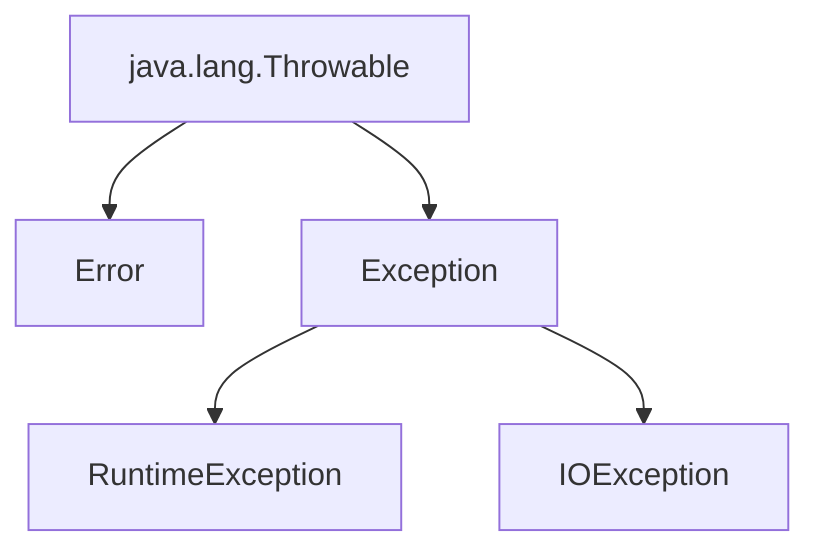

#### 요약

Java의 **예외 처리(Exception Handling)** 는 프로그램 실행 중 발생할 수 있는  
오류(에러, 에러 상황)를 안전하게 감지하고 처리하기 위한 메커니즘이다.  
예외를 적절히 처리하면 프로그램의 **안정성**과 **가독성**을 높일 수 있다.  

**핵심 요약**
1. 예외(Exception)는 **프로그램 실행 중 발생하는 비정상 상황**이다.  
2. 예외 처리는 `try-catch-finally` 구문으로 수행한다.  
3. Checked Exception과 Unchecked Exception으로 구분된다.  
4. 예외는 `throw` 또는 `throws` 키워드로 직접 발생시킬 수 있다.  
5. 사용자 정의(Custom) 예외를 통해 비즈니스 로직에 맞는 예외를 설계할 수 있다.  

---

##### 참고자료
- [Oracle Java Tutorials: Exceptions](https://docs.oracle.com/javase/tutorial/essential/exceptions/)
- [Baeldung: Java Exception Handling Best Practices](https://www.baeldung.com/java-exceptions)
- [Java SE API Docs - java.lang.Exception](https://docs.oracle.com/javase/8/docs/api/java/lang/Exception.html)

---

#### 1. 예외와 오류의 차이

| 구분 | 클래스 | 설명 |
|------|----------|------|
| **Error** | `java.lang.Error` | 시스템 레벨 오류 (복구 불가, 예: OutOfMemoryError) |
| **Exception** | `java.lang.Exception` | 코드 실행 중 비정상 상황 (복구 가능) |
| **RuntimeException** | `java.lang.RuntimeException` | 실행 시점 오류 (개발자 실수) |



---

#### 2. Checked vs Unchecked Exception

| 구분                      | 설명                 | 예시                                            | 처리 필요 여부   |
| ----------------------- | ------------------ | --------------------------------------------- | ---------- |
| **Checked Exception**   | 컴파일 시점에 반드시 처리해야 함 | `IOException`, `SQLException`                 | ✅ 예외 처리 필수 |
| **Unchecked Exception** | 실행 중 발생, 선택적 처리    | `NullPointerException`, `ArithmeticException` | ⚙️ 선택적 처리  |

---

#### 3. try-catch-finally 기본 구조

```java
try {
    int result = 10 / 0;
} catch (ArithmeticException e) {
    System.out.println("0으로 나눌 수 없습니다.");
} finally {
    System.out.println("항상 실행됩니다.");
}
```

출력 결과:

```
0으로 나눌 수 없습니다.
항상 실행됩니다.
```

> 💡 `finally` 블록은 예외 발생 여부와 관계없이 **항상 실행**된다.

---

#### 4. 다중 catch문

여러 종류의 예외를 구분하여 처리할 수 있다.

```java
try {
    int[] nums = {1, 2, 3};
    System.out.println(nums[5]);
} catch (ArrayIndexOutOfBoundsException e) {
    System.out.println("배열 인덱스 범위를 초과했습니다.");
} catch (Exception e) {
    System.out.println("기타 예외 발생: " + e.getMessage());
}
```

---

#### 5. 예외 객체의 주요 메소드

| 메소드                 | 설명             |
| ------------------- | -------------- |
| `getMessage()`      | 예외 메시지 반환      |
| `printStackTrace()` | 예외 발생 위치 출력    |
| `toString()`        | 예외 클래스와 메시지 출력 |

```java
try {
    throw new NullPointerException("값이 null입니다.");
} catch (Exception e) {
    System.out.println(e.getMessage());
    e.printStackTrace();
}
```

---

#### 6. throw / throws 키워드

##### (1) throw — 예외를 직접 발생시킴

```java
public void divide(int a, int b) {
    if (b == 0)
        throw new ArithmeticException("0으로 나눌 수 없습니다.");
    System.out.println(a / b);
}
```

##### (2) throws — 예외를 호출자에게 전달

```java
public void readFile(String filePath) throws IOException {
    FileReader fr = new FileReader(filePath);
}
```

> ⚙️ `throws`는 호출 메소드가 예외 처리를 책임진다는 의미다.

---

#### 7. 사용자 정의(Custom) 예외

업무 규칙이나 비즈니스 로직에 맞는 예외를 정의할 수 있다.

```java
public class InsufficientBalanceException extends Exception {
    public InsufficientBalanceException(String message) {
        super(message);
    }
}
```

```java
public class Account {
    private int balance = 1000;

    public void withdraw(int amount) throws InsufficientBalanceException {
        if (amount > balance) {
            throw new InsufficientBalanceException("잔액이 부족합니다.");
        }
        balance -= amount;
    }
}
```

```java
public class Main {
    public static void main(String[] args) {
        Account acc = new Account();
        try {
            acc.withdraw(2000);
        } catch (InsufficientBalanceException e) {
            System.out.println(e.getMessage());
        }
    }
}
```

출력 결과:

```
잔액이 부족합니다.
```

---

#### 8. try-with-resources (Java 7+)

입출력(IO)과 같이 리소스를 자동으로 닫을 때 사용한다.
`AutoCloseable` 인터페이스를 구현한 객체에 적용 가능하다.

```java
import java.io.*;

public class ReadFileExample {
    public static void main(String[] args) {
        try (BufferedReader br = new BufferedReader(new FileReader("test.txt"))) {
            System.out.println(br.readLine());
        } catch (IOException e) {
            System.out.println("파일 읽기 오류: " + e.getMessage());
        }
    }
}
```

> ✅ `finally` 없이도 자동으로 리소스(`br.close()`)가 해제된다.

---

#### 9. 예외 전파 (Exception Propagation)

예외는 메소드 호출 계층을 따라 상위로 전달된다.

```java
public void methodA() throws IOException {
    methodB();
}

public void methodB() throws IOException {
    throw new IOException("입출력 오류 발생");
}
```

호출 측:

```java
try {
    methodA();
} catch (IOException e) {
    System.out.println("예외 처리 완료");
}
```

---

#### 10. 예외 처리 모범 사례 (Best Practices)

| 항목                                 | 권장 사항                      |
| ---------------------------------- | -------------------------- |
| ✅ 명확한 예외 메시지                       | 사용자/개발자가 원인 파악 가능하게 작성     |
| ✅ 구체적인 예외 사용                       | `Exception`보다 세분화된 예외 사용   |
| ✅ 예외 은폐 금지                         | 발생한 예외를 무시하지 말 것           |
| ✅ finally 또는 try-with-resources 사용 | 리소스 누수 방지                  |
| ✅ 로깅 활용                            | `Logger` 또는 `SLF4J`로 예외 기록 |

---

#### 11. 로깅 예외 처리 예시

```java
import java.util.logging.*;

public class LogExample {
    private static final Logger logger = Logger.getLogger(LogExample.class.getName());

    public static void main(String[] args) {
        try {
            int result = 10 / 0;
        } catch (ArithmeticException e) {
            logger.log(Level.SEVERE, "오류 발생: " + e.getMessage(), e);
        }
    }
}
```

출력 결과 (콘솔 로그):

```
SEVERE: 오류 발생: / by zero
java.lang.ArithmeticException: / by zero
    at LogExample.main(LogExample.java:7)
```

---

#### 12. 결론

* 예외 처리는 프로그램의 안정성과 신뢰성을 보장하는 핵심 메커니즘이다.
* `try-catch-finally` 또는 `try-with-resources` 구문을 통해 예외를 안전하게 관리할 수 있다.
* 비즈니스 로직에 적합한 **사용자 정의 예외(Custom Exception)** 를 설계하면 유지보수성이 향상된다.
* 로그 기반 예외 처리를 통해 운영 환경에서 문제 원인을 빠르게 파악할 수 있다.

---

