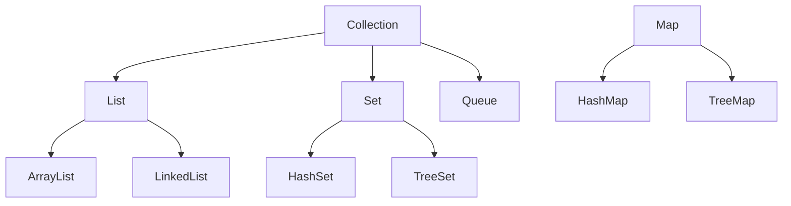

#### 요약

Java의 제네릭(Generics)과 컬렉션(Collection) 프레임워크는  
**타입 안정성(Type Safety)** 과 **데이터 구조화(Data Structuring)** 를 위해 사용된다.  
제네릭은 컴파일 시점에 타입 오류를 방지하며, 컬렉션은 데이터를 효율적으로 저장·관리한다.  

**핵심 요약**
1. 제네릭은 클래스나 메소드 선언 시 타입을 파라미터화한다.  
2. Wrapper 클래스는 기본형(Primitive)을 객체형으로 변환한다.  
3. 컬렉션은 데이터를 동적으로 저장하며, `List`, `Set`, `Map`이 대표적이다.  
4. `Iterator`를 통해 컬렉션을 안전하게 순회할 수 있다.  
5. 제네릭은 형변환을 줄이고 코드 재사용성을 높인다.  

---

##### 참고자료
- [Oracle Java Tutorials: Generics](https://docs.oracle.com/javase/tutorial/java/generics/)
- [Baeldung: Java Collections Overview](https://www.baeldung.com/java-collections)
- [Java SE API: java.util](https://docs.oracle.com/javase/8/docs/api/java/util/package-summary.html)

---

#### 1. Wrapper 클래스

기본형(Primitive Type)을 객체(Object)로 포장(wrapping)하는 클래스이다.

| 기본형 | Wrapper 클래스 |
|--------|----------------|
| `int` | `Integer` |
| `double` | `Double` |
| `char` | `Character` |
| `boolean` | `Boolean` |

```java
int a = 10;
Integer b = a;   // 오토박싱 (Auto-Boxing)
int c = b;       // 언박싱 (Unboxing)
```

> 💡 Wrapper 클래스는 컬렉션 프레임워크에서 필수적으로 사용된다.
> (컬렉션은 객체만 저장 가능하기 때문)

---

#### 2. 제네릭(Generics) 개념

제네릭은 **데이터 타입을 일반화**하여 컴파일 시점에 타입 안정성을 확보한다.

```java
List<String> list = new ArrayList<>();
list.add("Java");
// list.add(123); // 컴파일 오류 (타입 불일치)
```

> ⚙️ 제네릭을 사용하면 형변환(Casting)이 필요 없으며, 코드 안정성이 향상된다.

---

#### 3. 제네릭 클래스 정의

```java
public class Box<T> {
    private T value;

    public void set(T value) {
        this.value = value;
    }
    public T get() {
        return value;
    }
}

public class Main {
    public static void main(String[] args) {
        Box<Integer> intBox = new Box<>();
        intBox.set(10);
        System.out.println(intBox.get());
    }
}
```

출력 결과:

```
10
```

---

#### 4. 제네릭 메소드

메소드 선언 시 타입 매개변수를 지정할 수 있다.

```java
public <T> void printArray(T[] arr) {
    for (T element : arr) {
        System.out.println(element);
    }
}

String[] fruits = {"사과", "바나나"};
printArray(fruits);
```

---

#### 5. 제한된 타입 파라미터 (Bounded Type Parameter)

상한(`extends`) 또는 하한(`super`) 제한을 지정할 수 있다.

```java
public <T extends Number> double sum(T a, T b) {
    return a.doubleValue() + b.doubleValue();
}
```

> 💡 위 예시는 `Integer`, `Double`, `Float` 등 `Number` 하위 클래스만 허용한다.

---

#### 6. 와일드카드(`?`)

| 문법              | 의미             | 예시                       |
| --------------- | -------------- | ------------------------ |
| `<?>`           | 모든 타입 허용       | `List<?> list`           |
| `<? extends T>` | T 또는 하위 타입만 허용 | `List<? extends Number>` |
| `<? super T>`   | T 또는 상위 타입만 허용 | `List<? super Integer>`  |

```java
List<? extends Number> nums = new ArrayList<Integer>();
List<? super Integer> ints = new ArrayList<Number>();
```

---

#### 7. 컬렉션 프레임워크 개요

컬렉션은 데이터를 저장, 탐색, 삭제, 정렬하는 구조를 제공한다.
모든 컬렉션 클래스는 `java.util` 패키지에 포함된다.



---

#### 8. List 인터페이스

순서가 있는 데이터 집합이며, 중복을 허용한다.

```java
import java.util.*;

List<String> names = new ArrayList<>();
names.add("홍길동");
names.add("김철수");
names.add("홍길동"); // 중복 허용
System.out.println(names);
```

출력 결과:

```
[홍길동, 김철수, 홍길동]
```

---

#### 9. Set 인터페이스

중복을 허용하지 않으며, 순서가 보장되지 않는다.

```java
Set<String> set = new HashSet<>();
set.add("A");
set.add("B");
set.add("A");
System.out.println(set);
```

출력 결과:

```
[A, B]
```

> ⚙️ 순서를 유지하려면 `LinkedHashSet`, 정렬이 필요하면 `TreeSet` 사용.

---

#### 10. Map 인터페이스

Key-Value 형태로 데이터를 관리한다.

```java
Map<String, Integer> scores = new HashMap<>();
scores.put("수학", 90);
scores.put("영어", 85);
scores.put("국어", 95);
System.out.println(scores);
```

출력 결과:

```
{영어=85, 수학=90, 국어=95}
```

##### 주요 메소드

| 메소드              | 설명      |
| ---------------- | ------- |
| `put(K,V)`       | 값 추가    |
| `get(K)`         | 값 조회    |
| `containsKey(K)` | 키 존재 여부 |
| `remove(K)`      | 키 제거    |
| `keySet()`       | 키 집합 반환 |
| `values()`       | 값 목록 반환 |

---

#### 11. Iterator를 이용한 순회

```java
List<String> items = Arrays.asList("A", "B", "C");
Iterator<String> iterator = items.iterator();

while (iterator.hasNext()) {
    System.out.println(iterator.next());
}
```

> 💡 `Iterator`는 컬렉션의 내부 구조와 무관하게 안전하게 순회할 수 있다.

---

#### 12. Collections 유틸리티 클래스

`java.util.Collections`는 컬렉션 조작을 위한 정적 메소드를 제공한다.

```java
List<Integer> nums = Arrays.asList(3, 1, 4, 1, 5);
Collections.sort(nums);
Collections.reverse(nums);
System.out.println(nums);
```

출력 결과:

```
[5, 4, 3, 1, 1]
```

| 메소드               | 설명          |
| ----------------- | ----------- |
| `sort()`          | 오름차순 정렬     |
| `reverse()`       | 역순 정렬       |
| `shuffle()`       | 랜덤 섞기       |
| `max()` / `min()` | 최댓값, 최솟값 반환 |

---

#### 13. 실습 예시: 학생 점수 관리 프로그램

```java
import java.util.*;

public class StudentScores {
    public static void main(String[] args) {
        Map<String, Integer> scores = new HashMap<>();
        scores.put("홍길동", 90);
        scores.put("김철수", 85);
        scores.put("이영희", 92);

        for (String name : scores.keySet()) {
            System.out.println(name + "의 점수: " + scores.get(name));
        }

        System.out.println("평균 점수: " +
            scores.values().stream().mapToInt(Integer::intValue).average().getAsDouble());
    }
}
```

출력 결과:

```
홍길동의 점수: 90
김철수의 점수: 85
이영희의 점수: 92
평균 점수: 89.0
```

---

#### 14. 결론

* 제네릭은 타입 안정성을 제공하고 불필요한 형변환을 제거한다.
* 컬렉션 프레임워크는 데이터를 효율적으로 관리하기 위한 핵심 도구이다.
* 상황에 맞게 `List`, `Set`, `Map`을 선택하고, `Collections` 유틸리티를 활용하면
  보다 읽기 쉽고 유지보수성 높은 코드를 작성할 수 있다.

---

