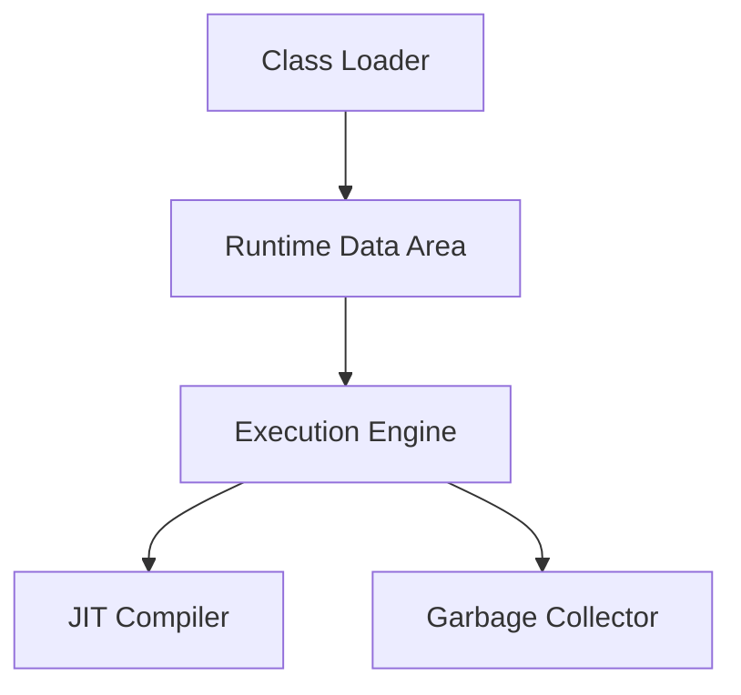

#### 요약

Java의 성능 최적화는 **JVM 구조 이해**, **메모리 관리(GC)**, **스레드 모델**,  
**프로파일링 및 튜닝** 과정을 통해 애플리케이션의 효율성을 극대화하는 영역이다.  
코드 최적화보다 더 중요한 것은 **런타임 동작 원리(JVM Behavior)** 를 파악하는 것이다.

**핵심 요약**
1. JVM은 Class Loader, Runtime Data Area, Execution Engine으로 구성된다.  
2. GC(Garbage Collection)는 자동 메모리 회수 시스템이다.  
3. 스레드(Thread)와 동시성(Concurrency)은 Java 성능의 핵심이다.  
4. JIT(Just-In-Time) 컴파일러는 런타임에서 코드 실행 속도를 최적화한다.  
5. 프로파일링 도구(JVisualVM, JMC, JProfiler)를 통해 성능 병목을 진단한다.  

---

##### 참고자료
- [Oracle Java Performance Tuning Guide](https://docs.oracle.com/en/java/javase/17/performance/)
- [Baeldung: Java GC Tuning](https://www.baeldung.com/java-garbage-collection)
- [JVisualVM & JMC Docs](https://visualvm.github.io/)

---

#### 1. JVM 구조 개요

Java Virtual Machine(JVM)은 Java 코드를 실행하는 **가상 실행 환경**이다.



| 구성 요소                 | 설명                              |
| --------------------- | ------------------------------- |
| **Class Loader**      | .class 파일 로드 및 메모리 배치           |
| **Runtime Data Area** | Heap, Stack, Method, PC 등 실행 영역 |
| **Execution Engine**  | 바이트코드 실행                        |
| **JIT Compiler**      | 자주 실행되는 코드를 기계어로 컴파일            |
| **GC**                | 불필요한 객체 자동 회수                   |

---

#### 2. JVM 메모리 구조

| 영역                      | 설명                             | 관리 주체   |
| ----------------------- | ------------------------------ | ------- |
| **Heap**                | 객체 저장 영역                       | GC 관리   |
| **Stack**               | 메소드 호출, 지역변수 저장                | 스레드별 독립 |
| **Method Area**         | 클래스 정보, static 변수              | JVM 공용  |
| **PC Register**         | 현재 실행 위치 추적                    | 스레드별 독립 |
| **Native Method Stack** | JNI(Java Native Interface) 호출용 | 시스템     |

```java
public class MemoryExample {
    static int staticValue = 10; // Method Area
    int instanceValue = 20;      // Heap
    public void print() {        // Stack
        int localValue = 30;
        System.out.println(localValue);
    }
}
```

---

#### 3. Garbage Collection (GC) 개요

GC는 사용하지 않는 객체를 자동으로 메모리에서 해제하는 시스템이다.

| GC 구분                | 설명             | 특징            |
| -------------------- | -------------- | ------------- |
| **Serial GC**        | 단일 스레드         | 단일 코어 환경에 적합  |
| **Parallel GC**      | 멀티스레드 병렬 처리    | Throughput 중심 |
| **G1 GC**            | Region 단위 관리   | Java 9+ 기본 GC |
| **ZGC / Shenandoah** | 초저지연(≤10ms) GC | 대규모 서버 환경 적합  |

---

#### 4. GC 튜닝 예시

```bash
java -Xms512m -Xmx1024m -XX:+UseG1GC -XX:MaxGCPauseMillis=100 -jar app.jar
```

| 옵션                     | 설명          |
| ---------------------- | ----------- |
| `-Xms`, `-Xmx`         | 초기/최대 힙 크기  |
| `-XX:+UseG1GC`         | G1 GC 활성화   |
| `-XX:MaxGCPauseMillis` | 목표 GC 지연 시간 |
| `-XX:+PrintGCDetails`  | GC 로그 출력    |

> 💡 실무에서는 GC 로그를 수집해 `GCViewer`, `GCEasy`, `VisualVM` 등으로 분석한다.

---

#### 5. JIT (Just-In-Time) 컴파일

JIT는 반복 실행되는 바이트코드를 **기계어로 변환**해 성능을 향상시킨다.

| 구분              | 역할                     |
| --------------- | ---------------------- |
| **C1 Compiler** | 빠른 컴파일, 초기 실행 속도 개선    |
| **C2 Compiler** | 고성능 최적화, 장기 실행 애플리케이션용 |

```java
// 자주 실행되는 메소드는 JIT 컴파일러가 최적화
for (int i = 0; i < 1000000; i++) {
    Math.sqrt(i);
}
```

---

#### 6. 스레드(Thread) 모델

스레드는 프로그램 내에서 독립적으로 실행되는 단위이다.

```java
public class ThreadExample extends Thread {
    public void run() {
        System.out.println("스레드 실행: " + Thread.currentThread().getName());
    }

    public static void main(String[] args) {
        new ThreadExample().start();
        new ThreadExample().start();
    }
}
```

출력 예시:

```
스레드 실행: Thread-0
스레드 실행: Thread-1
```

> ⚙️ 스레드는 JVM 내부에서 **Stack 메모리를 개별적으로 할당받는다.**

---

#### 7. ExecutorService — 스레드 풀 관리

```java
import java.util.concurrent.*;

public class ThreadPoolExample {
    public static void main(String[] args) {
        ExecutorService pool = Executors.newFixedThreadPool(3);
        for (int i = 1; i <= 5; i++) {
            int task = i;
            pool.submit(() -> System.out.println("작업 " + task + " 실행 중"));
        }
        pool.shutdown();
    }
}
```

출력 결과:

```
작업 1 실행 중
작업 2 실행 중
작업 3 실행 중
...
```

> ✅ 스레드 풀은 스레드 생성 비용을 줄이고 안정적인 자원 관리를 보장한다.

---

#### 8. 동기화(Synchronization)

공유 자원에 여러 스레드가 접근할 때 발생할 수 있는 **경쟁 상태(Race Condition)** 를 방지한다.

```java
class Counter {
    private int count = 0;
    public synchronized void increment() { count++; }
    public int getCount() { return count; }
}
```

```java
Counter counter = new Counter();
Thread t1 = new Thread(() -> { for(int i=0; i<1000; i++) counter.increment(); });
Thread t2 = new Thread(() -> { for(int i=0; i<1000; i++) counter.increment(); });
t1.start(); t2.start();
t1.join(); t2.join();
System.out.println(counter.getCount()); // 2000
```

---

#### 9. 성능 분석 도구 (Profiling Tools)

| 도구                             | 설명                 | 주요 용도                |
| ------------------------------ | ------------------ | -------------------- |
| **JVisualVM**                  | JVM 모니터링 GUI       | Heap, Thread, GC 시각화 |
| **JConsole**                   | JMX 기반 관리          | 실시간 메모리/CPU 추적       |
| **Java Mission Control (JMC)** | Flight Recorder 분석 | 런타임 병목 분석            |
| **JProfiler / YourKit**        | 상용 분석 도구           | SQL, 메소드 호출 추적       |

```bash
jvisualvm
```

> 💡 JVisualVM은 Java에 기본 포함되어 있으며, 원격 JVM 분석도 가능하다.

---

#### 10. 성능 최적화 Best Practices

| 영역      | 권장 사항                                  |
| ------- | -------------------------------------- |
| **메모리** | 불필요한 객체 생성 줄이기, StringBuilder 사용       |
| **컬렉션** | 초기 크기 지정, Stream 대신 기본 루프 활용(대량 데이터 시) |
| **GC**  | 짧은 생명주기 객체 최소화, G1 GC 사용               |
| **스레드** | ExecutorService 사용, synchronized 최소화   |
| **I/O** | 버퍼 기반 스트림(`BufferedReader/Writer`) 사용  |
| **DB**  | Connection Pool, Batch 처리 사용           |

---

#### 11. 예시: 대용량 데이터 처리 성능 비교

```java
long start = System.currentTimeMillis();

List<Integer> list = new ArrayList<>();
for (int i = 0; i < 10_000_000; i++) {
    list.add(i);
}

// Stream 처리
long sum = list.parallelStream()
               .mapToLong(Integer::longValue)
               .sum();

System.out.println("합계: " + sum);
System.out.println("소요 시간: " + (System.currentTimeMillis() - start) + "ms");
```

> 💡 `parallelStream()`은 CPU 코어 수에 따라 자동으로 병렬 처리된다.

---

#### 12. 결론

* JVM의 구조와 GC 동작 원리를 이해하면 성능 문제를 근본적으로 해결할 수 있다.
* JIT 컴파일, Thread Pool, Parallel Stream은 **고성능 서버 개발의 핵심 도구**이다.
* 프로파일링 도구(JVisualVM, JMC)를 통해 병목 지점을 수치로 파악해야 한다.
* 최적화의 핵심은 “**측정(Measure) 없이 튜닝하지 않는다**”는 원칙이다.

---

