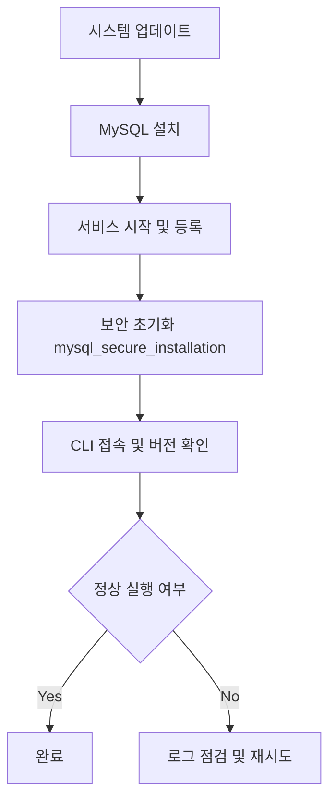

**version: 8.0.x**

#### 요약

- MySQL은 **서버형 RDBMS(Relational Database Management System)** 로,  
  다양한 OS 환경(Ubuntu, macOS, Windows, Docker)에서 구동 가능하다.  
- 본 문서는 **MySQL 8.x** 기준으로 CLI와 Docker 환경 모두에서 설치 절차를 다룬다.  
- 주요 내용  
  1. OS별 설치 명령  
  2. 보안 초기화  
  3. 서비스 등록 및 실행 확인  
  4. CLI 접속 및 버전 확인  
  5. Docker 기반 대체 구성

> MySQL은 운영 환경별 설치 명령이 다르지만,
> **공통 절차는 “설치 → 서비스 시작 → 보안 설정 → 접속 테스트”** 이다.
> CLI 환경만 익숙해지면, Docker나 GUI 환경도 쉽게 확장할 수 있다.

---

##### 참고자료  
- [공식 문서: MySQL Installation Guide](https://dev.mysql.com/doc/refman/8.0/en/installing.html)  

---

#### 1. 설치 개요

| 구분 | 설명 |
|------|------|
| **대상 버전** | MySQL 8.0.x (Community Edition) |
| **실행 환경** | Ubuntu 22.04 / macOS / Windows / Docker |
| **사용 포트** | 기본 3306 |
| **인증 방식** | `mysql_native_password` 또는 `caching_sha2_password` |

---

#### 2. Ubuntu 설치 절차

```bash
# 1️⃣ 패키지 업데이트
sudo apt update

# 2️⃣ MySQL 서버 설치
sudo apt install mysql-server -y

# 3️⃣ MySQL 서비스 시작 및 등록
sudo systemctl start mysql
sudo systemctl enable mysql

# 4️⃣ 설치 확인
mysql --version
# mysql  Ver 8.0.37 for Linux on x86_64 (MySQL Community Server - GPL)
```

---

#### 3. 보안 설정 및 기본 환경

```bash
sudo mysql_secure_installation
```

* root 계정 비밀번호 설정
* 원격 접속 허용 여부
* test DB 삭제
* 권한 테이블 재적용 (`flush privileges;` 자동 실행)

---

#### 4. CLI 접속 및 테스트

```bash
mysql -u root -p
```

**성공 메시지 예시**

```
Welcome to the MySQL monitor.  Commands end with ; or \g.
Your MySQL connection id is 8
Server version: 8.0.11 MySQL Community Server - GPL
```

---

#### 5. macOS (Homebrew) 설치

```bash
brew install mysql
brew services start mysql
mysql -u root
```

* `brew services list` 로 서비스 상태 확인
* `/usr/local/var/mysql` 디렉터리에 기본 데이터 저장

---

#### 6. Docker 기반 설치 (대체 방식)

```bash
docker run -d \
  --name mysql8 \
  -e MYSQL_ROOT_PASSWORD=rootpw \
  -p 3306:3306 \
  mysql:8.0
```

**컨테이너 실행 후 접속**

```bash
docker exec -it mysql8 mysql -u root -p
```

---

#### 7. 설치 확인 및 버전 점검

```bash
mysql -e "select @@version, @@hostname, @@port;"
```

| 항목  | 결과 예시     |
| --- | --------- |
| 버전  | 8.0.37    |
| 호스트 | localhost |
| 포트  | 3306      |

---

#### 8. 설치 흐름도 (Mermaid)



---

#### 9. 주의사항

1. Ubuntu 기본 저장소에는 오래된 MySQL 버전이 포함될 수 있으므로
   `apt-cache policy mysql-server` 로 버전 확인 후 설치한다.
2. 방화벽(ufw) 사용 시 3306 포트를 허용해야 원격 접속 가능:

   ```bash
   sudo ufw allow 3306/tcp
   ```
3. Docker 환경에서는 데이터 지속화를 위해 `-v ~/mysql_data:/var/lib/mysql` 옵션 추가 권장.

---

