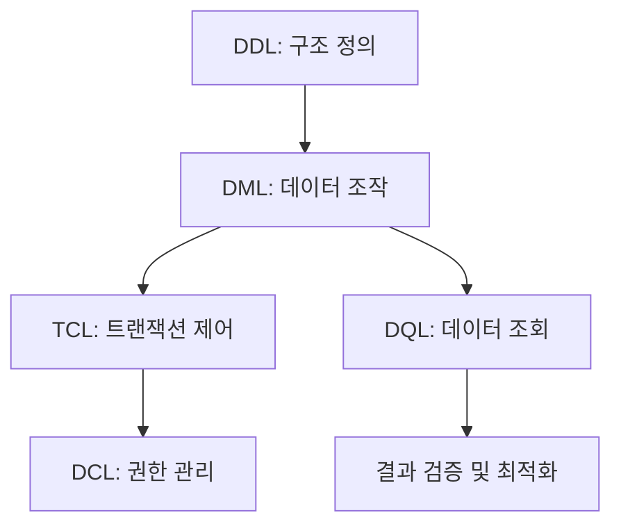

**version: 8.0.x**

---

#### 요약

- 본 문서는 MySQL에서 자주 사용하는 명령어(DDL, DML, DCL, TCL, DQL)를  
  한눈에 정리한 **Reference Sheet (참고 요약표)** 이다.  
- CLI 환경에서 빠르게 명령을 찾고 검증할 수 있도록  
  **명령어 / 설명 / 예시**를 함께 구성하였다.  
- 초급자에게는 명령 체계를 익히는 학습 자료로,  
  실무자에게는 즉시 확인 가능한 빠른 매뉴얼로 활용된다.  


> MySQL의 모든 SQL 명령은 이 5가지 범주(DDL/DML/DCL/TCL/DQL)로 정리된다.
> 각 명령의 목적을 명확히 구분하고 조합하면,
> **데이터 정의 → 조작 → 조회 → 제어 → 복구**까지의 전체 흐름을 완성할 수 있다.
> 반복 연습을 통해 SQL을 “외워서 쓰는 것”이 아니라 “이해하고 설계하는 도구”로 만들어야 한다.

**핵심 포인트**
1. SQL 문법 분류 (DDL / DML / DCL / TCL / DQL)  
2. 명령어별 기본 예시  
3. CLI 실습용 단축 명령  
4. 트랜잭션 및 권한 관련 주요 옵션  

---

##### 참고자료  
- 내부 문서:  
  - `01-core-languages/01-ddl.md` — 데이터 정의어  
  - `01-core-languages/02-dml.md` — 데이터 조작어  
  - `01-core-languages/03-dcl.md` — 데이터 제어어  
  - `01-core-languages/04-tcl.md` — 트랜잭션 제어어  
  - `01-core-languages/05-dql.md` — 데이터 질의어  

---

#### 1. SQL 기본 분류

| 분류 | 의미 | 주요 명령어 |
|------|------|--------------|
| **DDL (Data Definition Language)** | 데이터 구조 정의 | CREATE, ALTER, DROP, TRUNCATE |
| **DML (Data Manipulation Language)** | 데이터 조작 | INSERT, UPDATE, DELETE |
| **DCL (Data Control Language)** | 권한 관리 | GRANT, REVOKE |
| **TCL (Transaction Control Language)** | 트랜잭션 제어 | COMMIT, ROLLBACK, SAVEPOINT |
| **DQL (Data Query Language)** | 데이터 조회 | SELECT |

> 💡 DDL은 자동 커밋되며, DML/TCL은 트랜잭션으로 제어 가능하다.

---

#### 2. DDL — 데이터 정의어

| 명령 | 설명 | 예시 |
|------|------|------|
| `create database` | 데이터베이스 생성 | `create database addrdb;` |
| `create table` | 테이블 생성 | `create table tb1k (id int, name varchar(20));` |
| `alter table` | 테이블 수정 | `alter table tb1k add column age int;` |
| `drop table` | 테이블 삭제 | `drop table tb1k;` |
| `truncate table` | 데이터 전체 삭제 (구조 유지) | `truncate table tb1k;` |

---

#### 3. DML — 데이터 조작어

| 명령 | 설명 | 예시 |
|------|------|------|
| `insert` | 데이터 삽입 | `insert into tb1k values ('A101', '홍길동', 30);` |
| `update` | 데이터 수정 | `update tb1k set age = 35 where id = 'A101';` |
| `delete` | 데이터 삭제 | `delete from tb1k where id = 'A101';` |

> ⚙️ 트랜잭션을 통해 `rollback` 가능 (`autocommit=0` 권장).

---

#### 4. DCL — 데이터 제어어

| 명령 | 설명 | 예시 |
|------|------|------|
| `create user` | 사용자 생성 | `create user 'dev'@'localhost' identified by 'pass';` |
| `grant` | 권한 부여 | `grant select, insert on addrdb.* to 'dev'@'localhost';` |
| `revoke` | 권한 회수 | `revoke insert on addrdb.* from 'dev'@'localhost';` |
| `flush privileges` | 권한 테이블 적용 | `flush privileges;` |

---

#### 5. TCL — 트랜잭션 제어어

| 명령 | 설명 | 예시 |
|------|------|------|
| `start transaction` | 트랜잭션 시작 | `start transaction;` |
| `commit` | 변경사항 확정 | `commit;` |
| `rollback` | 변경사항 취소 | `rollback;` |
| `savepoint` | 중간 지점 설정 | `savepoint step1;` |
| `rollback to` | 특정 지점 복구 | `rollback to step1;` |

> 💡 `InnoDB` 엔진에서만 트랜잭션 기능 지원.

---

#### 6. DQL — 데이터 질의어

| 명령 | 설명 | 예시 |
|------|------|------|
| `select` | 데이터 조회 | `select * from tb1k;` |
| `distinct` | 중복 제거 | `select distinct age from tb1k;` |
| `order by` | 정렬 | `select * from tb1k order by age desc;` |
| `group by` | 그룹 집계 | `select age, count(*) from tb1k group by age;` |
| `having` | 그룹 필터 | `select age, count(*) from tb1k group by age having count(*)>1;` |
| `limit` | 출력 개수 제한 | `select * from tb1k limit 5;` |

---

#### 7. 함수 / 연산자 요약

| 유형 | 예시 | 설명 |
|------|------|------|
| 문자열 함수 | `concat(a,b)`, `substring()` | 문자열 처리 |
| 수학 함수 | `round()`, `abs()`, `mod()` | 수치 계산 |
| 날짜 함수 | `now()`, `date_add()`, `datediff()` | 시간 연산 |
| 조건문 | `if()`, `case when` | 조건 분기 |
| 논리 연산자 | `and`, `or`, `not` | 조건 결합 |

---

#### 8. 조건식 및 연산 예시

```sql
select name, age,
case
  when age >= 40 then '장년층'
  when age >= 20 then '청년층'
  else '미성년자'
end as 구분
from tb1k;
```

> ⚙️ `case when` 은 복잡한 조건 처리를 SQL 내부에서 수행할 때 유용하다.

---

#### 9. CLI 단축 명령 정리

| 명령            | 기능          |
| ------------- | ----------- |
| `\u <DB명>`    | 데이터베이스 전환   |
| `\s`          | 서버 상태 요약    |
| `\! clear`    | 터미널 초기화     |
| `source <파일>` | SQL 스크립트 실행 |
| `tee <파일>`    | 출력 로그 저장    |

---

#### 10. 키워드 관계 흐름 (Mermaid)



---

#### 11. 명령어 숙지 체크리스트

| 구분  | 명령                         | 숙련도 |
| --- | -------------------------- | --- |
| DDL | CREATE / ALTER / DROP      | ✅   |
| DML | INSERT / UPDATE / DELETE   | ✅   |
| TCL | COMMIT / ROLLBACK          | ✅   |
| DCL | GRANT / REVOKE             | ✅   |
| DQL | SELECT / GROUP BY / HAVING | ✅   |

---

