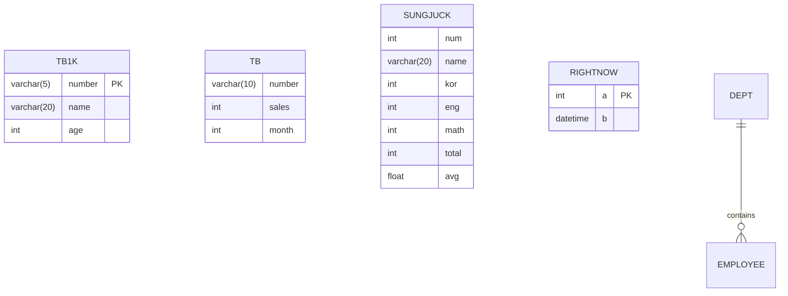

**version: 8.0.x**


#### 요약

- 본 문서는 MySQL 기본 학습 및 실무 테스트를 위해 자주 사용하는 **실습용 테이블 구조**를 정의한다.  
- 각 테이블은 DDL, DML, DQL 학습 단계별로 설계되었으며, 실제 사용 예제와 함께 테스트 가능하다.  
- 주요 테이블: `tb1k`, `tb`, `sungjuck`, `rightnow`  

> 실습 테이블은 DDL, DML, DQL, TCL 등 SQL 전 영역의 실습 기반이 된다.
> 각 테이블의 구조와 제약조건을 명확히 이해하면
> **데이터 조작 → 조회 → 트랜잭션 → 백업**으로 이어지는 전체 SQL 흐름을 손쉽게 학습할 수 있다.


**핵심 포인트**
1. 데이터베이스 생성 및 스키마 구조  
2. 주요 테이블 정의 (DDL 포함)  
3. 기본 데이터 삽입 (DML 예시)  
4. 관계형 구조 확장 예시 (JOIN / FOREIGN KEY)  

---

##### 참고자료  
- 내부 문서:
  - `01-core-languages/01-ddl.md` — 테이블 정의 문법  
  - `01-core-languages/05-dql.md` — 데이터 조회 실습  
  - `04-appendix/A2-practice-questions.md` — 연습문제 목록  

---

#### 1. 데이터베이스 생성

```sql
create database if not exists addrdb
character set utf8mb4
collate utf8mb4_general_ci;

use addrdb;
```

> 💡 모든 예제 테이블은 `addrdb` 데이터베이스 내에서 관리한다.

---

#### 2. 테이블 구조 개요

| 테이블명       | 용도    | 주요 컬럼                                 | 비고                        |
| ---------- | ----- | ------------------------------------- | ------------------------- |
| `tb1k`     | 회원 정보 | number, name, age                     | DML 실습용                   |
| `tb`       | 매출 기록 | number, sales, month                  | DQL 집계 실습용                |
| `sungjuck` | 성적표   | num, name, kor, eng, math, total, avg | UPDATE 계산 실습용             |
| `rightnow` | 시간 기록 | a, b(datetime)                        | AUTO_INCREMENT 및 now() 실습 |

---

#### 3. `tb1k` — 회원 정보 테이블

```sql
create table tb1k (
  number varchar(5) primary key,
  name   varchar(20) not null,
  age    int default 0
);

insert into tb1k values
('A101', '강신우', 40),
('A105', '박문수', 35),
('A102', '김기덕', 28),
('A103', '문소리', 23);
```

| number | name | age |
| ------ | ---- | --- |
| A101   | 강신우  | 40  |
| A105   | 박문수  | 35  |
| A102   | 김기덕  | 28  |
| A103   | 문소리  | 23  |

---

#### 4. `tb` — 매출 기록 테이블

```sql
create table tb (
  number varchar(10),
  sales  int,
  month  int
);

insert into tb values
('A103', 101, 4),
('A102', 54, 5),
('A104', 181, 4),
('A101', 300, 5),
('A102', 205, 6),
('A107', 87, 6);
```

> ⚙️ `tb` 테이블은 `sum()`, `avg()`, `group by`, `having` 등의 집계 함수 학습에 활용된다.

---

#### 5. `sungjuck` — 성적표 테이블

```sql
create table sungjuck (
  num  int,
  name varchar(20),
  kor  int,
  eng  int,
  math int,
  total int,
  avg float
);

insert into sungjuck (num, name, kor, eng, math) values
(1, '송준기', 100, 80, 80),
(2, '이승기', 90, 100, 90);

update sungjuck set total = kor + eng + math;
update sungjuck set avg = total / 3;
```

| num | name | kor | eng | math | total | avg  |
| --- | ---- | --- | --- | ---- | ----- | ---- |
| 1   | 송준기  | 100 | 80  | 80   | 260   | 86.7 |
| 2   | 이승기  | 90  | 100 | 90   | 280   | 93.3 |

---

#### 6. `rightnow` — 현재 시각 기록 테이블

```sql
create table rightnow (
  a int auto_increment primary key,
  b datetime
);

insert into rightnow (b) values (now());
select * from rightnow;
```

| a | b                   |
| - | ------------------- |
| 1 | 2025-10-26 03:30:45 |
| 2 | 2025-10-26 03:35:22 |

> 💡 `auto_increment` + `now()` 조합으로 DDL/DML 동작을 동시에 테스트할 수 있다.

---

#### 7. 관계형 구조 확장 예시

```sql
-- 부서 테이블
create table dept (
  dept_id int auto_increment primary key,
  dept_name varchar(50)
);

-- 직원 테이블
create table employee (
  emp_id int auto_increment primary key,
  emp_name varchar(30),
  dept_id int,
  foreign key (dept_id) references dept(dept_id)
);
```

> ⚙️ `foreign key` 를 통해 DML 실습 테이블 간 관계형 구조를 학습할 수 있다.

---

#### 8. 테이블 관계도 (Mermaid)



---

#### 9. 초기화 스크립트 예시

```bash
# 파일명: init_schema.sql
mysql -u root -p < init_schema.sql
```

> 💡 GitBook 내 코드 예제 실행 시
> `source init_schema.sql;` 명령으로 CLI에서 바로 불러올 수 있다.

---

