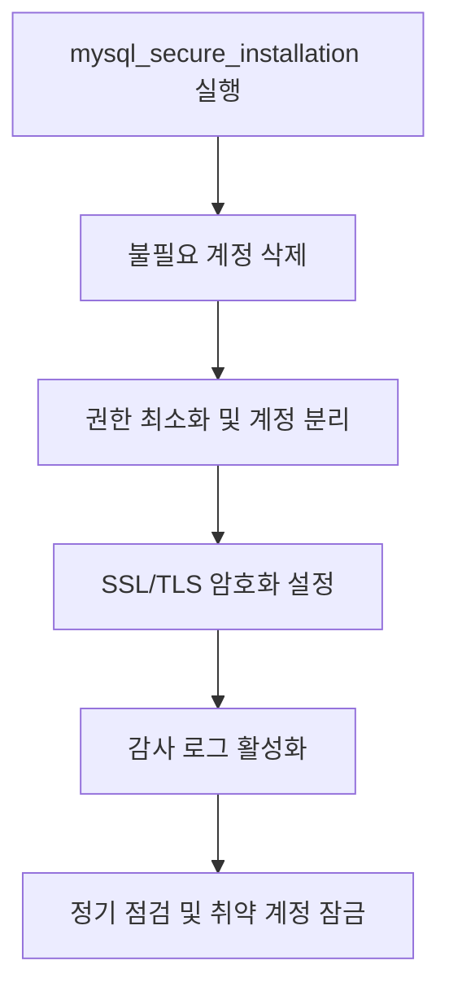

**version: 8.0.x**

---

#### 요약

- 본 문서는 MySQL 서버의 **보안 취약점 예방과 접근 제어 강화**를 위한 실무 가이드다.  
- 기본 계정 관리, 권한 최소화, 데이터 암호화, SSL/TLS 설정 등  
  MySQL 운영 환경에서 반드시 적용해야 할 보안 수칙을 다룬다.  
- `root` 계정 관리부터 연결 암호화까지,  
  **“방어적 운영(Defensive Operation)”** 관점으로 구성하였다.  

> MySQL 보안 강화는 단일 명령이 아니라 **지속적인 점검 체계**다.
> 설치 초기의 `mysql_secure_installation` → 권한 분리 → SSL 설정 → 감사 로그까지
> **“예방 → 탐지 → 대응”** 구조를 갖춘 운영이 가장 안전하다.
> “편의보다 보안이 우선(Convenience vs Security)” 원칙을 항상 유지해야 한다.

**핵심 포인트**
1. 초기 보안 설정 (`mysql_secure_installation`)  
2. 최소 권한 원칙 (Least Privilege)  
3. SSL/TLS 암호화 통신 설정  
4. 데이터 암호화(`AES_ENCRYPT`, `AES_DECRYPT`)  
5. 보안 감사 및 계정 점검  

---

##### 참고자료  
- [공식 문서: MySQL Security Guidelines](https://dev.mysql.com/doc/refman/8.0/en/security.html)  
---

#### 1. 초기 보안 설정

MySQL 설치 직후 보안 스크립트를 실행하여 기본 보호 조치를 수행한다.

```bash
sudo mysql_secure_installation
```

| 설정 항목          | 설명                     |
| -------------- | ---------------------- |
| root 비밀번호 설정   | 관리자 비밀번호 변경            |
| 익명 사용자 제거      | 불필요한 계정 삭제             |
| 원격 root 로그인 차단 | root@% 비활성화            |
| test DB 삭제     | 공개 테스트 DB 제거           |
| 권한 테이블 재적용     | `flush privileges;` 실행 |

> ✅ 보안 설정 이후에는 반드시 MySQL 서비스를 재시작한다.

---

#### 2. 최소 권한 원칙 (Least Privilege Principle)

| 원칙             | 설명                                    |
| -------------- | ------------------------------------- |
| **권한 분리**      | 운영, 개발, 분석 계정을 분리                     |
| **업무 범위별 권한**  | SELECT/INSERT/UPDATE/DELETE 최소 권한만 부여 |
| **root 계정 제한** | 직접 로그인 금지, `sudo mysql` 사용            |
| **비밀번호 주기 변경** | 최소 90일 주기                             |
| **로그 모니터링 병행** | 접속 이력 점검 (`mysql.general_log`)        |

> ⚙️ `grant all privileges` 대신 필요한 권한만 명시적으로 부여한다.

---

#### 3. 원격 접속 제한

기본 설정 파일 수정:

```ini
# /etc/mysql/mysql.conf.d/mysqld.cnf
bind-address = 127.0.0.1
```

특정 IP만 허용 예시:

```sql
create user 'remote'@'192.168.10.%' identified by 'Safe#123';
grant select, insert on addrdb.* to 'remote'@'192.168.10.%';
flush privileges;
```

> 💡 `bind-address`는 “서버가 수신하는 IP 범위”를 지정하며,
> 운영 환경에서는 localhost 또는 특정 IP 범위로 제한해야 한다.

---

#### 4. SSL/TLS 암호화 설정

1️⃣ 인증서 생성

```bash
sudo mysql_ssl_rsa_setup --uid=mysql
```

2️⃣ MySQL 설정 파일 수정

```ini
[mysqld]
ssl-ca=/var/lib/mysql/ca.pem
ssl-cert=/var/lib/mysql/server-cert.pem
ssl-key=/var/lib/mysql/server-key.pem
```

3️⃣ 서비스 재시작

```bash
sudo systemctl restart mysql
```

4️⃣ SSL 접속 테스트

```sql
show variables like '%ssl%';
```

| 변수         | 설명        | 예시                    |
| ---------- | --------- | --------------------- |
| `have_ssl` | SSL 지원 여부 | YES                   |
| `ssl_ca`   | 인증서 경로    | /var/lib/mysql/ca.pem |

> 💡 클라이언트 접속 시 `--ssl-mode=REQUIRED` 옵션으로 SSL 강제 가능.

---

#### 5. 데이터 암호화 함수

MySQL 내장 암호화 함수 예시:

```sql
-- 데이터 암호화
insert into users(name, password)
values ('admin', aes_encrypt('1234', 'secret-key'));

-- 복호화
select cast(aes_decrypt(password, 'secret-key') as char) from users;
```

| 함수                       | 설명                 |
| ------------------------ | ------------------ |
| `aes_encrypt(str, key)`  | AES-256 기반 문자열 암호화 |
| `aes_decrypt(blob, key)` | 암호문 복호화            |
| `sha2(str, 256)`         | 단방향 해시 (비밀번호 저장용)  |

> ⚠️ 비밀번호는 항상 `sha2()` 또는 `bcrypt()` 같은 단방향 암호화를 사용해야 하며,
> 복호화 가능한 AES는 일반 데이터 암호화용으로만 사용한다.

---

#### 6. 감사 로그 (Audit Log) 구성

**MySQL Enterprise Edition** 또는 **Audit Plugin (Community)** 활용 가능:

```sql
install plugin audit_log soname 'audit_log.so';
show variables like 'audit_log%';
```

| 항목                 | 설명                    |
| ------------------ | --------------------- |
| `audit_log_format` | 로그 포맷 (JSON/XML)      |
| `audit_log_file`   | 로그 파일 경로              |
| `audit_log_policy` | RECORD / LOGINS / ALL |

> ✅ 로그인 시도, DDL 변경, 권한 부여 내역을 모두 기록할 수 있다.

---

#### 7. 계정 정책 점검

```sql
select user, host, account_locked, password_last_changed
from mysql.user;
```

| 상태                     | 의미                                 |
| ---------------------- | ---------------------------------- |
| `account_locked='Y'`   | 비활성 계정                             |
| `password_expired='Y'` | 비밀번호 만료                            |
| `plugin`               | 인증 방식 (`caching_sha2_password` 권장) |

> ⚙️ 장기 미사용 계정은 반드시 잠금(lock) 처리해야 한다.

---

#### 8. 비밀번호 정책(Validate Password Plugin)

```sql
show variables like 'validate_password%';
```

| 설정                                     | 설명                        | 예시     |
| -------------------------------------- | ------------------------- | ------ |
| `validate_password.policy`             | 보안 수준 (LOW/MEDIUM/STRONG) | STRONG |
| `validate_password.length`             | 최소 길이                     | 10     |
| `validate_password.mixed_case_count`   | 대/소문자 최소 개수               | 1      |
| `validate_password.special_char_count` | 특수문자 최소 개수                | 1      |

> ✅ STRONG 모드는 영문·숫자·특수문자 조합 8자 이상을 요구한다.

---

#### 9. 백업 데이터 암호화

```bash
mysqldump -u root -p addrdb | openssl enc -aes-256-cbc -salt -out addrdb.sql.enc
openssl enc -d -aes-256-cbc -in addrdb.sql.enc -out addrdb_restored.sql
```

> 💡 백업 파일은 항상 암호화 후 외부 저장소(S3, NAS)에 저장한다.

---

#### 10. 보안 점검 흐름 (Mermaid)



---

#### 11. 보안 점검 체크리스트

| 항목               | 점검 내용                                      | 상태       |
| ---------------- | ------------------------------------------ | -------- |
| ✅ root 원격 로그인 제한 | `/etc/mysql/mysql.conf.d/mysqld.cnf` 설정 확인 | OK       |
| ✅ SSL 연결 활성화     | `have_ssl=YES` 확인                          | OK       |
| ✅ 익명 사용자 제거      | `mysql.user` 확인                            | OK       |
| ✅ 비밀번호 정책 적용     | `validate_password` 값 검증                   | OK       |
| ✅ 감사 로그 활성화      | `audit_log.so` 상태 확인                       | Optional |

---
