**version: 8.0.x**

---

#### 요약

- 본 문서는 MySQL 쿼리 실행 성능, 인덱스 효율, 메모리/캐시 관리 등  
  **데이터베이스 성능을 극대화하기 위한 실무 튜닝 전략**을 다룬다.  
- 성능 저하 원인은 주로 **비효율적인 쿼리, 인덱스 누락, 파라미터 설정 미비, I/O 병목**에 있다.  
- CLI와 GUI(DBeaver, Workbench) 모두에서 동일하게 적용할 수 있는 튜닝 원칙을 제시한다.  

> MySQL 성능 튜닝의 본질은 **데이터 접근 비용을 최소화하는 것**이다.
> 인덱스 설계, 캐시 설정, 실행 계획 분석을 체계적으로 수행하면
> 수천만 건 이상의 데이터도 안정적으로 처리할 수 있다.
> 최적화는 일회성이 아닌, **모니터링 → 분석 → 조정 → 검증**의 순환 과정이다.


**핵심 포인트**
1. 실행 계획(Execution Plan) 분석  
2. 인덱스(Index) 설계 및 관리  
3. 캐시 및 버퍼 설정  
4. 대용량 데이터 처리 전략  
5. 성능 모니터링 및 로그 활용  

---

##### 참고자료  
- [공식 문서: MySQL Performance Schema & Optimization](https://dev.mysql.com/doc/refman/8.0/en/optimization.html)  
- 내부 문서:
  - `02-best-practices.md` — SQL 작성 규칙  
  - `03-tools-and-management/04-logging-monitoring.md` — 로그 수집 및 모니터링  

---

#### 1. 실행 계획 (EXPLAIN)

```sql
explain select * from tb where sales > 200;
```

결과 예시:

| id | select_type | table | type | key  | rows | Extra       |
| -- | ----------- | ----- | ---- | ---- | ---- | ----------- |
| 1  | SIMPLE      | tb    | ALL  | NULL | 1000 | Using where |

| 필드      | 설명                                    |
| ------- | ------------------------------------- |
| `type`  | 접근 방식 (ALL=Full Scan, ref=Index 조회)   |
| `key`   | 사용된 인덱스                               |
| `rows`  | 예상 스캔 행 수                             |
| `Extra` | 추가 정보 (Using where, Using filesort 등) |

> 💡 `type='ALL'` 은 전체 스캔 → 인덱스 필요
> `type='ref'` 또는 `type='range'` 는 효율적인 조회 구조를 의미한다.

---

#### 2. 인덱스 설계 원칙

| 규칙                           | 설명                     |
| ---------------------------- | ---------------------- |
| 1️⃣ 선택도 높은 컬럼 우선             | 중복률 낮은 컬럼 우선 인덱스화      |
| 2️⃣ WHERE 절 우선 고려            | 자주 사용되는 필터 컬럼 우선       |
| 3️⃣ ORDER BY, GROUP BY 컬럼 포함 | 정렬/그룹 연산을 최소화          |
| 4️⃣ 복합 인덱스는 사용 순서 중요         | WHERE → ORDER BY 순서 일치 |

예시:

```sql
create index idx_sales_month on tb (sales, month);
```

> ⚙️ 인덱스는 SELECT 속도를 높이지만 INSERT/UPDATE 성능을 낮출 수 있으므로
> 읽기 중심 시스템(Read-heavy)에 적합하다.

---

#### 3. 인덱스 상태 확인 및 삭제

```sql
show index from tb;
drop index idx_sales_month on tb;
```

결과 예시:

| Table | Key_name        | Column_name | Seq_in_index | Cardinality |
| ----- | --------------- | ----------- | ------------ | ----------- |
| tb    | idx_sales_month | sales       | 1            | 200         |

> 💡 Cardinality(고유값 수)가 높을수록 인덱스 효율이 좋다.

---

#### 4. 캐시 및 버퍼 튜닝

| 설정 변수                     | 설명                          | 권장값         |
| ------------------------- | --------------------------- | ----------- |
| `innodb_buffer_pool_size` | InnoDB 버퍼 메모리 크기            | RAM의 60~70% |
| `query_cache_size`        | 쿼리 결과 캐시 (8.0에서 deprecated) | 0 (비활성화 권장) |
| `innodb_log_file_size`    | 트랜잭션 로그 파일 크기               | 512MB~1GB   |
| `tmp_table_size`          | 임시 테이블 최대 크기                | 64MB 이상     |
| `max_connections`         | 동시 접속 제한                    | 200~500     |

```sql
show variables like 'innodb_buffer_pool_size';
set global innodb_buffer_pool_size = 4*1024*1024*1024;
```

---

#### 5. 대용량 데이터 처리 전략

| 전략                  | 설명                                                    |
| ------------------- | ----------------------------------------------------- |
| **Batch Insert**    | 여러 행을 한 번에 삽입 (`insert into ... values (...), (...)`) |
| **Partition Table** | 날짜, ID 기준으로 테이블 분할                                    |
| **Archive Table**   | 과거 데이터는 별도 아카이브 테이블로 이동                               |
| **LIMIT + OFFSET**  | 페이징 기반 데이터 조회                                         |
| **Index Merge**     | 다중 인덱스 병합 활용                                          |

예시:

```sql
create table sales_data (
  id bigint primary key auto_increment,
  region varchar(10),
  amount int,
  sale_date date
)
partition by range (year(sale_date)) (
  partition p2024 values less than (2025),
  partition p2025 values less than (2026)
);
```

---

#### 6. 쿼리 성능 진단 도구

| 도구                             | 기능           | 명령어                              |
| ------------------------------ | ------------ | -------------------------------- |
| `show processlist;`            | 실행 중 쿼리 확인   | 활동 세션 모니터링                       |
| `show status like 'Threads%';` | 스레드 상태 통계    | Thread_running, Connected 등      |
| `performance_schema`           | 쿼리 성능 데이터 수집 | CPU, IO, Memory 통계               |
| `slow_query_log`               | 느린 쿼리 추적     | `set global slow_query_log = 1;` |

> 💡 `performance_schema`를 활성화하면 쿼리 병목 구간을 정밀 분석할 수 있다.

---

#### 7. 슬로우 쿼리 로그 분석

```sql
set global slow_query_log = 1;
set global long_query_time = 1;
```

로그 위치:

```
/var/lib/mysql/slow.log
```

내용 예시:

```
# Query_time: 2.301  Lock_time: 0.000 Rows_sent: 1 Rows_examined: 100000
select * from tb where sales > 200;
```

> ⚙️ `Rows_examined` 값이 높으면 인덱스 미활용 가능성이 높다.

---

#### 8. 통계 기반 최적화 (Optimizer Hints)

```sql
select /*+ INDEX(tb idx_sales_month) */ * from tb where sales > 100;
```

| Hint             | 설명                  |
| ---------------- | ------------------- |
| `INDEX()`        | 특정 인덱스 강제 사용        |
| `NO_INDEX_MERGE` | 인덱스 병합 비활성화         |
| `STRAIGHT_JOIN`  | 조인 순서 고정            |
| `USE_NL`         | Nested Loop Join 사용 |

> ⚙️ 힌트는 옵티마이저가 비효율적으로 실행계획을 선택할 때 수동으로 제어할 수 있는 옵션이다.

---

#### 9. 튜닝 절차 흐름 (Mermaid)

```mermaid
flowchart LR
    A[문제 탐지] --> B[EXPLAIN으로 실행계획 확인]
    B --> C{인덱스 미사용?}
    C -- Yes --> D[인덱스 설계 및 추가]
    C -- No --> E[메모리 파라미터 점검]
    D --> F[성능 로그 검토]
    E --> F
    F --> G[튜닝 적용 및 재테스트]
```



---

#### 10. 운영 환경별 권장 설정

| 항목                        | 개발 환경   | 운영 환경       |
| ------------------------- | ------- | ----------- |
| `innodb_buffer_pool_size` | 1~2GB   | RAM의 60% 이상 |
| `max_connections`         | 100     | 300~500     |
| `slow_query_log`          | 비활성     | 활성          |
| `log_bin` (Binary Log)    | 선택      | 활성          |
| `character_set_server`    | utf8mb4 | utf8mb4     |

---


